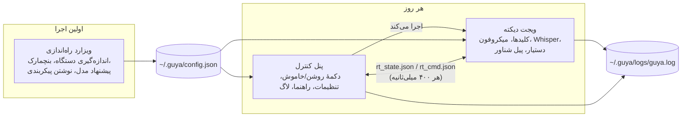
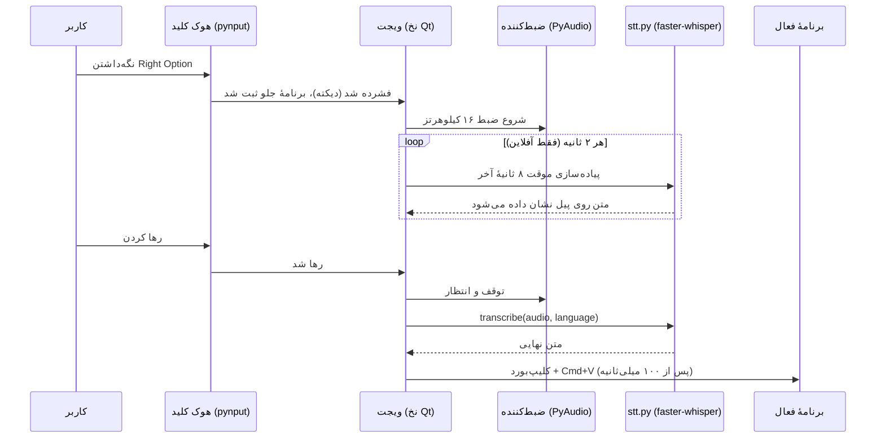
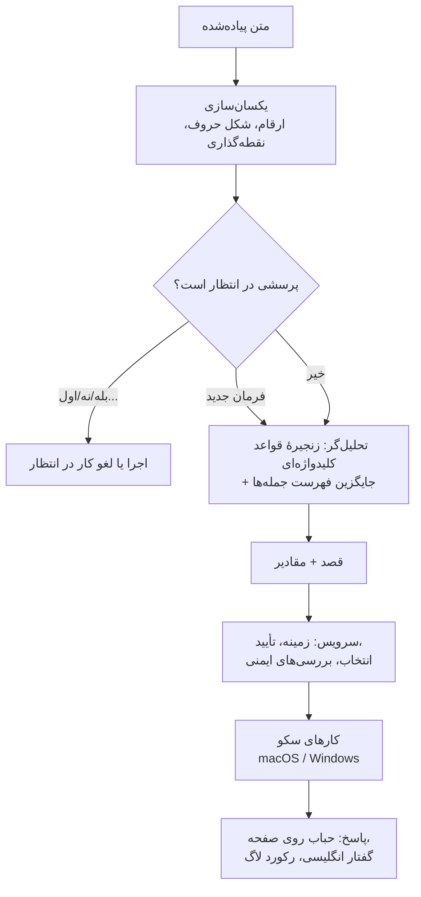

# گویا (Guya): تبدیل گفتار فارسی و انگلیسی به متن و دستیار محدود رومیزی برای افرادی که تایپ کردن برایشان دشوار است

**گزارش پروژهٔ پایانی دورهٔ کارشناسی مهندسی کامپیوتر**

| | |
|---|---|
| دانشجو | محمدرضا گنجی (۲۲۰۷۰۱۰۹۱) |
| استاد راهنما | دکتر حسین آقابابا |
| دانشگاه | دانشگاه تهران، دانشکدگان فارابی، دانشکدهٔ مهندسی |
| نیمسال | نیمسال هشتم، ۱۴۰۵ |
| کد برنامه | `git@github.com:faceesmart/guya.git` |

## فهرست

۱. مقدمه
۲. پیشینه و کارهای مرتبط
۳. نیازمندی‌ها و محدودهٔ پروژه
۴. طراحی سیستم
۵. پیاده‌سازی
۶. راهنمای کاربر
۷. ارزیابی
۸. بحث
۹. نتیجه‌گیری و کارهای آینده
مراجع
پیوست الف. بازتولید نتایج · پیوست ب. مجموعهٔ فرمان‌ها · پیوست پ. پیکربندی · پیوست ت. آزمون‌های خودکار

---

## چکیده

گویا یک برنامهٔ رومیزی برای افرادی است که می‌توانند صحبت کنند اما تایپ طولانی و کار مکرر با موس و کیبورد برایشان دشوار است. دو حالت «نگه‌دار و صحبت کن» (push-to-talk) روی دو کلید جداگانه دارد: دیکته، که گفتار کاربر را در هر برنامه‌ای که جلو باشد می‌نویسد، و یک دستیار کوچک که مجموعهٔ ثابتی از کارهای امن رومیزی را انجام می‌دهد: ساختن، پیدا کردن، باز کردن و تغییر نام فایل‌ها، باز کردن برنامه‌ها، ذخیره و بستن پنجره، و پیمایش ساده در مرورگر. هر دو حالت به فارسی و انگلیسی کار می‌کنند، به‌طور کامل روی رایانهٔ خود کاربر و با نرم‌افزار آزاد اجرا می‌شوند و هزینه‌ای ندارند. یک ویزارد نصب، سرعت رایانه را اندازه می‌گیرد و مدل گفتاری‌ای را پیشنهاد می‌کند که روی همان دستگاه با سرعت قابل استفاده اجرا شود؛ برای دستگاه‌های ضعیف، یک مدل آنلاین رایگان به‌عنوان جایگزین در نظر گرفته شده است.

این گزارش طراحی و پیاده‌سازی سیستم را شرح می‌دهد و آن را با اندازه‌گیری‌های قابل تکرار ارزیابی می‌کند: نرخ خطای واژه (WER) برای شش اندازهٔ مدل Whisper روی یک مجموعهٔ آزمون ثابت فارسی و انگلیسی، یک مطالعهٔ حذفی (ablation) روی تنظیمات رمزگشایی خود گویا، یک آزمون تعمیم‌پذیری تحلیل‌گر فرمان‌ها روی جمله‌های دیده‌نشده، و گزارش استفادهٔ واقعی از دستیار. یافته‌های اصلی این‌هاست: فارسی برای قابل استفاده بودن به مدلی دست‌کم به بزرگی `large-v3-turbo` نیاز دارد، در حالی که انگلیسی با مدل `small` هم خوب است؛ چند تنظیم دستی که از نمونه‌های اولیه به ارث رسیده بود در واقع دقت را کم می‌کرد و اندازه‌گیری، توضیح و اصلاح شد؛ تحلیل‌گر قاعده‌محور فرمان‌ها، پس از رسیدگی به واژه‌های اضافی گفتار، به جمله‌های دیده‌نشده خوب تعمیم می‌یابد (از ۶۹٪ به ۱۰۰٪ روی مجموعهٔ آزمون)؛ و تقریباً تمام تأخیری که کاربر حس می‌کند مربوط به خود مدل گفتار است، نه دستیار.

Abstract: Guya is a desktop application for people who can speak but find sustained typing and repeated mouse and keyboard work difficult. It has two push-to-talk modes on two separate keys: dictation, which types what the user says into whatever application is in front, and a small assistant, which carries out a fixed set of safe desktop actions such as creating, finding, opening and renaming files, opening applications, saving and closing, and simple browser navigation. Both modes work in Persian and English, run entirely on the user's own computer with free software, and cost nothing to use. A setup wizard measures the computer's speed and recommends a speech model that will run at usable speed on that machine, with a free online model as the fallback for weak hardware. This report describes the design and implementation and evaluates the system with reproducible measurements: word error rate of six Whisper model tiers on a fixed Persian and English test set, an ablation of Guya's own decoding settings, a held-out test of the command parser, and the assistant's real-use log. The main findings are that Persian needs a model at least the size of `large-v3-turbo` to be usable while English is already good with `small`; that several hand-tuned decoding settings inherited from earlier prototypes reduced accuracy and were measured, explained and corrected; that the rule-based parser generalises well to unseen phrasings once filler words are handled (69% → 100% on a held-out set); and that almost all of the latency the user feels is the speech model itself, not the assistant.

---

## ۱. مقدمه

### ۱.۱ مسئله

برای کسی که محدودیت حرکتی دارد، یک پاراگراف متن یک پاراگراف تایپ نیست؛ چند دقیقه تلاش است و اغلب همراه با درد. همین برای کارهای مکانیکی کوچک اطراف نوشتن هم صادق است: باز کردن فایل درست، پیدا کردن دوبارهٔ آن بعد از بستن، تغییر نامش، پایین بردن یک صفحهٔ وب. نرم‌افزارهای دیکتهٔ تجاری وجود دارند، اما یا به یک سرویس ابری پولی وابسته‌اند، یا فارسی را ضعیف پشتیبانی می‌کنند، یا هر دو؛ و برای کارهای اطراف نوشتن هیچ کمکی نمی‌کنند.

مورد مشخصی که پشت این پروژه است برادر من است. او واضح صحبت می‌کند، اما تایپ طولانی برایش سخت است. همین از ابتدا شکل پروژه را تعیین کرد: باید روی یک رایانهٔ خانگی معمولی اجرا شود، باید فارسی را به‌اندازهٔ انگلیسی پشتیبانی کند، و نباید به اشتراک پولی وابسته باشد.

### ۱.۲ گویا چه می‌کند

گویا دو کلید به رایانه اضافه می‌کند. با نگه‌داشتن کلید اول (Right Option در macOS) و صحبت کردن، کلمات هنگام رها کردن کلید در سند فعال نوشته می‌شوند. با نگه‌داشتن کلید دوم (Right Command) و صحبت کردن، گفتار به یک دستیار کوچک می‌رسد که فهرست ثابتی از فرمان‌ها را به فارسی یا انگلیسی می‌فهمد و اجرا می‌کند. این دو کلید عمداً از هم جدا هستند تا یک جملهٔ دیکته‌شده مانند «گزارش را باز کن» هرگز با یک فرمان اشتباه گرفته نشود.

دستیار عمداً کوچک است. گفت‌وگو نمی‌کند، صفحات وب را نمی‌خواند و هیچ چیزی را نمی‌تواند حذف کند. می‌تواند فایل‌های Word و متنی و پوشه بسازد، فایل‌ها را با نام گفتاری‌شان پیدا کند (با در نظر گرفتن شیوه‌ای که تشخیص گفتار نام فایل‌ها را خراب می‌کند: «تست شش داکس» برای `test6.docx`)، فایل، پوشه و چند برنامه را باز کند، بعد از گرفتن تأیید فایلی را تغییر نام دهد، پنجرهٔ فعال را ذخیره یا ببندد، سایت شناخته‌شده‌ای را باز کند، در وب جستجو کند، و صفحهٔ مرورگر را بالا و پایین ببرد. وقتی یک نام گفتاری با چند فایل مطابقت دارد، تا سه گزینه روی صفحه نشان می‌دهد و کلیک یا گفتن «اول»، «دوم»، «سوم» را می‌پذیرد.

در اولین اجرا یک ویزارد نصب اجرا می‌شود. سرعت رایانه را در اجرای یک مدل گفتاری کوچک اندازه می‌گیرد، رفتار مدل‌های بزرگ‌تر را پیش‌بینی می‌کند و مدلی را پیشنهاد می‌دهد که روی همان دستگاه هم‌پای گفتار باشد. به رایانه‌های ضعیف یک مدل آنلاین رایگان پیشنهاد می‌شود.

### ۱.۳ اهداف و دستاوردها

پروژه پنج هدف اعلام‌شده داشت (از پیشنهادنامه): دیکتهٔ قابل اتکای فارسی و انگلیسی با کلید نگه‌داشتنی؛ یک دستیار دوزبانهٔ جداگانه برای مجموعهٔ محدودی از کارها؛ رفتار پیش‌بینی‌پذیر و امن از راه فهم قاعده‌محور فرمان، تأیید گرفتن و محدود کردن دسترسی به فایل‌ها؛ حالت‌های آفلاین، آنلاین و دوگانهٔ تشخیص گفتار با کمک اندازه‌گیری دستگاه؛ و ارزیابی دقت، زمان پاسخ، موفقیت در انجام کار، ایمنی و کاربردپذیری.

آنچه این گزارش فراتر از نرم‌افزار در حال اجرا اضافه می‌کند، شواهد است. به‌طور مشخص:

۱. یک اندازه‌گیری قابل تکرار از دقت و سرعت شش اندازهٔ مدل Whisper روی گفتار خوانده‌شدهٔ فارسی و انگلیسی، روی سخت‌افزار خانگی، که دادهٔ پشت پیشنهاد مدل در ویزارد است (بخش ۷.۲).
۲. یک مطالعهٔ حذفی که نشان می‌دهد هر یک از تنظیمات رمزگشایی خود گویا چه اثری بر دقت دارد و چند تنظیم را که از نمونه‌های اولیه بدون اندازه‌گیری به ارث رسیده بود اصلاح کرد (بخش ۷.۳).
۳. یک مجموعهٔ آزمون دیده‌نشده از ۲۶۷ جملهٔ فرمان طبیعی فارسی و انگلیسی و یک ارزیاب برای تحلیل‌گر، که دقت تشخیص قصد را از ۶۹٪ به ۱۰۰٪ رساند و نُه مورد از سیزده سوءبرداشت واقعی ثبت‌شده در لاگ استفاده را برطرف کرد (بخش ۷.۵).
۴. یک رکورد ساخت‌یافتهٔ لاگ برای هر فرمان که استفادهٔ روزانه از دستیار را به یک مجموعه‌دادهٔ ارزیابی تبدیل می‌کند (بخش ۷.۶).

### ۱.۴ محدودهٔ این گزارش

این نرم‌افزار یک نمونهٔ دانشگاهی است، نه یک محصول. فصل ۳ مرز آن را دقیقاً بیان می‌کند. پشتیبانی از Windows در کد وجود دارد اما تا زمان نوشتن این گزارش روی یک دستگاه ویندوزی اعتبارسنجی نشده است، و مطالعهٔ کاربردپذیری با کاربر هدف هنوز انجام نشده بود؛ هر دو در فصل ۹ صادقانه به‌عنوان کار باقی‌مانده گزارش شده‌اند.

---

## ۲. پیشینه و کارهای مرتبط

### ۲.۱ تشخیص گفتار با Whisper

Whisper (Radford و همکاران، ۲۰۲۳) یک مدل ترنسفورمر رمزگذار–رمزگشا است که روی ۶۸۰ هزار ساعت صوت چندزبانه آموزش دیده است. فارسی را بدون هیچ آموزش اضافه‌ای تشخیص می‌دهد و همین است که این پروژه را با بودجهٔ صفر ممکن کرد. در اندازه‌های مختلف از `tiny` (۳۹ میلیون پارامتر) تا `large-v3` (۱٫۵۵ میلیارد) عرضه می‌شود. `large-v3-turbo` رمزگذار کامل مدل بزرگ را نگه می‌دارد اما فقط چهار لایهٔ رمزگشا دارد، و به همین دلیل با دقتی نزدیک به `large-v3` بسیار سریع‌تر است.

گویا از faster-whisper استفاده می‌کند که پیاده‌سازی دوبارهٔ Whisper روی موتور استنتاج CTranslate2 است. با وزن‌های ۸ بیتی، حتی مدل‌های بزرگ را روی پردازندهٔ یک لپ‌تاپ با سرعتی برابر یا بهتر از زمان واقعی اجرا می‌کند، و همین است که یک سیستم کاملاً محلی فارسی را ممکن می‌کند. هزینه‌اش این است که کار سنگین پردازنده است و سرعت آن بین دستگاه‌ها و اندازه‌های مدل تا یک مرتبهٔ بزرگی تغییر می‌کند (بخش ۷.۴)؛ روی رایانهٔ ضعیف‌تر، مدلی که فارسی به آن نیاز دارد ممکن است اصلاً هم‌پای گفتار نباشد. این محدودیت کل طراحی را شکل داده است (بخش ۴.۵).

### ۲.۲ چرا فارسی سخت‌تر است

فارسی برای Whisper در مقایسه با انگلیسی زبان کم‌منبعی است: دادهٔ آموزشی صوتی بسیار کمتر، خط عربی با چند شکل معادل برای یک حرف (ي/ی، ك/ک)، اعراب اختیاری، و نیم‌فاصله‌ای که کاربردش بین نویسندگان فرق می‌کند. فارسی گفتاری محاوره‌ای هم با شکل نوشتاری رسمی که بر متن آموزشی Whisper غالب است تفاوت دارد: گوینده می‌گوید «میخوام» و مدل می‌نویسد «می‌خواهم». همهٔ این‌ها در اندازه‌گیری‌ها (بخش ۷.۲) به‌صورت شکاف بزرگی بین نرخ خطای فارسی و انگلیسی ظاهر می‌شود، و به همین دلیل ارزیابی، نرخ خطای نویسه (CER) را در کنار نرخ خطای واژه گزارش می‌کند.

### ۲.۳ فهم فرمان: قاعده‌محور در برابر مدل‌محور

یک دستیار صوتی باید متن پیاده‌شده را به یک قصد (intent) و آرگومان‌هایش تبدیل کند. راه مُد روز این است که متن را به یک مدل زبانی بزرگ بدهیم. من به سه دلیل یک تحلیل‌گر قطعی (کلیدواژه‌ها، عبارت‌های منظم و یک فهرست کوچک از جمله‌های نمونه) را انتخاب کردم. رایگان است و آفلاین کار می‌کند. هر تصمیمی که می‌گیرد قابل چاپ و توضیح است، و این وقتی مهم است که کار مورد نظر تغییر نام فایل کسی باشد. و نمی‌شود آن را وادار کرد کاری خارج از فهرستش انجام دهد، که تمام استدلال ایمنی بخش ۴.۶ همین است. هزینه‌اش پوشش است: یک تحلیل‌گر قاعده‌محور فقط جمله‌بندی‌هایی را می‌فهمد که کسی به آن‌ها فکر کرده باشد. بخش ۷.۵ این هزینه را اندازه می‌گیرد و نشان می‌دهد می‌توان آن را کوچک کرد.

### ۲.۴ ملاحظات دسترس‌پذیری

«نگه‌دار و صحبت کن» به جای واژهٔ بیدارکننده انتخاب شد، چون به میکروفون همیشه‌روشن نیاز ندارد، به کاربر کنترل صریح می‌دهد که رایانه کِی گوش می‌دهد، و حالت (دیکته یا فرمان) را در لحظهٔ فشردن کلید مشخص می‌کند. بازخورد روی صفحه و، برای انگلیسی، با صدا داده می‌شود؛ پیل همیشه رنگش را با یک برچسب متنی همراه می‌کند تا رنگ هرگز تنها حامل وضعیت نباشد، که یکی از معیارهای WCAG 2.2 [۹] است که ویجت با آن سنجیده شد، همراه با اندازهٔ هدف‌های قابل کلیک. نتایج مبهم به‌صورت گزینه‌های بزرگ قابل کلیک نشان داده می‌شوند که با صدا هم قابل انتخاب‌اند. هر کار خراب‌کننده اول می‌پرسد. این‌ها اصول معمول دسترس‌پذیری‌اند؛ بخش جالب جایی است که محدودیت‌ها اثر گذاشتند، مثلاً تصمیم به ساکت ماندن بازخورد فارسی به جای خواندن آن با صدای عربی (بخش ۴.۷).

### ۲.۵ ابزارهای موجود

هیچ‌یک از محصولات رایج دیکته و کنترل صوتی، موردی را که این پروژه برایش ساخته شده پوشش نمی‌دهد: یک فارسی‌زبان با یک رایانهٔ معمولی و بدون بودجه. جدول R1 وضعیت شهریور ۱۴۰۵ (سپتامبر ۲۰۲۶) را از مستندات خود سازندگان نشان می‌دهد.

| ابزار | دیکتهٔ فارسی | فرمان صوتی برای رومیزی | اجرای آفلاین | هزینه | سکو |
|---|---|---|---|---|---|
| Apple Dictation / Voice Control | خیر (فارسی در فهرست زبان‌های دیکته نیست؛ Voice Control فقط انگلیسی، اسپانیایی، فرانسوی، آلمانی، چینی و ژاپنی) | بله، انگلیسی و چند زبان دیگر | تا حدی | رایگان | macOS و iOS |
| Windows Voice Access / voice typing | خیر (۱۵ گونهٔ انگلیسی، اسپانیایی، آلمانی، فرانسوی، چینی، ژاپنی و ایتالیایی) | بله | بله | رایگان | Windows 11 |
| Nuance Dragon Professional v16 | خیر (هشت زبان، بدون فارسی) | بله | بله | حدود ۷۰۰ دلار | فقط Windows؛ نسخهٔ مک متوقف شده است |
| Google Docs voice typing | بله (Farsi در فهرست هست) | فقط داخل Google Docs | خیر، سرویس ابری مرورگر | رایگان | هر مرورگری |
| Talon Voice | خیر (مدل اصلی فقط انگلیسی) | بله، بسیار عمیق، برای برنامه‌نویسان مبتلا به RSI | بله | نسخهٔ رایگان و نسخهٔ بتای پولی | macOS، Windows، Linux |
| نویسا (عصر گویش پرداز) | بله، فارسی از سال ۱۳۸۲، با ویرایش‌های پزشکی و حقوقی | محصول جداگانه (کارا) | بله | مجوز تجاری | Windows |
| **گویا** | **بله، فارسی و انگلیسی** | **بله، مجموعهٔ ثابت و امن، دوزبانه** | **بله** | **رایگان** | **macOS؛ کد Windows موجود، اعتبارسنجی‌نشده** |

*جدول R1. ابزارهای موجود در برابر چهار نیازمندی پروژه.*

دو تای این‌ها نزدیک‌ترین همسایه‌ها هستند و نگاه دقیق‌تری می‌طلبند.

نویسا محصول جدی دیکتهٔ فارسی است که یک شرکت ایرانی در دو دهه روی یک تشخیص‌دهندهٔ کلاسیک تنظیم‌شده برای فارسی ساخته است، و دقیقاً به این دلیل وجود دارد که سازندگان بین‌المللی هرگز این زبان را پوشش ندادند. تجاری است، فقط برای Windows است، و محصول فرمان صوتی‌اش جداست. گویا رقیب آن نیست؛ گویا چیزی است که با وجود یک مدل چندزبانهٔ آزاد مانند Whisper ممکن می‌شود: ابزاری رایگان و چندسکویی که یک دانشجو بتواند بسازد و یک خانواده بتواند نصب کند، با دیکته و فرمان در یک برنامه.

Talon از نظر دسترس‌پذیری نزدیک‌ترین است. برای افرادی طراحی شده که اصلاً نمی‌توانند از دست‌هایشان استفاده کنند، دقیق است، و جامعهٔ بزرگی از دستورهای صوتی دارد. اما فقط انگلیسی است و ابزاری برای کاربران حرفه‌ای با منحنی یادگیری است؛ کاربر گویا قرار است دو کلید و ده‌دوازده جمله یاد بگیرد.

بنابراین شکافی که گویا پر می‌کند باریک و واقعی است: فارسی به‌علاوهٔ انگلیسی، دیکته به‌علاوهٔ چند فرمان امن، محلی و رایگان، روی یک لپ‌تاپ معمولی، برای یک فرد مشخص.

### ۲.۶ پژوهش در تشخیص گفتار فارسی

فارسی برای مدت زیادی زبانی با دادهٔ گفتاری اندک بود. دو چیز وضعیت را تغییر داد: پیکره‌های عمومی گفتار خوانده‌شده که فارسی را هم دربر می‌گیرند، یعنی Mozilla Common Voice (Ardila و همکاران، ۲۰۲۰) و Google FLEURS (Conneau و همکاران، ۲۰۲۲)، و خود Whisper (Radford و همکاران، ۲۰۲۳) که روی ۶۸۰ هزار ساعت صوت وب در ۹۷ زبان آموزش دیده و فارسی را بدون هیچ کار مخصوص فارسی تشخیص می‌دهد. `large-v3` علاوه بر آن روی یک میلیون ساعت صوت با برچسب ضعیف و چهار میلیون ساعت صوت با برچسب شبه‌خودکار آموزش دیده و OpenAI برای زبان‌هایی که خوب پشتیبانی می‌کند، ۱۰ تا ۲۰ درصد کاهش خطا نسبت به `large-v2` روی Common Voice 15 و FLEURS گزارش می‌کند.

دو واقعیت از این پژوهش‌ها انتظارات پروژه را شکل داد. اول، نرخ خطای فارسی Whisper در هر اندازهٔ مدل چند برابر نرخ خطای انگلیسی آن است، که بخش ۷.۲ آن را روی دادهٔ خود این پروژه اندازه می‌گیرد. دوم، تنظیم دقیق (fine-tuning) روی دادهٔ فارسی کمک بزرگی می‌کند: مدل‌هایی که روی بخش فارسی Common Voice تنظیم شده‌اند حدود ۱۳٪ WER روی FLEURS گزارش می‌کنند، کمتر از نصف خطای مدل استاندارد که اینجا اندازه‌گیری شد. تنظیم دقیق به GPU و زمانی نیاز دارد که این پروژه نداشت، اما گام بعدی بدیهی است و در فصل ۹ بحث شده است.

خود متن فارسی لایه‌ای اضافه می‌کند که ارزیابی انگلیسی ندارد: چند شکل معادل حروف عربی، اعراب اختیاری، نیم‌فاصله، و تفاوت زبان نوشتاری رسمی که مدل‌ها از آن آموخته‌اند با زبان گفتاری محاوره‌ای مردم. بخش ۷.۱ توضیح می‌دهد که ارزیابی سه مورد اول را چگونه یکسان‌سازی می‌کند و برای نرم کردن مورد آخر، نرخ خطای نویسه را هم گزارش می‌کند.

### ۲.۷ گویا از این‌ها چه گرفته است

از محصولات: طراحی دو کلیدی (Talon و Dragon دیکته را از فرمان جدا می‌کنند)، تأیید پیش از کارهای خراب‌کننده (Voice Control تأیید می‌گیرد)، و این واقعیت صادقانه که هیچ‌کس فارسی را روی رومیزی به‌صورت رایگان حل نکرده است. از پژوهش: انتخاب Whisper، این انتظار که فارسی به بزرگ‌ترین مدل عملی نیاز دارد، تصمیم به اندازه‌گیری روی FLEURS تا اعداد قابل بازتولید و مقایسه باشند، و تنظیم دقیق به‌عنوان کار آینده.

---

## ۳. نیازمندی‌ها و محدودهٔ پروژه

### ۳.۱ کاربر اصلی

کاربر اصلی می‌تواند آن‌قدر واضح صحبت کند که تشخیص گفتار کار کند، اما با تایپ طولانی و کار مکرر با کیبورد و موس مشکل دارد. ممکن است یکی از اعضای خانواده در نصب و راه‌اندازی اولیه کمک کند؛ پس نصب‌کننده و ویزارد باید برای یک کمک‌کنندهٔ غیرفنی قابل استفاده باشند، و استفادهٔ روزانه نباید به چیزی بیش از دو کلید نیاز داشته باشد.

### ۳.۲ آنچه در نسخهٔ ۱ هست

- دیکتهٔ فارسی و انگلیسی با کلید نگه‌داشتنی، در برنامهٔ فعال.
- یک کلید جداگانهٔ دستیار با مجموعهٔ ثابت فرمان‌های دوزبانه: ساختن فایل Word و متنی و پوشه (و سپس پرسیدن پیش از باز کردن)؛ باز کردن برنامه‌ها، فایل‌ها و پوشه‌های پشتیبانی‌شده؛ پیدا کردن فایل و پوشه با یکسان‌سازی نام گفتاری؛ نمایش تا سه نتیجهٔ مبهم برای انتخاب با کلیک یا صدا؛ به خاطر سپردن فایل‌های اخیر تا «دوباره بازش کن» کار کند؛ تغییر نام با تأیید و بدون بازنویسی؛ ذخیره یا بستن پنجرهٔ فعال؛ باز کردن سایت شناخته‌شده یا دامنهٔ گفته‌شده روی HTTPS؛ جستجو در وب؛ پیمایش، رفتن به اول یا آخر صفحه، عقب و جلو در مرورگر فعال.
- حالت‌های آفلاین، آنلاین و دوگانهٔ تشخیص، اندازه‌گیری دستگاه و پیشنهاد مدل بر پایهٔ بنچمارک.
- نصب‌کننده، ویزارد راه‌اندازی، پنل کنترل، ویجت شناور وضعیت، بازخورد گفتاری (انگلیسی) و روی صفحه، و لاگ.
- دسترسی به فایل‌ها محدود به پوشه‌های کاربر که در پیکربندی مشخص شده (به‌طور پیش‌فرض Desktop، Documents و Downloads).
- آزمون‌های خودکار به‌علاوهٔ یک چک‌لیست ارزیابی گفتاری.

### ۳.۳ آنچه صریحاً بیرون است

دستیار گفت‌وگویی عمومی؛ اجرای فرمان‌های دلخواه سیستم یا کنترل نامحدود رایانه؛ حذف یا بازنویسی فایل‌ها یا دور زدن تأیید؛ خواندن یا فهمیدن صفحات وب دلخواه، کلیک روی نتایج یا دانلود؛ روال‌های خاص هر برنامه مانند Save As؛ گوش دادن دائمی با واژهٔ بیدارکننده؛ پشتیبانی از هر لهجه، نام فایل یا برنامه؛ انتشار در فروشگاه‌های نرم‌افزار.

### ۳.۴ قواعد ایمنی

این‌ها از ابتدا تصمیم گرفته شدند و در کد اعمال می‌شوند، نه به‌صورت قرارداد (بخش ۴.۶): هیچ قصد «حذف» وجود ندارد؛ تغییر نام می‌پرسد و هرگز بازنویسی نمی‌کند؛ ساختن پیش از باز کردن می‌پرسد؛ هر مسیر پیش از استفاده resolve و در برابر پوشه‌های مجاز بررسی می‌شود؛ برنامه‌ها از یک فهرست مجاز می‌آیند؛ سایت‌ها فقط با HTTPS و فقط با نام شناخته‌شده یا دامنه‌ای که صریحاً گفته شده باز می‌شوند؛ کنترل مرورگر شش کد کلید است که به فرایند خود مرورگر فرستاده می‌شود؛ فرایند خود گویا هرگز نمی‌تواند هدف یک کلید باشد.

---

## ۴. طراحی سیستم

### ۴.۱ نمای کلی

گویا سه فرایند همکار است، همه به زبان Python.



**ویزارد** (`guya/wizard.py`) یک بار اجرا می‌شود. **پنل کنترل** (`guya/control_panel.py`) پنجره‌ای است که کاربر روی آن دوبار کلیک می‌کند؛ **ویجت** (`guya/widget.py`) را به‌عنوان فرایند فرزند اجرا می‌کند و وضعیتش را بازتاب می‌دهد. ویجت برنامه‌ای است که واقعاً گوش می‌دهد و عمل می‌کند. جدا کردن ویجت از پنل دلیل عملی دارد: مدل Whisper باید پیش از وارد کردن کتابخانهٔ رابط کاربری Qt بارگذاری شود، چون بک‌اند GPU کتابخانهٔ CTranslate2 در Windows ممکن است اگر Qt اول مقداردهی شود از کار بیفتد، و یک فرایند فرزند این ترتیب را رایگان فراهم می‌کند.

این دو فرایند از طریق دو فایل کوچک JSON که به‌صورت اتمی نوشته می‌شوند با هم حرف می‌زنند: ویجت هر ۴۰۰ میلی‌ثانیه وضعیتش را می‌نویسد، پنل فرمان‌های شماره‌دار می‌نویسد (روشن یا خاموش، تغییر زبان، تغییر بک‌اند). زیبا نیست، اما به سوکت، مجوز یا کتابخانه نیاز ندارد.

### ۴.۲ مسیر دیکته



تا وقتی کلید نگه داشته شده، میکروفون با ۱۶ کیلوهرتز تک‌کاناله ضبط می‌شود. در حین ضبط، یک گذر پس‌زمینه هر دو ثانیه هشت ثانیهٔ آخر را دوباره پیاده می‌کند و متن موقت را روی پیل نشان می‌دهد تا کاربر ببیند شنیده می‌شود. هنگام رها کردن، کل ضبط یک بار پیاده می‌شود و نتیجه از راه کلیپ‌بورد در برنامهٔ جلو چسبانده می‌شود. چسباندن به جای شبیه‌سازی ضربه‌های کلید انتخاب شد، چون یک بار چسباندن برای یونیکد امن و فوری است، در حالی که تایپ حرف‌به‌حرف فارسی از راه شبیه‌ساز کیبورد قابل اتکا نبود.

### ۴.۳ خط لولهٔ گفتار به متن (`guya/stt.py`)

فراخوانی مدل درون خط لوله‌ای پیچیده شده که در استفادهٔ روزانه تنظیم شد: بلندی صدا یکسان‌سازی می‌شود؛ تشخیص فعالیت صوتی (VAD) سکوت را می‌بُرد؛ یک prompt واژگانی برای هر زبان، رمزگشا را به سمت واژه‌های معمول کاربر سوق می‌دهد؛ یک آستانهٔ no-speech و یک فیلتر برای واژه‌های تکراری در برابر عادت Whisper به توهم متن در سکوت محافظت می‌کنند (یک جریمهٔ تکرار هم همین کار را می‌کرد، تا وقتی بخش ۷.۳ هزینه‌اش را اندازه گرفت)؛ سپس برای فارسی، سه مرحلهٔ پس‌پردازش شکل‌های حروف عربی را یکسان می‌کند، جدولی از اشتباه‌های تکرارشونده را اصلاح می‌کند، و شکل‌های رسمی فعل را به شکل محاوره‌ای که کاربر واقعاً گفته برمی‌گرداند.

بیرون کشیدن این خط لوله به یک ماژول جداگانه تغییری بود که برای این گزارش انجام شد: به ابزار ارزیابی اجازه می‌دهد *دقیقاً* همان خط لوله‌ای را اجرا کند که ویجت اجرا می‌کند و هر تنظیم را یکی‌یکی به پیش‌فرض کتابخانه برگرداند. بخش ۷.۳ نشان می‌دهد چرا این مهم بود: بعضی از این «بهبودها» اوضاع را بدتر می‌کردند.

### ۴.۴ مسیر دستیار



تحلیل‌گر (`guya/assistant/parser.py`) یک زنجیرهٔ مرتب از قواعد است. ترتیب همان معناست: ساختن پیش از تغییر نام بررسی می‌شود چون «یه فایل بساز و اسمش رو بذار X» شامل «اسمش رو بذار» است؛ ذخیره و بستن پیش از حرکت در مرورگر؛ سایت پیش از برنامه پیش از فایل، تا «برو یوتیوب» یک سایت باشد نه جستجوی فایلی به نام یوتیوب. هر قاعده آرگومان‌هایش را با عبارت منظمی که برای همان فرمان و به هر دو زبان نوشته شده استخراج می‌کند. اگر هیچ قاعده‌ای فعال نشود، جمله با فهرستی از جمله‌های نمونه مقایسه می‌شود و نزدیک‌ترین قصد، اگر به‌اندازهٔ کافی شبیه باشد (نسبت ≥ ۰٫۸۲)، پذیرفته می‌شود. دو افزوده برای این گزارش انجام شد، هر دو به دنبال اندازه‌گیری: واژه‌های اضافی در دو سر جمله («let's»، «please»، «again»، «یه کم»، «لطفاً») پیش از اجرای گرامرهای سخت‌گیر حذف می‌شوند، و حرکت در مرورگر یک جایگزین کلیدواژه‌ای نرم‌تر دارد که فقط وقتی فعال می‌شود که هیچ چیزی در جمله نام فایل، پوشه یا برنامه نباشد.

سرویس (`guya/assistant/service.py`) یک زمینهٔ کوچک نگه می‌دارد: فایل فعلی و پنج فایل اخیر، تا «دوباره بازش کن» و «اسمش رو عوض کن» کار کنند، و پرسش در انتظار، اگر دستیار تازه پرسشی کرده باشد. «بله» یا «نه» به پرسش پاسخ می‌دهد؛ یک فرمان تازه جای آن را می‌گیرد (دستیار قبلاً اصرار داشت اول پاسخ بگیرد، که هر ساختن فایل را یک جملهٔ اضافه گران می‌کرد)؛ پرسشی که در دو دقیقه پاسخ نگیرد منقضی می‌شود، تا «بله»ای که دیرتر گفته شود هرگز چیزی فراموش‌شده را تغییر نام ندهد.

نام‌های گفتاری فایل به یکسان‌ساز خودشان نیاز دارند. Whisper برای `test6.docx` می‌شنود «test six docks» و برای `گزارش ۶.docx` می‌شنود «گزارش شش ورد». یکسان‌ساز ارقام و واژه‌های عددی را تا می‌کند، واژه‌های آغازین مانند «the» و «my» را می‌اندازد، و پسوندهایی را که تشخیص گفتار تولید می‌کند (docs، docks، «doc x»، دکس) به پسوند فایل بازنویسی می‌کند. تطبیق امتیازی است، نه دقیق: ۱٫۰ برای نام دقیق، ۰٫۹۸ برای همان ریشه، ۰٫۸۶ برای پیشوندی با دست‌کم سه نویسه، و همین‌طور. یک تطبیق مطمئن مستقیم باز می‌شود؛ رقابت نزدیک گزینه‌ها را نشان می‌دهد. کف سه‌نویسه‌ای به دلیل یک اشکال واقعی وجود دارد: «پوشهٔ system را باز کن» یک بار پوشه‌ای به نام `m` را باز کرد.

### ۴.۵ انتخاب مدل بر اساس دستگاه (`guya/benchmark.py`)

حدس زدن مدل درست از روی مشخصات دستگاه قابل اتکا نیست: یک مک با ۱۶ گیگابایت حافظه و یک PC بدون GPU با ۱۶ گیگابایت بسیار متفاوت رفتار می‌کنند. پس ویزارد اندازه می‌گیرد. مدل `tiny` را روی یک کلیپ گفتاری هفت‌ثانیه‌ای همراه برنامه زمان‌سنجی می‌کند، ضریب زمان واقعی (RTF) هر مدل بزرگ‌تر را از نسبت‌های هزینهٔ اندازه‌گیری‌شده پیش‌بینی می‌کند، یک کف دقت برای هر زبان اعمال می‌کند (فارسی دست‌کم `large-v3-turbo` لازم دارد، انگلیسی با `small` خوب است)، و دقیق‌ترین مدلی را پیشنهاد می‌دهد که پیش‌بینی می‌شود در زمان واقعی یا سریع‌تر اجرا شود. اگر هیچ‌کدام نشد، مدل آنلاین را پیشنهاد می‌دهد.

دو چیز در این طراحی هنگام ارزیابی نادرست از آب درآمد و اصلاح شد. بنچمارک قبلاً مدل را روی نویز مصنوعی زمان‌سنجی می‌کرد؛ روی نویز، Whisper بررسی‌های کیفیت خودش را رد می‌کند و با دماهای بالاتر دوباره تلاش می‌کند، پس داشت تلاش‌های دوبارهٔ رمزگشا را اندازه می‌گرفت، نه دستگاه را، و روی دستگاه توسعه برای هر سه زبان مدل آنلاین را پیشنهاد می‌داد، در حالی که همان دستگاه هر روز `large-v3-turbo` را اجرا می‌کند. قاعدهٔ پیشنهاد هم دو سطح تأخیر داشت که آن را غیریکنوا می‌کرد: به یک دستگاه کمی کندتر ممکن بود مدل بزرگ‌تر و کندتری پیشنهاد شود. نسبت‌های هزینه از اندازه‌گیری‌های بخش ۷.۴ دوباره به دست آمدند.

### ۴.۶ مرز ایمنی

ایمنی دستیار به درست بودن تحلیل‌گر تکیه ندارد. هر کار از `SafeDesktopActions` می‌گذرد که مسیر را resolve می‌کند (با دنبال کردن پیوندهای نمادین) و بررسی می‌کند زیر یکی از پوشه‌های مجاز باشد؛ پس پیوندی که به بیرون از پوشهٔ مجاز اشاره کند نامرئی است. هیچ عمل حذفی وجود ندارد. تغییر نام اگر مقصد وجود داشته باشد رد می‌کند. برنامه‌ها از یک جدول ثابت جستجو می‌شوند، هرگز از روی یک رشتهٔ گفتاری اجرا نمی‌شوند. سایت‌ها از `safe_website_url` می‌گذرند که فقط نام شناخته‌شده یا دامنه‌ای را می‌پذیرد که کاربر واقعاً به‌صورت دامنه گفته باشد، و همیشه یک نشانی `https://` بدون مسیر و پرس‌وجو می‌سازد. کنترل مرورگر یکی از شش کد کلید است که به شناسهٔ فرایند مرورگر فرستاده می‌شود، هرگز به هر پنجره‌ای که اتفاقاً جلو باشد، و شناسه‌های فرایند خود گویا به‌عنوان هدف رد می‌شوند. هیچ زیرفرایندی هرگز با shell اجرا نمی‌شود.

### ۴.۷ بازخورد

پاسخ‌های انگلیسی با صدای سیستم خوانده و روی پیل نشان داده می‌شوند. پاسخ‌های فارسی فقط نشان داده می‌شوند. macOS ۱۸۴ صدا دارد و هیچ‌کدام فارسی نیست؛ تنها صدای عربی‌خط، فارسی را با لهجهٔ عربی می‌خواند، و بعد از امتحان کردنش تصمیم گرفتم سکوت بهتر از صدایی است که به گوش هر فارسی‌زبانی نادرست می‌آید. این حد صادقانهٔ یک طراحی با هزینهٔ صفر روی این سکو است. برای جبران، هر پاسخی که از گنجایش پیل بلندتر باشد، و هر پرسشی، در یک حباب راست‌به‌چپ با شکست خط زیر پیل نشان داده می‌شود، سبز برای موفقیت، کهربایی برای پرسش و قرمز برای خطا، و پیل متنش را در اختیار VoiceOver می‌گذارد. فشردن کلید دستیار در حین خوانده شدن یک پاسخ انگلیسی، آن را قطع می‌کند و گوش می‌دهد.

### ۴.۸ پیکربندی، نصب و لاگ

همهٔ تنظیمات در `~/.guya/config.json` هستند و روی پیش‌فرض‌ها ادغام می‌شوند تا یک فایل قدیمی بعد از به‌روزرسانی هم کار کند. در macOS نصب‌کننده کد و محیط Python آن را به `~/.guya/runtime` کپی می‌کند و یک بستهٔ `Guya.app` می‌سازد که آن کپی را اجرا می‌کند؛ این را یک خرابی واقعی تحمیل کرد که در لاگ اجراکننده ثبت شده است: برنامه‌ای که از Finder اجرا می‌شد از دسترسی به محیط Python روی Desktop منع شد. این بسته همان فرایندی است که مجوز میکروفون و دسترس‌پذیری را می‌خواهد، پس مجوز به گویا تعلق می‌گیرد نه به یک ترمینال.

هر فرایند در یک لاگ چرخشی می‌نویسد. هر فرمان دستیار به‌صورت یک رکورد JSON با متن پیاده‌شده، زبان، قصد، آرگومان‌ها، نتیجه، برنامهٔ هدف و زمان صرف‌شده در تشخیص گفتار و در اجرا ثبت می‌شود. بخش ۷.۶ کاملاً از همین رکوردها ساخته شده است.

---

## ۵. پیاده‌سازی

### ۵.۱ فناوری

Python 3.11، PyQt6 برای رابط‌ها، faster-whisper 1.2.1 روی CTranslate2 4.8.1 (وزن‌های ۸ بیتی روی CPU)، PyAudio برای ضبط، pynput و PyObjC برای لایهٔ کلید و پنجره در macOS، و API ویندوز از طریق ctypes در Windows. بدون PyTorch، بدون سرویس پولی. بک‌اند آنلاین اختیاری، سطح رایگان Groq برای `whisper-large-v3` است.

### ۵.۲ اندازه و ساختار

| ماژول | خط | نقش |
|---|---:|---|
| `guya/widget.py` | ~۲٬۷۰۰ | ضبط‌کننده، کلیدها، پیل شناور، حباب پاسخ، پنجرهٔ نتایج، اتصال به دستیار |
| `guya/wizard.py` | ~۲٬۱۰۰ | ویزارد راه‌اندازی یازده‌صفحه‌ای دوزبانه |
| `guya/control_panel.py` | ~۱٬۰۰۰ | پنجرهٔ اجراکننده، تنظیمات، راهنما، لاگ، نگهداری |
| `guya/stt.py` | ~۵۰۰ | خط لولهٔ گفتار به متن، مشترک با ارزیابی |
| `guya/assistant/parser.py` | ~۹۰۰ | قصدها و مقادیر، فارسی و انگلیسی |
| `guya/assistant/service.py` | ~۷۵۰ | زمینه، تأیید، انتخاب، توزیع |
| `guya/assistant/actions/` | ~۱٬۴۰۰ | عملیات امن فایل؛ لایه‌های macOS و Windows |
| `guya/assistant/normalizer.py` | ~۲۸۰ | یکسان‌سازی متن و نام گفتاری فایل |
| `guya/benchmark.py`، `profiler.py` | ~۴۵۰ | مشخصات دستگاه، بنچمارک، پیشنهاد |
| `eval/` | ~۹۰۰ | ارزیاب‌های دقت، حذفی، قصد و لاگ |
| `tests/` | ۱۳۴ آزمون | تحلیل‌گر، یکسان‌ساز، سرویس، کارها، سکو، امتیازدهنده، رگرسیون‌ها |

آزمون‌ها به میکروفون، مدل و شبکه نیاز ندارند و در یک‌چهارم ثانیه اجرا می‌شوند. چند تا از آن‌ها *نبودن* اثر جانبی را تأیید می‌کنند: این‌که پیش از «بله» چیزی باز نشده، با «نه» چیزی تغییر نام نداده، و یک درخواست حذف به هیچ چیزی دست نزده است.

### ۵.۳ دو جزئیات که ارزش ثبت دارند

ساختن `.docx` بدون کتابخانهٔ Word: فایل یک zip از نوع OPC با سه بخش XML است که با ماژول استاندارد `zipfile` نوشته می‌شود؛ هم macOS و هم Word آن را باز می‌کنند. این یک وابستگی را از پروژه‌ای بیرون نگه داشت که تمام هدفش اجرای رایگان روی هر جایی است.

مسئلهٔ هدف‌گیری خود گویا: بعد از این‌که کاربر روی پیل یا یکی از دکمه‌های نتیجه کلیک می‌کند، خود گویا برنامهٔ جلو است، و فرمان بعدی به گویا فرستاده می‌شد. نسخهٔ اول لاگ این را در شش فرمان از چهل‌ویک نشان داد. ویجت اکنون آخرین هدف واقعی را به خاطر می‌سپارد و به آن برمی‌گردد، و روال چسباندن وقتی گویا جلو باشد چسباندن را رد می‌کند و متن را با یک راهنمای قابل دیدن در کلیپ‌بورد نگه می‌دارد.

### ۵.۴ رابط کاربری


---

## ۶. راهنمای کاربر

این فصل برای کسی نوشته شده که از گویا استفاده می‌کند، یا عضو خانواده‌ای که آن را برایش نصب می‌کند. هیچ چیزی از فصل‌های طراحی را تکرار نمی‌کند.

### ۶.۱ نصب

پوشهٔ پروژه را دانلود یا clone کنید، سپس روی نصب‌کننده دوبار کلیک کنید: `Install Guya.command` در macOS (بار اول روی آن راست‌کلیک کنید و Open را بزنید، چون از App Store نیامده)، یا `Install Guya.bat` در Windows. نصب‌کننده Python را پیدا می‌کند، یا برای نصبش کمک می‌کند، همه چیز را آماده می‌کند و ویزارد راه‌اندازی را باز می‌کند. در macOS اولین اجرا دو مجوز می‌خواهد، میکروفون و دسترس‌پذیری (Accessibility)؛ هر دو لازم‌اند، اولی برای شنیدن شما و دومی برای فشردن کلیدها از طرف شما. چیزی به جایی فرستاده نمی‌شود: مدل گفتاری یک بار دانلود می‌شود (حدود ۱٫۵ گیگابایت برای مدل پیشنهادی) و پس از آن گویا بدون اینترنت کار می‌کند.

### ۶.۲ اولین اجرا: ویزارد راه‌اندازی


ویزارد سه چیز می‌پرسد. به چه زبان‌هایی صحبت می‌کنید (فارسی، انگلیسی یا هر دو)؛ این تعیین می‌کند کدام مدل گفتاری قابل قبول است. سپس چند ثانیه رایانهٔ شما را اندازه می‌گیرد و پیشنهاد می‌دهد چگونه اجرا شود: آفلاین با مدلی که هم‌پای صدای شماست، آنلاین از طریق یک سرویس رایگان اگر رایانه برای مدلی که فارسی لازم دارد خیلی کند است، یا هر دو. سپس انتخابش را نشان می‌دهد و یک دکمه برای نصب. حالت آسان همهٔ این‌ها را در یک صفحه با یک دکمهٔ «تغییر» کنار هر انتخاب انجام می‌دهد؛ حالت پیشرفته همان انتخاب‌ها را صفحه‌به‌صفحه می‌پرسد.


در پایان، ویزارد یک اجراکنندهٔ `Guya` می‌سازد (Guya.app در macOS، Start Guya در Windows). از آن پس فقط روی همان دوبار کلیک می‌کنید.

### ۶.۳ هر روز


روی Guya دوبار کلیک کنید. پنل کنترل باز می‌شود و گویا را روشن می‌کند؛ یک پیل گرد کوچک بالای صفحه ظاهر می‌شود. پیل چهرهٔ گویاست: خاکستری در حالت بیکار، قرمز هنگام گوش دادن، آبی هنگام فکر کردن، سبز وقتی کار انجام شد، کهربایی وقتی پرسشی دارد، و قرمزرنگ وقتی چیزی خراب شده. نشان دوحرفی روی آن (FA، EN یا DUAL) زبانی است که برایش گوش می‌دهد؛ برای تغییر روی آن کلیک کنید یا یک فرمان زبان بگویید (بخش ۶.۷).

پنجرهٔ پنل کنترل را فقط با خاموش کردن گویا می‌توان بست؛ تا وقتی گویا روشن است، پنل را باز یا کمینه (minimise) نگه دارید.

### ۶.۴ دیکته

کلید **Right Option (⌥)** را در macOS یا **G** را در Windows نگه دارید، صحبت کنید و رها کنید. در حین صحبت، پیل کلماتی را که تا آن لحظه شنیده نشان می‌دهد؛ وقتی رها کنید، کل جمله در هر برنامه‌ای که جلو باشد، همان جایی که مکان‌نما هست، نوشته می‌شود. طبیعی و با جمله‌های کامل صحبت کنید؛ مدل روی جملهٔ کامل بهتر از کلمه‌های تکی عمل می‌کند. اگر متن ظاهر نشد، در کلیپ‌بورد است: ⌘V (در Windows: Ctrl+V) را بزنید. این وقتی پیش می‌آید که پنجرهٔ خود گویا جلو بوده باشد، و پیل این را می‌گوید.

### ۶.۵ فرمان‌ها

کلید **Right Command (⌘)** را در macOS یا **F8** را در Windows نگه دارید، یک فرمان بگویید و رها کنید. گویا روی پیل پاسخ می‌دهد و اگر پاسخ بلند یا یک پرسش باشد، در حبابی زیر آن. پاسخ‌های انگلیسی خوانده هم می‌شوند؛ پاسخ‌های فارسی فقط نشان داده می‌شوند، چون مک صدای فارسی ندارد.

| می‌خواهید | بگویید (انگلیسی) | بگویید (فارسی) |
|---|---|---|
| یک فایل Word بسازید | Create a Word file named report | یه فایل ورد به اسم گزارش بساز |
| فایل متنی یا پوشه بسازید | Make a text file called notes · Create a folder named photos | یه فایل متنی به اسم یادداشت بساز · یه پوشه به اسم عکس‌ها بساز |
| برنامه‌ای باز کنید | Open the calculator · Open Chrome | ماشین حساب رو باز کن · کروم رو باز کن |
| فایل یا پوشه‌ای پیدا کنید | Find my report file · Where is the photos folder | فایل گزارش رو پیدا کن · پوشه عکس‌ها کجاست |
| فایلی را با نام باز کنید | Open test six docs | فایل تست شش ورد رو باز کن |
| آخرین مورد را دوباره باز کنید | Open it again | دوباره بازش کن |
| تغییر نام (گویا اول می‌پرسد) | Rename it to final report | اسمش رو بذار گزارش نهایی |
| پنجرهٔ فعلی را ذخیره یا ببندید | Save it · Close it | ذخیره کن · پنجره رو ببند |
| سایتی باز کنید | Go to YouTube · Visit github.com | برو به سایت یوتیوب |
| در وب جستجو کنید | Search for the weather on Chrome | توی گوگل سرچ کن هوای تهران |
| دو کار پشت هم | Open Chrome, then search for YouTube | کروم رو باز کن بعد یوتیوب رو جستجو کن |
| در مرورگر حرکت کنید | Scroll down · Go back · Go to the top | یه کم برو پایین · برگرد · برو اول صفحه |
| زبان را عوض کنید | Switch to Persian · Switch to dual | برو انگلیسی · دو زبانه |

واژه‌های اضافی اشکالی ندارند («let's scroll down a bit»، «لطفاً یه کم برو پایین»). اعداد در نام‌ها را می‌توان با کلمه گفت («تست شش»، «test six») و لازم نیست پسوند واقعی فایل درست گفته شود؛ «docs» و «دکس» هر دو یعنی `.docx`.

### ۶.۶ پرسش‌ها و انتخاب‌ها

بعد از ساختن چیزی، گویا می‌پرسد باز شود یا نه. با صدا (بله / نه) یا با کلیک روی دکمه‌های بله / نه در حباب پاسخ دهید. پیش از تغییر نام، به همین شکل می‌پرسد و نام جدید دقیق را نشان می‌دهد؛ تا «بله» نگویید چیزی تغییر نام نمی‌دهد. اگر نامی با چند فایل مطابقت داشته باشد، تا سه گزینه روی صفحه ظاهر می‌شود: روی یکی کلیک کنید، یا بگویید اول / دوم / سوم، یا لغو. می‌توانید هم فقط فرمان دیگری بدهید؛ پرسش کنار می‌رود. پرسشی که در دو دقیقه پاسخ نگیرد خودبه‌خود منقضی می‌شود.

### ۶.۷ زبان‌ها و حالت‌ها

نشان روی پیل تعیین می‌کند گویا برای کدام زبان گوش می‌دهد. FA و EN دقیق‌اند؛ DUAL به مدل اجازه می‌دهد زبان را جمله‌به‌جمله تشخیص دهد و کمی کندتر است. برای تغییر با صدا، فرمان را به زبانی بگویید که الان تنظیم است: «switch to Persian» وقتی روی EN هستید، «برو انگلیسی» وقتی روی FA هستید، و «dual» یا «دو زبانه» برای هر دو. زبانهٔ تنظیمات در پنل کنترل، مدل و حالت اجرا (آفلاین، آنلاین، هر دو) را تغییر می‌دهد؛ این تغییرها گویا را دوباره راه‌اندازی می‌کنند.

### ۶.۸ کارهایی که گویا انجام نمی‌دهد

فقط داخل Desktop، Documents و Downloads نگاه می‌کند. هرگز حذف نمی‌کند، هرگز بازنویسی نمی‌کند، هرگز فرمان سیستمی اجرا نمی‌کند، هرگز داخل صفحات وب کلیک یا چیزی دانلود نمی‌کند، و Save As را خودکار نمی‌کند. اگر یکی از این‌ها را بخواهید، همین را می‌گوید. فرمان‌های مرورگر فقط وقتی کار می‌کنند که مرورگر برنامهٔ جلو باشد.

### ۶.۹ اگر مشکلی پیش آمد

- *«Too short»*: کلید را در حین صحبت نگه دارید و بعد از آخرین کلمه رها کنید.
- *«Nothing heard»*: میکروفون سکوت شنیده؛ دستگاه ورودی را در System Settings بررسی کنید.
- *«Microphone error»*: معمولاً یک نسخهٔ دوم از گویا در حال اجراست؛ هر دو را ببندید و یک بار اجرا کنید. روی بعضی مک‌ها بعد از خواب سیستم هم پیش می‌آید؛ راه‌اندازی دوبارهٔ گویا آن را حل می‌کند.
- *«Focus a supported browser»*: اول داخل صفحهٔ مرورگر کلیک کنید.
- *فرمانی اشتباه فهمیده می‌شود*: پیل کلماتی را که گویا شنیده نشان می‌دهد. جمله را دوباره در یک نفس بگویید؛ کلمه‌های تکی کوتاه سخت‌ترین مورد برای مدل‌اند.
- *بقیهٔ موارد*: دکمهٔ Open Logs در پنل کنترل، `~/.guya/logs/guya.log` را نشان می‌دهد؛ هر فرمان یک خط آنجاست با آنچه شنیده شد و آنچه اتفاق افتاد. فرستادن آن فایل همراه گزارش مشکل سریع‌ترین راه رفع آن است.

### ۶.۱۰ حذف گویا

دکمهٔ Uninstall در تنظیمات، تنظیمات، لاگ‌ها، مدل‌های دانلودشده و اجراکننده را حذف می‌کند و پوشهٔ پروژه را نگه می‌دارد. Re-run Setup ویزارد را دوباره اجرا می‌کند بدون این‌که چیزی حذف شود.

---

## ۷. ارزیابی

هر عددی در این فصل با یک اسکریپت در `eval/` از داده‌ای تولید شده که در مخزن هست یا هر کسی می‌تواند دانلود کند؛ `eval/README.md` فرمان‌های دقیق را می‌دهد. نتایج گفتار، نرخ خطای واژه (WER) و نرخ خطای نویسه (CER) در سطح پیکره‌اند؛ ضریب زمان واقعی (RTF) زمان پیاده‌سازی تقسیم بر طول صوت است، اندازه‌گیری‌شده روی یک Apple M1 Pro بیکار (۱۰ هسته، ۱۶ گیگابایت) با وزن‌های ۸ بیتی روی CPU، که همان دستگاهی است که گویا هر روز روی آن استفاده می‌شود.

### ۷.۱ داده

**گفتار.** Google FLEURS گفتار خوانده‌شده از جمله‌های ویکی‌پدیا است که گویندگان بومی ضبط کرده‌اند، با متن پیاده‌شدهٔ انسانی، و تنها پیکرهٔ گفتار فارسی است که بدون حساب کاربری قابل دانلود است، پس هر کسی که این گزارش را ارزیابی می‌کند می‌تواند ارزیابی را دوباره اجرا کند. `eval/import_fleurs.py` ۶۰ کلیپ فارسی و ۶۰ کلیپ انگلیسی از بخش dev را با یک seed ثابت نمونه‌برداری می‌کند، یک کلیپ برای هر جمله: ۱۴٫۸ دقیقه فارسی (۱٬۳۵۵ واژه) و ۹٫۴ دقیقه انگلیسی (۱٬۲۱۱ واژه). جمله‌های فارسی بلندند (میانهٔ ۲۱ واژه، ۱۴ ثانیه)، رسمی‌اند و پر از عدد و نام خاص؛ این از فرمان‌های کوتاه محاوره‌ای که گویا برایشان ساخته شده سخت‌تر است، و نرخ‌های خطای مطلق فارسی باید با این ذهنیت خوانده شوند. ده جملهٔ انگلیسی تمیز از سنتزکنندهٔ گفتار macOS هم به‌عنوان آزمون دود نگه داشته شد؛ برای رتبه‌بندی مدل‌ها بیش از حد آسان‌اند و در ادامه استفاده نشده‌اند.

**فرمان‌ها.** `eval/data/intents.jsonl` ۲۶۷ جملهٔ فرمان فارسی و انگلیسی دارد که برای طبیعی بودن نوشته شده‌اند نه برای مطابقت با تحلیل‌گر (ده تای آخر عیناً از جلسه‌های آزمون دستی گرفته شده‌اند)، هر یک با کار و آرگومان‌های مورد نظر برچسب خورده. ارزیاب حساب می‌کند کدام‌یک با یکی از جمله‌های نمونهٔ خود تحلیل‌گر یکی است (۴۶ تا، بعد از گسترده شدن واژگان بله/نه) و آن‌ها را جداگانه گزارش می‌کند، پس عدد اصلی روی ۲۲۱ جمله‌ای است که تحلیل‌گر هرگز ندیده بود.

**استفادهٔ واقعی.** هر فرمان دستیاری که گویا پردازش کرده، یک رکورد JSON در لاگ می‌نویسد. در زمان ممیزی، لاگ ۴۱ فرمان از چهار جلسهٔ استفادهٔ خودم در تیر و مرداد داشت.

### ۷.۲ فارسی به کدام اندازهٔ مدل نیاز دارد؟

| مدل | WER فارسی | CER فارسی | WER انگلیسی | CER انگلیسی | RTF فارسی | RTF انگلیسی |
|---|---:|---:|---:|---:|---:|---:|
| tiny | ۹۲٫۵٪ | ۳۷٫۷٪ | ۱۳٫۴٪ | ۶٫۱٪ | ۰٫۱۱ | ۰٫۰۳ |
| base | ۸۴٫۱٪ | ۳۰٫۸٪ | ۷٫۸٪ | ۳٫۷٪ | ۰٫۰۷ | ۰٫۰۵ |
| small | ۵۶٫۶٪ | ۱۶٫۷٪ | ۶٫۰٪ | ۲٫۶٪ | ۰٫۱۸ | ۰٫۱۴ |
| medium | ۳۹٫۶٪ | ۹٫۸٪ | ۵٫۰٪ | ۲٫۲٪ | ۰٫۴۲ | ۰٫۳۶ |
| large-v3-turbo | ۲۸٫۹٪ | ۶٫۰٪ | ۴٫۰٪ | ۱٫۹٪ | ۰٫۲۹ | ۰٫۳۵ |
| large-v3 | ۲۸٫۲٪ | ۵٫۸٪ | ۴٫۸٪ | ۲٫۲٪ | ۰٫۷۲ | ۰٫۵۷ |

*جدول ۱. رمزگشایی استاندارد faster-whisper (beam 5)، FLEURS dev، ۶۰ + ۶۰ کلیپ. RTF از یک گذر جداگانه روی دستگاه بیکار، ۱۲ + ۱۲ کلیپ.*

سه نتیجه از جدول ۱ به دست می‌آید.

انگلیسی در `small` یک مسئلهٔ حل‌شده است: ۶٪ WER روی جمله‌های خوانده‌شدهٔ ویکی‌پدیا، و کلیپ میانه اصلاً خطایی ندارد. فارسی این‌طور نیست. سه مدل کوچک‌تر برای فارسی غیرقابل استفاده‌اند (از هر دو واژه یکی یا بیشتر اشتباه)، `medium` مرزی است، و فقط دو مدل بزرگ فارسی را زیر ۳۰٪ WER می‌آورند. شکاف دو زبان در انتهای بزرگ هفت برابر و در `small` نُه برابر است. این همان اندازه‌گیری پشت کف دقت هر زبان در ویزارد است: انگلیسی می‌تواند روی `small` اجرا شود، به فارسی نباید چیزی ضعیف‌تر از `large-v3-turbo` پیشنهاد شود. آن قاعده از اولین نمونهٔ اولیه یک ثابت دستی در کد بود؛ حالا یک قاعدهٔ اندازه‌گیری‌شده است.

`large-v3-turbo` پیش‌فرض درست است. در فارسی با `large-v3` برابر است (۲۸٫۹٪ در برابر ۲۸٫۲٪، اختلاف نُه واژه در ۱٬۳۵۵)، در انگلیسی از آن بهتر است و در کمتر از نصف زمان اجرا می‌شود (RTF ۰٫۳۲ در برابر ۰٫۶۶). `large-v3` روی CPU جایی ندارد.

CER فارسی بسیار کمتر از WER فارسی است، ۶٪ در برابر ۲۹٪ برای مدل عرضه‌شده، چون سهم بزرگی از خطاهای واژه قراردادهای فاصله‌گذاری‌اند نه کلمه‌های اشتباه‌شنیده: «می‌کند» که «می کند» نوشته شده، «کنترل کننده‌های» که «کنترل کننده های» نوشته شده. امتیازدهنده عمداً این‌ها را یکسان نمی‌کند، چون کاربر باید آن‌ها را با دست اصلاح کند؛ اما نوع خطایشان با جایگزینی‌های بدترین کلیپ‌ها فرق دارد (واژگان فنی مانند «ردیابی» → «رجابی»، اعداد، نام‌های خارجی)، و یک خوانندهٔ فارسی متن را عمدتاً درست می‌بیند. پراکندگی در سطح کلیپ زیاد است: با `large-v3-turbo`، شش کلیپ از شصت کلیپ فارسی WER ۱۰٪ یا کمتر دارند و پنج کلیپ ۵۰٪ یا بیشتر، و میانه ۲۴٫۵٪ است.

### ۷.۳ خط لولهٔ خود گویا کمک می‌کند یا ضرر می‌زند؟

ویجت مدل را با تنظیمات استاندارد فرا نمی‌خواند. در ماه‌ها استفاده، یکسان‌سازی بلندی، یک تشخیص فعالیت صوتی تنظیم‌شده برای گفتار آرام، یک prompt واژگانی برای هر زبان، یک جریمهٔ تکرار ۱٫۲ در برابر عادت Whisper به حلقه زدن، یک آستانهٔ no-speech سخت‌گیرتر، و سه مرحله پس‌پردازش فارسی به آن اضافه شده بود. هیچ‌کدام هرگز اندازه‌گیری نشده بود. بیرون کشیدن خط لوله به `guya/stt.py` این امکان را داد که *دقیقاً* کد تولیدی روی مجموعهٔ آزمون اجرا شود و سپس هر تنظیم یکی‌یکی به پیش‌فرض کتابخانه برگردانده شود.

| `small` | WER فارسی | CER فارسی | WER انگلیسی | CER انگلیسی |
|---|---:|---:|---:|---:|
| faster-whisper استاندارد | ۵۶٫۶٪ | ۱۶٫۷٪ | ۶٫۰٪ | ۲٫۶٪ |
| خط لولهٔ گویا، همهٔ تنظیمات | ۶۳٫۲٪ | ۲۱٫۶٪ | ۱۵٫۶٪ | ۱۱٫۰٪ |
| منهای جریمهٔ تکرار | ۵۷٫۳٪ | ۱۷٫۵٪ | ۶٫۰٪ | ۲٫۵٪ |
| منهای تشخیص فعالیت صوتی | ۶۲٫۳٪ | ۲۱٫۳٪ | ۱۲٫۲٪ | ۷٫۰٪ |
| منهای prompt واژگانی | ۶۳٫۷٪ | ۲۰٫۶٪ | ۱۶٫۹٪ | ۱۲٫۷٪ |
| منهای پس‌پردازش فارسی | ۶۲٫۴٪ | ۲۰٫۶٪ | ۱۵٫۶٪ | ۱۱٫۰٪ |
| منهای آستانهٔ no-speech سخت‌گیرتر | ۶۲٫۶٪ | ۲۰٫۷٪ | ۱۵٫۶٪ | ۱۱٫۰٪ |
| منهای یکسان‌سازی بلندی | ۶۴٫۳٪ | ۲۲٫۱٪ | ۱۶٫۴٪ | ۱۲٫۲٪ |
| منهای خاموش کردن conditioning در ضبط‌های کوتاه | ۶۲٫۶٪ | ۲۰٫۷٪ | ۱۵٫۶٪ | ۱۱٫۰٪ |

*جدول ۲. خط لولهٔ تولیدی روی `small`، و هر تنظیم به‌نوبت به حالت استاندارد برگردانده‌شده.*

خط لولهٔ تولیدی `small` را در انگلیسی دو و نیم برابر بدتر کرد (۶٫۰٪ → ۱۵٫۶٪) و در فارسی به‌طور محسوس بدتر، و جدول ۲ می‌گوید چرا: تقریباً همه‌اش جریمهٔ تکرار است. حذف فقط همان یک تنظیم، دقت استاندارد را در انگلیسی دقیقاً و تقریباً تمام ضرر فارسی را بازمی‌گرداند. نگاه به بدترین کلیپ‌ها سازوکار را نشان می‌دهد. جریمه، که امتیاز هر توکنِ قبلاً تولیدشده را کم می‌کند، رمزگشا را وادار می‌کند جمله را زود تمام کند تا واژهٔ رایجی مانند «the» یا «of» را تکرار نکند:

- *مرجع:* Next, some saddles, particularly English saddles, have safety bars that allow a stirrup leather to fall off the saddle if pulled backwards by a falling rider.
- *با جریمه:* Next, some saddles particularly English saddles have safety bars that allow a stirrup leather
- *بدون:* Next, some saddles, particularly English saddles, have safety bars that allow a stirrup leather to fall off the saddle if pulled backwards by a falling rider.

تشخیص فعالیت صوتی سه تا چهار امتیاز دیگر از انگلیسی را در `small` می‌گیرد، چون تقسیم جمله به قطعه‌ها در هر برش زمینه را از دست می‌دهد؛ prompt، پس‌پردازش و آستانهٔ no-speech در حد نویز از هم فاصله دارند. از پس‌پردازش فارسی انتظار می‌رود روی این مجموعه خطا *اضافه* کند، چون عمداً شکل‌های رسمی فعل را به شکل محاوره‌ای که گوینده به کار می‌برد بازنویسی می‌کند («می‌خواهم» → «میخوام») و FLEURS متن رسمی است؛ هزینه‌اش زیر یک امتیاز است.

| `large-v3-turbo` | WER فارسی | CER فارسی | WER انگلیسی | CER انگلیسی |
|---|---:|---:|---:|---:|
| faster-whisper استاندارد | ۲۸٫۹٪ | ۶٫۰٪ | ۴٫۰٪ | ۱٫۹٪ |
| خط لولهٔ گویا، همهٔ تنظیمات | ۲۹٫۲٪ | ۶٫۳٪ | ۴٫۱٪ | ۲٫۰٪ |
| منهای جریمهٔ تکرار | ۲۷٫۱٪ | ۶٫۶٪ | ۳٫۹٪ | ۱٫۸٪ |
| منهای تشخیص فعالیت صوتی | ۲۹٫۷٪ | ۷٫۲٪ | ۴٫۴٪ | ۲٫۰٪ |
| منهای prompt واژگانی | ۲۹٫۷٪ | ۶٫۸٪ | ۴٫۰٪ | ۱٫۹٪ |
| منهای پس‌پردازش فارسی | ۲۸٫۳٪ | ۶٫۴٪ | ۴٫۱٪ | ۲٫۰٪ |

*جدول ۳. همان روی مدل عرضه‌شده.*

روی مدل عرضه‌شده کل خط لوله در حد چند واژه از استاندارد فاصله دارد، پس آسیب جریمه مخصوص مدل کوچک‌تر است که دربارهٔ هر توکن کمتر مطمئن است و آسان‌تر از ادامه دادن منصرف می‌شود؛ و حتی آنجا هم ردیف بدون جریمه بهترین ردیف جدول است (۲۷٫۱٪ فارسی، ۳٫۹٪ انگلیسی)، بهتر از رمزگشایی استاندارد. تغییری که در نتیجه انجام شد: جریمهٔ تکرار اکنون خاموش است (۱٫۰). محافظت در برابر حلقه‌های تکرار Whisper بر عهدهٔ فیلتر توهم است که قطعه‌ای را که یک واژهٔ تکراری بر آن غالب باشد می‌اندازد، و بر عهدهٔ شرطی نکردن روی متن قبلی برای ضبط‌های کوتاه؛ هر دو نگه داشته شده‌اند. بقیهٔ تنظیمات می‌مانند، چون روی مدل عرضه‌شده هزینهٔ قابل اندازه‌گیری ندارند و برای وضعیت‌هایی وجود دارند که این مجموعهٔ آزمون ندارد (میکروفون‌های ضعیف، واژگان تخصصی، فارسی محاوره‌ای).

### ۷.۴ کالیبره کردن بنچمارک دستگاه

ویزارد سرعت هر مدل را از یک اندازه‌گیری روی `tiny` پیش‌بینی می‌کند. جدول ۴ هزینهٔ اندازه‌گیری‌شدهٔ هر مدل نسبت به `tiny` روی دستگاه بیکار را می‌دهد؛ این نسبت‌ها جدول حدسی در `benchmark.py` را جایگزین کردند.

| مدل | RTF (بیکار) | نسبت به `tiny` | حدس قبلی |
|---|---:|---:|---:|
| tiny | ۰٫۰۸ | ۱٫۰ | ۱٫۰ |
| base | ۰٫۰۶ | ۰٫۸ | ۲٫۰ |
| small | ۰٫۱۶ | ۲٫۱ | ۵٫۲ |
| medium | ۰٫۴۰ | ۵٫۰ | ۱۴٫۰ |
| large-v3-turbo | ۰٫۳۲ | ۴٫۰ | ۸٫۰ |
| large-v3 | ۰٫۶۶ | ۸٫۴ | ۲۸٫۰ |

*جدول ۴. نسبت‌های هزینهٔ اندازه‌گیری‌شده. `base` کمی از `tiny` سریع‌تر است چون `tiny` بیشتر در بررسی‌های کیفیت Whisper رد می‌شود و با دماهای بالاتر دوباره تلاش می‌کند. جدول ویزارد اکنون همین مقادیر اندازه‌گیری‌شده را دارد (خط لولهٔ خود گویا برای `small` و `large-v3-turbo`، رمزگشایی استاندارد برای بقیه) تقسیم بر اندازه‌گیری مرجع ۰٫۰۴۰ روی مدل پیش‌آزمون، پس دستگاهی که نتیجهٔ پیش‌آزمونش دو برابر مرجع باشد، پیش‌بینی می‌شود هر مدل را دو برابر کندتر اجرا کند.*

حدس‌ها دو تا سه برابر بدبینانه بودند، و خود بنچمارک بدتر بود: `tiny` را روی نویز مصنوعی زمان‌سنجی می‌کرد، که روی آن Whisper بررسی نسبت فشرده‌سازی خودش را رد می‌کند و در هر دما دوباره تلاش می‌کند، پس سه اجرا روی همان دستگاه بیکار RTF ۰٫۳۴، ۰٫۴۸ و ۰٫۶۹ داد، و هر سه به این دستگاه، که `large-v3-turbo` را با ۰٫۳۲ اجرا می‌کند، گفتند برای هر سه زبان از مدل آنلاین استفاده کند. بنچمارک اکنون یک کلیپ گفتاری هفت‌ثانیه‌ای همراه برنامه را با temperature fallback خاموش زمان‌سنجی می‌کند، بهترین از دو اجرا را می‌گیرد، و روی این دستگاه ۰٫۰۴۰ می‌دهد (سه اجرا: ۰٫۰۳۹۸، ۰٫۰۴۰، ۰٫۰۴۰)؛ با نسبت‌های جدول ۴، `large-v3-turbo` را ۰٫۳۳ پیش‌بینی و پیشنهاد می‌کند، که درست است. قاعدهٔ پیشنهاد هم از دو سطح تأخیر، که غیریکنوا بود (به یک دستگاه کمی کندتر می‌شد مدل بزرگ‌تری گفت)، به یک آستانهٔ واحد ۱٫۰ تغییر کرد.

### ۷.۵ آیا تحلیل‌گر فرمان تعمیم می‌یابد؟

| تحلیل‌گر | جمله‌ها | قصد درست | قصد و آرگومان‌ها | انگلیسی | فارسی | حرکت در مرورگر |
|---|---:|---:|---:|---:|---:|---:|
| پیش از این کار | ۲۲۱ | ۶۹٫۲٪ | ۶۶٫۱٪ | ۶۵٫۸٪ | ۷۳٫۳٪ | ۴۲٫۳٪ |
| پس از آن | ۲۲۱ | ۱۰۰٫۰٪ | ۱۰۰٫۰٪ | ۱۰۰٫۰٪ | ۱۰۰٫۰٪ | ۱۰۰٫۰٪ |

*جدول ۵. جمله‌های دیده‌نشده، `eval/intent_accuracy.py`. ۴۶ جمله‌ای که با نمونه‌های خود تحلیل‌گر یکی‌اند از هر دو ردیف حذف شده‌اند.*

آزمون‌های واحد همیشه می‌گفتند تحلیل‌گر خوب است، چون جمله‌های نمونهٔ آن را در برابر خودشان آزمایش می‌کردند. مجموعهٔ دیده‌نشده چیز دیگری گفت. بزرگ‌ترین علت، واژه‌های اضافی بود: «let's scroll down»، «again, scroll down»، «یه کم برو پایین» همه یکسره رد می‌شدند، چون حرکت در مرورگر با یک عبارت منظم روی کل جمله تطبیق داده می‌شد. حرکت در مرورگر پیش از این ۴۲٪ و پس از حذف واژه‌های اضافی از دو سر جمله و افزودن یک جایگزین کلیدواژه‌ای ۱۰۰٪ شد. آن جایگزین خودش به یک دور دوم نیاز داشت: نسخهٔ اول روی هر جملهٔ کوتاهی که یک واژهٔ جهت داشت فعال می‌شد، پس «shut down the computer» صفحه را پایین می‌برد و «back up my thesis» به عقب می‌رفت؛ اکنون به یک واژهٔ حرکت به‌علاوهٔ یک جهت نیاز دارد و هر چیزی را که نام فایل، پوشه، برنامه، پنجره یا زبانه باشد رد می‌کند. بقیهٔ اصلاح‌ها تک‌تک کوچک بودند و هر یک از یک ردیف شکست‌خوردهٔ مشخص آمدند: «new» یک فعل ساختن بود، پس «open the new folder» پوشه‌ای *می‌ساخت*؛ «note app» شبیه دامنهٔ `note.app` بود؛ واژهٔ «نامه» شامل «نام» است، پس «سند پایان نامه رو باز کن» یک تغییر نام بود؛ «ماشین حساب» به‌تنهایی هیچ چیز نبود؛ «delete the report» با تطبیق فازی یک جستجوی فایل می‌شد، و اکنون با جمله‌ای که این را می‌گوید رد می‌شود.

نمرهٔ کامل روی مجموعه‌ای که همان کسی نوشته که تحلیل‌گر را نوشته، اثبات عمومیت نیست، فقط پوشش جمله‌بندی‌هایی است که یک نفر توانسته به آن‌ها فکر کند؛ لاگ استفادهٔ واقعی محک آن است (بخش ۷.۶)، و بازبینی کدی که در بخش ۸.۲ شرح داده شده پنج رگرسیون دیگر پیدا کرد که این مجموعه نگرفته بود.

با اجرای دوبارهٔ ۱۳ متن سوءبرداشت‌شدهٔ واقعی از لاگ استفاده روی تحلیل‌گر جدید، ۹ تا اکنون به کار مورد نظر تجزیه می‌شوند. از چهار تای دیگر، دو تا متن‌های فارسی‌اند که فراتر از اصلاح غلط شنیده شده‌اند («برگیار داکات»)، و دو تا «Let's cool down» هستند، که چیزی است که Whisper از «let's scroll down» ساخته: تحلیل‌گر عمداً آن‌قدر آسان‌گیر نیست که روی «cool down» صفحه را پایین ببرد، چون همان آسان‌گیری باعث می‌شد «shut down the computer» صفحه را پایین ببرد.

### ۷.۶ استفادهٔ واقعی

۴۱ فرمان ثبت‌شده نمونه‌ای کوچک و جانبدار است: فرمان‌های خودم، عمدتاً به انگلیسی، و عمدتاً فرمان‌های مرورگر چون آن زمان همان قابلیت آزمایش می‌شد. با این حال دو چیز را روشن می‌گویند.

| نتیجه (۴۱ فرمان) | سهم |
|---|---:|
| کار انجام شد | ۵۱٪ |
| فهمیده نشد | ۲۷٪ |
| فهمیده شد اما شکست خورد (پنجرهٔ اشتباه جلو بود، چیزی پیدا نشد) | ۱۵٪ |
| دستیار پرسشی کرد | ۵٪ |
| لغو شد | ۲٪ |

نیمی از شکست‌ها تحلیل‌گر بود، و بخش ۷.۵ تقریباً همهٔ آن‌ها را برطرف می‌کند. نیم دیگر یک اشکال تعاملی مشخص بود: بعد از کلیک روی پیل یا یک دکمهٔ نتیجه، خود گویا برنامهٔ جلو بود، پس فرمان بعدی به گویا خطاب می‌شد و رد می‌شد؛ شش فرمان از ۴۱ به این خوردند، و ویجت اکنون به آخرین هدف واقعی برمی‌گردد.

تأخیر کاملاً مربوط به مدل گفتار است. میانهٔ طول جمله ۱٫۹ ثانیه؛ میانهٔ تشخیص ۲٬۷۶۲ میلی‌ثانیه؛ میانهٔ تجزیه و اجرا ۳۰ میلی‌ثانیه؛ ۹۷٪ زمان بین رها کردن کلید و پاسخ، Whisper است. ضریب زمان واقعی در استفاده ۱٫۴۴ بود، بدتر از ۰٫۳۲ اندازه‌گیری‌شده در انزوا، چون ویجت برای متن موقت هر دو ثانیه کل بافر را دوباره پیاده می‌کرد و گذر نهایی باید پشت آن منتظر می‌ماند؛ گذر موقت اکنون به هشت ثانیهٔ آخر محدود شده است. پیشنهاددهنده‌ای بر اساس دستگاه که مدلی پیشنهاد می‌دهد که سپس در استفاده از زمان واقعی عقب می‌ماند، مفیدترین نتیجهٔ منفی‌ای است که پروژه تولید کرد، و به همین دلیل آستانهٔ پیشنهاد ۱٫۰ است نه ۲٫۰.

### ۷.۷ آنچه اندازه‌گیری نشد

هنوز هیچ‌کس جز من از گویا استفاده نکرده است. فهرست کارها و پرسش‌نامه برای جلسه با برادرم در `docs/USER_STUDY.md` است، و `eval/record.py` صدای او را برای مجموعهٔ دقت ضبط می‌کند، اما آن جلسه در زمان نوشتن این گزارش انجام نشده بود، پس نمرهٔ کاربردپذیری و رقم دقتی روی گفتار کاربر هدف وجود ندارد. Windows اجرا نشده است. حالت دوگانه (انگلیسی آفلاین به‌علاوهٔ فارسی آنلاین) و مدل آنلاین اندازه‌گیری نشدند، چون امتیازدهی آن‌ها یعنی فرستادن صوت آزمون به یک شخص ثالث.

---

## ۸. بحث

### ۸.۱ اعداد دربارهٔ طراحی چه می‌گویند

شرط اصلی طراحی این بود که یک ابزار دیکتهٔ فارسی کاملاً محلی و بدون هزینه روی یک لپ‌تاپ معمولی ممکن است. جدول ۱ می‌گوید بله، با یک شرط: به بزرگ‌ترین مدل turbo و دستگاهی نیاز دارد که آن را با حدود یک‌سوم زمان واقعی اجرا کند، و متن فارسی‌ای تحویل می‌دهد که از هر ده نویسه نُه تای آن درست است و به اصلاح فاصله‌گذاری نیاز دارد. انگلیسی بسیار آسان‌تر است و روی هر دستگاهی اجرا می‌شود. همین عدم تقارن دلیل وجود ویزارد است، و بخش ۷.۴ اولین باری است که ویزارد به جای فرض، با اندازه‌گیری هدایت می‌شود.

شرط دوم یک دستیار قاعده‌محور بود. بخش ۷.۵ تصویر صادقانه است: در برابر نمونه‌های خودش بی‌نقص به نظر می‌رسید؛ در برابر جمله‌بندی‌هایی که کسی واقعاً می‌گوید، از هر سه فرمان دو تا را می‌فهمید؛ بعد از یک روز کار به راهنمایی یک مجموعهٔ آزمون، تقریباً همه را می‌فهمد، و استدلال ایمنی بخش ۴.۶ هنوز برقرار است چون هیچ چیزی در تحلیل‌گر نمی‌تواند عملی تولید کند که در فهرست نیست. یک مدل زبانی از روز اول واژه‌های اضافی را مدیریت می‌کرد، اما نمی‌توانست همین تضمین را بدهد، و رایگان هم نبود.

### ۸.۲ اندازه‌گیری تنظیم‌های خود

آموزنده‌ترین نتیجه جدول ۲ است. هر تنظیم خط لوله دلیلی داشت و هر یک بعد از یک مشکل واقعی در استفادهٔ روزانه اضافه شده بود. با هم، مدل کوچک را به‌طور محسوس بدتر کردند، و یکی از آن‌ها، جریمهٔ تکرار، بی‌سروصدا جمله‌ها را کوتاه می‌کرد. هیچ‌کدام از این‌ها در استفاده دیده نمی‌شد، چون مدل عرضه‌شده اتفاقاً به آن حساس نیست و چون یک دیکتهٔ بریده‌شده شبیه پایانی است که زیر لب گفته شده. فقط وقتی دیده شد که دقیقاً کد تولیدی روی یک مجموعهٔ آزمون ثابت اجرا شد و هر تنظیم به‌نوبت خاموش شد. درسی که از آن می‌گیرم این نیست که تنظیم‌ها اشتباه بودند؛ این است که تنظیم بدون اندازه‌گیری حدس زدن است، و ابزاری که اندازه‌گیری را ارزان می‌کند از هر تنظیم منفردی باارزش‌تر است.

همین درس برای اصلاح‌های خودم هم صدق کرد. بعد از این‌که تغییرهای تحلیل‌گر روی مجموعهٔ دیده‌نشده به ۱۰۰٪ رسید، یک بازبینی مستقل از تغییرات (پنج بازبین، که هر یافته‌شان سپس توسط یک بازبین شکاک که باید آن را بازتولید می‌کرد بررسی شد) ۲۷ نقص را در کار همان روز تأیید کرد: «open word file» به جای Word آخرین پوشهٔ به‌خاطرسپرده را باز می‌کرد، محافظ کل‌واژه‌ای که جلوی تغییر نام شدن «نامه» را می‌گرفت جلوی شکل محاوره‌ای «اسمشو» را هم می‌گرفت، جایگزین حرکت روی «shut down the computer» صفحه را پایین می‌برد، فهرست حذفی که قرار بود `node_modules` را پنهان کند هر پوشه‌ای را که کاربر `build` یا `out` نامیده بود هم پنهان می‌کرد، و کلید ablation یکی از تنظیم‌ها برعکس عمل می‌کرد. همهٔ آن‌ها پیش از پایان این گزارش بازتولید، اصلاح و با یک آزمون تثبیت شدند، و اعداد بالا پس از آن دوباره تولید شدند. یک مجموعهٔ آزمون دیده‌نشده چیزی را می‌گیرد که نویسنده‌اش تصور کرده؛ یک خوانندهٔ دوم چیزی را می‌گیرد که نویسنده تصور نکرده.

### ۸.۳ صدای فارسی

گویا پاسخ‌های انگلیسی‌اش را می‌خواند و پاسخ‌های فارسی‌اش را نشان می‌دهد. این محدودیت سکو است، نه انتخابی که دوستش داشته باشم: macOS صدای فارسی ندارد، و خواندن فارسی با تنها صدای عربی، برای گوش فارسی، از هیچ بدتر بود. پیامدش در ممیزی پیدا شد نه در استفاده: برچسب پیل حدود سی نویسه جا دارد، پس یک پرسش تأیید فارسی به سه واژهٔ اولش بریده می‌شد، و کاربر به پرسشی «بله» می‌گفت که نمی‌توانست بخواند. حباب پاسخ نمایش را درست می‌کند؛ یک صدای فارسی آفلاین رایگان (Piper از طریق sherpa-onnx، آزمایش‌شده روی این دستگاه با RTF ۰٫۰۶) گام بعدی طبیعی است، و تصمیمی برای کسی که قرار است به آن گوش دهد.

### ۸.۴ محدودیت‌ها و تهدیدهای اعتبار

FLEURS گفتار خوانده‌شده و رسمی از یک چیدمان میکروفون است؛ ورودی واقعی گویا کوتاه، محاوره‌ای و از هر میکروفونی است که کاربر دارد. بنابراین نرخ‌های خطای مطلق جدول ۱، در هیچ‌یک از دو جهت، نرخ خطایی نیستند که کاربر می‌بیند: فرمان‌ها کوتاه‌تر و آسان‌ترند، اما میکروفون‌های خانگی و فارسی محاوره‌ای سخت‌ترند. آنچه جدول پشتیبانی می‌کند رتبه‌بندی مدل‌ها و اندازهٔ شکاف بین دو زبان است.

مجموعهٔ قصد دیده‌نشده را خودم نوشتم، بعد از خواندن تحلیل‌گر. سعی کردم چیزی را بنویسم که مردم می‌گویند نه چیزی که تحلیل‌گر می‌پذیرد، و نقطهٔ شروع ۶۹٫۲٪ نشان می‌دهد که صرفاً مطابق کد ننوشته‌ام، اما این یک نمونهٔ مستقل از جمله‌بندی‌های کاربران واقعی نیست. لاگ واقعی آن نمونه است، و کوچک است.

همهٔ ارقام زمانی از یک دستگاه‌اند. نسبت‌های هزینهٔ جدول ۴ روی یک لپ‌تاپ Windows بدون سامانهٔ حافظهٔ سریع فرق خواهند کرد، و دقیقاً به همین دلیل ویزارد اندازه می‌گیرد نه فرض می‌کند؛ اما خود اندازه‌گیری فقط روی همین یک دستگاه اعتبارسنجی شده است.

مرز ایمنی با آزمون‌های واحد و با خواندن آزمایش شده، نه توسط یک مهاجم. سطح آن آن‌قدر کوچک است که خواندن باورپذیر باشد، اما همچنان ادعایی دربارهٔ یک نمونهٔ اولیه است.

---

## ۹. نتیجه‌گیری و کارهای آینده

گویا با این هدف شروع شد که به یک نفر راهی بدهد تا با صدا، به فارسی و انگلیسی و رایگان، بنویسد و کارهای کوچکی روی رایانه انجام دهد. نرم‌افزار این کار را می‌کند، و این گزارش بیشتر آنچه را دربارهٔ آن باور می‌شد با آنچه اندازه‌گیری شد جایگزین کرده است: فارسی به کدام مدل نیاز دارد، دستگاه چه چیزی را می‌تواند اجرا کند، تنظیم‌ها چه می‌کنند، تحلیل‌گر چه می‌فهمد، و زمان کجا می‌رود.

سه یافته به هر کسی که ابزار مشابهی بسازد منتقل می‌شود. فارسی به مدل turbo بزرگ نیاز دارد و انگلیسی ندارد، پس یک ابزار دوزبانه باید برای هر زبان جداگانه انتخاب کند. جریمهٔ تکرار، درمان استاندارد حلقه‌های Whisper، روی مدل‌های کوچک‌تر جمله‌ها را کوتاه می‌کند و باید پیش از استفاده اندازه‌گیری شود. و یک تحلیل‌گر فرمان قاعده‌محور برای یک مجموعهٔ فرمان ثابت کافی است، به شرطی که روی جمله‌بندی‌هایی آزمایش شود که از روی آن‌ها نوشته نشده، و به شرطی که واژه‌های اضافی پیش از اجرای گرامر مدیریت شوند.

آنچه می‌ماند بخشی است که به افراد دیگر نیاز دارد: جلسه با کاربر هدف، که تنها عدد دقتی را که اهمیت دارد، روی صدای خودش، و نمرهٔ کاربردپذیری را تولید می‌کند؛ اجرا روی دستگاه Windows که کد برایش نوشته شده اما هرگز روی آن اجرا نشده؛ و نمایش (demo). پس از آن، بهبودهای بدیهی این‌هاست: یک صدای فارسی، پاسخی اندازه‌گیری‌شده به این‌که آیا prompt واژگانی روی گفتار محاوره‌ای کمک می‌کند (جدول ۲ فقط نشان می‌دهد روی گفتار رسمی ضرر نمی‌زند)، و یک جدول اصلاح شخصی که از اصلاح‌های خود کاربر یاد گرفته شود به جای جدول ثابت.

---

## مراجع

1. A. Radford, J. W. Kim, T. Xu, G. Brockman, C. McLeavey and I. Sutskever, "Robust Speech Recognition via Large-Scale Weak Supervision," *Proceedings of the 40th International Conference on Machine Learning (ICML)*, 2023. Model card and `large-v3` release notes: https://github.com/openai/whisper and https://github.com/openai/whisper/discussions/1762.
2. SYSTRAN, *faster-whisper: Whisper transcription with CTranslate2*, https://github.com/SYSTRAN/faster-whisper (version 1.2.1 used).
3. OpenNMT, *CTranslate2: fast inference engine for Transformer models*, https://github.com/OpenNMT/CTranslate2 (version 4.8.1 used).
4. A. Conneau, M. Ma, S. Khanuja, Y. Zhang, V. Axelrod, S. Dalmia, J. Riesa, C. Rivera and A. Bapna, "FLEURS: Few-shot Learning Evaluation of Universal Representations of Speech," *IEEE Spoken Language Technology Workshop (SLT)*, 2022. Data: https://huggingface.co/datasets/google/fleurs (CC-BY-4.0).
5. R. Ardila, M. Branson, K. Davis, M. Henretty, M. Kohler, J. Meyer, R. Morais, L. Saunders, F. M. Tyers and G. Weber, "Common Voice: A Massively-Multilingual Speech Corpus," *Proceedings of LREC*, 2020.
6. Silero Team, *Silero VAD: pre-trained enterprise-grade voice activity detector*, https://github.com/snakers4/silero-vad (used through faster-whisper).
7. M. Gholizadeh, *whisper-large-v3-persian-common-voice-17*, Hugging Face model card, 2024, https://huggingface.co/MohammadGholizadeh/whisper-large-v3-persian-common-voice-17 (a Persian fine-tune reporting about 13% WER on FLEURS).
8. J. Brooke, "SUS: a 'quick and dirty' usability scale," in *Usability Evaluation in Industry*, Taylor & Francis, 1996.
9. W3C, *Web Content Accessibility Guidelines (WCAG) 2.2*, W3C Recommendation, October 2023, https://www.w3.org/TR/WCAG22/.
10. Apple, "Use Voice Control on your Mac," Apple Support, and "Dictation in Farsi/Persian," Apple Community discussion 253735978, accessed September 2026.
11. Microsoft, "Voice access frequently asked questions," Microsoft Support, accessed September 2026, https://support.microsoft.com/en-US/accessibility/windows/voice-access/voice-access-frequently-asked-questions-faqs.
12. Nuance, *Dragon Professional v16 data sheet*, 2023, https://dragon.nuance.com/shared/data-sheets/ds-dragon-professional-v16-en-us.pdf.
13. Google, "Type & edit with your voice," Google Docs Editors Help, accessed September 2026, https://support.google.com/docs/answer/4492226.
14. Talon Community, "Speech engines," Talon Community Wiki, accessed September 2026, https://talon.wiki/Resource%20Hub/Speech%20Recognition/speech%20engines/.
15. Asr Gooyesh Pardaz, *Nevisa: Persian speech to text*, https://asr-gooyesh.com/en/, accessed September 2026.
16. Riverbank Computing, *PyQt6*, https://www.riverbankcomputing.com/software/pyqt/ (version 6.11 used); PortAudio and PyAudio for capture; pynput and PyObjC for the macOS hotkey and window layer.

---

## پیوست الف. بازتولید نتایج

```bash
./install.sh && ./venv/bin/python -m unittest discover -s tests -t .      # 134 tests
python eval/import_fleurs.py                                              # data (once)
python eval/accuracy.py --manifest eval/data/fleurs/manifest.jsonl \
    --models tiny,base,small,medium,large-v3-turbo,large-v3 --pipeline raw --out eval/results/fleurs_raw
python eval/accuracy.py --manifest eval/data/fleurs/manifest.jsonl \
    --models small,large-v3-turbo --pipeline guya --out eval/results/fleurs_guya
# Tables 2 and 3 were measured while production still had repetition_penalty=1.2;
# with the current code, "all settings" is `--ablate penalty_1_2` and "minus the
# penalty" is the plain `--pipeline guya` row.
for a in penalty_1_2 no_vad no_prompt no_postprocess no_speech_thr no_rms no_cond; do
  python eval/accuracy.py --manifest eval/data/fleurs/manifest.jsonl --models small --pipeline guya --ablate $a \
      --out eval/results/ablate_small_$a; done
python eval/intent_accuracy.py --failures
python eval/assistant_report.py --replay
python eval/report_tables.py --write                                      # the tables above
```

جدول‌های ۲ و ۳ زمانی اندازه‌گیری شدند که کد تولیدی هنوز `repetition_penalty=1.2` داشت؛ با کد فعلی، ردیف «همهٔ تنظیمات» همان `--ablate penalty_1_2` است و ردیف «منهای جریمهٔ تکرار» همان اجرای سادهٔ `--pipeline guya`.

## پیوست ب. مجموعهٔ فرمان‌ها

| قصد | نمونه‌ها (انگلیسی / فارسی) | آرگومان‌ها |
|---|---|---|
| create_word_document | Create a Word file named report / یه فایل ورد به اسم گزارش بساز | name |
| create_text_file | Make a text file called notes / یه فایل متنی به اسم یادداشت بساز | name |
| create_folder | Create a folder named photos / یه پوشه به اسم عکس‌ها بساز | name |
| open_app | Open the calculator / ماشین حساب رو باز کن | app (word، text editor، calculator، file manager، browser، chrome، safari، pages) |
| open_file، open_folder | Open test six docs / فایل تست شش ورد رو باز کن؛ Open it again / دوباره بازش کن | query (اختیاری؛ «it» و «ـش» فایل به‌خاطرسپرده را می‌گیرد) |
| search | Find my report file / گزارش رو پیدا کن؛ Where is my budget file / پوشه پروژه کجاست | query |
| rename | Rename it to final report / اسمش رو بذار گزارش نهایی | old_name (اختیاری)، new_name؛ همیشه تأیید می‌گیرد |
| save_current، close_current | Save it / ذخیره کن؛ Close the window / پنجره رو ببند | — |
| open_website | Go to YouTube / برو به سایت یوتیوب؛ Visit github.com | target (نام شناخته‌شده یا دامنهٔ گفته‌شده) |
| web_search | Search for GitHub on Chrome / تو گوگل دنبال هوا بگرد | query، app |
| browser_navigation | Scroll down, Go to the top, Go back / یه کم برو پایین، برو اول صفحه، برگرد | action (scroll_down، scroll_up، top، bottom، back، forward) |
| sequence | Open Chrome, then search for YouTube / کروم رو باز کن بعد یوتیوب رو جستجو کن | ۲ تا ۳ گام از open_app، open_website، web_search، save، close |
| confirm، cancel | Yes, sure, go ahead / بله، باشه؛ No, cancel / نه، لغو کن | — |
| delete_unsupported | Delete the report / فایل گزارش رو پاک کن | با توضیح رد می‌شود |
| save_as_unsupported | Save this file as report on the Desktop | به‌عنوان پشتیبانی‌نشده توضیح داده می‌شود |

## پیوست پ. پیکربندی

`~/.guya/config.json`، که در هر بار بارگذاری روی پیش‌فرض‌ها ادغام می‌شود تا یک فایل قدیمی همچنان کار کند.

| کلید | پیش‌فرض | معنی |
|---|---|---|
| `model.backend` | `faster-whisper` | `faster-whisper` (آفلاین) یا `cloud` |
| `model.size` | `large-v3-turbo` | tiny، base، small، medium، large-v3-turbo، large-v3 |
| `model.device`، `model.compute_type` | `auto`، `auto` | CPU int8 یا CUDA float16، انتخاب‌شده در شروع |
| `language` | `fa` | `fa`، `en` یا `dual`؛ مقدار شروع نشان روی پیل |
| `cloud.provider`، `cloud.api_key`، `cloud.enabled` | groq، خالی، false | مدل آنلاین اختیاری؛ `enabled` یعنی حالت دوگانه |
| `hotkey.*`، `assistant.hotkey.*` | G، F8 | کلیدهای Windows؛ کلیدهای macOS ثابت‌اند (⌥، ⌘) |
| `assistant.allowed_roots` | Desktop، Documents، Downloads | تنها پوشه‌هایی که دستیار اجازه دارد به آن‌ها دست بزند |
| `assistant.default_directory` | Documents | جایی که فایل‌های جدید ساخته می‌شوند |
| `assistant.speak_feedback` | true | خواندن پاسخ‌های انگلیسی |
| `audio.*` | ۱۶ کیلوهرتز، ۱۰۲۴ فریم، ۲ ثانیه | تنظیمات ضبط و پیاده‌سازی موقت |
| `behavior.min_recording_duration` | ۰٫۴ ثانیه | ضبط‌های کوتاه‌تر نادیده گرفته می‌شوند |

## پیوست ت. آزمون‌های خودکار

۱۳۴ آزمون زیر `tests/`، اجرا با `python -m unittest discover -s tests -t .` در حدود یک‌چهارم ثانیه، بدون میکروفون، مدل یا شبکه:

| فایل | چه چیزی را تثبیت می‌کند |
|---|---|
| `test_assistant_parser.py` | هر نمونهٔ بستهٔ عبارت‌ها به قصد خودش نگاشته می‌شود؛ استخراج آرگومان‌ها |
| `test_assistant_parser_robustness.py` | واژه‌های اضافی، «new»، دامنه‌های گفته‌شده، مرزهای تغییر نام فارسی، رد کردن حذف |
| `test_review_regressions.py` | هر رگرسیونی که بازبینی مستقل و جلسه‌های آزمون دستی پیدا کردند |
| `test_assistant_normalizer.py` | یکسان‌سازی نام فایل گفته‌شده و امتیازدهندهٔ تطبیق |
| `test_assistant_service.py`، `test_assistant_service_pending.py` | تأیید، انتخاب، انقضا، پرسش‌های غیرمسدودکننده، دنباله‌ها؛ چند آزمون تضمین می‌کنند هیچ عملی انجام نشده |
| `test_assistant_actions.py` | مرز سیستم فایل، تغییر نام بدون بازنویسی، تولید DOCX، فشردن کلید در macOS با سیستم‌عامل mock‌شده |
| `test_platform_macos.py` | تشخیص کلید میانبر |
| `test_benchmark.py` | کالیبراسیون، کف زبان، پیشنهاد یکنوا |
| `test_eval_wer.py` | امتیازدهنده‌ای که پشت هر عدد دقت است |
