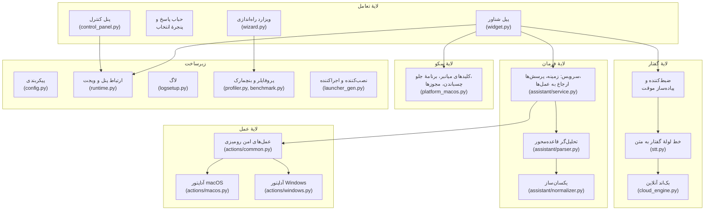
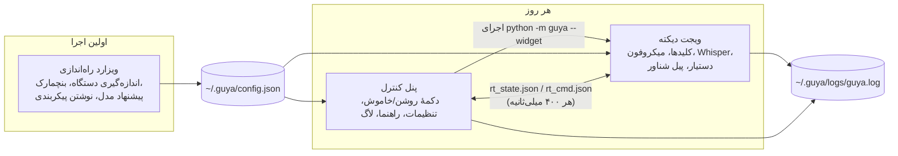
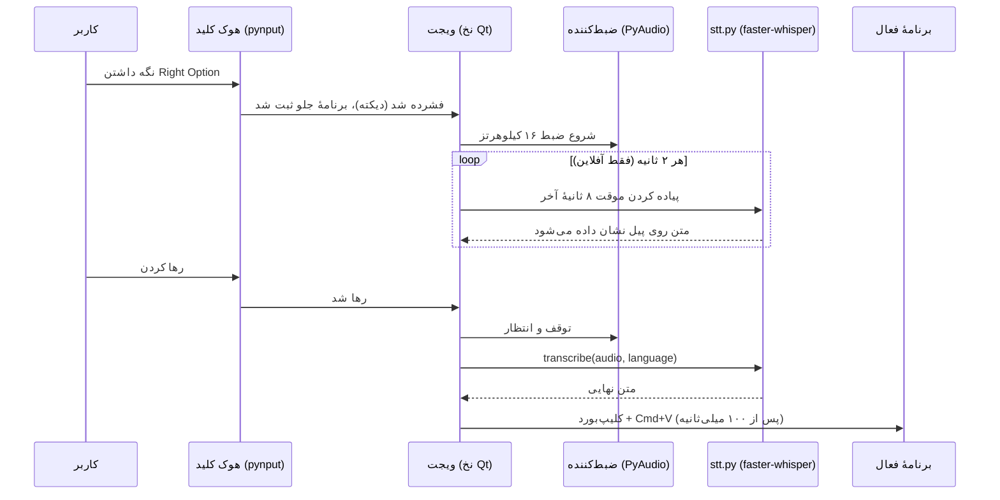
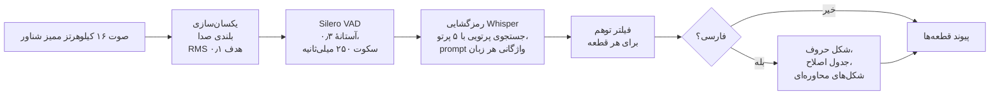
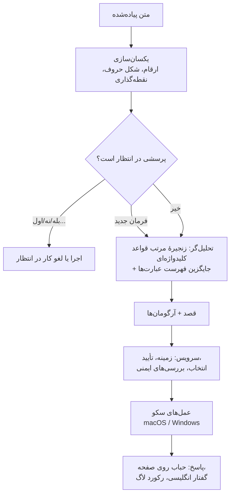
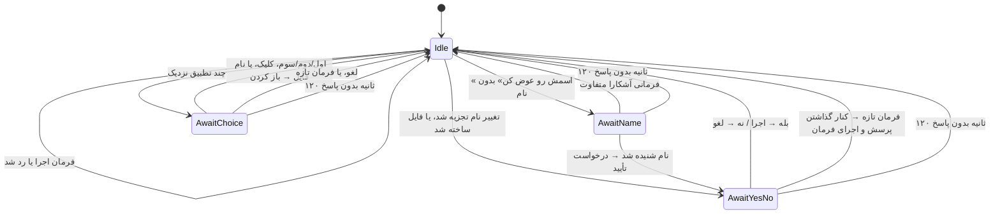
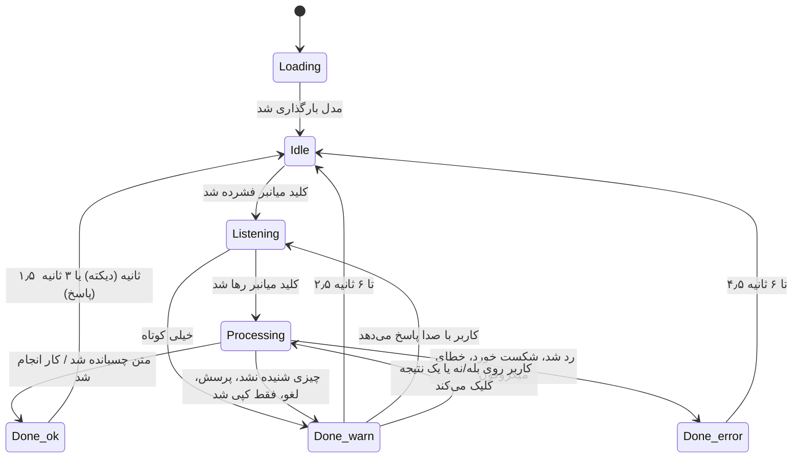

# گویا (Guya): تبدیل گفتار فارسی و انگلیسی به متن و دستیار محدود رومیزی برای افرادی که تایپ کردن برایشان دشوار است

**گزارش پروژهٔ پایانی دورهٔ کارشناسی مهندسی کامپیوتر**

| | |
|---|---|
| دانشجو | محمدرضا گنجی (۲۲۰۷۰۱۰۹۱) |
| استاد راهنما | دکتر حسین آقابابا |
| دانشگاه | دانشگاه تهران، دانشکدگان فارابی، دانشکدهٔ مهندسی |
| نیمسال | نیمسال هشتم، ۱۴۰۵ |
| کد برنامه | `git@github.com:faceesmart/guya.git` |

## فهرست

۱. مقدمه: مسئله، انگیزه، اهداف، رویکرد، دستاوردها، سهم پژوهشی
۲. پیشینه و کارهای مرتبط: Whisper، faster-whisper، معیارها، فارسی، تشخیص فعالیت صوتی، فهم فرمان، دسترس‌پذیری، ابزارهای موجود، پژوهش‌های فارسی
۳. تحلیل نیازمندی‌ها: کاربران، موارد کاربرد، مرور یک روز استفاده، نیازمندی‌های کارکردی، غیرکارکردی و ایمنی، محدودیت‌ها، محدوده
۴. طراحی سیستم: معماری، فرایندها، مسیر دیکته، خط لولهٔ گفتار، فهم فرمان، انتخاب مدل، مدل ایمنی، بازخورد، لایهٔ سکو، پیکربندی، لاگ
۵. پیاده‌سازی: فناوری، سازمان‌دهی کد، نخ‌ها، ماژول گفتار، نام فایل‌ها، تحلیل‌گر، سرویس، عمل‌ها، ویجت، ویزارد، پنل کنترل، نصب، آزمون‌ها، تاریخچه، مفاهیم درسی
۶. راهنمای کاربر
۷. ارزیابی: داده، اندازهٔ مدل، مطالعهٔ حذفی، کالیبراسیون بنچمارک، تعمیم تحلیل‌گر، استفادهٔ واقعی، بازبینی، جلسه‌های دستی، اجرای Windows و جلسه با کاربر هدف، اهداف
۸. بحث
۹. نتیجه‌گیری و کارهای آینده
مراجع
پیوست الف. بازتولید نتایج · ب. مجموعهٔ فرمان‌ها · پ. پیکربندی · ت. ابزارهای ارزیابی · ث. تاریخچهٔ پروژه · ج. واژه‌نامه

**شکل‌ها.** ۴.۱ معماری لایه‌ای · ۴.۲ سه فرایند · ۴.۳ توالی دیکته · ۴.۴ خط لولهٔ تبدیل گفتار · ۴.۵ مسیر دستیار · ۴.۶ وضعیت‌های پرسش در انتظار · ۴.۷ وضعیت‌ها و رنگ‌های پیل · ۵.۱ زبانهٔ تنظیمات · ۵.۲ زبانهٔ راهنما · ۶.۱ صفحهٔ خوش‌آمد ویزارد · ۶.۲ انتخاب زبان در ویزارد · ۶.۳ پنل کنترل

**جدول‌ها.** ۱.۱ اهداف · ۱.۲ دستاوردها · ۲.۱ اندازه‌های مدل Whisper · ۲.۲ ابزارهای موجود · ۳.۱ موارد کاربرد · ۳.۲ نیازمندی‌های کارکردی · ۳.۳ نیازمندی‌های غیرکارکردی · ۳.۴ نیازمندی‌های ایمنی · ۴.۱ مسئولیت ماژول‌ها · ۴.۲ وضعیت‌های پاسخ · ۴.۳ اعمال ایمنی · ۴.۴ وضعیت‌های پیل · ۴.۵ واسط سکو · ۴.۶ رکورد لاگ · ۵.۱ وابستگی‌ها · ۵.۲ اندازهٔ ماژول‌ها · ۵.۳ نخ‌ها و تایمرها · ۵.۴ تنظیمات رمزگشایی · ۵.۵ مقیاس تطبیق نام فایل · ۵.۶ قواعد تحلیل‌گر · ۵.۷ ثابت‌های بنچمارک · ۵.۸ مجموعهٔ آزمون · ۵.۹ جدول زمانی توسعه · ۵.۱۰ مفاهیم درسی · ۶.۱ فرمان‌های گفتاری · ۷.۱ دقت هر مدل · ۷.۲ مطالعهٔ حذفی روی small · ۷.۳ مطالعهٔ حذفی روی large-v3-turbo · ۷.۴ نسبت‌های هزینه · ۷.۵ دقت قصد روی مجموعهٔ دیده‌نشده · ۷.۶ نتایج استفاده · ۷.۷ نقص‌های بازبینی · ۷.۸ جلسه‌های دستی · ۷.۹ نتایج جلسه با کاربر هدف · ۷.۱۰ وضعیت اهداف · ب.۱ مجموعهٔ فرمان‌ها · پ.۱ پیکربندی · ج.۱ واژه‌نامه

---

## چکیده

گویا یک برنامهٔ رومیزی برای افرادی است که می‌توانند صحبت کنند اما تایپ طولانی و کار مکرر با موس و کیبورد برایشان دشوار است. دو حالت «نگه‌دار و صحبت کن» (push-to-talk) روی دو کلید جداگانه دارد: دیکته، که گفتار کاربر را در هر برنامه‌ای که جلو باشد می‌نویسد، و یک دستیار کوچک که مجموعهٔ ثابتی از کارهای امن رومیزی را انجام می‌دهد: ساختن، پیدا کردن، باز کردن و تغییر نام فایل‌ها، باز کردن برنامه‌ها، ذخیره و بستن پنجره، و پیمایش ساده در مرورگر. هر دو حالت به فارسی و انگلیسی کار می‌کنند، در حالت پیش‌فرض آفلاین به‌طور کامل روی رایانهٔ خود کاربر و با نرم‌افزار آزاد اجرا می‌شوند و هزینه‌ای ندارند. یک ویزارد راه‌اندازی، سرعت رایانه را اندازه می‌گیرد و مدل گفتاری‌ای را پیشنهاد می‌کند که روی همان دستگاه با سرعت قابل استفاده اجرا شود؛ برای دستگاه‌های ضعیف، یک مدل آنلاین رایگان به‌عنوان جایگزین در نظر گرفته شده است. برنامه با یک دوبار کلیک نصب می‌شود، ۱۱٬۹۰۵ خط کد Python در ۲۴ ماژول دارد، مرز ایمنی‌ای را اعمال می‌کند که در آن هیچ عملی نمی‌تواند فایلی را حذف یا بازنویسی کند، و ۱۳۶ آزمون خودکار آن را پوشش می‌دهند.

این گزارش نیازمندی‌ها، معماری و پیاده‌سازی سیستم را شرح می‌دهد و آن را با اندازه‌گیری‌های قابل تکرار ارزیابی می‌کند: نرخ خطای واژه (WER) برای شش اندازهٔ مدل Whisper روی یک مجموعهٔ آزمون ثابت فارسی و انگلیسی، یک مطالعهٔ حذفی (ablation) روی تنظیمات رمزگشایی خود گویا، کالیبراسیون بنچمارک دستگاه، یک آزمون تعمیم‌پذیری تحلیل‌گر فرمان‌ها روی جمله‌های دیده‌نشده، و گزارش استفادهٔ واقعی از دستیار، و در پی آن یک جلسه با کاربر هدف روی یک لپ‌تاپ Windows که در آن هر دوازده کار پروتکل مطالعه انجام شد و مقیاس کاربردپذیری سیستم نمرهٔ ۸۲٫۵ گرفت. یافته‌های اصلی از این قرارند: فارسی برای رسیدن به نرخ خطای واژهٔ زیر ۳۰٪ به `large-v3-turbo` یا بزرگ‌تر نیاز دارد، در حالی که انگلیسی با مدل `small` به ۶٪ می‌رسد؛ یک تنظیم دستی که از نمونه‌های اولیه به ارث رسیده بود، یعنی جریمهٔ تکرار، جمله‌ها را کوتاه می‌کرد و حذف شد؛ تحلیل‌گر قاعده‌محور فرمان‌ها، پس از رسیدگی به واژه‌های اضافی گفتار، به جمله‌های دیده‌نشده خوب تعمیم می‌یابد (از ۶۹٪ به ۱۰۰٪ روی مجموعهٔ دیده‌نشده)؛ و مدل گفتار حدود ۹۷٪ تأخیر سرتاسری یک فرمان دستیار را تشکیل می‌دهد، به‌طوری که سهم پردازش خود دستیار ناچیز است.

Abstract: Guya is a desktop application for people who can speak but find sustained typing and repeated mouse and keyboard work difficult. It has two push-to-talk modes on two separate keys: dictation, which types what the user says into whatever application is in front, and a small assistant, which carries out a fixed set of safe desktop actions such as creating, finding, opening and renaming files, opening applications, saving and closing, and simple browser navigation. Both modes work in Persian and English, run, in their default offline mode, entirely on the user's own computer with free software, and cost nothing to use. A setup wizard measures the computer's speed and recommends a speech model that will run at usable speed on that machine, with a free online model as the fallback for weak hardware. The application is installed with one double-click, is 11,905 lines of Python in 24 modules, enforces a safety boundary under which no action can delete or overwrite a file, and is covered by 136 automated tests. This report describes the requirements, the architecture and the implementation, and evaluates the system with reproducible measurements: word error rate of six Whisper model tiers on a fixed Persian and English test set, an ablation of Guya's own decoding settings, a calibration of the device benchmark, a held-out test of the command parser, and the assistant's real-use log, followed by a session with the target user on a Windows laptop in which all twelve tasks of the study protocol were completed and the System Usability Scale scored 82.5. The main findings are that Persian needs `large-v3-turbo` or larger to fall below 30% word error rate, while English reaches 6% with `small`; that one hand-tuned decoding setting inherited from earlier prototypes, the repetition penalty, was found to cut sentences short and was removed; that the rule-based parser generalises well to unseen phrasings once filler words are handled (69% → 100% on a held-out set); and that the speech model accounts for about 97% of the end-to-end latency of an assistant command, so the assistant's own processing is negligible.

---

## ۱. مقدمه

### ۱.۱ بیان مسئله

بیشتر نوشتن با رایانه از راه تایپ انجام می‌شود، و تایپ کردن تلاشی جسمی و پیوسته است. برای کسی که محدودیت حرکتی دارد، نوشتن یک پاراگراف می‌تواند چند دقیقه طول بکشد و درد به همراه داشته باشد. کارهای کوچک اطراف نوشتن هم به همان اندازه هزینه دارند: باز کردن سند درست، پیدا کردن آن بعد از بسته شدن، تغییر نامش، پایین بردن یک صفحهٔ وب برای خواندن ادامهٔ آن. هر یک از این‌ها دنباله‌ای از عملیات دقیق با موس و کیبورد است.

نرم‌افزار دیکته مدت‌هاست وجود دارد و امروزه سیستم‌عامل‌ها هم کنترل صوتی دارند. در عمل هیچ‌کدام به کار یک فارسی‌زبان با یک رایانهٔ خانگی معمولی نمی‌آید. دیکتهٔ داخلی macOS و Windows فارسی را در فهرست زبان‌هایش ندارد. تنها محصول تجاری‌ای که فارسی را پشتیبانی می‌کند، نویسا، فقط برای Windows است و با مجوز پولی فروخته می‌شود. سرویس‌های ابری‌ای که فارسی را خوب تشخیص می‌دهند هر جمله را به یک سرور می‌فرستند و به حساب کاربری نیاز دارند، و برای کارهای اطراف متن هیچ کمکی نمی‌کنند. مرور این ابزارها در بخش ۲.۸ آمده است.

در آغاز پروژه یک پرسش فنی هم وجود داشت. مدل‌های گفتاری آزاد مانند Whisper فارسی را تشخیص می‌دهند، اما روی پردازندهٔ لپ‌تاپ، اندازه‌هایی از مدل که فارسی را دقیق تشخیص می‌دهند کُند اجرا می‌شوند، و اندازه‌هایی که سریع اجرا می‌شوند دقیق نیستند. این‌که آیا یک ابزار دیکتهٔ فارسی قابل استفاده می‌تواند به‌طور کامل و بدون هزینه روی یک رایانهٔ معمولی اجرا شود، در شروع پروژه معلوم نبود. بخشی از این گزارش با اندازه‌گیری به این پرسش پاسخ می‌دهد. پاسخ کوتاه مثبت است، با یک شرط: بزرگ‌ترین مدل turbo، کوانتیزه‌شده به ۸ بیت، فارسی را با خطای واژهٔ زیر ۳۰٪ و خطای نویسهٔ ۶٪ و در یک‌سوم زمان واقعی روی پردازندهٔ لپ‌تاپ نگارنده پیاده می‌کند، و هیچ مدل کوچک‌تری به اندازهٔ کافی خوب نیست (بخش ۷.۲).

### ۱.۲ انگیزه و کاربر هدف

این پروژه برای یک کاربر مشخص ساخته شده است: برادر نگارنده. او واضح صحبت می‌کند، اما تایپ طولانی برایش دشوار است و بیشتر کار روزانه‌اش با رایانه، نوشتن به فارسی همراه با انگلیسی گاه‌به‌گاه است. همین، پیش از نوشتن حتی یک خط کد، سه محدودیت را تعیین کرد. نرم‌افزار باید روی همان نوع رایانه‌ای اجرا شود که یک خانواده از قبل دارد، بدون کارت گرافیک و بدون اشتراک؛ باید فارسی را به همان اندازهٔ انگلیسی پشتیبانی کند؛ و یکی از اعضای خانواده باید بتواند آن را بدون کمک فنی برایش نصب و راه‌اندازی کند.

کاربر در بخش ۳.۱ به‌صورت رسمی‌تر توصیف شده است. نکتهٔ مهم این است که پروژه برای یک فرد واقعی ساخته شده و تصمیم‌های طراحی فصل ۴ با توجه به کارهایی که او در عمل با برنامه خواهد کرد سنجیده شده‌اند. او در پایان نیمسال در یک جلسهٔ مشاهده‌شده از نرم‌افزار استفاده کرد (بخش ۷.۹).

### ۱.۳ اهداف

پیشنهادنامهٔ تصویب‌شده (پیوست ث تاریخچهٔ آن را خلاصه می‌کند) پنج هدف را بیان می‌کند. این اهداف در اینجا تکرار می‌شوند، چون ارزیابی فصل ۷ حول آن‌ها سازمان یافته است.

| شناسه | هدف |
|---|---|
| O1 | دیکتهٔ قابل اتکای فارسی و انگلیسی به روش «نگه‌دار و صحبت کن» در برنامهٔ فعال. |
| O2 | یک دستیار دوزبانهٔ جداگانه برای مجموعهٔ محدودی از کارهای رومیزی: ساختن، پیدا کردن، باز کردن و تغییر نام فایل‌ها و پوشه‌ها، باز کردن برنامه‌ها، ذخیره یا بستن پنجرهٔ فعال، و جستجوی امن در وب. |
| O3 | رفتار پیش‌بینی‌پذیر و امن از راه فهم قاعده‌محور فرمان، تأیید پیش از تغییر نام، نمایش گزینه‌ها برای نتایج مبهم، و محدود کردن دسترسی به سیستم فایل. |
| O4 | حالت‌های تشخیص آفلاین، آنلاین و دوگانه، همراه با نمایه‌سازی دستگاه و پیشنهاد مدل بر پایهٔ اندازه‌گیری در زمان راه‌اندازی. |
| O5 | ارزیابی دقت تشخیص، زمان پاسخ، موفقیت در انجام فرمان‌ها، ایمنی و کاربردپذیری با کاربران نمونه، از جمله کاربر هدف. |

*جدول ۱.۱. اهداف پروژه، برگرفته از پیشنهادنامه.*

پیمایش مرورگر در جریان پیاده‌سازی به O2 افزوده شد؛ پیشنهادنامه فقط جستجوی وب را فهرست کرده بود.

### ۱.۴ رویکرد

گویا یک برنامهٔ رومیزی است که با Python و رابط PyQt6 نوشته شده و به سه فرایند تقسیم می‌شود: یک ویجت شناور که گوش می‌دهد و می‌نویسد، یک پنل کنترل برای تنظیمات روزانه، و یک ویزارد راه‌اندازی که یک بار اجرا می‌شود (بخش ۴.۲). تشخیص گفتار به‌صورت محلی با مدل Whisper شرکت OpenAI انجام می‌شود، که از طریق کتابخانهٔ faster-whisper روی موتور استنتاج CTranslate2 و با وزن‌های ۸ بیتی اجرا می‌شود، و به همین دلیل حتی مدل بزرگ هم روی پردازندهٔ یک لپ‌تاپ قابل اجراست. کاربر برای دیکته یک کلید و برای دادن فرمان کلید دیگری را نگه می‌دارد. متن دیکته‌شده در هر برنامه‌ای که جلو باشد جای‌گذاری (paste) می‌شود. فرمان‌ها به یک دستیار کوچک می‌رسند که فهم آن قاعده‌محور است: مجموعهٔ ثابتی از قصدها (intent) که هر یک با کلیدواژه‌ها و عبارت‌های منظمی که برای فارسی و انگلیسی نوشته شده‌اند تشخیص داده می‌شود، و یک فهرست عبارت‌های نمونه به‌عنوان راه جایگزین. دستیار کارها را از طریق یک لایهٔ نازک سکو برای macOS و Windows انجام می‌دهد، پشت مرز ایمنی‌ای که هیچ حذف یا بازنویسی‌ای را مجاز نمی‌داند و هر عملیات فایلی را به پوشه‌های Desktop، Documents و Downloads کاربر محدود می‌کند.

چون مدلی که فارسی به آن نیاز دارد از نظر محاسباتی پرهزینه است، یک ویزارد راه‌اندازی در اولین اجرا سرعت رایانه را اندازه می‌گیرد و دقیق‌ترین مدلی را پیشنهاد می‌کند که روی همان دستگاه هم‌پای گفتار پیش می‌رود. اگر هیچ مدلی چنین نباشد، به جای آن یک مدل آنلاین رایگان پیشنهاد می‌شود، و یک حالت دوگانه هر دو را در دسترس نگه می‌دارد تا کاربر بتواند، برای نمونه، انگلیسی را آفلاین نگه دارد و برای فارسی با یک ضربه روی پیل به مدل آنلاین سوئیچ کند.

کل سیستم بین ژوئن و سپتامبر ۲۰۲۶ روی لپ‌تاپ نگارنده (Apple M1 Pro با ۱۶ گیگابایت حافظه) ساخته و ارزیابی شد و هر روز روی همان دستگاه استفاده می‌شود.

### ۱.۵ آنچه تحویل داده شد

پروژه برنامه‌ای عملیاتی و قابل نصب را همراه با هر آنچه برای ارزیابی و بازتولید آن لازم است تحویل داده است. جدول ۱.۲ دستاوردها را فهرست می‌کند. اندازه‌ها از مخزن در زمان نوشتن این گزارش گرفته شده‌اند.

| دستاورد | محتوا | اندازه |
|---|---|---|
| برنامه | ویجت دیکته، دستیار، ویزارد راه‌اندازی، پنل کنترل، آداپتورهای سکو برای macOS و Windows | ۲۴ ماژول Python، ۱۱٬۹۰۵ خط |
| نصب‌کننده‌ها و اجراکننده‌ها | نصب‌کننده‌های macOS و Windows که با یک دوبار کلیک اجرا می‌شوند، بستهٔ `Guya.app` تولیدشده، حذف‌کنندهٔ برنامه (uninstaller) درون پنل کنترل | ۶ اسکریپت |
| ابزار ارزیابی | امتیازدهندهٔ دقت و سرعت گفتار، واردکنندهٔ FLEURS، کلیدهای مطالعهٔ حذفی، ارزیاب قصد روی مجموعهٔ دیده‌نشده، تحلیل‌گر لاگ استفاده، تولیدکنندهٔ جدول‌ها، ضبط‌کنندهٔ صدای کاربر هدف و سازندهٔ نمونه‌های گفتار مصنوعی | ۸ ماژول، ۱٬۲۴۰ خط |
| مجموعهٔ آزمون | آزمون‌های واحد و رگرسیون که بدون میکروفون، مدل یا شبکه اجرا می‌شوند | ۱۳۶ آزمون، ۱۰ فایل، ۱٬۵۹۸ خط |
| داده و نتایج | مجموعهٔ آزمون گفتار دوزبانه با ۱۲۰ کلیپ (مانیفست)، ۲۶۷ جمله‌بندی فرمان، همهٔ فایل‌های نتیجه | ۶۰ فایل نتیجه |
| مستندات | راهنمای کاربر (فصل ۶)، متن نمایش (demo)، پروتکل مطالعهٔ کاربر، فهرست ارزیابی گفتاری، این گزارش به انگلیسی و فارسی | |

*جدول ۱.۲. دستاوردها.*

مخزن ۵۶ کامیت بین ۵ ژوئن و ۱۴ سپتامبر ۲۰۲۶ دارد؛ دستیار در اوت و داده‌ها و نتایج ارزیابی در سپتامبر اضافه شدند (تاریخچه در بخش ۵.۱۴ آمده است).

### ۱.۶ سهم پژوهشی

فراتر از نرم‌افزار، پروژه اندازه‌گیری‌هایی تولید کرد که پیش از آن در دسترس نبودند و همهٔ آن‌ها از مخزن قابل بازتولیدند (پیوست الف):

۱. اندازه‌گیری شش اندازهٔ مدل Whisper روی گفتار خوانده‌شدهٔ فارسی و انگلیسی روی سخت‌افزار خانگی، که دقت و سرعت هر یک را به دست می‌دهد. این همان داده‌ای است که پیشنهاد ویزارد و کف مدل هر زبان بر آن استوار است (بخش ۷.۲).
۲. یک مطالعهٔ حذفی (ablation) روی تنظیمات رمزگشایی خود گویا، هر بار یک تنظیم. این مطالعه نشان داد که یکی از تنظیمات به‌ارث‌رسیده از نمونه‌های اولیه، یعنی جریمهٔ تکرار، جمله‌ها را کوتاه می‌کرد، و آن تنظیم حذف شد (بخش ۷.۳).
۳. کالیبراسیون بنچمارک دستگاه با نسبت‌های هزینهٔ اندازه‌گیری‌شده، به جای برآوردهایی که دو تا سه برابر خطا داشتند (بخش ۷.۴).
۴. یک مجموعهٔ آزمون دیده‌نشده از ۲۶۷ جمله‌بندی طبیعی فرمان به فارسی و انگلیسی و یک ارزیاب برای تحلیل‌گر. دقت تشخیص قصد روی ۲۲۱ جمله‌بندی دیده‌نشده، پس از آن‌که تحلیل‌گر برای حذف واژه‌های اضافی و افزودن جایگزین کلیدواژه‌ای حرکت در مرورگر تغییر کرد، از ۶۹٫۲٪ به ۱۰۰٪ رسید (بخش ۷.۵).
۵. یک رکورد ساخت‌یافتهٔ لاگ برای هر فرمان دستیار، که استفادهٔ روزانه را به یک مجموعه‌دادهٔ ارزیابی تبدیل می‌کند (بخش ۷.۶).

خود نرم‌افزار چند بخش دارد که باید ساخته می‌شدند نه سرهم؛ داور ممکن است بخواهد مستقیماً به آن‌ها نگاه کند: یک تحلیل‌گر قاعده‌محور دوزبانه و مقاوم به واژه‌های اضافی برای ۱۹ قصد که بدون هیچ مدل آموزش‌دیده‌ای روی جمله‌بندی‌های دیده‌نشده به ۱۰۰٪ می‌رسد (بخش ۵.۶)؛ یک حل‌کنندهٔ نام فایل گفتاری که «test six docks» یا «آزمون شیش دکس» را با یک مقیاس امتیازدهی تطبیق و قاعده‌ای برای این‌که کِی به جای حدس زدن بپرسد به `test6.docx` تبدیل می‌کند (بخش ۵.۵)؛ یک بنچمارک دستگاه که جدول مدل‌هایش اندازه‌گیری‌شده است نه برآوردی (بخش ۵.۱۰)؛ یک مرز ایمنی ۵۱۳ خطی که بازبین می‌تواند آن را کامل بخواند (بخش ۴.۷)؛ پرسش‌های تأیید غیرمسدودکننده که پس از دو دقیقه منقضی می‌شوند تا «بله»ای دیرهنگام نتواند نام فایل اشتباهی را تغییر دهد (بخش ۴.۵)؛ یک نویسندهٔ `.docx` که فقط بر کتابخانهٔ استاندارد تکیه دارد، پس ساختن فایل Word به هیچ وابستگی اضافه‌ای نیاز ندارد (بخش ۵.۸)؛ و یک طراحی سه‌فرایندی که فرایندهایش از راه فایل‌های JSON با جایگزینی اتمی و بدون سوکت یا مجوز با هم گفت‌وگو می‌کنند (بخش ۴.۲).

### ۱.۷ ساختار گزارش

فصل ۲ پیشینهٔ تشخیص گفتار با Whisper، فارسی به‌عنوان یک زبان کم‌منبع، فهم فرمان و ابزارهای موجود را مرور می‌کند. فصل ۳ نیازمندی‌ها و محدوده را بیان می‌کند. فصل ۴ معماری و تصمیم‌های طراحی را شرح می‌دهد. فصل ۵ پیاده‌سازی را ماژول به ماژول، همراه با راهبرد آزمون و تاریخچهٔ توسعه، شرح می‌دهد. فصل ۶ راهنمای کاربر است. فصل ۷ ارزیابی را ارائه می‌کند. فصل ۸ دربارهٔ نتایج و محدودیت‌های آن‌ها بحث می‌کند و فصل ۹ با کارهای آینده جمع‌بندی می‌کند. پیوست‌ها فرمان‌های بازتولید، مجموعهٔ فرمان‌ها، کلیدهای پیکربندی، ابزارهای ارزیابی، تاریخچهٔ پروژه و یک واژه‌نامه را در بر می‌گیرند.

---

## ۲. پیشینه و کارهای مرتبط

### ۲.۱ تشخیص خودکار گفتار و Whisper

تشخیص خودکار گفتار (ASR) سیگنال صوتی را به متن تبدیل می‌کند. تا چند سال پیش، یک تشخیص‌دهندهٔ خوب از کنار هم گذاشتن مدل‌های جداگانهٔ آکوستیک، تلفظ و زبان ساخته می‌شد که هر یک روی داده‌ای آماده‌شده برای همان زبان آموزش می‌دید. سیستم‌های فارسی از این نوع وجود دارند (بخش ۲.۸)، اما ساختن یکی از آن‌ها برای یک شرکت کاری چندساله است. آنچه یک پروژهٔ دانشجویی را ممکن کرد، پیدایش مدل‌های بزرگ سرتاسری (end-to-end) بود که هم‌زمان روی زبان‌های زیادی آموزش دیده‌اند.

Whisper (Radford و همکاران، ۲۰۲۳) [۱] چنین مدلی است. یک ترنسفورمر رمزگذار–رمزگشا است که OpenAI آن را روی ۶۸۰٬۰۰۰ ساعت صوت گردآوری‌شده از وب، همراه با متن‌های پیاده‌شدهٔ آن‌ها، آموزش داده است. صوت به پنجره‌های ۳۰ ثانیه‌ای بریده می‌شود، به طیف‌نگار لگاریتمی مل (log-mel spectrogram) تبدیل می‌شود و از رمزگذار می‌گذرد؛ سپس رمزگشا توکن‌های متن را یکی‌یکی تولید می‌کند، مشروط بر خروجی رمزگذار و توکن‌هایی که تا آن لحظه تولید شده‌اند. توکن‌های ویژه‌ای در آغاز دنبالهٔ رمزگشا به مدل می‌گویند که انتظار کدام زبان را داشته باشد و گفتار را پیاده کند یا ترجمه. بنابراین همان وزن‌ها هم فارسی را پوشش می‌دهند و هم انگلیسی را، و برای جابه‌جایی میان این دو، تنها یک توکن زبان کافی است. همین ویژگی است که این پروژه را با هزینهٔ صفر ممکن کرد: برای رسیدن به یک تشخیص‌دهندهٔ فارسی قابل استفاده به هیچ آموزش مخصوص فارسی نیاز نبود.

Whisper در چند اندازه عرضه می‌شود که در جدول ۲.۱ فهرست شده‌اند. گونهٔ `large-v3-turbo` رمزگذار کامل `large-v3` را نگه می‌دارد اما رمزگشا را از ۳۲ لایه به ۴ لایه کاهش می‌دهد، که آن را با از دست دادن اندکی دقت چند برابر سریع‌تر می‌کند [۱]. فصل ۷ اندازه می‌گیرد که این ادعا برای فارسی روی یک لپ‌تاپ تا چه حد برقرار است.

| مدل | پارامترها | حجم دانلود (float16، مگابایت) | توضیح |
|---|---:|---:|---|
| tiny | ۳۹ میلیون | ۷۵ | ویزارد از آن برای سنجش سرعت دستگاه استفاده می‌کند |
| base | ۷۴ میلیون | ۱۴۵ | |
| small | ۲۴۴ میلیون | ۴۸۴ | کف انگلیسی در گویا |
| medium | ۷۶۹ میلیون | ۱٬۵۳۰ | |
| large-v3-turbo | ۸۰۹ میلیون | ۱٬۶۲۰ | کف فارسی و مدل پیش‌فرض |
| large-v3 | ۱٬۵۵۰ میلیون | ۳٬۰۹۰ | |

*جدول ۲.۱. اندازه‌های مدل Whisper. تعداد پارامترها از کارت مدل [۱]؛ حجم‌های دانلود، تبدیل‌های float16 در CTranslate2 هستند که ویزارد دریافت می‌کند؛ وزن‌ها هنگام بارگذاری مدل به ۸ بیت کوانتیزه می‌شوند.*

تنظیمات رمزگشایی به اندازهٔ انتخاب مدل بر خروجی اثر می‌گذارند. رمزگشای Whisper با جستجوی پرتویی (beam search) اجرا می‌شود (گویا از پرتوی ۵ استفاده می‌کند) و مجموعه‌ای از بررسی‌های کیفیت داخلی دارد: اگر نسبت فشرده‌سازی متن تولیدشده بیش از حد بالا باشد (نشانهٔ تکرار) یا میانگین لگاریتم احتمال آن خیلی پایین باشد، کتابخانه همان پنجره را با دمای نمونه‌برداری بالاتر دوباره امتحان می‌کند. گویا این بررسی‌ها را نگه می‌دارد اما تلاش دوباره را در حالت‌های تک‌زبانه خاموش می‌کند و فقط در حالت دوگانه یک نردبان دمایی کوتاه را مجاز می‌داند (بخش ۵.۴). همچنین برای هر پنجره یک احتمال «بدون گفتار» برآورد می‌کند که برای دور انداختن قطعه‌هایی که احتمالاً سکوت‌اند به کار می‌رود. این بررسی‌ها به دلیل دو حالت شکست شناخته‌شدهٔ Whisper وجود دارند که گویا هم باید آن‌ها را مدیریت کند: متن توهمی (hallucination) روی سکوت یا نویز، معمولاً جمله‌هایی مانند «thanks for watching» که در زیرنویس‌های آموزشی رایج بوده‌اند، و حلقه‌های تکرار که در آن‌ها رمزگشا یک عبارت را بارها و بارها تولید می‌کند. بخش ۵.۴ فیلترهایی را که گویا به کار می‌برد شرح می‌دهد و بخش ۷.۳ هزینهٔ هر یک را اندازه می‌گیرد.

### ۲.۲ faster-whisper و CTranslate2

اجرای پیاده‌سازی اصلی Whisper با PyTorch روی پردازنده کند است. گویا از faster-whisper [۲] استفاده می‌کند که پیاده‌سازی دوبارهٔ استنتاج روی CTranslate2 [۳] است، موتوری که به زبان C++ برای مدل‌های ترنسفورمر نوشته شده است. CTranslate2 وزن‌ها را روی پردازنده به اعداد صحیح ۸ بیتی کوانتیزه می‌کند، که حافظه را حدود چهار برابر کم می‌کند و عملیات ماتریسی را سریع‌تر می‌کند، با هزینه‌ای در دقت که عموماً ناچیز گزارش می‌شود؛ همهٔ اندازه‌گیری‌های این پروژه با int8 انجام شد و این تفاوت در اینجا اندازه‌گیری نشد. این کتابخانه تشخیص‌دهندهٔ فعالیت صوتی Silero را هم همراه دارد (بخش ۲.۵) و همهٔ گزینه‌های رمزگشایی Whisper را به‌صورت آرگومان‌های کلیدواژه‌ای در دسترس می‌گذارد. در سراسر پروژه از faster-whisper 1.2.1 و CTranslate2 4.8.1 استفاده شده است.

با وزن‌های ۸ بیتی، `large-v3-turbo` روی دستگاه توسعه گفتار را در حدود یک‌سوم زمان واقعی پیاده می‌کند (RTF برابر ۰٫۲۹ برای فارسی و ۰٫۳۵ برای انگلیسی) (بخش ۷.۲)، و همین است که یک سیستم فارسی کاملاً محلی را عملی می‌کند. همان اندازه‌گیری نشان می‌دهد که سرعت بین اندازه‌های مدل تا یک مرتبهٔ بزرگی تغییر می‌کند و روی دستگاه‌های دیگر باز هم تغییر خواهد کرد. همین تغییرپذیری دلیل آن است که گویا به جای فرض کردن یک مدل ثابت، دستگاه را اندازه می‌گیرد (بخش ۴.۶).

جایگزین استنتاج محلی، برای دستگاهی که نمی‌تواند مدل فارسی را با سرعت قابل استفاده اجرا کند، یک Whisper میزبانی‌شده است. حالت آنلاین گویا ضبط را به‌صورت WAV ۱۶ بیتی به نقطهٔ پایانی پیاده‌سازی گفتار Groq [۱۸] می‌فرستد که `whisper-large-v3`، یعنی همان خانوادهٔ مدل مسیر آفلاین، را روی یک سطح رایگان اجرا می‌کند که فقط به یک حساب کاربری و یک کلید API نیاز دارد. بهای آن حریم خصوصی است: در این حالت صدا از دستگاه بیرون می‌رود و ویزارد این را در همان صفحه‌ای که حالت انتخاب می‌شود می‌گوید. حالت دوگانه راه میانه است، یک زبان آفلاین و زبان دیگر آنلاین، تا دستگاهی ضعیف بتواند انگلیسی را با `small` محلی نگه دارد و فقط فارسی را بیرون بفرستد. حالت‌های آنلاین و دوگانه در فصل ۷ امتیازدهی نشدند، چون امتیازدهی آن‌ها یعنی بارگذاری صوت آزمون نزد یک شخص ثالث (بخش ۷.۹).

### ۲.۳ اندازه‌گیری یک تشخیص‌دهنده

سه معیار در سراسر این گزارش به کار می‌روند.

**نرخ خطای واژه** (WER) یک متن پیاده‌شده نسبت به متن مرجع، کمینهٔ تعداد جایگزینی، حذف و درج واژه‌هایی است که برای تبدیل یکی به دیگری لازم است، تقسیم بر تعداد واژه‌های مرجع:

WER = (S + D + I) / N

**نرخ خطای نویسه** (CER) همان کمیت است که روی نویسه‌ها و با حذف فاصله‌ها محاسبه می‌شود. برای فارسی در کنار WER گزارش می‌شود، چون سهم بزرگی از خطاهای واژهٔ فارسی تفاوت‌های فاصله‌گذاری‌اند که خواننده به‌سختی متوجه آن‌ها می‌شود (بخش ۷.۲)؛ CER نشان می‌دهد چه نسبتی از نویسه‌ها درست تشخیص داده شده‌اند.

**ضریب زمان واقعی** (RTF) زمان صرف‌شده برای پیاده کردن گفتار تقسیم بر طول صوت است. RTF برابر ۰٫۵ یعنی ده ثانیه گفتار پنج ثانیه طول می‌کشد تا پیاده شود. زیر ۱٫۰، تشخیص‌دهنده هم‌پای گفتار پیش می‌رود.

همهٔ نرخ‌های خطا در این گزارش در سطح پیکره‌اند: تعداد ویرایش‌های همهٔ کلیپ‌ها پیش از تقسیم جمع می‌شود، پس کلیپ‌های بلند وزن بیشتری از کلیپ‌های کوتاه دارند. مرجع و فرضیه هر دو پیش از امتیازدهی از یک یکسان‌سازی می‌گذرند (حروف کوچک، حذف نشانه‌گذاری، یکسان کردن ارقام و اعداد با حروف، تبدیل شکل‌های عربی حروف به شکل فارسی، حذف اعراب و نیم‌فاصله). امتیازدهنده در `eval/wer.py` است و آزمون‌های خودش را دارد، چون هر عددی در فصل ۷ به آن وابسته است.

دو معیار دیگر برای دستیار به کار می‌روند. **دقت قصد** سهم جمله‌بندی‌های آزمونی است که تحلیل‌گر برای آن‌ها قصد مورد نظر را برمی‌گرداند؛ **دقت قصد و آرگومان‌ها** که سخت‌گیرانه‌تر است، علاوه بر آن می‌خواهد آرگومان‌های نام‌برده (نام فایل جدید، سایت، جهت پیمایش، مرحله‌های یک دنباله) هم پس از یکسان‌سازی مطابقت داشته باشند. هر دو با `eval/intent_accuracy.py` و فقط روی جمله‌بندی‌های دیده‌نشده محاسبه می‌شوند: ردیف‌هایی که با عبارت‌های نمونهٔ خود تحلیل‌گر یکی‌اند علامت می‌خورند و کنار گذاشته می‌شوند، پس تحلیل‌گر هرگز روی جمله‌هایی که از روی آن‌ها نوشته شده امتیاز نمی‌گیرد. برای استفادهٔ واقعی، هر فرمانی که دستیار پردازش می‌کند به‌صورت یک رکورد JSON همراه با نتیجه‌اش (انجام شد، فهمیده نشد، فهمیده شد اما شکست خورد، پرسشی مطرح شد، لغو شد) و دو زمان، زمان تشخیص و زمان تجزیه و اجرا، ثبت می‌شود؛ `eval/assistant_report.py` این رکوردها را به سهم نتایج و تفکیک تأخیر بخش ۷.۶ تبدیل می‌کند.

### ۲.۴ چرا فارسی سخت‌تر است

فارسی برای Whisper یک زبان کم‌منبع است. بیشتر دادهٔ آموزشی انگلیسی است و فارسی یکی از زبان‌هایی است که سهم کوچکی از آن دارد. خط فارسی هم دشواری‌های خودش را اضافه می‌کند. فارسی با خط عربی نوشته می‌شود و چند حرف آن دو شکل یونیکد دارند (ي و ی، ك و ک)، پس یک واژه را می‌توان به دو شکل نوشت. مصوت‌های کوتاه معمولاً نوشته نمی‌شوند. واژه‌های مرکب و پیشوندهای فعل با نیم‌فاصله (ZWNJ) نوشته می‌شوند که بسیاری از نویسندگان آن را با فاصله جایگزین می‌کنند یا حذف می‌کنند («می‌کند»، «می کند»، «میکند»)، و خروجی Whisper در این مورد ناسازگار است. سرانجام، زبان گفتاری با زبان نوشتاری فرق دارد: گوینده می‌گوید «میخوام» و مدل، که متن‌های آموزشی‌اش بیشتر به زبان نوشتاری‌اند، «می‌خواهم» را خروجی می‌دهد. گویا رایج‌ترین این شکل‌های رسمی را به شکل گفتاری بازمی‌گرداند (بخش ۵.۴)، و ارزیابی CER را در کنار WER گزارش می‌کند تا تغییرپذیری فاصله‌گذاری تصویر واقعی را پنهان نکند.

### ۲.۵ تشخیص فعالیت صوتی

یک تشخیص‌دهندهٔ فعالیت صوتی (VAD) هر قاب کوتاه صوت را به‌عنوان گفتار یا غیرگفتار برچسب می‌زند. Whisper پنجره‌های ثابت ۳۰ ثانیه‌ای را پیاده می‌کند و روی سکوت به توهم گرایش دارد، پس حذف بخش‌های ساکت پیش از رمزگشایی هم محاسبات هدررفته و هم متن ساختگی را کم می‌کند. faster-whisper مدل Silero VAD [۶] را، که شبکهٔ بازگشتی کوچکی است و به‌صورت فایل ONNX عرضه می‌شود، همراه دارد و صوت را بر اساس چند پارامتر می‌بُرد که گویا چهار تای آن‌ها را تنظیم می‌کند: آستانهٔ احتمال گفتار، کمینهٔ سکوتی که یک ناحیهٔ گفتار را پایان می‌دهد، کمینهٔ طول یک ناحیهٔ گفتار، و حاشیه‌ای که دور هر ناحیه نگه داشته می‌شود. گویا آستانه را نسبت به پیش‌فرض کتابخانه پایین می‌آورد و فاصلهٔ سکوت را کوتاه می‌کند، چون کاربر هدف آرام صحبت می‌کند و در میان جمله مکث می‌کند؛ مقادیر دقیق و اثر اندازه‌گیری‌شدهٔ آن‌ها در بخش‌های ۵.۴ و ۷.۳ آمده است.

### ۲.۶ فهم فرمان: قاعده یا مدل زبانی

یک دستیار صوتی باید متن پیاده‌شده را به یک قصد و آرگومان‌های آن نگاشت کند، مثلاً «rename it to final report» را به *تغییر نام* با نام جدید *final report*. راه رایج امروز برای این کار فرستادن متن به یک مدل زبانی بزرگ است. گویا به جای آن از یک تحلیل‌گر قطعی استفاده می‌کند: مجموعه‌های کلیدواژه، عبارت‌های منظمی که برای هر فرمان در هر زبان نوشته شده‌اند، و فهرستی از عبارت‌های نمونه که به‌عنوان راه جایگزین به کار می‌رود. سه دلیل به این انتخاب انجامید.

اول، هزینه و محلی بودن. API یک مدل زبانی یا پولی است یا سقف استفاده دارد و به اتصال اینترنت نیاز دارد؛ یک مدل زبانی محلی هم با Whisper بر سر همان پردازنده رقابت می‌کرد. گزینهٔ میانی، یک دسته‌بند کوچک آموزش‌دیده روی فرمان‌های برچسب‌خورده، به دلیل نبود داده کنار گذاشته شد: هیچ پیکره‌ای از فرمان‌های رومیزی فارسی وجود ندارد، و ۲۶۷ جمله‌بندی‌ای که پروژه سرانجام گردآوری کرد (بخش ۷.۵) برای آزمودن تحلیل‌گر نوشته شده‌اند نه برای آموزش آن، و برای هر دو کار هم کم‌اند. جایی که قواعد فعال نمی‌شوند، گویا به تطبیق تقریبی رشته‌ها پناه می‌برد: جملهٔ یکسان‌شده با نسبت شباهت difflib با هر عبارت نمونه مقایسه می‌شود و نزدیک‌ترین قصد فقط بالای ۰٫۸۲ پذیرفته می‌شود، با آستانه‌های آسان‌گیرتر برای پاسخ یک‌واژه‌ای به پرسش در انتظار (۰٫۷۵) و برای واژه‌های انتخاب مانند «دوم» (۰٫۵)، چون «بله»ی بدشنیده‌شده باید همچنان بله شمرده شود، اما فرمانی که بد شنیده شده نباید به عملی تبدیل شود.

دوم، قابلیت توضیح. هر تصمیم یک تحلیل‌گر قاعده‌محور را می‌توان چاپ کرد و تا یک خط مشخص از کد ردیابی کرد. این موضوع وقتی اهمیت پیدا می‌کند که کار مورد نظر تغییر نام فایل کاربر است.

سوم، ایمنی. تحلیل‌گر فقط می‌تواند قصدهایی از یک فهرست ثابت تولید کند و لایهٔ عمل فقط همان قصدها را پیاده‌سازی می‌کند. هیچ مسیری از متن گفتاری به یک عمل دلخواه وجود ندارد و هیچ تزریق دستوری (prompt injection) نیست که بخواهیم در برابرش دفاع کنیم. بخش ۴.۷ استدلال ایمنی را بر همین پایه می‌سازد.

بهای این انتخاب، محدود شدن پوشش است: یک تحلیل‌گر قاعده‌محور فقط جمله‌بندی‌هایی را می‌فهمد که هنگام نوشتن قواعد پیش‌بینی شده باشند. بخش ۷.۵ این هزینه را روی جمله‌بندی‌هایی که تحلیل‌گر هرگز ندیده بود اندازه می‌گیرد و نشان می‌دهد چگونه کاهش یافت.

### ۲.۷ ملاحظات دسترس‌پذیری

چند انتخاب طراحی از کاربر مورد نظر ناشی می‌شوند، نه از فناوری. «نگه‌دار و صحبت کن» به جای واژهٔ بیدارکننده انتخاب شد: به میکروفون همیشه‌روشن نیاز ندارد، به کاربر کنترل صریح می‌دهد که رایانه کِی گوش می‌دهد، و کلیدی که فشرده می‌شود خودش می‌گوید کدام حالت مورد نظر است. بازخورد همیشه روی صفحه دیده می‌شود و برای انگلیسی خوانده هم می‌شود. خروجی گفتاری از سنتزکنندهٔ خود سیستم‌عامل استفاده می‌کند (`say` در macOS، موتور گفتار PowerShell در Windows) نه از یک صدای همراه برنامه، که نصب را کوچک نگه می‌دارد؛ اما macOS اصلاً صدای فارسی ندارد و تنها صدای عربی آن فارسی را بد می‌خواند، پس پاسخ‌های فارسی به جای خوانده شدن در یک حباب پاسخ نشان داده می‌شوند (بخش‌های ۴.۹ و ۸.۳). یک صدای فارسی آفلاین رایگان، `fa_IR-amir-medium` از Piper از طریق sherpa-onnx [۱۷]، با ضریب زمان واقعی ۰٫۰۶ آزمایش شد و به‌عنوان کار آینده باقی مانده است (بخش ۹.۲). ویجت شناور وضعیت هر رنگ را با یک برچسب متنی همراه می‌کند تا رنگ هرگز تنها حامل وضعیت نباشد (معیار موفقیت 1.4.1 دستورالعمل‌های دسترس‌پذیری محتوای وب WCAG 2.2، استفاده از رنگ)، و هدف‌های قابل کلیک آن از کمینهٔ ۲۴ × ۲۴ پیکسل معیار 2.5.8، اندازهٔ هدف، بزرگ‌ترند: ارتفاع پیل ۴۲ پیکسل است، حباب پاسخ دست‌کم ۴۸ پیکسل، و دکمه‌های بله/نه دست‌کم ۹۶ پیکسل پهنا و بیش از ۲۴ پیکسل ارتفاع دارند (متن ۱۴ پیکسلی با ۸ پیکسل حاشیه در بالا و پایین) [۹]. نتایج مبهم به‌صورت دکمه‌های بزرگی نشان داده می‌شوند که با صدا هم قابل انتخاب‌اند. تغییر نام، تنها عملی که فایلی موجود را تغییر می‌دهد، اول می‌پرسد؛ ساختن هرگز نام موجودی را بازنویسی نمی‌کند و ذخیره فقط فرمان ذخیرهٔ خود برنامه را فعال می‌کند. این‌ها اصول استاندارد دسترس‌پذیری‌اند. جایی که سکو آن‌ها را محدود کرد، مثلاً در تصمیم به نشان دادن بازخورد فارسی به‌صورت متن به جای خواندن آن با یک صدای عربی، بخش ۴.۹ این مصالحه را توضیح می‌دهد.

### ۲.۸ ابزارهای موجود

هیچ‌یک از محصولات رایج دیکته و کنترل صوتی موردی را که این پروژه برایش ساخته شده پوشش نمی‌دهد: یک فارسی‌زبان با یک رایانهٔ معمولی و بدون بودجه. جدول ۲.۲ وضعیت سپتامبر ۲۰۲۶ را، برگرفته از مستندات خود سازندگان [۱۰ تا ۱۵]، خلاصه می‌کند.

| ابزار | دیکتهٔ فارسی | فرمان‌های صوتی رومیزی | اجرای آفلاین | هزینه | سکو |
|---|---|---|---|---|---|
| Apple Dictation / Voice Control | خیر (فارسی در فهرست زبان‌های دیکته نیست؛ Voice Control فقط انگلیسی، اسپانیایی، فرانسوی، آلمانی، چینی و ژاپنی) | بله، انگلیسی و چند زبان دیگر | تا حدی | رایگان | macOS و iOS |
| Windows Voice Access / voice typing | خیر (۱۵ گونهٔ انگلیسی، اسپانیایی، آلمانی، فرانسوی، چینی، ژاپنی و ایتالیایی) | بله | بله | رایگان | Windows 11 |
| Nuance Dragon Professional v16 | خیر (هشت زبان، بدون فارسی) | بله | بله | حدود ۷۰۰ دلار | فقط Windows؛ نسخهٔ مک متوقف شده است |
| Google Docs voice typing | بله (Farsi در فهرست زبان‌ها آمده است) | فقط داخل Google Docs | خیر، سرویس ابری مرورگر | رایگان | هر مرورگری |
| Talon Voice | خیر (مدل اصلی فقط انگلیسی) | بله، بسیار عمیق، برای برنامه‌نویسان مبتلا به RSI | بله | نسخهٔ رایگان و نسخهٔ بتای پولی | macOS، Windows، Linux |
| نویسا (عصر گویش پرداز) | بله، فارسی از سال ۱۳۸۲ (۲۰۰۳)، با ویرایش‌های پزشکی و حقوقی | محصول جداگانه (کارا) | بله | مجوز تجاری | Windows |
| **گویا** | **بله، فارسی و انگلیسی** | **بله، مجموعهٔ ثابت و امن، دوزبانه** | **بله** | **رایگان** | **macOS و Windows** |

*جدول ۲.۲. ابزارهای موجود در برابر نیازمندی‌های پروژه.*

دو مورد از این‌ها، نویسا و Talon، نزدیک‌ترین ابزارها برای مقایسه‌اند و در ادامه بررسی می‌شوند.

نویسا محصول جاافتادهٔ دیکتهٔ فارسی است. یک شرکت ایرانی آن را طی دو دهه بر پایهٔ یک تشخیص‌دهندهٔ کلاسیک که برای فارسی تنظیم شده ساخته است، و به این دلیل وجود دارد که سازندگان بین‌المللی هرگز این زبان را پوشش ندادند. تجاری است، فقط برای Windows است، و محصول فرمان صوتی‌اش جداست. گویا با آن رقابت نمی‌کند. گویا نشان می‌دهد یک مدل چندزبانهٔ آزاد مانند Whisper چه چیزی را ممکن می‌کند: ابزاری رایگان که یک دانشجو بتواند بسازد و یک خانواده بتواند نصب کند، با دیکته و فرمان در یک برنامه.

Talon از نظر دسترس‌پذیری نزدیک‌ترین ابزار برای مقایسه است. برای افرادی طراحی شده که اصلاً نمی‌توانند از دست‌هایشان استفاده کنند، دقیق است، و مجموعهٔ بزرگی از گرامرهای فرمان دارد که جامعهٔ کاربرانش نوشته‌اند. اما فقط انگلیسی است و ابزاری برای کاربران حرفه‌ای است که یادگیری‌اش زمان می‌برد. کاربر گویا قرار است دو کلید و فهرست کوتاه جمله‌های جدول ۶.۱ را یاد بگیرد.

از زمان انتشار Whisper، شماری برنامهٔ رومیزی متن‌باز پدید آمده‌اند که یک کلید را نگه می‌دارند، ضبط می‌کنند و خروجی Whisper را در پنجرهٔ فعال می‌چسبانند. این برنامه‌ها دیکتهٔ فارسی را رایگان و روی هر سکویی فراهم می‌کنند، و حالت دیکتهٔ گویا از این نظر یکی دیگر از آن‌هاست. آنچه هیچ‌یک از آن‌ها فراهم نمی‌کند همان چیزی است که بقیهٔ این گزارش درباره‌اش است: یک حالت فرمان فارسی و انگلیسی پشت یک مرز ایمنی، پس‌پردازش فارسی برای گفتار محاوره‌ای، راه‌اندازی‌ای که دستگاه را اندازه می‌گیرد و مدلی را انتخاب می‌کند که رایانه واقعاً می‌تواند اجرا کند، و نصب‌کننده‌ای که یکی از اعضای خانواده بتواند از آن استفاده کند.

بنابراین گویا ترکیبی را پوشش می‌دهد که هیچ‌یک از این ابزارها ارائه نمی‌کند: دیکتهٔ فارسی و انگلیسی همراه با مجموعهٔ کوچکی از فرمان‌های امن رومیزی، که به‌صورت محلی و رایگان روی یک لپ‌تاپ معمولی اجرا می‌شود.

### ۲.۹ پژوهش در تشخیص گفتار فارسی

فارسی برای مدت زیادی زبانی با دادهٔ گفتاری عمومی اندک بود. دو پیشرفت این وضعیت را تغییر داد: پیکره‌های عمومی گفتار خوانده‌شده که فارسی را هم دربر می‌گیرند، یعنی Mozilla Common Voice (Ardila و همکاران، ۲۰۲۰) [۵] و FLEURS (Conneau و همکاران، ۲۰۲۲) [۴]، و Whisper (Radford و همکاران، ۲۰۲۳) [۱]، که روی صوت وب در ۹۷ زبان آموزش دید و فارسی را بدون هیچ کار مخصوص فارسی تشخیص می‌دهد. نسخهٔ `large-v3` یک میلیون ساعت صوت با برچسب ضعیف و چهار میلیون ساعت صوت با شبه‌برچسب (pseudo-label) به آن افزود، و OpenAI برای زبان‌هایی که خوب پشتیبانی می‌کند ۱۰ تا ۲۰٪ خطای کمتر نسبت به `large-v2` روی Common Voice 15 و FLEURS گزارش می‌کند.

دو واقعیت از این پژوهش‌ها انتظارات پروژه را شکل داد. اول، نرخ خطای فارسی Whisper در هر اندازهٔ مدل چند برابر نرخ خطای انگلیسی آن است؛ بخش ۷.۲ این را روی مجموعهٔ آزمون خود پروژه اندازه می‌گیرد. دوم، تنظیم دقیق (fine-tuning) Whisper روی دادهٔ فارسی خطا را به‌طور چشمگیری کم می‌کند: یک `large-v3` که روی بخش فارسی Common Voice تنظیم دقیق شده حدود ۱۳٪ WER روی FLEURS گزارش می‌کند [۷]، کمتر از نصف خطای مدل بدون تنظیم دقیق که در اینجا اندازه‌گیری شد. تنظیم دقیق به GPU و زمانی نیاز دارد که این پروژه نداشت؛ امیدبخش‌ترین مورد کارهای آینده است (بخش ۹.۲).

### ۲.۱۰ گویا از این‌ها چه گرفته است

از محصولات: طراحی دوکلیدی (Talon و Dragon هر دو دیکته را از فرمان جدا می‌کنند)، تأیید پیش از کارهای مخرب (Voice Control تأیید می‌گیرد)، و این مشاهده که هیچ ابزار رومیزی رایگانی دیکتهٔ فارسی را ارائه نمی‌کند. از پژوهش: Whisper از طریق faster-whisper به‌عنوان تشخیص‌دهنده، این انتظار که فارسی به بزرگ‌ترین مدل عملی نیاز دارد، FLEURS به‌عنوان مجموعهٔ آزمون تا اعداد قابل بازتولید و قابل مقایسه با کارهای منتشرشده باشند، و تنظیم دقیق به‌عنوان کار آینده.

---

## ۳. تحلیل نیازمندی‌ها

### ۳.۱ ذی‌نفعان و کاربر اصلی

سه نقش در میان است. **کاربر اصلی** آن‌قدر واضح صحبت می‌کند که تشخیص گفتار برای او قابل استفاده باشد، اما تایپ طولانی و کار مکرر با موس و کیبورد برایش دشوار است. در واژه‌پرداز و در مرورگر، بیشتر به فارسی و گاهی به انگلیسی می‌نویسد. کاربر فنی نیست و نباید مجبور شود دفترچهٔ راهنما بخواند. **کمک‌کننده**، یکی از اعضای خانواده، نرم‌افزار را نصب می‌کند و راه‌اندازی اولیه را انجام می‌دهد؛ بنابراین نصب‌کننده و ویزارد باید برای یک فرد غیرفنی قابل استفاده باشند. **توسعه‌دهنده** (نگارنده) باید بتواند مشکل‌ها را بعد از وقوع و فقط از روی لاگ تشخیص دهد، چون در لحظهٔ وقوع آن‌ها حضور ندارد.

رایانهٔ کاربر یک لپ‌تاپ یا رایانهٔ رومیزی معمولی بدون کارت گرافیک مجزا، با سیستم‌عامل macOS یا Windows است. اتصال اینترنت ممکن است کند یا قطع باشد و روی هیچ سرویس پولی نمی‌توان حساب کرد.

### ۳.۲ موارد کاربرد

جدول ۳.۱ موارد کاربردی را که سیستم پشتیبانی می‌کند فهرست می‌کند. هر مورد با یکی از اقلام محدودهٔ پیشنهادیه (`docs/PROPOSAL.md`، بخش ۵) متناظر است. UC-1 تا UC-7 و UC-9 در سناریوی نمایش (`docs/DEMO.md`) و فهرست کارهای مطالعهٔ کاربری (`docs/USER_STUDY.md`) تمرین می‌شوند؛ UC-8 را آزمون‌های بنچمارک ویزارد و UC-10 را تحلیل لاگ بخش ۷.۶ پوشش می‌دهند.

| شناسه | مورد کاربرد | کنشگر | جریان اصلی | نتیجه |
|---|---|---|---|---|
| UC-1 | دیکتهٔ متن | کاربر | مکان‌نما را در هر برنامه‌ای می‌گذارد، کلید دیکته را نگه می‌دارد، یک جمله می‌گوید و کلید را رها می‌کند | جمله در محل مکان‌نما و به زبانی که نشانِ روی پیل نمایش می‌دهد نوشته می‌شود |
| UC-2 | ساختن سند | کاربر | کلید دستیار را نگه می‌دارد و می‌گوید «یه فایل ورد به اسم گزارش بساز» | فایل در Documents ساخته می‌شود؛ گویا می‌پرسد باز شود یا نه؛ «بله» گفتاری یا کلیک آن را باز می‌کند |
| UC-3 | پیدا کردن و باز کردن فایل | کاربر | می‌گوید «open test six docs» یا «فایل گزارش رو پیدا کن» | اگر تنها یک فایل مطابقت داشته باشد باز می‌شود؛ اگر چند فایل نزدیک به هم مطابقت داشته باشند، حداکثر سه دکمه نشان داده می‌شود که با کلیک یا با گفتن نام انتخاب می‌شوند |
| UC-4 | تغییر نام امن فایل | کاربر | می‌گوید «اسمش رو بذار گزارش نهایی» | گویا نام قدیم و جدید را نشان می‌دهد و می‌پرسد؛ فقط «بله» نام را عوض می‌کند؛ نام موجود هرگز بازنویسی نمی‌شود |
| UC-5 | کنترل پنجرهٔ فعال | کاربر | می‌گوید «ذخیره کن»، «ببند» | ضربهٔ کلید به همان برنامه‌ای فرستاده می‌شود که فرمان خطاب به آن گفته شده |
| UC-6 | استفاده از مرورگر | کاربر | می‌گوید «برو یوتیوب»، «برو پایین»، «برگرد»، «توی کروم هوا رو سرچ کن» | مرورگر پیمایش می‌کند؛ جستجو در مرورگر جلو یا در مرورگری که نامش گفته شده انجام می‌شود |
| UC-7 | تغییر زبان | کاربر | روی نشان کلیک می‌کند یا می‌گوید «switch to Persian» / «برو انگلیسی» | زبان تشخیص برای هر دو حالت عوض می‌شود |
| UC-8 | راه‌اندازی اولیه | کمک‌کننده | روی نصب‌کننده دوبار کلیک می‌کند و به سه پرسش ویزارد پاسخ می‌دهد | مدل دانلود می‌شود، اجراکننده ساخته می‌شود، گویا شروع به کار می‌کند |
| UC-9 | شروع و توقف روزانه | کاربر یا کمک‌کننده | روی گویا دوبار کلیک می‌کند و بعداً آن را از پنل کنترل می‌بندد | ویجت روی صفحه ظاهر می‌شود؛ همهٔ فرایندها با هم پایان می‌یابند |
| UC-10 | تشخیص مشکل | توسعه‌دهنده | لاگ را از پنل کنترل باز می‌کند | برای هر فرمان یک رکورد ساخت‌یافته ثبت می‌شود که می‌گوید چه شنیده شد و چه رخ داد |
| UC-11 | دادن دو مرحله در یک جمله | کاربر | می‌گوید «open Chrome and search for the weather» یا «کروم رو باز کن بعد یوتیوب رو جستجو کن» | هر دو مرحله به ترتیب اجرا می‌شوند و جستجو در همان مرورگری انجام می‌شود که مرحلهٔ اول باز کرده است؛ اگر هر یک از مرحله‌ها خارج از مجموعهٔ مجاز باشد، هیچ‌کدام اجرا نمی‌شود |

*جدول ۳.۱. موارد کاربرد.*

### ۳.۳ مرور یک روز استفاده

این بخش موارد کاربرد جدول ۳.۱ را به شکل یک روز استفاده و به ترتیبی که رخ می‌دهند ارائه می‌کند. این سناریو استفادهٔ مورد انتظار کاربر اصلی را پس از آن‌که کمک‌کننده گویا را نصب کرده است شرح می‌دهد؛ هر پیامی که در ادامه از صفحه نقل شده، عیناً از خود نرم‌افزار برداشته شده است.

**صبح.** روی Guya دوبار کلیک می‌کند. پنل کنترل باز می‌شود، دکمهٔ روشن/خاموش آن سبزآبی می‌شود، خط وضعیت «Guya is on» را نشان می‌دهد و یک دایرهٔ خاکستری کوچک در وسط لبهٔ بالای صفحه ظاهر می‌شود. دیگر به پنل دست نمی‌زند؛ می‌توان آن را کمینه کرد. Word را باز می‌کند، مکان‌نما را می‌گذارد، کلید Right Option را نگه می‌دارد و شروع به گفتن یک جملهٔ فارسی می‌کند. دایره به شکل یک پیل کشیده می‌شود، قرمز می‌شود و ابتدا «● Dictation listening…» و سپس اولین واژه‌ها را، همان‌طور که تشخیص داده می‌شوند، نشان می‌دهد. وقتی کلید را رها می‌کند پیل آبی («Processing…») و سپس سبز («✓ Done») می‌شود و جمله در محل مکان‌نما ظاهر می‌شود، با فاصله‌گذاری اصلاح‌شده در اطراف نشانه‌های سجاوندی فارسی و همان شکل‌های محاوره‌ای فعل که او واقعاً به کار برده بود (بخش ۵.۴). جمله به جمله ادامه می‌دهد. هیچ صوت یا متنی از رایانه بیرون فرستاده نشده است؛ مدل روی خود لپ‌تاپ اجرا می‌شود.

**یک ایمیل انگلیسی.** باید به انگلیسی پاسخ دهد. کلید دستیار را نگه می‌دارد و می‌گوید «switch to English»؛ پاسخ «Switched to English.» روی پیل ظاهر می‌شود و با صدا خوانده می‌شود، و نشان از FA به EN تغییر می‌کند. پاسخ را به همان روش دیکته می‌کند و بعد «برو فارسی» می‌گوید تا برگردد. پاسخ‌های فارسی با صدا خوانده نمی‌شوند؛ از این رو این پاسخ فقط نشان داده می‌شود، روی پیل؛ پاسخ‌های فارسی بلندتر و هر پرسشی در حباب زیر پیل تکرار می‌شوند. وقتی جمله‌ای فارسی واژه‌های انگلیسی، نام یک محصول یا اصطلاحی از محیط کار در خود دارد، به جای آن نشان را روی DUAL می‌گذارد: در این حالت مدل زبان هر قطعه را خودش تعیین می‌کند و واژهٔ انگلیسی با حروف لاتین نوشته می‌شود. این حالت کمی کندتر از زبان ثابت است، پس برای فارسی ساده FA را نگه می‌دارد.

**یک سند تازه.** کلید Right Command را نگه می‌دارد و می‌گوید «یه فایل ورد به اسم گزارش هفتگی بساز». پیل کهربایی می‌شود و حباب «گزارش هفتگی.docx ساخته شد. الان بازش کنم؟ بگویید بله یا نه.» را با دو دکمهٔ «بله» و «نه» نشان می‌دهد. «بله» می‌گوید (یا کلیک می‌کند) و سند در Word باز می‌شود. اگر چیزی نمی‌گفت، پرسش پس از دو دقیقه منقضی می‌شد و فایل بسته می‌ماند.

**پیدا کردن فایل هفتهٔ پیش.** کمی بعد می‌گوید «فایل گزارش رو باز کن». دو نامزد وجود دارد؛ بنابراین پیل می‌پرسد و یک پنجرهٔ کوچک آن‌ها را فهرست می‌کند: «1. گزارش هفتگی.docx در Documents» و «2. گزارش.docx در Desktop»، با راهنمای «روی گزینه بزنید یا بگویید اول، دوم، سوم یا لغو». می‌گوید «دومی»؛ باز می‌شود. تصمیم می‌گیرد نام درست نیست و می‌گوید «اسمش رو بذار گزارش قدیمی». حباب می‌پرسد «نام گزارش.docx به گزارش قدیمی.docx تغییر کند؟ بگویید بله یا نه.» فایل فقط پس از آن‌که او «بله» بگوید تغییر نام می‌یابد و اگر فایلی با آن نام وجود داشت، دستیار درخواست را رد می‌کرد.

**مرورگر.** داخل Chrome کلیک می‌کند و می‌گوید «go to YouTube». صفحه در همان زبانه باز می‌شود. می‌گوید «let's scroll down a bit» و بعد «go back». هر فرمان روی پیل پاسخ می‌گیرد («Scrolled down.»، «Went back one page.»). اگر «scroll down» را وقتی Word جلو بود می‌گفت، پاسخ «Focus a supported browser, then try the command again.» بود.

**وقتی کاری پیش نمی‌رود.** به اشتباه روی پیل کلیک می‌کند و بعد جمله‌ای دیکته می‌کند: پیل «Copied! Press ⌘V to paste» را نشان می‌دهد، چون حالا خود گویا برنامهٔ جلو است و متن روی کلیپ‌بورد مانده است. آن را جای‌گذاری می‌کند. بار دیگر پیل می‌گوید «Too short — hold the key while you speak»، چون کلید را پیش از اولین واژه رها کرده بود. اگر چیزی خارج از مجموعهٔ فرمان‌ها بخواهد، مثلاً «delete the old report»، حباب توضیح می‌دهد که گویا هرگز فایلی را حذف یا پاک نمی‌کند.

**شب.** Word و مرورگر را مثل همیشه می‌بندد، سپس روی دکمهٔ روشن/خاموش پنل کلیک می‌کند یا پنجرهٔ پنل را می‌بندد. پیل هم با آن ناپدید می‌شود؛ میکروفون در اختیار هیچ فرایندی نمی‌ماند.

### ۳.۴ نیازمندی‌های کارکردی

جدول ۳.۲ نیازمندی‌های کارکردی نسخهٔ ۱ را فهرست می‌کند. ستون آخر نشان می‌دهد هر نیازمندی کجا تأیید شده است: یک فایل آزمون خودکار، یک بخش از فصل ارزیابی، جلسه‌های آزمون دستی بخش ۷.۸، یا استفادهٔ روزانهٔ نگارنده (بخش ۷.۶)؛ FR-20 و FR-21 فقط به‌صورت دستی بررسی شده‌اند.

| شناسه | نیازمندی | تأیید با |
|---|---|---|
| FR-1 | دیکتهٔ «نگه‌دار و صحبت کن» به فارسی و انگلیسی، به‌طوری که ضبط با فشردن و رها کردن کلید محدود شود. | استفادهٔ روزانه از ژوئن؛ بخش‌های ۷.۲ و ۷.۳ (دقت خط لولهٔ عرضه‌شده روی ۶۰ + ۶۰ کلیپ)؛ بخش ۷.۶ (تأخیر در استفاده) |
| FR-2 | تا وقتی کلید نگه داشته شده، واژه‌هایی که تا آن لحظه تشخیص داده شده‌اند روی ویجت وضعیت نشان داده می‌شوند. | استفادهٔ روزانه |
| FR-3 | هنگام رها کردن، کل ضبط یک بار پیاده می‌شود و متن در برنامهٔ جلو چسبانده می‌شود؛ اگر چسباندن ممکن نباشد، متن در کلیپ‌بورد می‌ماند و ویجت این را می‌گوید. | استفادهٔ روزانه؛ بخش‌های ۵.۹ و ۷.۶ (شکست چسباندن به خود گویا که اعلان کلیپ‌بورد را پدید آورد) |
| FR-4 | کلید دومی، جدا از کلید دیکته، فرمان را آغاز می‌کند؛ یک جملهٔ دیکته‌شده هرگز نمی‌تواند به‌عنوان فرمان اجرا شود. | `test_platform_macos.py` |
| FR-5 | ساختن سند Word، فایل متنی یا پوشه از روی نامی که گفته شده، و سپس پرسیدن این‌که باز شود یا نه. | `test_assistant_service.py` |
| FR-6 | باز کردن برنامه از یک فهرست ثابت (واژه‌پرداز، ویرایشگر متن، ماشین‌حساب، مدیر فایل، مرورگرها). | `test_assistant_parser.py` |
| FR-7 | پیدا کردن و باز کردن فایل‌ها و پوشه‌ها با نام گفتاری، شامل عددهای گفته‌شده و پسوندهای گفته‌شده («test six docs»). | `test_assistant_normalizer.py`، `test_assistant_actions.py` |
| FR-8 | وقتی چند فایل مطابقت دارند، نمایش حداکثر سه گزینه که با کلیک یا با صدا («first»، «دوم») انتخاب می‌شوند. | `test_assistant_service.py` |
| FR-9 | به خاطر سپردن فایل‌های اخیر تا «دوباره بازش کن» و «اسمش رو عوض کن» بدون نام کار کنند. | `test_assistant_service.py` |
| FR-10 | تغییر نام فایل یا پوشه فقط پس از تأیید و هرگز روی نام موجود. | `test_assistant_actions.py`، `test_review_regressions.py` |
| FR-11 | ذخیره یا بستن پنجره‌ای که فرمان خطاب به آن گفته شده. | `test_assistant_actions.py` |
| FR-12 | باز کردن سایت با نام شناخته‌شده یا دامنهٔ گفته‌شده، همیشه روی HTTPS. | `test_assistant_actions.py` |
| FR-13 | جستجو در وب در مرورگر جلو یا در مرورگری که نامش گفته شده. | `test_assistant_parser_robustness.py`، `test_review_regressions.py` |
| FR-14 | پیمایش، رفتن به بالا یا پایین صفحه، و رفتن به عقب و جلو در مرورگر جلو. | `test_assistant_service.py`، بخش ۷.۵ |
| FR-15 | انجام دو یا سه فرمان که در یک جمله گفته شده‌اند («کروم رو باز کن بعد یوتیوب رو جستجو کن»). | `test_assistant_parser.py`، `test_assistant_service_pending.py` |
| FR-16 | تغییر زبان تشخیص با صدا یا با کلیک روی نشان، میان فارسی، انگلیسی و دوزبانه (نشان DUAL). در تنظیم دوزبانه مدل زبان هر قطعه را خودش تعیین می‌کند، پس جملهٔ فارسی‌ای که نام محصول یا اصطلاح فنی انگلیسی در خود دارد همان‌طور که گفته شده پیاده می‌شود؛ این تنظیم کمی کندتر از زبان ثابت است. | `test_review_regressions.py`؛ بخش ۵.۴ |
| FR-17 | پاسخ به پرسش در انتظار با صدا یا با کلیک روی دکمه؛ پرسشی که بی‌پاسخ بماند منقضی می‌شود. فشردن هر یک از دو کلید در حین خوانده شدن یک پاسخ انگلیسی صدا را قطع می‌کند، پس کاربر هرگز منتظر نمی‌ماند تا حرف گویا تمام شود. | `test_assistant_service_pending.py`؛ دستی |
| FR-18 | رد کردن حذف و Save As همراه با توضیح. | `test_assistant_service_pending.py` |
| FR-19 | ویزارد راه‌اندازی سرعت رایانه را اندازه می‌گیرد، مدلی پیشنهاد می‌کند، آن را دانلود می‌کند و اجراکننده می‌سازد. | `test_benchmark.py`؛ بخش ۷.۴ |
| FR-20 | حالت‌های تشخیص آفلاین، آنلاین و دوگانه، قابل تغییر از پنل کنترل. حالت آفلاین یک مدل دانلودشده را روی همین دستگاه اجرا می‌کند؛ حالت آنلاین هر ضبط را به یک Whisper میزبانی‌شدهٔ رایگان می‌فرستد؛ حالت دوگانه هر دو را آماده نگه می‌دارد تا یک زبان آفلاین و زبان دیگر آنلاین اجرا شود و بک‌اند روی پیل عوض شود. این *حالت* دوگانه با *نشان* DUAL در FR-16، که یک تنظیم زبان است، فرق دارد. | دستی؛ بخش ۵.۴ |
| FR-21 | پنل کنترل گویا را روشن و خاموش می‌کند، تنظیمات را تغییر می‌دهد، لاگ را نشان می‌دهد و می‌تواند به‌روزرسانی، اجرای دوبارهٔ راه‌اندازی یا حذف نصب را انجام دهد. | دستی: موارد UI-01 تا UI-07 کاربرگ ارزیابی `docs/Guya_V1_Test_and_Evaluation.docx` (راه‌اندازی، مجوزها، هر دو کلید، تغییر زبان، نمایش لاگ) |
| FR-22 | هر فرایند در یک لاگ واحد می‌نویسد و هر فرمان دستیار یک رکورد ساخت‌یافته تولید می‌کند. | بخش ۷.۶ |
| FR-23 | متن فارسی دیکته‌شده پیش از چسبانده شدن یکسان‌سازی می‌شود: شکل‌های عربی حروف به معادل فارسی نگاشته می‌شوند، فاصله‌گذاری اطراف نشانه‌های سجاوندی فارسی درست می‌شود، جدولی از اشتباه‌های شناخته‌شدهٔ تشخیص به‌صورت واژهٔ کامل اصلاح می‌شود، و شکل‌های محاوره‌ای فعل که گوینده به کار برده به جای شکل‌های رسمی مورد علاقهٔ مدل نگه داشته می‌شوند. ضبطی که خروجی‌اش فقط یک واژهٔ تکراری یا یک عبارت توهمی شناخته‌شده باشد به جای چسبانده شدن دور ریخته می‌شود. | بخش ۷.۳ (`eval/accuracy.py --ablate no_postprocess`) |

*جدول ۳.۲. نیازمندی‌های کارکردی.*

نیازمندی‌ها از اهداف جدول ۱.۱ نتیجه می‌شوند: FR-1 تا FR-3 و FR-16 هدف O1 را محقق می‌کنند؛ FR-5 تا FR-15 هدف O2 را؛ FR-4، FR-8، FR-10، FR-17 و FR-18، همراه با نیازمندی‌های ایمنی بخش ۳.۶، هدف O3 را؛ FR-19 تا FR-21 هدف O4 را؛ و FR-22، همراه با ابزار ارزیابی فصل ۷، هدف O5 را.

### ۳.۵ نیازمندی‌های غیرکارکردی

جدول ۳.۳ نیازمندی‌های غیرکارکردی و، برای هر یک، شیوهٔ برآورده شدن آن در سیستم تحویل‌شده را فهرست می‌کند.

| شناسه | نیازمندی | چگونه برآورده شده |
|---|---|---|
| NFR-1 | هزینهٔ صفر: فقط نرم‌افزار و سرویس رایگان. | faster-whisper، PyQt6 و Python؛ مدل آنلاین اختیاری از سطح رایگان Groq استفاده می‌کند. |
| NFR-2 | اجرای محلی: پس از دانلود یک‌بارهٔ مدل، دیکته و فرمان‌ها بدون اتصال به اینترنت کار می‌کنند. | حالت آفلاین؛ بدون ارسال آمار؛ در حین اجرای گویا تنها ارتباط شبکه‌ای، پیاده کردن اختیاری گفتار به‌صورت آنلاین است. سه ارتباط دیگر، یعنی دانلود مدل، آزمون کلید در ویزارد و دکمهٔ Update پنل، هر یک به دست کاربر آغاز می‌شوند و هیچ‌کدام گفتاری را منتقل نمی‌کنند. |
| NFR-3 | پاسخ‌گویی: مدل پیشنهادی باید روی دستگاه کاربر گفتار را سریع‌تر از زمان واقعی پیاده کند، و کار خود دستیار باید در برابر تشخیص ناچیز باشد. | ویزارد دستگاه را اندازه می‌گیرد و آستانهٔ ضریب زمان واقعی ۱٫۰ را اعمال می‌کند (بخش ۴.۶)؛ روی دستگاه توسعه، مدل عرضه‌شده با ۰٫۳۲ زمان واقعی اجرا می‌شود (جدول ۷.۱)، و در استفاده، تجزیه و اجرای یک فرمان میانهٔ ۳۰ میلی‌ثانیه در برابر ۲٬۷۶۲ میلی‌ثانیه تشخیص دارد (بخش ۷.۶). |
| NFR-4 | قابلیت نصب توسط کمک‌کنندهٔ غیرفنی. | نصب‌کننده‌هایی که با یک دوبار کلیک اجرا می‌شوند، ویزارد به فارسی یا انگلیسی با حالت آسان. |
| NFR-5 | رابط و پاسخ‌های دوزبانه. | هر پاسخ به فارسی و انگلیسی وجود دارد؛ ویزارد و پنل ترجمه شده‌اند. |
| NFR-6 | بازخورد هرگز فقط با رنگ داده نمی‌شود و هرگز نادیدنی نیست: هر وضعیت برچسب متنی دارد، هر پرسش کامل نشان داده می‌شود و پاسخ‌های انگلیسی با صدا هم خوانده می‌شوند. | برچسب‌های پیل، حباب پاسخ، گفتار انگلیسی؛ هر تغییر برچسب در توضیح دسترس‌پذیری پیل بازتاب می‌یابد و هر دکمه نام دسترس‌پذیر دارد تا صفحه‌خوان بتواند وضعیت را بخواند (بخش ۴.۸). |
| NFR-7 | حریم خصوصی: صدا از دستگاه بیرون نمی‌رود مگر کاربر صریحاً حالت آنلاین را انتخاب کرده باشد، و هیچ اطلاعاتی دربارهٔ کاربر گردآوری نمی‌شود. | ویزارد این را در صفحهٔ حالت می‌گوید؛ فایل پیکربندی که کلید API در آن ذخیره می‌شود فقط برای مالک خواندنی است؛ صدا هرگز روی دیسک نوشته نمی‌شود، و لاگ فقط ۸۰ نویسهٔ اول هر جملهٔ دیکته‌شده و هر فرمان را، زیر پوشهٔ خانگی کاربر و با سقف ۲ MiB در پنج فایل، نگه می‌دارد، پس لاگی که همراه گزارش اشکال فرستاده می‌شود کوتاه است و می‌توان پیش از فرستادن آن را خواند. |
| NFR-8 | قابلیت تشخیص: مشکلی که بعد از وقوع گزارش می‌شود باید فقط از روی لاگ قابل فهم باشد. | یک لاگ چرخشی، رکوردهای ساخت‌یافتهٔ فرمان (بخش ۴.۱۱). |
| NFR-9 | قابلیت آزمون: منطق باید بدون میکروفون، مدل یا شبکه قابل آزمون باشد. | لایه‌های تحلیل‌گر، سرویس و عمل از رابط کاربری جدا هستند؛ ۱۳۶ آزمون در یک‌چهارم ثانیه اجرا می‌شوند. |
| NFR-10 | قابلیت حمل: یک پایگاه کد روی macOS و Windows اجرا می‌شود. | آداپتورهای سکو برای کلیدهای میانبر، هدف‌گیری پنجره، ضربه‌های کلید و گفتار (`actions/macos.py`، `actions/windows.py`، `platform_macos.py`)؛ آداپتور Windows با mock کردن سیستم‌عامل آزمون واحد شده و در پایان نیمسال روی لپ‌تاپ Windows خانواده اجرا شده است (بخش ۷.۹). |
| NFR-11 | ردپای منابع: مدل آفلاین باید در دیسک و حافظهٔ یک لپ‌تاپ معمولی جا بگیرد، و ویزارد هرگز نباید مدلی را پیشنهاد کند که دستگاه توان نگه داشتن آن را ندارد. | مدل پیشنهادی ۱٫۶ گیگابایت روی دیسک می‌گیرد (medium ۱٫۵ گیگابایت، small ۰٫۵ گیگابایت)؛ ویزارد `large-v3-turbo` را زیر ۸ گیگابایت حافظه (جز روی Apple silicon) و `medium` را زیر ۶ گیگابایت پیشنهاد نمی‌کند، و وقتی هیچ مدل آفلاینی واجد شرایط نباشد مدل آنلاین را پیشنهاد می‌دهد (بخش ۴.۶). |
| NFR-12 | بازتولیدپذیری: هر عددی که دربارهٔ سیستم گزارش می‌شود باید توسط شخص ثالث از روی مخزن قابل بازتولید باشد. | ابزار ارزیابی در `eval/` با واردکنندهٔ FLEURS، کلیدهای مطالعهٔ حذفی و مجموعهٔ قصد دیده‌نشده؛ `report_tables.py` در هر اجرا هر فرضیهٔ ذخیره‌شده را دوباره امتیازدهی می‌کند تا جدول‌ها و فایل‌های خام هرگز با هم اختلاف نداشته باشند (پیوست الف). |
| NFR-13 | استواری: اجرای دوباره نباید میکروفون را دو بار باز کند، و بستن پنل هرگز نباید فرایندی را با کلیدهای میانبر یا میکروفون در دست باقی بگذارد. | یک فایل قفل برای هر فرایند (پس از ده ثانیه کهنه می‌شود)؛ ویجت در هر تیک شناسهٔ فرایند والد را بررسی می‌کند و وقتی پنل رفته باشد خارج می‌شود؛ خرابی میکروفون روی پیل گزارش می‌شود و با ضبط کوتاه اشتباه گرفته نمی‌شود (بخش‌های ۴.۲ و ۷.۸). |

*جدول ۳.۳. نیازمندی‌های غیرکارکردی.*

### ۳.۶ نیازمندی‌های ایمنی

نیازمندی‌های ایمنی در پیشنهادیه و پیش از آغاز پیاده‌سازی تعیین شدند و هر یک با یک بررسی در خود کد اعمال می‌شود؛ بخش ۴.۷ می‌گوید هر یک کجا پیاده‌سازی شده است. این نیازمندی‌ها به این دلیل وجود دارند که ورودی به شیوه‌ای مشخص غیرقابل اتکاست: تشخیص‌دهنده واژه‌های کوتاه فارسی را بد می‌شنود (بخش ۷.۸ ثبت کرده است که «بله» به‌صورت «بیلی» و «اول» به‌صورت «عوال» شنیده شده) و تحلیل‌گر قاعده‌محور ممکن است قصد نادرستی را تطبیق دهد. بنابراین هر یک از نیازمندی‌های زیر، مستقل از آنچه تحلیل‌گر تولید کرده، در لایهٔ عمل برقرار است، تا بدترین پیامد یک تشخیص نادرست عملی ردشده یا برگشت‌پذیر باشد، نه یک فایل ازدست‌رفته.

| شناسه | نیازمندی |
|---|---|
| SR-1 | هیچ عمل حذفی وجود ندارد. درخواست گفتاری حذف با توضیح رد می‌شود. |
| SR-2 | هیچ‌چیز هرگز بازنویسی نمی‌شود: ساختن فایل با نام موجود شکست می‌خورد و تغییر نام به نام موجود نیز شکست می‌خورد. |
| SR-3 | دستیار فقط به مسیرهای داخل پوشه‌های پیکربندی‌شده دست می‌زند (به‌طور پیش‌فرض Desktop، Documents و Downloads)؛ هر مسیر، با دنبال کردن پیوندهای نمادین، پیش از بررسی به مسیر واقعی خود تبدیل می‌شود. |
| SR-4 | برنامه‌ها فقط از یک جدول ثابت اجرا می‌شوند، هرگز از روی رشته‌ای که گفته شده. |
| SR-5 | سایت‌ها فقط به‌صورت میزبان HTTPS باز می‌شوند، یا با نام شناخته‌شده یا با دامنه‌ای که کاربر به‌صورت دامنه گفته است؛ بدون مسیر، پرس‌وجو، پورت یا اسکریپت. |
| SR-6 | ضربه‌های کلید به همان فرایندی فرستاده می‌شوند که فرمان خطاب به آن گفته شده، هرگز به‌صورت سراسری و هرگز به فرایند خود گویا. |
| SR-7 | هیچ زیرفرایندی از راه shell اجرا نمی‌شود و متن گفتاری هرگز بخشی از یک خط فرمان نیست. |
| SR-8 | تغییر نام، و باز کردن فایلی که همین حالا ساخته شده، فقط پس از تأیید کاربر انجام می‌شوند. |
| SR-9 | پرسش در انتظار پس از دو دقیقه منقضی می‌شود تا «بله»ای که دیر گفته می‌شود بر درخواستی فراموش‌شده اثر نکند. |
| SR-10 | فرمان چندمرحله‌ای پیش از اجرای اولین مرحله به‌صورت یکجا اعتبارسنجی می‌شود و فقط می‌تواند برنامه یا سایت باز کند، جستجو کند، ذخیره کند یا ببندد. |

*جدول ۳.۴. نیازمندی‌های ایمنی.*

### ۳.۷ محدودیت‌ها

این پروژه را یک دانشجو در یک نیمسال، در کنار درس‌های دیگر و بدون بودجه انجام داده است. توسعه و همهٔ اندازه‌گیری‌ها روی یک دستگاه انجام شد: یک لپ‌تاپ Apple M1 Pro با ۱۶ گیگابایت حافظه و بدون GPU با CUDA. دستگاه Windows هدف متعلق به خانوادهٔ کاربر است و فقط در پایان نیمسال در دسترس قرار گرفت (بخش ۷.۹). macOS هیچ صدای سیستمی فارسی ندارد، و این محدود می‌کند که پاسخ‌های فارسی چگونه تحویل داده شوند (بخش‌های ۴.۹ و ۸.۳). دو محدودیت دیگر از خود macOS می‌آید. برنامه‌ای که به کلیدهای میانبر سراسری گوش می‌دهد و ضربهٔ کلید ارسال می‌کند به مجوز Accessibility نیاز دارد، و برنامه‌ای که ضبط می‌کند به مجوز Microphone؛ هر دو باید در اولین اجرا توسط کمک‌کننده داده شوند، و مجوز به همان فرایندی تعلق می‌گیرد که آن را درخواست کرده است؛ به همین دلیل اجراکننده یک بستهٔ برنامهٔ امضاشده است نه یک اسکریپت ترمینال (بخش ۴.۱۰)، و به همین دلیل پنل کنترل وقتی یکی از این دو مجوز نباشد نواری با دکمه‌ای به پنجرهٔ مربوط در System Settings نشان می‌دهد (بخش ۵.۱۱). و برنامه‌ای که به‌صورت محلی ساخته شده از یک توسعه‌دهندهٔ شناخته‌شده نیست، پس بسته به‌صورت ad hoc امضا می‌شود تا بدون حساب توسعه‌دهندهٔ Apple از Gatekeeper عبور کند.

### ۳.۸ خارج از محدوده

بیشتر موارد زیر در پیشنهادیه (`docs/PROPOSAL.md`، بخش ۵) از نسخهٔ ۱ کنار گذاشته شدند؛ Save As و دیگر روال‌های خاص هر برنامه در حین پیاده‌سازی کنار گذاشته شدند. همه همچنان بیرون از محدوده‌اند: دستیار گفت‌وگویی عمومی؛ فرمان‌های دلخواه shell یا کنترل نامحدود رایانه؛ حذف یا بازنویسی فایل‌ها یا دور زدن تأیید؛ خواندن یا فهمیدن صفحه‌های وب دلخواه، کلیک روی نتایج یا دانلود؛ روال‌های خاص هر برنامه مانند Save As در هر ویرایشگر؛ گوش دادن با واژهٔ بیدارکننده؛ تضمین تشخیص هر لهجه و هر نام فایل، و کنترل هر برنامه؛ و انتشار در فروشگاه‌های نرم‌افزار. این موارد به این دلیل کنار گذاشته شدند که استدلال ایمنی بخش ۴.۷ آن‌قدر کوتاه بماند که بتوان آن را به‌طور کامل بررسی کرد.

---

## ۴. طراحی سیستم

### ۴.۱ نمای کلی معماری

گویا در شش لایه سازمان‌دهی شده است که در شکل ۴.۱ نشان داده شده‌اند. پیشنهادیه پنج لایه را توصیف کرده بود (تعامل، تشخیص گفتار، فهم فرمان، ایمنی و عمل، کنترل دسترس‌پذیر). ساختن سیستم آن‌ها را بازآرایی کرد: ویزارد و پنل کنترل به لایهٔ تعامل پیوستند، چسب سیستم‌عامل به لایهٔ سکوی مستقلی تبدیل شد، و لایهٔ ششم، زیرساخت، از مشکلات نصب و عیب‌یابی‌ای پدید آمد که در طول نیمسال پیش آمد. هر لایه یک بسته یا ماژول Python درون `guya/` است و وابستگی‌ها فقط رو به پایین‌اند: لایهٔ تعامل لایه‌های گفتار و فرمان را می‌شناسد، لایهٔ فرمان لایهٔ عمل را، و هیچ لایه‌ای در پایین از رابط کاربری چیزی نمی‌داند. به همین سبب می‌توان لایه‌های فرمان و عمل را بدون صفحه‌نمایش، میکروفون یا مدل آزمود (بخش ۵.۱۳).



*شکل ۴.۱. معماری لایه‌ای. پیکان‌ها جهت فراخوانی را نشان می‌دهند.*

جدول ۴.۱ مسئولیت هر ماژول را در یک خط بیان می‌کند. اندازه‌ها در بخش ۵.۲ بررسی می‌شوند.

| ماژول | مسئولیت |
|---|---|
| `widget.py` | فرایند پیل: کلیدهای میانبر، ضبط، پیاده کردن گفتار به‌صورت زنده و نهایی، چسباندن، اتصال به دستیار، حباب و پنجرهٔ انتخاب، انتشار وضعیت |
| `stt.py` | خط لولهٔ گفتار به متن که ویجت و ابزار ارزیابی مشترکاً از آن استفاده می‌کنند |
| `cloud_engine.py` | پیاده کردن اختیاری گفتار به‌صورت آنلاین از طریق Groq |
| `assistant/normalizer.py` | یکسان‌سازی یونیکد و عددهای گفتاری؛ یکسان‌سازی نام فایل گفتاری؛ امتیازدهی تطبیق نام فایل |
| `assistant/parser.py` | تبدیل متن پیاده‌شده به قصد و آرگومان‌ها، فارسی و انگلیسی |
| `assistant/service.py` | حافظهٔ زمینه، پرسش‌های در انتظار، اعتبارسنجی دنباله‌ها، ارجاع فرمان به عمل‌ها، پاسخ‌های دوزبانه |
| `assistant/context.py`، `models.py` | کلاس‌های داده: فرمان تجزیه‌شده، پاسخ، نتیجهٔ عمل، زمینه |
| `assistant/actions/common.py` | مرز ایمنی و عمل‌های سیستم فایل؛ عملیات انتزاعی سکو |
| `assistant/actions/macos.py`، `windows.py` | آداپتورهای سکو: باز کردن، ضربه‌های کلید، مرورگر، گفتار |
| `platform_macos.py` | شنوندهٔ کلید میانبر، برنامهٔ جلو، چسباندن، مجوز دسترس‌پذیری |
| `wizard.py`، `profiler.py`، `benchmark.py` | راه‌اندازی اولیه، پروفایل دستگاه، پیشنهاد مدل بر پایهٔ اندازه‌گیری |
| `control_panel.py` | پنجرهٔ روزمره: روشن/خاموش، کنترل‌های زنده، تنظیمات، راهنما، لاگ، نگهداری |
| `config.py`، `runtime.py`، `logsetup.py`، `launcher_gen.py`، `__main__.py` | پیکربندی، فایل‌های ارتباط بین فرایندی، لاگ، ساخت اجراکننده، نقطهٔ ورود |

*جدول ۴.۱. مسئولیت ماژول‌ها.*

### ۴.۲ مدل فرایندی

گویا در زمان اجرا از سه فرایند همکار تشکیل می‌شود که هر سه به زبان Python نوشته شده‌اند (شکل ۴.۲). **ویزارد** فقط یک بار، در نخستین اجرا یا به درخواست کاربر، اجرا می‌شود؛ خودش دو فرایند فرزند کوتاه‌عمر راه می‌اندازد: بنچمارک (`python -m guya.benchmark`، تا مدل پیش‌آزمون در فرایندی زمان‌سنجی شود که هرگز Qt را وارد نکرده است) و دانلود مدل (تا دانلودی که متوقف مانده بتواند بدون قفل شدن ویزارد مکث کند، از سر گرفته شود یا لغو شود). **پنل کنترل** پنجره‌ای است که کاربر روی آن دوبار کلیک می‌کند؛ **ویجت** را به‌عنوان فرایند فرزند اجرا می‌کند و وضعیتش را بازتاب می‌دهد. ویجت برنامه‌ای است که گوش می‌دهد و عمل می‌کند.



*شکل ۴.۲. سه فرایند و فایل‌هایی که میانشان مشترک است.*

پنل و ویجت به دو دلیل از هم جدا شدند. نخست، ترتیب وارد کردن (import) کتابخانه‌هاست. مدل Whisper باید پیش از وارد کردن کتابخانهٔ Qt بارگذاری شود، چون در Windows اگر Qt کتابخانه‌های OpenGL خود را زودتر مقداردهی کرده باشد، بک‌اند CUDA کتابخانهٔ CTranslate2 از کار می‌افتد. فرایند فرزندی که اول مدل را بارگذاری و بعد Qt را وارد می‌کند این ترتیب را بدون هیچ هماهنگی دیگری تضمین می‌کند، و نقطهٔ ورود برنامه هم به همین دلیل پس از ویزارد اولین اجرا خودش را دوباره اجرا می‌کند. دوم پایداری است. اگر فرایند ویجت خارج شود، تیک ۴۰۰ میلی‌ثانیه‌ای پنل تغییر وضعیت فرایند فرزند را می‌بیند و دکمهٔ روشن/خاموش را خاموش نشان می‌دهد؛ کاربر به جای از دست دادن پنجره، با یک کلیک دوباره شروع می‌کند.

این دو فرایند از طریق دو فایل کوچک JSON با هم ارتباط برقرار می‌کنند که به‌صورت اتمی نوشته می‌شوند (ابتدا در فایلی موقت نوشته و سپس با تغییر نام، جای فایل مقصد را می‌گیرد). ویجت هر ۴۰۰ میلی‌ثانیه وضعیتش را منتشر می‌کند: شناسهٔ فرایند، برچسب زمانی، فعال بودن، فعال بودن دستیار و کلید آن، بک‌اند، زبان (و در حالت دوگانه، زبان قفل‌شده روی آفلاین)، دوگانه بودن، وضعیت میکروفون، وضعیت جاری، و این‌که مجوز دسترس‌پذیری داده شده یا نه. پنل با همان فاصلهٔ زمانی این فایل را می‌خواند، وضعیتی را که بیش از دو ثانیه از آن گذشته باشد کهنه تلقی می‌کند، و فرمان‌ها را (روشن یا خاموش، تغییر زبان، تغییر بک‌اند، فعال کردن دستیار) با یک شمارهٔ ترتیب صعودی می‌فرستد تا هیچ فرمانی دو بار اعمال نشود. این روش زیبا نیست، اما به سوکت، مجوز یا کتابخانه‌ای نیاز ندارد و از راه‌اندازی دوبارهٔ هر یک از دو فرایند جان سالم به در می‌برد.

سه سازوکار محافظ، مدل فرایندی را سالم نگه می‌دارند. ویجت در هر تیک، شناسهٔ فرایند والدش را با شناسه‌ای که در شروع ثبت کرده مقایسه می‌کند و اگر پنل دیگر وجود نداشته باشد خارج می‌شود، تا بستن پنل هرگز فرایند یتیمی به جا نگذارد که کلیدهای میانبر و میکروفون را در اختیار داشته باشد. ویجت و پنل هر یک یک فایل قفل می‌گیرند (`widget.lock`، `control-panel.lock`، که پس از ده ثانیه کهنه می‌شوند) تا اجرای دوباره نتواند دو ویجت راه بیندازد که هر دو میکروفون را باز کنند و هر دو شکست بخورند. سرانجام، هر سه فرایند در یک لاگ مشترک می‌نویسند (بخش ۴.۱۱).

### ۴.۳ مسیر دیکته

شکل ۴.۳ نشان می‌دهد بین فشردن کلید و چسبانده شدن متن چه رخ می‌دهد.



*شکل ۴.۳. دیکته از فشردن کلید تا چسباندن متن.*

شنوندهٔ کلید میانبر در نخ خودش اجرا می‌شود و در لحظهٔ فشردن، پیش از آن‌که هیچ پنجره‌ای از گویا بتواند فوکوس بگیرد، ثبت می‌کند کدام برنامه جلو است. توابع callback آن کاری جز صادر کردن یک سیگنال Qt نمی‌کنند، پس هر تغییر وضعیت روی نخ رابط کاربری رخ می‌دهد؛ ضبط‌کننده، پیاده‌ساز موقت، پیاده کردن نهایی و فرمان دستیار هر یک روی نخ خودشان اجرا می‌شوند و نتیجه را از راه سیگنال‌ها برمی‌گردانند (جدول ۵.۳). سه محافظ نمی‌گذارند دو کلید در کار هم دخالت کنند: شنونده به خاطر می‌سپارد کدام کلید نگه داشته شده و تا وقتی یکی پایین است، رویدادهای تکرار کلید و کلید دیگر را نادیده می‌گیرد؛ رها کردن فقط برای حالتی پذیرفته می‌شود که در حال ضبط است، پس فشردن کلید دوم در حین یک ضبط نه ضبط دومی را آغاز می‌کند و نه ضبط اول را پایان می‌دهد؛ و تا وقتی یک پیاده کردن گفتار یا یک فرمان هنوز در حال پردازش است، هیچ ضبطی نمی‌تواند آغاز شود. بنابراین در هر لحظه حداکثر یک ضبط و یک فراخوانی مدل وجود دارد. تا وقتی کلید نگه داشته شده، صدا از میکروفون با نرخ ۱۶ کیلوهرتز و تک‌کاناله گرفته می‌شود. کلیدها از نوع کلیدهای تغییردهنده (modifier) هستند (Right Option برای دیکته، Right Command برای دستیار)، چون کلید تغییردهنده‌ای که به‌تنهایی فشرده شود چیزی تایپ نمی‌کند: لازم نیست هیچ کلیدی در سطح سیستم بلعیده شود، هیچ نویسهٔ ناخواسته‌ای به سند نمی‌رسد و شنونده بدون سرکوب هیچ رویدادی کار می‌کند. نگه داشتن به جای روشن و خاموش کردن یعنی ضبط با دست خود کاربر محدود می‌شود، پس میکروفون هرگز به اشتباه باز نمی‌ماند (بخش ۲.۷)؛ Right Control هم همچنان برای دستیار پذیرفته می‌شود تا کیبورد تمام‌اندازهٔ نمونهٔ اولیه همچنان کار کند. در حین ضبط با بک‌اند آفلاین، یک گذر پس‌زمینه هر دو ثانیه هشت ثانیهٔ آخر را دوباره پیاده می‌کند و متن موقت را روی پیل نشان می‌دهد تا کاربر ببیند که صدایش شنیده می‌شود؛ این متن فقط برای نمایش است و هرگز در نتیجهٔ نهایی ادغام نمی‌شود. با بک‌اند آنلاین هیچ متن موقتی نشان داده نمی‌شود. هنگام رها کردن، کل ضبط یک بار پیاده می‌شود و نتیجه از راه کلیپ‌بورد در برنامهٔ جلو چسبانده می‌شود.

چسباندن به دو دلیل به جای شبیه‌سازی ضربه‌های کلید انتخاب شد. یک چسباندن واحد کل رشتهٔ یونیکد را در یک عملیات منتقل می‌کند، در حالی که تایپ حرف‌به‌حرف فارسی از راه شبیه‌ساز کیبورد در نمونه‌های اولیه قابل اتکا نبود. و چسباندن به هر برنامه‌ای می‌رود که در همان لحظه جلو است: ویجت هرگز فوکوس نمی‌گیرد، پس فیلد متنی کاربر همچنان جلو است. دلیل دومی هم هست که در کد ثبت شده است: نسخهٔ اول، برنامهٔ ثبت‌شده در لحظهٔ فشردن کلید را دوباره فعال می‌کرد، و در macOS برنامهٔ جلویی که روی نخ شنونده خوانده می‌شد گاهی کهنه بود و برنامه‌ای را برمی‌گرداند که گویا را اجرا کرده بود، پس متن به پنجرهٔ اشتباه می‌رفت (commit 599bf81، پیوست ث). خواندن دوبارهٔ برنامهٔ جلو روی نخ رابط کاربری در لحظهٔ چسباندن این مشکل را حل کرد؛ شناسهٔ ثبت‌شده همچنان به کار می‌رود، اما فقط برای نشانی دادن به ضربه‌های کلید دستیار (بخش ۴.۹)، جایی که راه جایگزین بخش ۵.۹ برای هدف‌گیری خود گویا حالت کهنه را پوشش می‌دهد. تنها موردی که این روش شکست می‌خورد وقتی است که کاربر لحظه‌ای پیش روی خود گویا کلیک کرده باشد؛ در این حالت چسباندن رد می‌شود، متن در کلیپ‌بورد می‌ماند و پیل این را اعلام می‌کند (بخش ۵.۹).

### ۴.۴ خط لولهٔ گفتار

فراخوانی مدل درون خط لوله‌ای قرار دارد که در شکل ۴.۴ نشان داده شده است؛ این خط لوله در استفادهٔ روزانه تنظیم و سپس اندازه‌گیری شد (بخش ۷.۳). هر مرحله، پارامترهای آن و دلیل انتخابشان در بخش ۵.۴ شرح داده شده‌اند.



*شکل ۴.۴. خط لولهٔ گفتار به متن در `stt.py`.*

خط لوله یک نقطهٔ ورود دارد، `transcribe_audio`، با آرگومانی به نام `mode` که prompt واژگانی را انتخاب می‌کند: prompt دیکته واژه‌های معمول کاربر را فهرست می‌کند، prompt دستیار واژگان فرمان‌ها را، و prompt پاسخ، که فقط وقتی پرسشی در انتظار است به کار می‌رود، چیزی جز پاسخ‌های ممکن را فهرست نمی‌کند. دو مورد آخر پس از اولین جلسهٔ آزمون دستی اضافه شدند، وقتی پاسخ‌های کوتاه فارسی مانند «بله» و «بازش کن» به‌صورت واژه‌های بی‌ربط شنیده می‌شدند (بخش ۷.۸). این تابع یک دیکشنری `overrides` هم می‌گیرد که ابزار ارزیابی با آن هر تنظیم را یکی‌یکی به پیش‌فرض کتابخانه برمی‌گرداند. خط لوله برای این گزارش به ماژولی جداگانه منتقل شد تا ابزار ارزیابی دقیقاً همان کدی را اجرا کند که ویجت اجرا می‌کند؛ مطالعهٔ حذفی بخش ۷.۳ به همین تغییر وابسته است.

خط لوله یک شاخهٔ آنلاین هم دارد، و شیوهٔ استفاده از آن همان حالت سوم تشخیص در هدف O4 است. در **حالت دوگانه** ویجت مدل آفلاین را بار می‌کند و مدل آنلاین را هم نگه می‌دارد، و پیل یک کلید OFFLINE/ONLINE دارد که پنل کنترل آن را بازتاب می‌دهد. دلیل آن کف هر زبان در بخش ۷.۲ است: دستگاهی که نمی‌تواند `large-v3-turbo` را هم‌پای زمان واقعی اجرا کند، همچنان می‌تواند `small` را برای انگلیسی به‌صورت آفلاین اجرا کند، و فقط فارسی باید آنلاین برود. دو قاعده از این‌جا می‌آید. تا وقتی پشتیبان آفلاین انتخاب شده، نشان به زبانی که برایش تنظیم شده قفل است، چون این تنها زبانی است که مدل کوچک آفلاین برایش به‌قدر کافی خوب است؛ رفتن به آنلاین نشان را باز می‌کند و، وقتی زبان آفلاین انگلیسی باشد، آن را به‌صورت پیش‌فرض روی فارسی می‌گذارد. و هیچ پیاده‌سازی موقتی روی پشتیبان آنلاین اجرا نمی‌شود: یک درخواست به ازای هر رها کردن کلید به جای یکی در هر دو ثانیه، محدودیت نرخ سطح رایگان را دور نگه می‌دارد و از بارگذاری صوت برای متنی که فقط نمایش داده می‌شود پرهیز می‌کند. مسیر آنلاین (`cloud_engine.py`) ضبط را به‌صورت یک WAV ۱۶ بیتی در یک درخواست چندبخشی به نقطهٔ پایانی `whisper-large-v3` در Groq با مهلت ۳۰ ثانیه می‌فرستد، همان فیلتر توهم و پس‌پردازش فارسی مسیر آفلاین را اعمال می‌کند تا هر دو متن قابل مقایسه تولید کنند، و قطع اتصال، پایان مهلت، کلید نامعتبر و محدودیت نرخ را به چهار پیام کوتاه روی پیل نگاشت می‌کند. صفحهٔ حالت ویزارد به زبان ساده می‌گوید که در این حالت صوت از رایانه بیرون می‌رود (NFR-7).

### ۴.۵ فهم فرمان

شکل ۴.۵ مسیر یک فرمان گفتاری را نشان می‌دهد.



*شکل ۴.۵. مسیر دستیار.*

**تحلیل‌گر** یک زنجیرهٔ مرتب از قواعد است که در آن اولین قاعدهٔ منطبق برنده می‌شود، پس ترتیب قواعد نتیجه را تعیین می‌کند. حذف اول از همه بررسی می‌شود تا پیش از آن‌که هیچ قاعدهٔ دیگری جمله را ببیند رد شود. ساختن پیش از تغییر نام بررسی می‌شود، چون «یه فایل بساز و اسمش رو بذار X» شامل «اسمش رو بذار» است. ذخیره و بستن پیش از حرکت در مرورگر می‌آیند. سایت پیش از برنامه و برنامه پیش از فایل، تا «برو یوتیوب» یک سایت باشد و «open Word» به جای جستجوی فایلی به نام «word»، خود برنامه را باز کند. هر قاعده آرگومان‌هایش را با عبارت‌های منظمی استخراج می‌کند که برای همان فرمان و برای هر زبان نوشته شده‌اند. اگر هیچ قاعده‌ای فعال نشود، جمله با عبارت‌های نمونهٔ زبان خودش مقایسه می‌شود (۶۷ عبارت در هر یک از دو فایل عبارت‌ها، بدون ورودی‌های بله/نه و لغو) و نزدیک‌ترین قصد، اگر نسبت شباهت دست‌کم ۰٫۸۲ باشد، پذیرفته می‌شود. قواعد یکی‌یکی در بخش ۵.۶ شرح داده شده‌اند.

برای این گزارش دو چیز به تحلیل‌گر افزوده شد که هر دو حاصل ارزیابی روی مجموعهٔ دیده‌نشده بودند. واژه‌های اضافی در دو سر جمله («let's»، «please»، «again»، «یه کم»، «لطفاً») پیش از اجرای گرامرهای سخت‌گیر حذف می‌شوند. و حرکت در مرورگر یک راه جایگزین کلیدواژه‌ای سهل‌گیرانه‌تر دارد که به یک واژهٔ حرکت و یک واژهٔ جهت نیاز دارد و وقتی جمله نام فایل، پوشه، برنامه، پنجره یا زبانه‌ای را در خود دارد فعال نمی‌شود. دلیل سخت‌گیری قاعدهٔ دوم در بخش ۷.۵ ثبت شده است: نسخهٔ اول آن با «shut down the computer» صفحه را پایین می‌برد.

**سرویس** یک زمینهٔ کوچک نگه می‌دارد: مسیر فعلی، پنج مسیر اخیر و در هر لحظه حداکثر یک پرسش در انتظار. مسیرهای اخیر همان چیزی‌اند که «دوباره بازش کن» و «اسمش رو عوض کن» را بدون نام ممکن می‌کنند. پرسش در انتظار یکی از سه نوع است: تأیید (تغییر نام، یا «الان بازش کنم؟» پس از ساخته شدن فایل)، درخواست نامی که گفته نشده، یا انتخاب میان حداکثر سه نتیجهٔ جستجو. شکل ۴.۶ نشان می‌دهد سرویس چگونه میان این وضعیت‌ها حرکت می‌کند.



*شکل ۴.۶. وضعیت‌های پرسش در انتظار در سرویس دستیار.*

رفتار زیر در این ماشین وضعیت عمدی است. «بله» یا «نه» به پرسش پاسخ می‌دهد و یک فرمان تازه جای آن را می‌گیرد: دستیار قبلاً اصرار داشت اول پاسخ بگیرد، و این یعنی هر بار ساختن فایل یک جملهٔ اضافه از کاربر می‌گرفت، و لاگ نشان می‌داد کاربران بی‌اعتنا به پرسش، سراغ کار بعدی می‌روند. پرسشی که در دو دقیقه پاسخ نگیرد منقضی می‌شود، تا «بله»ای که دیرتر گفته شود هرگز چیزی را که کاربر فراموش کرده تغییر نام ندهد. و پاسخ به پرسش به زبان همان پرسش تفسیر می‌شود، پس «yes» انگلیسی در پاسخ به پرسشی فارسی، پاسخی فارسی می‌گیرد.

**دنباله‌ها** تنها جایی‌اند که یک جمله بیش از یک عمل تولید می‌کند، و محافظه‌کارانه طراحی شده‌اند. تحلیل‌گر جمله را فقط روی پیوندهای صریح می‌شکند («then»، «and then»، «بعد»، «سپس»، و «and» یا «و» تنها وقتی فعلی مانند ذخیره، بستن یا جستجو پس از آن بیاید)، حداکثر به سه بخش، و هر بخش باید به‌تنهایی تجزیه شود وگرنه کل جمله یک فرمان واحد تلقی می‌شود. سپس سرویس هر مرحله را پیش از اجرای مرحلهٔ اول در برابر فهرست مجاز پنج قصد (باز کردن برنامه، باز کردن سایت، جستجوی وب، ذخیره، بستن) اعتبارسنجی می‌کند، پس مرحلهٔ سومی که رد می‌شود هرگز نمی‌تواند دو مرحلهٔ اول را انجام‌شده به جا بگذارد؛ این فهرست هیچ قصدی را که چیزی بسازد، نامی را تغییر دهد یا پرسشی بپرسد در بر ندارد، و به همین دلیل یک دنباله هرگز نیازی به نگه داشتن وضعیت در انتظار ندارد. مرحله‌ها به ترتیب اجرا می‌شوند و در اولین شکست متوقف می‌شوند، و پاسخ می‌گوید چند مرحله کامل شد. یک قاعدهٔ وراثت پس از سومین جلسهٔ آزمون دستی افزوده شد: مرحلهٔ جستجویی که بلافاصله پس از «open Chrome» بیاید، جستجوی وب در Chrome می‌شود، چون «open Chrome and search for the weather» Safari را باز کرده بود.

هر پاسخ سرویس یکی از شش وضعیت جدول ۴.۲ را دارد. ویجت از این وضعیت برای انتخاب رنگ‌مایهٔ پیل و نشان دادن یا ندادن دکمه‌ها استفاده می‌کند.

قرارداد میان لایه‌ها چهار کلاس دادهٔ کوچک در `assistant/models.py` است و هیچ‌چیز دیگری از مرز لایه‌ها نمی‌گذرد. تحلیل‌گر یک `ParsedCommand` برمی‌گرداند (قصد، زبان، آرگومان‌ها، متن اصلی، و برای دنباله فهرست مرحله‌ها که هر یک خود یک `ParsedCommand` است). یک عمل یک `ActionOutcome` برمی‌گرداند (پرچم موفقیت، پیام به انگلیسی و به فارسی، و مسیری که روی آن عمل شده)، پس لایهٔ عمل هرگز زبان پاسخ را تعیین نمی‌کند. جستجو رکوردهای `SearchMatch` (مسیر، امتیاز، پرچم تطبیق دقیق) تولید می‌کند که سرویس آن‌ها را رتبه‌بندی می‌کند. و سرویس یک `AssistantResponse` برمی‌گرداند (وضعیت، پیام به زبان انتخاب‌شده، فرمان، مسیر، زبان و گزینه‌های پیشنهادشده) که تنها شیئی است که ویجت می‌بیند.

| وضعیت | معنی | رفتار ویجت |
|---|---|---|
| `success` | کار انجام شد | پیل سبز، پاسخ به مدت ۳ ثانیه نشان داده می‌شود |
| `error` | فهمیده نشد، رد شد، یا شکست خورد | پیل قرمز، پاسخ به مدت ۶ ثانیه نشان داده می‌شود |
| `needs_confirmation` | یک پرسش بله/نه در انتظار است | پیل کهربایی، حباب با دکمه‌های بله/نه |
| `needs_selection` | حداکثر سه تطبیق در انتظار انتخاب‌اند | پیل کهربایی، پنجرهٔ انتخاب با گزینه‌های قابل کلیک |
| `needs_input` | نامی گفته نشده است | پیل کهربایی، حباب با پرسش |
| `cancelled` | کاربر «نه» یا «لغو» گفت | پیل کهربایی، پاسخ به مدت ۶ ثانیه نشان داده می‌شود |

*جدول ۴.۲. وضعیت‌های پاسخ.*

**نام‌های گفتاری فایل** به یکسان‌ساز خودشان نیاز دارند. Whisper برای `test6.docx` می‌شنود «test six docks» و برای `گزارش ۶.docx` می‌شنود «گزارش شش ورد». یکسان‌ساز ارقام و واژه‌های عددی را یکی می‌کند، واژه‌های آغازین مانند «the» و «my» را حذف می‌کند، و پسوندهایی را که تشخیص گفتار تولید می‌کند (docs، docks، «doc x»، «دکس»، «ورد») به پسوند فایل بازنویسی می‌کند. تطبیق امتیازی است، نه دقیق، با یک مقیاس ثابت (بخش ۵.۵). تطبیقی که به‌تنهایی بالاتر از آستانهٔ اطمینان باشد مستقیماً باز می‌شود؛ وقتی چند نامزد امتیاز نزدیکی داشته باشند، گزینه‌ها نشان داده می‌شوند. قاعده‌ای که تطبیق جزئی را به دست‌کم سه نویسه محدود می‌کند به دلیل یک اشکال واقعی وجود دارد: «open the system folder» یک بار پوشه‌ای به نام `m` را باز کرد.

### ۴.۶ انتخاب مدل بر اساس دستگاه

حدس زدن مدل درست از روی مشخصات دستگاه قابل اتکا نیست: یک مک با ۱۶ گیگابایت حافظه و یک PC با ۱۶ گیگابایت حافظه و بدون کارت گرافیک رفتار بسیار متفاوتی دارند. پس ویزارد اندازه می‌گیرد. الگوریتم چنین است:

```
rtf_base   = زمان پیاده کردن کلیپ ۷ ثانیه‌ای همراه برنامه با `tiny` / طول کلیپ
             (یک گذر گرم‌کردن، سپس بهترین از دو گذر زمان‌سنجی‌شده، بازگشت دمایی خاموش)
برای هر مدل m:
    predicted_rtf[m] = rtf_base × RELATIVE_COST[m]
candidates = مدل‌های آفلاینی که پروفایلر برای این حافظه مجاز می‌داند،
             با رتبهٔ دقت ≥ FLOOR[language]
دقیق‌ترین نامزد با predicted_rtf ≤ 1.0 انتخاب می‌شود
اگر هیچ‌کدام: مدل آنلاین پیشنهاد می‌شود
```

`RELATIVE_COST` ضریب زمان واقعی اندازه‌گیری‌شدهٔ هر مدل روی دستگاه مرجع تقسیم بر مقدار مرجع پیش‌آزمون یعنی ۰٫۰۴۰ است (جدول ۷.۴). کف هر زبان بازتاب اندازه‌گیری دقت در بخش ۷.۲ است: انگلیسی از `small` به بالا قابل قبول است، فارسی و حالت دوگانه دست‌کم به `large-v3-turbo` نیاز دارند. آستانهٔ ۱٫۰ یعنی مدل پیشنهادی هم‌پای گفتار پیش می‌رود؛ ویزارد زمان پیش‌بینی‌شده برای ده ثانیه گفتار را هم روی کارت هر مدل نشان می‌دهد تا کاربری که دقت را به سرعت ترجیح می‌دهد، آگاهانه مدل کندتری انتخاب کند.

سهم پروفایلر، دروازه‌بانی پیش از بنچمارک است: ردهٔ large از ۸ گیگابایت حافظه یا روی Apple silicon پیشنهاد می‌شود، `medium` از ۶ گیگابایت و `small` همیشه، و به دستگاهی با یک کارت CUDA دست‌کم ۴ گیگابایتی، به جای `large-v3-turbo` روی پردازنده، `large-v3` کامل روی GPU با دقت ۱۶ بیتی پیشنهاد می‌شود. نسبت‌های هزینه روی یک پردازنده اندازه‌گیری شدند؛ این فرض که روی پردازنده‌ای دیگر، و روی GPU که ممکن است مدل پیش‌آزمون و مدل بزرگ در آن به شکل متفاوتی مقیاس بگیرند، همچنان برقرار باشند آزموده نشده است (بخش ۸.۴)، و این یک دلیل دیگر است که کارت‌ها زمان‌های پیش‌بینی‌شده را نشان می‌دهند، نه این‌که پنهانشان کنند.

ارزیابی دو نقص در طراحی قبلی بنچمارک آشکار کرد که هر دو از آن زمان اصلاح شده‌اند. بنچمارک قبلاً مدل را روی نویز مصنوعی زمان‌سنجی می‌کرد؛ Whisper روی نویز در بررسی‌های کیفیت خودش مردود می‌شود و با دماهای بالاتر دوباره تلاش می‌کند، پس بنچمارک به جای دستگاه، تلاش‌های دوبارهٔ رمزگشا را اندازه می‌گرفت و روی دستگاه توسعه برای هر زبان مدل آنلاین را پیشنهاد می‌داد، در حالی که همان دستگاه در استفادهٔ روزانه `large-v3-turbo` را اجرا می‌کند. قاعدهٔ پیشنهاد هم دو سطح تأخیر داشت که آن را غیریکنوا می‌کرد: به دستگاهی کمی کندتر ممکن بود مدل بزرگ‌تر و کندتری پیشنهاد شود. مورد دوم با آزمون‌ها تثبیت شده است (`tests/test_benchmark.py`: دستگاه مرجع جدول اندازه‌گیری‌شده را بازتولید می‌کند و به دستگاه کندتر هرگز مدل بزرگ‌تری داده نمی‌شود)؛ مورد اول آنچه را بنچمارک زمان‌سنجی می‌کند تغییر داد و با اندازه‌گیری بخش ۷.۴ بررسی می‌شود، نه با آزمون.

### ۴.۷ مدل ایمنی

ایمنی دستیار به درست بودن تحلیل‌گر تکیه ندارد. جدول ۴.۳ هر نیازمندی ایمنی بخش ۳.۶ را به سازوکاری که آن را اعمال می‌کند و ماژولی که آن را پیاده‌سازی کرده نگاشت می‌کند.

| نیازمندی | سازوکار | محل |
|---|---|---|
| SR-1 بدون حذف | هیچ متد حذفی در لایهٔ عمل وجود ندارد؛ تحلیل‌گر واژه‌های حذف را فقط برای رد کردن آن‌ها، پیش از هر قاعدهٔ دیگری، تشخیص می‌دهد | `parser.py`، `actions/common.py` |
| SR-2 بدون بازنویسی | `exists()` پیش از ساختن و پیش از تغییر نام بررسی می‌شود؛ فایل متنی با `exist_ok=False` ساخته می‌شود | `actions/common.py` |
| SR-3 پوشه‌های مجاز | هر مسیر با `resolve()` (با دنبال کردن پیوندهای نمادین) حل می‌شود و باید درون یکی از پوشه‌های مجاز قرار داشته باشد؛ جستجو وارد پیوندهای نمادین، پوشه‌های پنهان، بسته‌های برنامه یا فهرست ثابتی از پوشه‌های ابزار نمی‌شود و در عمق ۶ متوقف می‌شود | `actions/common.py` |
| SR-4 فهرست مجاز برنامه‌ها | برنامه‌ها در جدولی از هشت نام با فایل‌های اجرایی ثابت جستجو می‌شوند؛ رشتهٔ گفته‌شده هرگز اجرا نمی‌شود | `actions/macos.py`، `actions/windows.py` |
| SR-5 فقط میزبان HTTPS | `safe_website_url` نام شناخته‌شده یا دامنه‌ای با ساختار برچسب معتبر و دامنهٔ سطح بالا از یک فهرست را می‌پذیرد و `https://host` را بدون هیچ‌چیز پس از آن برمی‌گرداند | `actions/common.py` |
| SR-6 ضربه‌های کلید نشانی‌دار | macOS رویدادهای کلید را با `CGEventPostToPid` به فرایندی می‌فرستد که در لحظهٔ فشردن کلید ثبت شده؛ Windows پنجرهٔ ثبت‌شده را دوباره فوکوس می‌کند و پیش از فرستادن آن را بررسی می‌کند؛ شناسه‌های بستهٔ خود گویا به‌عنوان هدف رد می‌شوند | `actions/macos.py`، `actions/windows.py` |
| SR-7 بدون shell | هر فراخوانی `subprocess` یک فهرست آرگومان ثابت است (`open -a`، `say`، یک اسکریپت ثابت PowerShell)؛ متن گفتاری از راه stdin یا رمزگذار URL می‌گذرد، هرگز از خط فرمان | هر دو آداپتور |
| SR-8 تأیید | تغییر نام و «الان بازش کنم؟» یک تأیید در انتظار ثبت می‌کنند؛ عمل فقط از مسیر تأیید اجرا می‌شود | `service.py` |
| SR-9 انقضا | `PENDING_TIMEOUT_SEC = 120`؛ پرسش منقضی‌شده پیش از تفسیر هر پاسخی پاک می‌شود | `context.py`، `service.py` |
| SR-10 دنباله‌ها | هر مرحله پیش از اجرای اولین مرحله در برابر فهرست مجاز پنج قصد بررسی می‌شود | `service.py` |

*جدول ۴.۳. نیازمندی‌های ایمنی و شیوهٔ اعمال آن‌ها.*

این مرز آن‌قدر کوچک است که بتوان آن را کامل خواند: `actions/common.py` ۵۱۳ خط است.

یک سازوکار، هرچند نیازمندی مستقلی نیست، در کنار SR-2 و SR-3 جا می‌گیرد: هر نام گفتاری پیش از آن‌که به سیستم فایل برسد از `_safe_name` می‌گذرد. جداکننده‌های مسیر، نویسه‌هایی که Windows در نام‌ها ممنوع می‌کند و نویسه‌های کنترلی حذف می‌شوند، نقطه‌های آغاز و پایان برداشته می‌شوند، نامی که خالی باشد یا به `.` یا `..` فروکاسته شود رد می‌شود، و نتیجه به ۱۸۰ نویسه بریده می‌شود؛ بنابراین نامی که با یک اسلش برسد نمی‌تواند از پوشه بیرون برود و دستیار هرگز فایل پنهانی نمی‌سازد. همین تابع از تغییر نام هم محافظت می‌کند، و نام جدیدی که بدون پسوند گفته شود پسوند قبلی را به ارث می‌برد، پس یک تغییر نام گفتاری نمی‌تواند بی‌سروصدا یک `.docx` را به فایلی تبدیل کند که هیچ برنامه‌ای بازش نمی‌کند. چند آزمون واحد نبودِ اثر جانبی را بررسی می‌کنند، مثلاً این‌که پیش از «بله» چیزی باز نشده، پس از «نه» نام چیزی تغییر نکرده، و درخواست حذف به چیزی دست نزده است (بخش ۵.۱۳).

### ۴.۸ بازخورد و تعامل

پیل شناور چهرهٔ گویاست. پنج وضعیت دارد (بارگذاری، بیکار، شنیدن، پردازش، انجام‌شده) و وضعیت انجام‌شده یکی از سه رنگ‌مایه را می‌گیرد: موفق، هشدار یا خطا. شکل ۴.۷ گذارها را نشان می‌دهد؛ جدول ۴.۴ رنگ‌ها و برچسب‌ها را فهرست می‌کند.



*شکل ۴.۷. وضعیت‌ها و رنگ‌مایه‌های پیل.*

| وضعیت / رنگ‌مایه | رنگ نقطه | برچسب | معنی |
|---|---|---|---|
| بارگذاری | کهربایی | "Loading…" | مدل در حال بارگذاری است |
| بیکار | خاکستری | "⌥ Dictate · ⌘ Assist" | آماده؛ نشانِ روی پیل زبان جاری را نمایش می‌دهد |
| شنیدن | قرمز، تپنده | "● Dictation listening…" / "● Assistant listening…" و سپس متن موقت | کلید نگه داشته شده |
| پردازش | آبی، با تپش آرام | "Processing…" / "Understanding command…" | در حال پیاده کردن گفتار یا اجرا |
| انجام‌شده، موفق | سبز | "✓ Done" یا پاسخ | موفقیت |
| انجام‌شده، هشدار | کهربایی | پرسش یا اعلان | پرسشی در انتظار است، یا یک اعلان |
| انجام‌شده، خطا | قرمز | خطا | رد شد یا شکست خورد |

*جدول ۴.۴. وضعیت‌ها، رنگ‌مایه‌ها و برچسب‌های پیل.*

هر وضعیت رنگش را با یک برچسب متنی همراه می‌کند و هر تغییر برچسب در توضیح دسترس‌پذیریِ پیل (accessible description) بازتاب می‌یابد تا صفحه‌خوان بتواند آن را بخواند. در حالت بیکار، پیل به دایره‌ای ۴۰ پیکسلی در وسط لبهٔ بالای صفحه جمع می‌شود و فقط در حین شنیدن، پردازش یا نمایش پاسخ باز می‌شود، تا تقریباً هیچ جایی از سند را نگیرد و فقط وقتی چیزی در حال رخ دادن است چشم را به خود بکشد؛ روی همهٔ پنجره‌ها می‌ماند، هرگز فوکوس کیبورد نمی‌گیرد، و اگر روی چیزی را پوشانده باشد می‌توان آن را به کناری کشید. یک تایمر بیکاری واحد و قابل استفادهٔ مجدد، پیل را پس از تأخیری که به محتوای نشان‌داده‌شده بستگی دارد به حالت بیکار برمی‌گرداند: ۱٫۵ ثانیه برای یک «Done» ساده، ۲٫۵ ثانیه برای اعلان، ۴٫۵ ثانیه برای اعلان خطا در مسیر دیکته، ۳ ثانیه برای پاسخ موفق دستیار و ۶ ثانیه برای هر پاسخ دیگر دستیار (پرسش، رد، خطا یا لغو). این تایمر با هر تغییر دوباره تنظیم می‌شود، چون در طراحی قبلی که برای هر پاسخ یک تایمر جداگانه می‌ساخت، تایمر قدیمی می‌توانست پاسخ جدید را زودتر از موعد پاک کند.

برچسب پیل حدود سی نویسه جا دارد و نمی‌تواند به خط بعد بشکند. بنابراین هر پاسخ بلندتر از ۲۸ نویسه، و هر پاسخی که یک موفقیت ساده نیست، به‌طور کامل در یک **حباب پاسخ** زیر پیل تکرار می‌شود: یک پنل ۴۲۰ پیکسلی با شکست خط که از جهت متن پیروی می‌کند (راست‌به‌چپ برای فارسی)، با رنگ‌مایهٔ متناسب، و با دکمه‌های بله و نه وقتی تأییدی در انتظار است. این دکمه‌ها همان واژه‌های «yes» و «no» را به همان مسیری می‌فرستند که پاسخ گفتاری می‌رود، پس یک تکه کد هم کلیک و هم پاسخ صوتی را مدیریت می‌کند. نتایج جستجویی که به انتخاب نیاز دارند در پنجره‌ای مشابه با حداکثر سه دکمه و یک دکمهٔ لغو ظاهر می‌شوند. هیچ‌یک از این دو پنجره هرگز فوکوس کیبورد نمی‌گیرد، پس سند کاربر فوکوس را نگه می‌دارد.

پاسخ‌های انگلیسی علاوه بر نمایش، با صدای سیستم هم خوانده می‌شوند. پاسخ‌های فارسی فقط نشان داده می‌شوند. macOS ۱۸۴ صدا دارد و هیچ‌کدام فارسی نیست؛ تنها صدای موجود برای خط عربی، فارسی را با لهجهٔ عربی می‌خواند، و پس از امتحان کردن آن تصمیم گرفتیم سکوت بهتر از صدایی است که به گوش هر فارسی‌زبانی نادرست می‌آید. این محدودیتِ طراحیِ بی‌هزینه روی این سکوست، و دلیل وجود حباب هم همین است: در ممیزی معلوم شد یک پرسش تأیید فارسی روی پیل به سه واژهٔ اولش بریده می‌شد و کاربر به پرسشی «بله» می‌گفت که نمی‌توانست آن را بخواند. فشردن هر یک از دو کلید میانبر در حین خوانده شدن یک پاسخ انگلیسی آن را قطع می‌کند؛ کلید دیکته هم این کار را می‌کند چون یک بار صدای خود گویا به‌عنوان بخشی از دیکته ضبط شده بود.

### ۴.۹ لایهٔ انتزاعی سکو

هر چیزی که به سیستم‌عامل دست می‌زند از دو آداپتور با واسط یکسان می‌گذرد (جدول ۴.۵). سرویس و تحلیل‌گر هرگز خودشان API سیستم‌عامل را فراخوانی نمی‌کنند؛ هر فراخوانی از این دست پشت واسط آداپتور قرار دارد، و به همین دلیل آزمون‌ها می‌توانند یک آداپتور ساختگی را جایگزین کنند و بدون صفحه‌نمایش اجرا شوند (بخش ۵.۱۳).

| عملیات | macOS | Windows |
|---|---|---|
| تشخیص کلیدهای میانبر | شنوندهٔ pynput روی event tap سیستم؛ Right Option و Right Command (Right Control هم برای دستیار پذیرفته می‌شود) هم با کلید و هم با کد سخت‌افزاری تطبیق داده می‌شوند | هوک سطح پایین کیبورد (`WH_KEYBOARD_LL`) در یک نخ؛ به‌طور پیش‌فرض G و F8، قابل تغییر |
| ثبت هدف | شناسهٔ بستهٔ برنامهٔ جلو، که در نخ هوک در لحظهٔ فشردن کلید خوانده می‌شود | دستگیرهٔ پنجرهٔ پیش‌زمینه (window handle)، به‌علاوهٔ کنترل متنی فوکوس‌شده |
| چسباندن متن دیکته‌شده | کلیپ‌بورد، سپس Cmd+V به هر برنامه‌ای که جلو است؛ اگر آن برنامه خود گویا باشد رد می‌شود | کلیپ‌بورد، فوکوس دوبارهٔ پنجرهٔ ثبت‌شده، Ctrl+V |
| باز کردن فایل یا پوشه | `open <path>` | `os.startfile` |
| باز کردن برنامه | `open -a <name>` از جدولی از نامزدها | `os.startfile(<exe>)` از یک جدول |
| ذخیره، بستن | Cmd+S / Cmd+W به شناسهٔ فرایند ثبت‌شده فرستاده می‌شود؛ بستن اول دکمهٔ بستن پنجره را از راه Accessibility امتحان می‌کند | Ctrl+S / Ctrl+W پس از فوکوس دوباره و بررسی پنجرهٔ ثبت‌شده |
| حرکت در مرورگر | Page Up/Down، Cmd+Up/Down، Cmd+[ و Cmd+] به فرایند مرورگر فرستاده می‌شوند؛ اگر برنامهٔ ثبت‌شده یکی از هشت مرورگر شناخته‌شده نباشد، رد می‌شود | Page Up/Down، Home/End و کلیدهای Browser Back/Forward به پنجره‌ای از کلاس Chrome یا Firefox |
| باز کردن URL | در زبانهٔ فعلی مرورگر ثبت‌شده (Cmd+L، چسباندن، Return، بازگرداندن کلیپ‌بورد) یا `open -a <browser> <url>` | همان، با Ctrl+L |
| خواندن پاسخ | `say` برای انگلیسی؛ هیچ‌چیز برای فارسی | سنتزکنندهٔ گفتار PowerShell، اولین صدای `fa-*` اگر نصب باشد؛ متن از راه stdin و به‌صورت UTF-8 داده می‌شود |
| مجوزها | درخواست دسترس‌پذیری از راه `AXIsProcessTrustedWithOptions`؛ درخواست میکروفون با یک بار باز کردن جریان صوتی | بررسی مدیر بودن برای هوک کیبورد |

*جدول ۴.۵. واسط سکو و دو پیاده‌سازی آن.*

آداپتور Windows بر اساس مستندات API نوشته شد و تنها آزمونی که آن را اجرا می‌کند، با فراخوانی‌های سیستم‌عاملِ جایگزین‌شده (mock) اجرا می‌شود. این آداپتور نخستین بار در پایان نیمسال روی یک دستگاه Windows اجرا شد و همان‌طور که آداپتور macOS رفتار می‌کند رفتار کرد (بخش ۷.۹).

### ۴.۱۰ پیکربندی، نصب و چیدمان فایل‌های زمان اجرا

همهٔ تنظیمات در یک فایل JSON، `~/.guya/config.json`، با ۲۶ تنظیم و یک مهر نسخه قرار دارند (پیوست پ). در هر بار بارگذاری، محتوای فایل با پیش‌فرض‌های داخلی ادغام می‌شود (مقادیر فایل بر پیش‌فرض‌ها مقدم‌اند)، پس فایل قدیمی پس از به‌روزرسانی همچنان کار می‌کند و فقط کلیدهای جدید به آن افزوده می‌شود. فایل با مجوز فقط‌مالک نوشته می‌شود چون ممکن است کلید API آنلاین را در خود داشته باشد.

هر چیزی که گویا در زمان اجرا می‌نویسد زیر `~/.guya` قرار دارد:

```
~/.guya/
├── config.json          تنظیمات (chmod 600)
├── logs/guya.log        یک لاگ چرخشی برای همهٔ فرایندها (۲ MiB × ۵)
├── logs/launcher.log    خروجی و خطای استاندارد درخت فرایندهایی که از Guya.app شروع شده‌اند
├── runtime/guya/        کپی بسته (macOS)
├── runtime/venv/        کپی محیط Python (macOS)
├── runtime/origin       مسیر مخزن، برای Update و Uninstall
├── rt_state.json        ویجت → پنل، هر ۴۰۰ میلی‌ثانیه
├── rt_cmd.json          پنل → ویجت، فرمان‌های شماره‌دار
├── widget.lock          قفل‌های تک‌نمونه‌ای
└── control-panel.lock
```

مدل‌ها زیر `~/.guya` نیستند؛ در حافظهٔ نهان Hugging Face (`~/.cache/huggingface/hub`) قرار دارند، مکانی که هم ویزارد و هم حذف‌کننده به آن ارجاع می‌دهند.

کپی بسته و محیط زیر `runtime/` نتیجهٔ خرابی‌ای است که در لاگ اجراکننده ثبت شده است. برنامه‌ای که از Finder اجرا می‌شود از دسترسی به محیط Python روی Desktop یا Documents منع می‌شود، چون این پوشه‌ها زیر کنترل‌های حریم خصوصی macOS هستند؛ اجرا از Terminal این مشکل را پنهان می‌کند چون Terminal از قبل مجوز دارد. بنابراین نصب‌کننده کد را به `~/.guya/runtime` کپی می‌کند و یک بستهٔ `Guya.app` می‌سازد که همان نسخه را اجرا می‌کند. این بسته یک اسکریپت شل چهارخطی با یک `Info.plist` است که گویا را به‌عنوان فرایند درخواست‌کنندهٔ میکروفون و پوشه‌های Desktop، Documents و Downloads معرفی می‌کند، و به‌صورت ad hoc امضا شده تا Gatekeeper بدون حساب توسعه‌دهندهٔ Apple آن را بپذیرد. چون این بسته، و نه یک ترمینال، فرایندی است که مجوز دسترس‌پذیری را می‌خواهد، مجوز به گویا تعلق می‌گیرد. دکمهٔ Update پنل، مخزن را pull می‌کند، وابستگی‌ها را دوباره نصب می‌کند و بستهٔ `Guya.app` را دوباره می‌سازد، که خود این کار بستهٔ Python را دوباره کپی می‌کند؛ Uninstall تنظیمات، لاگ‌ها، مدل‌ها، نسخهٔ اجرایی و اجراکننده‌ها را حذف می‌کند و پوشهٔ پروژه را نگه می‌دارد.

### ۴.۱۱ لاگ و قابلیت تشخیص

مشکل‌ها پس از وقوع و بدون حضور توسعه‌دهنده گزارش می‌شوند، پس لاگ باید به‌تنهایی آن‌قدر در خود داشته باشد که بتوان آنچه را رخ داده بازسازی کرد. هر فرایند در یک فایل چرخشی واحد می‌نویسد و هر رکورد تاریخ و شناسهٔ فرایند را با خود دارد، پس می‌توان یک جلسه را بعداً بازسازی کرد. ویجت برای هر ضبط، حالت، هدف ثبت‌شده، طول صوت و زمان پیاده کردن گفتار، و ۸۰ نویسهٔ اول متن نهایی را ثبت می‌کند؛ همین است که گزارش «چیز اشتباهی تایپ کرد» را قابل تشخیص می‌کند؛ متن موقت فقط در سطح debug ثبت می‌شود. لاگ هرگز از دستگاه بیرون نمی‌رود: یک فایل محلی است، چرخش حداکثر شش فایل ۲ MiB نگه می‌دارد، و Uninstall آن را حذف می‌کند. و هر فرمان دستیار یک رکورد JSON تولید می‌کند (جدول ۴.۶) که بخش ۷.۶ و تحلیل‌گر لاگ استفاده بر پایهٔ آن ساخته شده‌اند. چون رکورد متن پیاده‌شده را نگه می‌دارد، لاگ در حکم یک مجموعهٔ رگرسیون هم هست: `eval/assistant_report.py --replay` هر متنی را که شکست خورده بود با تحلیل‌گر در وضعیت فعلی‌اش دوباره تجزیه می‌کند، پس یک تغییر در تحلیل‌گر را می‌توان بدون ضبط دوبارهٔ چیزی در برابر همهٔ شکست‌های واقعی‌ای که تاکنون ثبت شده‌اند بررسی کرد. هر جستجوی فایل رکورد دومی با پرس‌وجو، شکل استاندارد آن، تعداد نام‌های بررسی‌شده، زمان صرف‌شده و پنج نامزد برتر با امتیازهایشان می‌افزاید (بخش ۵.۸)، و همین است که «فایل اشتباهی را باز کرد» را به گزارشی قابل بازتولید تبدیل می‌کند. پنل کنترل ۴۰۰ خط آخر لاگ را در پنجره‌ای نشان می‌دهد که هر ۱٫۵ ثانیه تازه می‌شود و موقعیت پیمایش خواننده را حفظ می‌کند؛ از دست رفتن این موقعیت هنگام تازه شدن یکی از اشکال‌های گزارش‌شده بود.

| فیلد | محتوا |
|---|---|
| `transcript` | آنچه شنیده شد |
| `stt_language` | زبان انتخاب‌شده روی نشان پیل در آن لحظه |
| `response_language` | زبان پاسخ |
| `intent`، `slots`، `steps` | آنچه تحلیل‌گر تولید کرد |
| `status`، `message` | پاسخ سرویس |
| `path`، `options` | فایلی که روی آن عمل شد، یا گزینه‌های پیشنهادشده |
| `target_app` | برنامه‌ای که فرمان خطاب به آن بود |
| `audio_seconds`، `transcription_ms`، `command_ms` | تفکیک تأخیر |

*جدول ۴.۶. رکورد لاگ هر فرمان.*

---

## ۵. پیاده‌سازی

### ۵.۱ پشتهٔ فناوری

جدول ۵.۱ همهٔ وابستگی‌های زمان اجرا را همراه با نسخهٔ استفاده‌شده و کاربرد هر یک فهرست می‌کند. به PyTorch نیازی نیست، هیچ سرویس پولی در کار نیست و هیچ کدی که برای پروژه نوشته شده کامپایل نمی‌شود؛ تنها کد بومی، درون بسته‌های فهرست‌شده است. Python 3.10 تا 3.12 لازم است، چون PyQt6 6.11 در زمان ساخت پروژه برای Python 3.13 و جدیدتر بستهٔ آماده (wheel) نداشت؛ محیط توسعه با نسخهٔ 3.11.15 کار می‌کند.

PyQt6 به این دلیل انتخاب شد که پیل به پنجره‌هایی بدون قاب نیاز دارد که همیشه روی پنجره‌های دیگر بمانند و هرگز تمرکز کیبورد نگیرند (`WindowDoesNotAcceptFocus`، `WA_ShowWithoutActivating`)، به رسم سفارشی برای کپسول متحرک، به سیگنال‌هایی که نتیجهٔ یک نخ کارگر را روی نخ رابط کاربری تحویل می‌دهند، به نام‌ها و توضیح‌های دسترس‌پذیری که VoiceOver می‌خواند، و به متن راست‌به‌چپ با style sheet برای حباب فارسی؛ همهٔ این‌ها در Qt هست و PyQt6 تحت مجوز GPL رایگان است.

| مؤلفه | نسخه | کاربرد |
|---|---|---|
| Python | 3.11 | همه‌چیز |
| faster-whisper | 1.2.1 | تشخیص گفتار آفلاین؛ CTranslate2 4.8.1، توکنایزر، ONNX Runtime برای VAD و کلاینت Hugging Face Hub برای دانلود مدل را همراه خود می‌آورد |
| CTranslate2 | 4.8.1 | موتور استنتاج؛ وزن‌های ۸ بیتی روی CPU |
| PyQt6 | 6.11.0 | همهٔ پنجره‌ها، به‌علاوهٔ `QProcess`، `QThread`، `QTimer` و `QLockFile` |
| PyAudio (PortAudio) | 0.2.14 | ضبط میکروفون |
| NumPy | 2.4.6 | بافرهای صوتی |
| pyperclip | 1.11.0 | کلیپ‌بورد برای چسباندن متن |
| psutil | 7.2.2 | مشخصات دستگاه (هسته‌ها، حافظه) |
| httpx | 0.28.1 | درخواست اختیاری پیاده کردن گفتار به‌صورت آنلاین |
| pynput (macOS) | 1.8.2 | شنوندهٔ سراسری کلید میانبر؛ شبیه‌سازی Cmd+V |
| PyObjC: Cocoa، ApplicationServices، Quartz (macOS) | 12.2.1 | برنامهٔ جلو، مجوز Accessibility، دکمهٔ بستن پنجره، رویدادهای کلید نشانی‌دار |
| Groq API (اختیاری) | `whisper-large-v3` | پیاده کردن گفتار به‌صورت آنلاین روی سطح رایگان |

*جدول ۵.۱. وابستگی‌های زمان اجرا.*

### ۵.۲ سازمان‌دهی و اندازهٔ کد

ساختار مخزن به شکل زیر است.

```
guya/                         بستهٔ برنامه (24 ماژول، 11,905 خط)
  widget.py                   فرایند پیل
  stt.py                      خط لولهٔ گفتار به متن
  wizard.py  profiler.py  benchmark.py
  control_panel.py  runtime.py  config.py  logsetup.py  launcher_gen.py
  platform_macos.py  cloud_engine.py  __main__.py
  assistant/                  parser.py  service.py  normalizer.py  context.py  models.py
    commands_en.json  commands_fa.json      بسته‌های عبارت (93 + 100 نمونه)
    actions/                  common.py  macos.py  windows.py
  assets/                     bench_speech.wav (کلیپ آزمایشی 7 ثانیه‌ای)، فونت‌های Vazirmatn
eval/                         ابزار ارزیابی (8 ماژول، 1,240 خط)
tests/                        136 آزمون (10 فایل، 1,598 خط)
docs/                         این گزارش، مطالب راهنمای کاربر، پروتکل مطالعهٔ کاربری، متن نمایش، و `tools/build_report_html.py`، رندرکنندهٔ این گزارش
tools/                        record_sample.py، کاوشگر میکروفون که پیش از M4 برای اعتبارسنجی مسیر آنلاین به کار رفت
install.sh  install.bat  "Install Guya.command"  "Install Guya.bat"  run.sh  run.bat
```

اندازهٔ هر ماژول در جدول ۵.۲ آمده است. کل پروژه ۱۴٬۹۲۰ خط کد Python در ۴۵ ماژول است: بستهٔ برنامه، ابزار ارزیابی، آزمون‌ها، رندرکنندهٔ گزارش زیر `docs/tools/` و یک اسکریپت کوچک ضبط زیر `tools/`. دو ماژول بزرگ‌تر پروژه دو رابط کاربری‌اند؛ تحلیل‌گر، سرویس و عمل‌ها، که درستی سیستم بیش از همه به آن‌ها وابسته است، حدود ۳٬۳۰۰ خط‌اند و بیشتر ۱۳۶ آزمون به آن‌ها اختصاص دارد؛ یکسان‌ساز، بنچمارک، ارزیاب WER و لایهٔ کلید میانبر macOS هم فایل آزمون خودشان را دارند (جدول ۵.۸).

| ماژول | خط | نقش |
|---|---:|---|
| `widget.py` | ۲٬۸۰۸ | ضبط‌کننده، کلیدهای میانبر، پیل شناور، حباب پاسخ، پنجرهٔ نتایج، اتصال به دستیار |
| `wizard.py` | ۲٬۱۲۱ | ویزارد راه‌اندازی دوزبانهٔ یازده‌صفحه‌ای |
| `assistant/parser.py` | ۱٬۱۲۱ | قصدها و آرگومان‌ها، فارسی و انگلیسی |
| `control_panel.py` | ۱٬۰۱۷ | پنجرهٔ اجراکننده، تنظیمات، راهنما، لاگ، نگهداری |
| `assistant/service.py` | ۷۹۸ | زمینه، تأیید، انتخاب، ارجاع فرمان‌ها |
| `stt.py` | ۵۷۴ | خط لولهٔ گفتار به متن، مشترک با ارزیابی |
| `assistant/actions/macos.py` | ۵۴۷ | آداپتور macOS |
| `assistant/actions/common.py` | ۵۱۳ | مرز ایمنی و عمل‌های سیستم فایل |
| `platform_macos.py` | ۴۲۷ | کلیدهای میانبر، برنامهٔ جلو، چسباندن، مجوزها |
| `assistant/actions/windows.py` | ۳۱۵ | آداپتور Windows |
| `assistant/normalizer.py` | ۲۸۷ | یکسان‌سازی متن و نام گفتاری فایل |
| `benchmark.py`، `profiler.py` | ۴۹۸ | مشخصات دستگاه، بنچمارک، پیشنهاد مدل |
| `launcher_gen.py`، `config.py`، `cloud_engine.py` | ۴۹۸ | ساخت اجراکننده، پیکربندی، بک‌اند آنلاین |
| `__main__.py`، `runtime.py`، `logsetup.py`، `context.py`، `models.py`، فایل‌های `__init__` | ۳۸۱ | نقطهٔ ورود، ارتباط بین فرایندها، لاگ، کلاس‌های داده |
| `eval/` | ۱٬۲۴۰ | ارزیاب‌های دقت، مطالعهٔ حذفی، قصد و لاگ، تولیدکنندهٔ جدول‌ها |
| `tests/` | ۱٬۵۹۸ | ۱۳۶ آزمون |

*جدول ۵.۲. اندازهٔ ماژول‌ها.*

### ۵.۳ توالی راه‌اندازی و نخ‌ها

تابع `main()` ویجت یک توالی ثابت را اجرا می‌کند: فعال کردن fault handler، که اگر CTranslate2 یا PortAudio فرایند را از کار بیندازند و هیچ traceback پایتونی ظاهر نشود یک stack trace بومی چاپ می‌کند، و هدایت استثناهای مدیریت‌نشدهٔ همهٔ نخ‌ها به لاگ از طریق `sys.excepthook` و `threading.excepthook`؛ بررسی مجوز Accessibility و یک بار باز کردن میکروفون، تا macOS هر دو مجوز را درخواست کند؛ بارگذاری مدل Whisper (یا ساختن شیء مدل آنلاین؛ در حالت دوگانه هر دو، تا کلید بک‌اند روی پیل نیازی به راه‌اندازی دوباره نداشته باشد)؛ تنها پس از آن وارد کردن کتابخانهٔ Qt، چون بک‌اند CUDA در CTranslate2 اگر زمینهٔ OpenGL کتابخانهٔ Qt زودتر مقداردهی شده باشد از کار می‌افتد؛ گرفتن قفل تک‌نمونه‌ای؛ ساختن پنجره؛ تنظیم سیاست فعال‌سازی macOS برای فرایند ویجت روی حالت *accessory*، تا پیل بدون آیکون Dock و نوار منو نمایش داده شود (آیکون Dock که کاربر می‌بیند متعلق به فرایند پنل است که `Guya.app` اجرا می‌کند، بخش ۵.۱۲)؛ و نمایش پیل به‌صورت جمع‌شده در وسط لبهٔ بالای صفحه.

دستگاه و دقت محاسباتی هنگام بارگذاری مدل، در زمان اجرا انتخاب می‌شوند. در macOS بک‌اند GPU برای faster-whisper وجود ندارد، پس مدل روی CPU با وزن‌های ۸ بیتی و با همهٔ هسته‌ها اجرا می‌شود. در Windows کد از طریق `ctypes` وجود `nvcuda.dll` را بررسی می‌کند؛ اگر دستگاه CUDA پیدا شود، مدل روی آن با ممیز شناور ۱۶ بیتی اجرا می‌شود و اگر مقداردهی اولیه شکست بخورد به CPU برمی‌گردد، که در آن تلاش دوباره به جای اندازهٔ پیکربندی‌شده مدل `medium` را با وزن‌های ۸ بیتی بار می‌کند؛ اجرای Windows در بخش ۷.۹ این مسیر جایگزین را به کار نینداخت. اگر فایل‌های مدل در کش نباشند، در یک زیرفرایند با مهلت ده دقیقه‌ای دانلود می‌شوند. بررسی کش یک جستجوی الگویی (glob) برای فایل `model.bin` زیر `models--*--faster-whisper-<size>` در کش Hugging Face است که بدون وارد کردن کلاینت hub انجام می‌شود، چون زیرفرایندی که سازوکار دانلود را وارد می‌کرد حدود ۸۷ ثانیه زمان می‌برد و این هزینه در هر بار شروع پرداخت می‌شد، حتی وقتی مدل از قبل موجود بود.

در زمان اجرا ویجت پنج نخ و چهار تایمر دارد (جدول ۵.۳). قلاب کلید میانبر، ضبط‌کننده و پیاده‌کنندهٔ موقت نخ‌های معمولی Python هستند؛ پیاده کردن نهایی گفتار و فرمان‌های دستیار در نخ‌های Qt اجرا می‌شوند تا نتیجه‌شان به‌صورت سیگنال به نخ رابط کاربری برسد. هیچ فراخوانی مسدودکننده‌ای روی نخ رابط کاربری اجرا نمی‌شود، پس پیل در حالی که مدل کار می‌کند همچنان انیمیشن دارد. ضبط‌کننده هر قطعه را زیر یک قفل به یک فهرست می‌افزاید و تصویر لحظه‌ای پیاده‌کنندهٔ موقت فقط هشت ثانیهٔ انتهایی را کپی می‌کند، پس هزینهٔ یک گذر موقت هرقدر هم که کلید نگه داشته شود ثابت است؛ پیش از این سقف، هر گذر کل بافر را دوباره رمزگشایی می‌کرد و گذر نهایی پشت آن در صف می‌ماند، و همین بود که ضریب زمان واقعی ۱٫۴۴ را در استفاده به وجود آورد (بخش ۷.۶). هنگام رها کردن کلید، به نخ موقت گفته می‌شود متوقف شود اما منتظر پایانش نمی‌مانند، پس گذری که از قبل درون مدل است در پس‌زمینه تمام می‌شود در حالی که گذر نهایی آغاز شده است؛ همین سقف، این هم‌پوشانی را هم به یک رمزگشایی هشت‌ثانیه‌ای محدود می‌کند.

| نخ یا تایمر | کار | بازه |
|---|---|---|
| نخ قلاب کلید میانبر | شنوندهٔ pynput (macOS) یا قلاب سطح پایین کیبورد (Windows)؛ برنامهٔ جلو را در لحظهٔ فشردن کلید ثبت می‌کند | رویدادمحور |
| نخ ضبط | قطعه‌های ۱٬۰۲۴ نمونه‌ای (۶۴ میلی‌ثانیه) را از PortAudio در یک بافر می‌ریزد | تا وقتی کلید نگه داشته شده |
| نخ پیاده کردن موقت | ۸ ثانیهٔ آخر بافر را پیاده می‌کند و روی پیل نشان می‌دهد؛ فقط در دیکتهٔ آفلاین، چون درخواست به سرویس آنلاین در هر دو ثانیه سهمیهٔ سطح رایگان را صرف متنی می‌کرد که فقط نمایش داده می‌شود | هر ۲٫۰ ثانیه |
| `QThread` پیاده کردن گفتار | گذر نهایی روی کل ضبط | یک بار به ازای هر رها کردن کلید |
| `QThread` دستیار | `service.handle(text)` | یک بار به ازای هر فرمان |
| تایمر انیمیشن | انیمیشن عرض، درخشش و نقطهٔ پیل | ۳۳ میلی‌ثانیه (۳۰ فریم بر ثانیه) |
| تایمر زمان اجرا | وضعیت را برای پنل منتشر می‌کند، فرمان‌های آن را اعمال می‌کند، فرایند والد را بررسی می‌کند | ۴۰۰ میلی‌ثانیه |
| تایمر بیکاری | پیل را پس از یک پاسخ یا اعلان به حالت بیکار برمی‌گرداند | ۱٫۵ تا ۶ ثانیه، یک‌بار اجرا (single-shot) |
| تأخیر چسباندن | بین «Done» و کلید چسباندن | ۱۰۰ میلی‌ثانیه |

*جدول ۵.۳. نخ‌ها و تایمرهای ویجت.*

### ۵.۴ ماژول تبدیل گفتار به متن

`stt.py` ۵۷۴ خط دارد؛ نقطهٔ ورود آن `transcribe_audio` است و ویجت `CloudModel` و `is_hallucination` را هم از آن وارد می‌کند. مرحله‌های آن به ترتیبی که در شکل ۴.۴ آمده اجرا می‌شوند؛ جدول ۵.۴ تنظیمات رمزگشایی را در کنار مقادیر پیش‌فرض کتابخانه فهرست می‌کند.

**یکسان‌سازی بلندی صدا.** صوت ممیز شناور چنان مقیاس می‌شود که سطح جذر میانگین مربعات (RMS) آن به ۰٫۱ برسد؛ بهره حداکثر ۳۰ است و نتیجه در بازهٔ ±۱ بریده می‌شود. سکوت (RMS کمتر از ۱۰⁻⁶) دست‌نخورده می‌ماند. کاربر هدف آرام و با میکروفون داخلی لپ‌تاپ صحبت می‌کند؛ بدون این مرحله، VAD انتهای جمله‌ها را حذف می‌کرد.

**تشخیص فعالیت صوتی.** Silero VAD داخلی faster-whisper با آستانهٔ گفتار ۰٫۳ به جای ۰٫۵، حداقل سکوت ۲۵۰ میلی‌ثانیه به جای ۲٬۰۰۰ میلی‌ثانیه، ۵۰۰ میلی‌ثانیه حاشیه در اطراف هر ناحیهٔ گفتار، و حداقل طول ناحیهٔ گفتار ۸۰ میلی‌ثانیه فعال شده است. آستانهٔ پایین‌تر نمی‌گذارد گفتار آرام سکوت تلقی شود، حاشیهٔ ۵۰۰ میلی‌ثانیه‌ای لبه‌های واژه‌ها را در هر برش حفظ می‌کند، و حداقل سکوت ۲۵۰ میلی‌ثانیه‌ای به VAD اجازه می‌دهد در مکث‌های طبیعی ببرد نه فقط در وقفه‌های طولانی؛ بخش ۷.۳ نشان می‌دهد که این برش‌ها روی مدل کوچک به دقت آسیب می‌زنند اما روی مدل عرضه‌شده اثری ندارند.

**زبان و prompt.** برای فارسی و انگلیسی توکن زبان ثابت و دمای نمونه‌برداری ۰ است، بدون بازگشت دمایی. دمای ثابت یعنی یک گذر جستجوی پرتویی به ازای هر قطعه؛ نردبان پیش‌فرض کتابخانه هر بار که بررسی نسبت فشرده‌سازی یا لگاریتم احتمال رد شود، قطعه را تا شش دمای صعودی دوباره رمزگشایی می‌کند و هر تلاش دوباره یک گذر کامل دیگر است، پس این نردبان تأخیر را برای سود اندکی روی گفتار عادی پیش‌بینی‌ناپذیر می‌کند. همین رفتار تلاش دوباره بود که باعث شد بنچمارک به جای دستگاه، تلاش‌های دوبارهٔ رمزگشا را اندازه بگیرد (بخش ۴.۶). در حالت دوزبانه انتخاب زبان به مدل سپرده می‌شود، تشخیص زبان به ازای هر قطعه فعال است، و یک نردبان دمایی کوتاه (۰، ۰٫۲، ۰٫۴، ۰٫۶) مجاز است، چون صوت مخلوط دو زبان بیشتر از صوت تک‌زبانه در بررسی‌های کیفیت رد می‌شود. هر زبان یک prompt واژگانی دارد: فهرستی جداشده با ویرگول از واژه‌هایی که کاربر زیاد می‌گوید (واژه‌های نشانهٔ محاوره مانند «خب»، «میخوام»، «چجوری»، اصطلاح‌های فنی، نام‌های تجاری، «فایل»، «پوشه»، «گزارش»). این prompt به شکل فهرست است نه جمله، چون Whisper گرایش دارد prompt نوشته‌شده به شکل جمله را طوری در خروجی کپی کند که انگار گفته شده است. faster-whisper فقط ۲۲۳ توکن آخر prompt را نگه می‌دارد، و یک prompt فارسی قدیمی‌تر با ۲۹۸ توکن بی‌سروصدا ۷۵ توکن اولش را، یعنی همان واژه‌های نشانهٔ محاوره‌ای که برای آن‌ها وجود داشت، از دست می‌داد؛ prompt فعلی با توکنایزر مدل ۲۱۴ توکن اندازه‌گیری شده و توضیح کد همین را می‌گوید، تا کسی بدون اندازه‌گیری دوباره واژه‌ای به آن اضافه نکند.

**رمزگشایی.** رمزگشایی با جستجوی پرتویی (beam search) با ۵ پرتو، `best_of` برابر ۵، آستانهٔ no-speech برابر ۰٫۵ به جای ۰٫۶، و بدون جریمهٔ تکرار انجام می‌شود. این جریمه از اولین نمونهٔ اولیه تا سپتامبر ۲۰۲۶ برابر ۱٫۲ بود، به‌عنوان چارهٔ مرسوم برای حلقه‌های تکرار Whisper؛ مطالعهٔ حذفی بخش ۷.۳ نشان داد که این تنظیم رمزگشا را وادار می‌کند جمله‌ها را زود تمام کند و برای مدل کوچک ۹٫۶ واحد درصد به WER انگلیسی می‌افزاید، پس حذف شد. محافظت در برابر حلقه اکنون بر فیلتر توهم و بر این قاعده تکیه دارد که ضبط‌های کوتاه‌تر از پنج ثانیه بدون شرطی شدن روی متن قبلی رمزگشایی شوند. با حذف جریمه، خط لوله به شکل عرضه‌شده روی کلیپ‌های FLEURS به WER ۲۷٫۱٪ فارسی و ۳٫۹٪ انگلیسی می‌رسد، در برابر ۲۸٫۹٪ و ۴٫۰٪ برای رمزگشایی استاندارد همان مدل (جدول ۷.۳): تنظیماتی که مانده‌اند روی مدل عرضه‌شده یک سود خالص کوچک‌اند، نه صرفاً بی‌ضرر.

| تنظیم | گویا | پیش‌فرض faster-whisper |
|---|---|---|
| اندازهٔ پرتو / best of | ۵ / ۵ | ۵ / ۵ |
| دما | ۰ (fa، en)؛ ۰، ۰٫۲، ۰٫۴، ۰٫۶ (dual) | ۰ تا ۱٫۰ در شش پله |
| فیلتر VAD | روشن | خاموش |
| آستانهٔ VAD / حداقل سکوت / حاشیه / حداقل گفتار | ۰٫۳ / ۲۵۰ میلی‌ثانیه / ۵۰۰ میلی‌ثانیه / ۸۰ میلی‌ثانیه | ۰٫۵ / ۲٬۰۰۰ میلی‌ثانیه / ۴۰۰ میلی‌ثانیه / ۰ |
| آستانهٔ no-speech | ۰٫۵ | ۰٫۶ |
| جریمهٔ تکرار | ۱٫۰ (تا سپتامبر ۲۰۲۶ برابر ۱٫۲ بود) | ۱٫۰ |
| شرطی شدن روی متن قبلی | خاموش برای ضبط‌های زیر ۵ ثانیه | روشن |
| prompt اولیه | فهرست واژگانی هر زبان (fa ۲۱۴ توکن، en ۶۴، dual ۹۷) | ندارد |
| آستانه‌های نسبت فشرده‌سازی / لگاریتم احتمال | ۲٫۴ / ۱٫۰− (پیش‌فرض) | ۲٫۴ / ۱٫۰− |

*جدول ۵.۴. تنظیمات رمزگشایی.*

**فیلتر توهم.** هر قطعه‌ای از خروجی که کوتاه‌تر از دو نویسه باشد، فقط از علائم نگارشی تشکیل شده باشد، یک نویسهٔ تکرارشده باشد، یا پنج واژه یا بیشتر داشته باشد که یکی از آن‌ها بیش از ۶۰٪ کل واژه‌ها را تشکیل دهد، حذف می‌شود (قاعده دست‌کم پنج واژه می‌خواهد تا واژه‌ای که برای تأکید تکرار شده، مانند «خیلی خیلی خوب»، حذف نشود). قطعه‌ای که با یکی از شانزده عبارتی که Whisper در سکوت تولید می‌کند («ساب اسکرایب»، "thanks for watching"، «زیرنویس توسط»، "www.") مطابقت داشته باشد نیز حذف می‌شود، اما فقط وقتی که قطعه حداکثر یک واژه از آن عبارت بلندتر باشد، چون نسخهٔ قبلی که واژه‌های تکی مانند «ترجمه» را حذف می‌کرد، جمله‌های واقعی را هم پاک می‌کرد.

**پس‌پردازش فارسی.** سه مرحله روی متن فارسی (و در حالت دوزبانه، روی هر قطعه‌ای که خط فارسی داشته باشد) اجرا می‌شود. نخست، شش شکل عربی حروف به معادل فارسی‌شان نگاشته می‌شوند، اعراب حذف می‌شود، و فاصله‌گذاری اطراف علائم نگارشی فارسی اصلاح می‌شود بی‌آنکه به ساعت‌ها و شماره‌های نسخه («ساعت 10:30») دست بخورد. دوم، جدولی از ۶۴ اصلاح با تطبیق واژهٔ کامل و با اولویت کلیدهای بلندتر اعمال می‌شود. این مدخل‌ها در طول استفادهٔ روزانه جمع شده‌اند و در چهار دسته جای می‌گیرند: نام‌ها و مکان‌هایی که کاربر می‌گوید («جاباما»)، حروفی با صدای نزدیک به هم که با هم اشتباه می‌شوند (ب/پ، د/ت، ز/ذ)، واژه‌هایی که مدل می‌شکند یا می‌چسباند («پارامت های» ← «پارامترهای»، «محمد رضا» ← «محمدرضا»)، و اصطلاح‌های فنی و نام‌های تجاری («اپ دیت» ← «آپدیت»، «واتس اپ» ← «واتساپ»). تطبیق واژهٔ کامل ضروری است: نسخهٔ قبلی که زیررشته‌ها را جایگزین می‌کرد، «مدیریت» را به «مدیرت» تبدیل کرده بود. سوم، ۴۳ قاعدهٔ مبتنی بر عبارت منظم، شکل‌های رسمی نوشتاری را که Whisper ترجیح می‌دهد، بیشتر فعل‌ها اما ضمیرها و قیدها را هم، به شکل‌های محاوره‌ای که گوینده به کار برده برمی‌گردانند: «می‌خواهم» ← «میخوام»، «می‌دانم» ← «میدونم»، «می‌توانم» ← «میتونم»، «اصلاً» ← «اصن»، «آنها» ← «اونا»، «چگونه» ← «چجوری». متن انگلیسی پس‌پردازش نمی‌شود. هر سه مرحلهٔ فارسی جدول‌های جستجو و عبارت‌های منظم درون `stt.py` هستند و هیچ کتابخانهٔ پردازش زبان فارسی پشت آن‌ها نیست: hazm، انتخاب رایج، در یک نمونهٔ اولیه به کار رفت و حذف شد، چون وابستگی‌هایش با نسخهٔ CUDA پشتهٔ استنتاج ناسازگار بود، و همین سه مرحله آنچه را استفادهٔ روزانه واقعاً لازم داشت پوشش می‌دهند.

**حالت‌ها و `overrides`.** آرگومان `mode` انتخاب می‌کند کدام prompt به کار برود: `dictation` (پیش‌فرض)، `assistant` (واژگان فرمان: بله، نه، لغو، عددهای ترتیبی، باز کن، ببند، ذخیره کن، پیدا کن، بساز، فایل، پوشه، تغییر نام، اسکرول، واژهٔ «سایت»، دو مرورگر، ماشین حساب، نام زبان‌ها، و چند واژه از سناریوهای آزمون مانند «گزارش» و «آزمون»)، یا `answer` (فقط واژه‌هایی که می‌توانند پاسخ یک پرسش باشند: «اول، دوم، سوم، یک، دو، سه، لغو، بله، نه»). ویجت برای ضبط فرمان‌ها `assistant` را می‌فرستد و وقتی یک پرسش یا فهرست نتایج در انتظار است `answer` را. prompt فرمان در حالت دوگانه را نمی‌شد با چسباندن سادهٔ فهرست فارسی و انگلیسی ساخت: این دو با هم ۲۴۷ توکن‌اند، پس اولین اقلام فارسی، که دقیقاً همان واژه‌های پاسخ یعنی بله، نه، لغو و عددهای ترتیبی‌اند، بیرون از پنجرهٔ ۲۲۳ توکنی می‌افتادند و بی‌سروصدا حذف می‌شدند؛ اجتماع کوتاه‌تری که اکنون به کار می‌رود ۱۹۴ توکن است و کد این رقم را به همان دلیلی که برای prompt دیکته گفته شد ثبت کرده است. دیکشنری `overrides` روی آرگومان‌های رمزگشایی ادغام می‌شود و فقط برای ابزار ارزیابی وجود دارد؛ ویجت هرگز آن را نمی‌فرستد. دو پرچم از همین نوع، `postprocess=False` و `rms=False`، دو مرحله‌ای را که آرگومان رمزگشایی نیستند خاموش می‌کنند؛ ردیف‌های «منهای پس‌پردازش فارسی» و «منهای یکسان‌سازی بلندی» جدول ۷.۲ حاصل همین دو پرچم‌اند.

**بک‌اند آنلاین.** وقتی شیء مدل، مدل آنلاین باشد، همین تابع صوت را به شکل WAV ۱۶ بیتی به نقطهٔ پایانی پیاده کردن گفتار Groq می‌فرستد (`whisper-large-v3`، مهلت ۳۰ ثانیه، فیلد زبان برای فارسی یا انگلیسی تنظیم می‌شود و برای حالت دوزبانه حذف می‌شود) و همان فیلتر توهم و پس‌پردازش را روی نتیجه اعمال می‌کند. خطاهای اتصال، مهلت، احراز هویت و محدودیت نرخ به پیام‌های کوتاهی برای پیل نگاشته می‌شوند. هیچ prompt یا تنظیم VAD فرستاده نمی‌شود؛ یکسان‌سازی بلندی پیش از کدگذاری صوت اعمال می‌شود، و چون نقطهٔ پایانی قطعه‌ای برنمی‌گرداند فیلتر توهم یک بار روی کل متن اجرا می‌شود. Groq به این دلیل انتخاب شد که سطح رایگان آن `whisper-large-v3` را ارائه می‌کند، یعنی همان خانوادهٔ مدل مسیر آفلاین، پس کیفیت فارسی آنلاین دست‌کم به اندازهٔ مدل عرضه‌شده است؛ شکل درخواست پیش از نوشتن ماژول با دست روی نقطهٔ پایانی زنده بررسی شد.

### ۵.۵ نام‌های گفتاری فایل

نام فایل‌ها به همان شکلی که تشخیص‌دهندهٔ گفتار شنیده به دستیار می‌رسند: "test six docks"، «آزمون شیش دکس»، "report doc x". تابع `normalize_spoken_filename` آن‌ها را در پنج گام به شکلی تبدیل می‌کند که بتوان با نام‌های واقعی مقایسه‌اش کرد: یکسان‌سازی نویسه‌ها (حروف کوچک، رقم‌ها، شکل‌های عربی حروف، اعراب، تبدیل علائم نگارشی و جداکننده‌ها به فاصله)؛ تبدیل عددهای گفتاری ۰ تا ۹۹ در هر دو زبان، از جمله شکل‌های محاوره‌ای فارسی («یه»، «شیش»، «پونزده»)؛ حذف واژه‌های آغازین مانند "the"، "my"، «فایل»، «پوشه»؛ بازنویسی واژه‌های نوع در انتها ("word file"، «سند ورد») و پسوندهای گفتاری ("docs"، "docks"، "doc x"، «دکس»، «ورد» ← `docx`؛ "text"، «تکست» ← `txt`). سپس `filename_keys` نتیجه را به یک ریشه و یک پسوند شناخته‌شده تقسیم می‌کند.

سپس `filename_match_score` یک پرس‌وجوی گفتاری را با یک نام کاندید مقایسه می‌کند و امتیازی روی یک مقیاس ثابت برمی‌گرداند (جدول ۵.۵). نسبت شباهت همان `SequenceMatcher` ماژول difflib است (معیار Ratcliff–Obershelp: دو برابر تعداد نویسه‌های منطبق تقسیم بر طول مجموع)، که روی دو ریشه پس از حذف همهٔ جداکننده‌ها محاسبه می‌شود، تا "final report" و `final_report` به‌عنوان یک رشته مقایسه شوند و امتیاز فقط به حروف شنیده‌شده وابسته باشد. این مقیاس با دست و بر اساس خطاهای تشخیص‌دهنده که در استفادهٔ روزانه جمع شده‌اند تنظیم شده است؛ جستجو کاندیدهایی با امتیاز دست‌کم ۰٫۵۸ را نگه می‌دارد، حداکثر سه مورد را نشان می‌دهد، و فقط وقتی بدون پرسیدن باز می‌کند که بهترین کاندید به‌روشنی جلوتر باشد (یک تطبیق تنها با امتیاز ۰٫۹۰ یا بیشتر، یا بهترین امتیاز دست‌کم ۰٫۸۶ با فاصلهٔ ۰٫۱۲ از کاندید دوم، یا یک تطبیق دقیق بدون رقیب نزدیک به دقیق).

| حالت | امتیاز |
|---|---:|
| نام کامل یکسان | ۱٫۰۰ (دقیق) |
| ریشه یکسان، یکی یا هر دو بدون پسوند | ۰٫۹۸ (دقیق) |
| ریشه یکسان، پسوند متفاوت | ۰٫۹۰ |
| در غیر این صورت، نسبت شباهت ریشه‌ها | نسبت × ۰٫۷۶ |
| ریشهٔ کوتاه‌تر (≥ ۳ نویسه) پیشوند دیگری است | دست‌کم ۰٫۸۶ |
| ریشهٔ کوتاه‌تر (≥ ۳ نویسه) درون دیگری است | دست‌کم ۰٫۸۲ |
| سهم واژه‌های پرس‌وجو که در نام حاضرند | دست‌کم سهم × ۰٫۸۰ |
| پسوند یکسان / متفاوت | +۰٫۰۴ / −۰٫۰۸ |
| سقف هر تطبیق غیردقیق | ۰٫۹۷ |

*جدول ۵.۵. مقیاس تطبیق نام فایل.*

### ۵.۶ تحلیل‌گر فرمان

`parse(text)` ابتدا زبان را تشخیص می‌دهد (وجود هر نویسهٔ فارسی، جمله را فارسی می‌کند)، متن را یکسان‌سازی می‌کند، و بررسی می‌کند که آیا کل جمله، پیش یا پس از حذف واژه‌های اضافی، یکی از عبارت‌های تأیید یا لغو است (۱۴ و ۱۲ عبارت در انگلیسی، ۱۷ و ۱۶ در فارسی). سپس بررسی می‌کند که آیا جمله یک دنبالهٔ فرمان است: متن فقط در محل حروف ربط صریح شکسته می‌شود ("then"، "and then"، «بعد»، «سپس»، و یک "and" یا «و» تنها وقتی که پس از آن فعلی مانند ذخیره، ببند، جستجو، برو یا سایت بیاید)، و هر بخش جداگانه تجزیه می‌شود؛ بیش از سه بخش به‌عنوان نامشخص رد می‌شود، و اگر همهٔ بخش‌ها فهمیده شوند نتیجه یک دنباله است، وگرنه کل جمله به‌عنوان یک فرمان تجزیه می‌شود. یک گام جستجو که بلافاصله پس از «کروم رو باز کن» بیاید به جستجوی وب در Chrome تبدیل می‌شود، و یک گام سایت یا جستجو مرورگری را که گام قبلی باز کرده به ارث می‌برد؛ این قاعده حاصل سومین جلسهٔ آزمون دستی (بخش ۷.۸) است که در آن "open Chrome and search for the weather" مرورگر Safari را باز کرد.

حذف واژه‌های اضافی، فقط از دو سر جمله، هر یک از ۳۰ واژه و عبارت انگلیسی و ۲۴ واژه و عبارت فارسی را برمی‌دارد ("please"، "just"، "let's"، "can you"، "a bit"، «لطفاً»، «یه کم»، «دوباره»، «میشه»، «بی زحمت»)؛ بلندترین‌ها اول برداشته می‌شوند و این کار تا وقتی واژهٔ اضافی‌ای بماند تکرار می‌شود. محدود ماندن به دو سر جمله عمدی است: واژهٔ اضافی در میان یک نام («گزارش دوباره») بخشی از نام است.

تحلیل‌گر تک‌فرمان زنجیره‌ای از هجده قاعده است که به ترتیب امتحان می‌شوند (جدول ۵.۶). به جز آزمون نام مستعار روی کل جمله در قاعدهٔ ۲ و دو جایگزین انتهای زنجیره، هر قاعده ابتدا وجود کلیدواژه‌ای را به‌صورت واژهٔ کامل بررسی می‌کند و سپس آرگومان‌ها را با یک عبارت منظم مخصوص هر زبان استخراج می‌کند. هر قاعده همان ساختار داده را برمی‌گرداند: یک `ParsedCommand` با پنج فیلد `intent`، `language`، `slots` (دیکشنری‌ای مانند `{"old_name": ..., "new_name": ...}`)، `original_text`، و برای دنباله `steps`، فهرستی از `ParsedCommand`ها. سرویس چیز دیگری نمی‌خواند، و به همین دلیل می‌توان تحلیل‌گر را فقط روی متن ارزیابی کرد (بخش ۷.۵).

| # | قاعده | شرط فعال شدن | محافظ |
|---|---|---|---|
| ۱ | رد کردن حذف | هر یک از ۹ واژهٔ حذف، مگر آنکه فعل دیگری زودتر آمده باشد | "open the trash folder" و "rename it to remove" فرمان‌های عادی می‌مانند |
| ۲ | نام تنهای برنامه | کل جمله یکی از ۳۲ نام مستعار برنامه است | |
| ۳ | تغییر زبان | حداکثر شش واژه که با یک قالب تغییر زبان مطابقت کند ("switch to Persian"، «برو انگلیسی»، "dual") | نام تنهای یک زبان تغییر زبان نیست، پس "english" در حین دیکتهٔ یک نام اثری ندارد |
| ۴–۷ | ساختن سند Word، پوشه، فایل متنی، فایل ساده | یک فعل ساختن (۸ فعل در دو زبان)، یا در انگلیسی "new" در آغاز جمله یا "need"، "want"، "give me"، "get me" به همراه "a"، "an"، "another" یا "new" ("I need a word file")، به‌علاوهٔ یک واژهٔ نوع | "new" و "build" فعل ساختن نیستند، پس "open the new folder" و "open the build folder" درخواست باز کردن می‌مانند؛ در انگلیسی جمله‌ای که با "new" شروع شود یا "I need a"، "I want a" یا "give me a" بگوید هم درخواست ساختن شمرده می‌شود؛ ساختن پیش از تغییر نام بررسی می‌شود چون "make a file and name it X" شامل "name it" است |
| ۸ | تغییر نام | ۱۸ فعل تغییر نام یا قالب‌های "change … name"، «اسمش رو بذار»، «اسم جدیدش بشه» | «اسم» و «نام» باید واژهٔ کامل باشند، پس «نامه» هرگز تغییر نام نیست؛ اما شکل محاوره‌ای «اسمشو» پذیرفته می‌شود |
| ۹ | ذخیره / ذخیره با نام | ۷ فعل ذخیره؛ "save … as" یا نام یک پوشه یعنی Save As، که با توضیح رد می‌شود | |
| ۱۰ | بستن | ۷ فعل بستن | |
| ۱۱ | حرکت در مرورگر | ۲۰ الگوی سخت‌گیر انگلیسی و ۲۱ الگوی فارسی، سپس جایگزین کلیدواژه‌ای | جایگزین به یک واژهٔ حرکت و یک جهت نیاز دارد، حداکثر هفت توکن، و نبودِ هیچ واژه‌ای که فایل، پوشه، برنامه، پنجره، زبانه یا رایانه را نام ببرد |
| ۱۲ | باز کردن سایت | "go to"، "visit"، «برو به سایت» با نام سایت شناخته‌شده (۵۶ املا) یا یک دامنهٔ گفته‌شده | دامنه فقط وقتی حساب می‌شود که متن خام نقطه یا واژهٔ "dot"/«دات»/«نقطه» را داشته باشد؛ وگرنه "open note app" یک سایت می‌شد |
| ۱۳ | باز کردن برنامه | یک فعل باز کردن و یک نام مستعار برنامه | "open the word file report" یک فایل است، "open word file" همان Word است |
| ۱۴ | پیدا کن و باز کن | "find X and open it"، «X رو پیدا کن و بازش کن» | |
| ۱۵ | جستجوی وب / جستجوی فایل | ۱۶ فعل جستجو؛ اگر جمله وب، گوگل یا مرورگری را نام ببرد جستجوی وب است، با پنج الگوی فارسی که پرس‌وجو را پیش یا پس از فعل می‌پذیرند («توی گوگل سرچ کن X»، «X رو گوگل کن») | |
| ۱۶ | باز کردن فایل یا پوشه | یک فعل باز کردن؛ "open it"، «بازش کن» نامی نمی‌دهند و مسیر به‌خاطرسپرده را به کار می‌برند | |
| ۱۷ | جایگزین فهرست عبارت‌ها | نزدیک‌ترین عبارت از ۶۷ عبارت نمونهٔ زبان جمله (عبارت‌های تأیید و لغو کنار گذاشته می‌شوند) با شباهت ≥ ۰٫۸۲، سپس استخراج‌کنندهٔ آرگومان همان قصد | یک سایت از این مسیر می‌تواند نقطه نداشته باشد ("visit github com") |
| ۱۸ | نامشخص | | |

*جدول ۵.۶. قاعده‌های تحلیل‌گر به ترتیب.*

سه تابع کمکی هنگامی که پرسشی در انتظار پاسخ است به سرویس کمک می‌کنند. `leading_answer` یک "yes" یا "no" را که واژه‌های دیگری به دنبال دارد می‌پذیرد ("no, don't rename it"، «نه اسمش رو عوض نکن») و عبارت‌های لغو را اول امتحان می‌کند. `fuzzy_answer` یک تک‌واژهٔ اشتباه‌شنیده‌شده را وقتی به‌عنوان پاسخ می‌پذیرد که نسبت شباهت آن به یکی از واژه‌های بله یا نه دست‌کم ۰٫۷۵ باشد، چون Whisper به جای «بله» «بیلی» نوشته است. `fuzzy_selection_index` همین کار را برای "first"، "second"، "third" با آستانهٔ ۰٫۵ و فاصلهٔ ۰٫۱ از کاندید دوم انجام می‌دهد، چون به جای «اول» نوشته بود «عوال» و «آبال». هر سه فقط وقتی به کار می‌روند که پرسشی در انتظار باشد، پس یک واژهٔ اشتباه‌شنیده نمی‌تواند به‌تنهایی عملی را آغاز کند. کل این زنجیره ارزان است: هجده آزمون کلیدواژه و، در مسیر جایگزین، ۶۷ مقایسهٔ `SequenceMatcher`، حدود یک تا دو میلی‌ثانیه به ازای هر جمله، و در استفاده میانهٔ زمان تجزیه و اجرا ۳۰ میلی‌ثانیه در برابر ۲٬۷۶۲ میلی‌ثانیه تشخیص گفتار بود (بخش ۷.۶). بنابراین توضیح‌پذیری‌ای که در بخش ۲.۶ از آن دفاع شد هزینه‌ای ندارد که کاربر متوجه شود.

### ۵.۷ سرویس دستیار

`handle(text)` جریان شکل ۴.۶ را اجرا می‌کند. ابتدا پرسش در انتظاری را که بیش از ۱۲۰ ثانیه از آن گذشته پاک می‌کند. اگر یک فهرست نتایج در انتظار باشد، جمله به‌عنوان انتخاب امتحان می‌شود: یک واژهٔ ترتیبی، یک واژهٔ ترتیبیِ تقریبی (فازی)، یا نام یکی از گزینه‌ها (که با مقیاس نام فایل امتیاز می‌گیرد و با ۰٫۸۶ و فاصلهٔ ۰٫۱۲ پذیرفته می‌شود)؛ کلیک روی پنجرهٔ نتایج مستقیماً انتخاب می‌کند، و جمله‌ای که به‌عنوان فرمان دیگری با آرگومان‌های خودش تجزیه شود فهرست را کنار می‌گذارد، اما فرمان باز کردن یا جستجو نه، چون «گزارش رو باز کن» در حالی که فهرستی از گزارش‌ها روی صفحه است به احتمال بیشتر انتخاب با نام است تا درخواست تازه، پس نامش ابتدا با گزینه‌ها سنجیده می‌شود. اگر یک تأیید در انتظار باشد، `leading_answer` و `fuzzy_answer` تصمیم می‌گیرند؛ تأیید، عمل در انتظار را اجرا می‌کند، لغو گزارش می‌دهد که چه چیزی دست‌نخورده مانده است ("Okay. report.docx was created and left closed.")، و یک فرمان تازه از فهرستی شانزده‌تایی از قصدها جای پرسش را می‌گیرد؛ تنها استثنا «اسمش رو عوض کن» بدون نام در حالی است که تغییر نامی از قبل در انتظار است، که پرسش را دوباره مطرح می‌کند و باز با همان درخواست بله/نه پاسخ داده می‌شود. اگر یک نام در انتظار باشد، جمله پس از حذف هشت پیشوند انگلیسی و دوازده پیشوند فارسی ("the new name should be"، «اسمش رو بذار») به‌عنوان نام گرفته می‌شود، مگر آنکه به‌عنوان فرمان دیگری با آرگومان‌های خودش، یا به‌عنوان ذخیره، بستن یا حذف تجزیه شود. در غیر این صورت جمله تجزیه می‌شود و به رسیدگی‌کنندهٔ قصدش ارجاع داده می‌شود.

دو پاسخ به‌عنوان نام پذیرفته نمی‌شوند: واژهٔ تأیید ("yes"، «بله»)، چون به پرسشی پاسخ می‌دهد که پرسیده نشده و هرگز نباید نام فایل شود، و باقی‌ماندهٔ خالی، که دوباره می‌پرسد. در مسیر انتخاب، پیش از باز کردن فایل انتخاب‌شده بررسی می‌شود که هنوز وجود دارد، و واژهٔ ترتیبی‌ای که پس از انقضای فهرست گفته شود به جای سکوت با «آن فهرست منقضی شده است. لطفاً دوباره جستجو کنید.» پاسخ داده می‌شود.

`_dispatch` زنجیره‌ای از بررسی‌های قصد است با یک شاخه برای هر قصد. ساختن، عمل را فرا می‌خواند و سپس می‌پرسد نتیجه باز شود یا نه. باز کردن با نام، ابتدا مسیرهای به‌خاطرسپرده را بررسی می‌کند و بعد جستجو می‌کند. جستجو هرگز چیزی باز نمی‌کند؛ بهترین تطبیق را به خاطر می‌سپارد و می‌گوید چگونه می‌توان آن را باز کرد. یک دنباله پیش از اجرای اولین گامش به‌طور کامل اعتبارسنجی می‌شود: هر گام باید یکی از باز کردن برنامه، باز کردن سایت، جستجوی وب، ذخیره یا بستن باشد، و دنباله‌ای با هر گام دیگری به‌طور کامل رد می‌شود. در زمان اجرا گام‌ها به ترتیب اجرا می‌شوند و در اولین شکست متوقف می‌شوند؛ پاسخ آنگاه می‌گوید چند گام کامل شده و پیام گام شکست‌خورده را تکرار می‌کند ("Stopped after 1 step(s). ...")، و دنبالهٔ موفق شمار گام‌ها را همراه با پیام هر گام گزارش می‌کند، پس کاربر همیشه می‌داند یک فرمان سه‌گامی تا کجا پیش رفته است. تغییر نام، هدف را پیدا می‌کند (نام قدیمی گفته‌شده، یا مسیر به‌خاطرسپرده)، اگر نام جدید داده نشده آن را می‌پرسد، و سپس با نمایش هر دو نام تأیید می‌گیرد. حذف و Save As با یک توضیح ثابت پاسخ داده می‌شوند.

هر پیام به‌صورت یک رشتهٔ انگلیسی و یک رشتهٔ فارسی کنار هم در کد نوشته شده است، و سرویس یکی را بر اساس زبان جمله انتخاب می‌کند، یا برای یک پاسخ، بر اساس زبان پرسش. حدود چهل جفت از این دست در سرویس وجود دارد، و هر `ActionOutcome` که لایهٔ عمل برمی‌گرداند نیز `message_en` و `message_fa` را با خود دارد، پس هیچ مسیری نمی‌تواند پاسخی فقط به یک زبان تولید کند؛ برای کاربر فارسی‌زبان، که پاسخ‌هایش هرگز خوانده نمی‌شود (بخش ۴.۸)، متن حباب تمام بازخورد است. رتبه‌بندی نتایج جستجو امتیاز تازگی کوچکی به مسیرهای فهرست پنج‌تایی مسیرهای اخیر می‌دهد (۰٫۰۳ برای تازه‌ترین مسیر و برای هر مدخل قدیمی‌تر ۰٫۰۰۵ کمتر)، تا "open the report" گزارشی را که یک دقیقه پیش باز شده به گزارش قدیمی‌تری با همان نام ترجیح دهد.

### ۵.۸ عمل‌های رومیزی و آداپتورهای سکو

`SafeDesktopActions` عمل‌های سیستم فایل را یک بار برای هر دو سکو پیاده‌سازی می‌کند. پوشه‌های مجاز آن به‌طور پیش‌فرض Desktop، Documents و Downloads هستند و در زمان ساخت resolve می‌شوند؛ پوشهٔ پیش‌فرض فایل‌های جدید Documents است. هر مسیری که به یک عمل می‌رسد دوباره resolve می‌شود و باید نسبت به یکی از پوشه‌های مجاز باشد؛ پیوند نمادینی که به بیرون اشاره کند پس از حل شدن نیز بیرون از این پوشه‌ها می‌افتد و رد می‌شود، و حلقهٔ پیوند، که هنگام حل شدن استثنا می‌دهد، غیرمجاز شمرده می‌شود.

**جستجو** پوشه‌های مجاز را با `os.walk`، بدون دنبال کردن پیوندها، تا عمق شش و حداکثر ۲۰٬۰۰۰ کاندید به ازای هر پوشهٔ مجاز پیمایش می‌کند و پوشه‌های پنهان، بسته‌های برنامه و نُه پوشهٔ ابزاری (`node_modules`، `venv`، `__pycache__`، `Library` و مانند آن‌ها) را رد می‌کند. نام‌هایی که در پروژه‌های معمولی کاربران هم دیده می‌شوند، مانند `build`، `out` یا `dist`، رد نمی‌شوند: فهرست قبلی که آن‌ها را رد می‌کرد پوشه‌های خود کاربر را پنهان کرده بود. پوشهٔ ردشده همچنان به‌عنوان کاندید پیشنهاد می‌شود؛ فقط محتوایش جستجو نمی‌شود. هر نام با مقیاس نام فایل امتیاز می‌گیرد، کاندیدهای زیر ۰٫۵۸ حذف می‌شوند، و بیست کاندید برتر بر اساس امتیاز، دقیق بودن، طول نام و مسیر مرتب می‌شوند. پرسش‌های بیش از حد کلی ("the file"، «چیز») یا کوتاه‌تر از دو نویسه (مگر آنکه یک رقم باشند) پیش از پیمایش رد می‌شوند. هر جستجو یک رکورد تشخیصی در لاگ می‌نویسد با پرسش، تعداد نام‌های بررسی‌شده، زمان صرف‌شده و پنج کاندید برتر.

**ساختن** نام گفته‌شده را پاک‌سازی می‌کند (نویسه‌های نامعتبر حذف می‌شوند، طول به ۱۸۰ محدود می‌شود)، اگر پسوندی نداشته باشد `.docx` یا `.txt` را می‌افزاید، اگر فایلی با آن نام از قبل وجود داشته باشد آن را رد می‌کند و فایل را می‌نویسد. سند Word بدون هیچ کتابخانهٔ Word تولید می‌شود: یک بستهٔ Office Open XML است، یعنی یک zip با سه بخش (`[Content_Types].xml`، `_rels/.rels`، `word/document.xml` شامل یک پاراگراف خالی) که با ماژول استاندارد `zipfile` نوشته می‌شود. Word، Pages و LibreOffice آن را باز می‌کنند. به این ترتیب نیازی به کتابخانهٔ Word مانند python-docx نیست.

**تغییر نام** وقتی نام جدید پسوند ندارد پسوند قدیمی را نگه می‌دارد، مقصد موجود را رد می‌کند، و `Path.rename` را فرا می‌خواند. مرحلهٔ تأیید را سرویس (بخش ۵.۷) پیش از فراخوانی عمل انجام می‌دهد.

**سایت‌ها** از `safe_website_url` می‌گذرند: نام شناخته‌شده در جدولی از ۱۹ املا برای ۷ سایت جستجو می‌شود؛ هر چیز دیگری باید دست‌کم دو برچسب از حروف، رقم‌ها و خط تیره با یک دامنهٔ سطح بالا از فهرستی ۱۴تایی باشد، با حداکثر ۶۳ نویسه برای هر برچسب و ۲۵۳ نویسه برای کل میزبان، و به `https://host` تبدیل می‌شود. مسیر، رشتهٔ پرسش، پورت و طرح پذیرفته نمی‌شوند.

**آداپتور macOS** فایل‌ها را با `open` و برنامه‌ها را با `open -a` از روی یک جدول باز می‌کند (word یعنی Microsoft Word، Pages، LibreOffice به ترتیب اولویت؛ browser یعنی Safari، Google Chrome؛ در مجموع هشت مدخل). ضربه‌های کلید، رویدادهای کیبورد Quartz هستند که با `CGEventPostToPid` به شناسهٔ فرایندی فرستاده می‌شوند که از شناسهٔ بستهٔ ثبت‌شده در لحظهٔ فشردن کلید به دست آمده است؛ توضیح کد می‌گوید چرا کنترل‌کنندهٔ سراسری کیبورد کنار گذاشته شد: یک رویداد سراسری می‌تواند، اگر macOS در لحظهٔ نامناسبی تمرکز را عوض کند، به خود گویا برگردد، اما رویدادی که نشانی فرایند دارد نمی‌تواند. بستن، ابتدا از API دسترس‌پذیری دکمهٔ بستن پنجرهٔ متمرکز را می‌خواهد و آن را می‌فشارد، و در غیر این صورت به Cmd+W برمی‌گردد. حرکت در مرورگر رد می‌شود مگر آنکه برنامهٔ ثبت‌شده یکی از هشت مرورگر شناخته‌شده باشد؛ در آن صورت آداپتور Page Up، Page Down، Cmd+Up، Cmd+Down، Cmd+[ یا Cmd+] را به آن می‌فرستد. یک URL وقتی در زبانهٔ فعلی باز می‌شود که مرورگر ثبت‌شده با مرورگر درخواستی مطابقت داشته باشد: کلیپ‌بورد ذخیره می‌شود، URL کپی می‌شود، Cmd+L، Cmd+V و Return با مکث‌های کوتاه فرستاده می‌شوند، و کلیپ‌بورد بازگردانده می‌شود؛ در غیر این صورت URL با `open -a` به مرورگر درخواستی یا ثبت‌شده داده می‌شود. پاسخ‌های انگلیسی با `say` خوانده می‌شوند؛ پاسخ‌های فارسی خوانده نمی‌شوند، چون macOS صدای فارسی ندارد (بخش ۴.۸).

**آداپتور Windows** به جای pywin32 از اتصال‌های `ctypes` کتابخانهٔ استاندارد به `user32` (به‌علاوهٔ `pyperclip` برای کلیپ‌بورد) استفاده می‌کند: `os.startfile` برای فایل‌ها و برنامه‌ها، یک رویداد کیبورد سطح پایین پس از بازگرداندن تمرکز به پنجرهٔ ثبت‌شده و بررسی این‌که این بازگرداندن موفق بوده، کلیدهای Home، End، Page Up، Page Down و کلیدهای عقب و جلوی مرورگر برای حرکت، و باز کردن نشانی در زبانهٔ فعلی با Ctrl+L. برای گفتار از سنتزکنندهٔ گفتار .NET از طریق PowerShell استفاده می‌شود و اگر صدای فارسی‌ای نصب باشد، اولین آن‌ها انتخاب می‌شود؛ متن به جای قرار گرفتن در خط فرمان، به ورودی استاندارد فرایند به شکل UTF-8 نوشته می‌شود، چون گزینهٔ `-Command` در PowerShell هر چیزی را که پس از اسکریپت بیاید اسکریپت بیشتر تلقی می‌کند، پس متنی که به‌صورت آرگومان داده شود خالی می‌ماند و چیزی خوانده نمی‌شود. این آداپتور یک آزمون واحد دارد که فراخوانی‌های سیستم‌عامل را جایگزین می‌کند؛ در پایان نیمسال روی لپ‌تاپ Windows خانواده اجرا شد (بخش ۷.۹).

### ۵.۹ ویجت

پیل پنجره‌ای بدون قاب است که همیشه روی پنجره‌های دیگر می‌ماند و هرگز تمرکز نمی‌گیرد و به‌طور کامل با `QPainter` رسم می‌شود: یک دایرهٔ ۴۰ پیکسلی در حالت جمع‌شده و کپسولی به ابعاد ۲۸۰ در ۴۲ پیکسل در حالت باز (با عرض ۳۶۰ پیکسل در حالت دوگانه)، در فاصلهٔ ۱۸ پیکسل از بالای صفحه و قابل کشیدن. در macOS از نوع پنجرهٔ معمول `Tool` عمداً استفاده نشده است، چون چنین پنجره‌ای در آنجا یک پنل است که هر وقت برنامه فعال نباشد پنهان می‌شود و این نشانگر وضعیت را هر وقت برنامهٔ دیگری فعال باشد پنهان می‌کرد. پیل باز، نقطهٔ وضعیت، برچسب، کلید روشن/خاموش، نشان زبان و یک فلش جمع کردن را در خود دارد؛ دایرهٔ جمع‌شده فقط نقطه و نشان را نشان می‌دهد. عرض پیل با ۳۰ فریم بر ثانیه به سمت مقدار هدف حرکت می‌کند، و در حالت گوش دادن نقطه و درخشش آن می‌تپند.

برچسب بدون شکستن خط رسم می‌شود، و همین است که حباب پاسخ را لازم می‌کند (بخش ۴.۸). نشان با کلیک بین فارسی، انگلیسی و دوزبانه می‌چرخد؛ در حالت دوگانه، تا وقتی بک‌اند آفلاین فعال است روی زبان آفلاین پیکربندی‌شده قفل می‌ماند و فقط وقتی بک‌اند آنلاین انتخاب شده باشد می‌چرخد. منوی راست‌کلیک همان تغییر زبان و گزینهٔ خروج را دارد.

حباب و پنجرهٔ نتایج دو پنجرهٔ جداگانه‌اند که با کلیک فعال نمی‌شوند و با Qt style sheet آراسته شده‌اند: یک پنل تیره با حاشیهٔ یک پیکسلی و همان رنگ سبزآبی ویزارد؛ حباب متن ۱۴ پیکسلی و دکمه‌های پاسخ با عرض دست‌کم ۹۶ پیکسل دارد و پنجرهٔ نتایج دکمه‌های گزینهٔ ۱۲ پیکسلی که تمام عرض آن را می‌گیرند. هر دو زیر پیل و در محدودهٔ لبه‌های صفحه قرار می‌گیرند و وقتی زیر پیل جا نباشد به بالای آن می‌روند. کلیک روی بله، نه، یک گزینه یا لغو ابتدا هر گفتاری را قطع می‌کند و سپس واژهٔ متناظر را دقیقاً مانند وقتی که گفته شده باشد به دستیار می‌دهد.

هر مسیری که پیش‌تر بی‌صدا شکست می‌خورد، از طریق یک تابع واحد اعلانی نشان می‌دهد: «Too short — hold the key while you speak» وقتی ضبط کمتر از ۰٫۴ ثانیه است؛ «Microphone error — check that only one Guya is running» وقتی PortAudio نتوانسته دستگاه را باز کند، که نشانهٔ مشترک یک نسخهٔ دوم در حال اجرا، یک مجوز پس‌گرفته‌شده یا دستگاهی است که پس از خواب سیستم از دست رفته؛ «Nothing heard — please try again» برای متن خالی؛ «Copied! Press ⌘V to paste» وقتی چسباندن رد شده است. اعلان‌های خطای میکروفون و دستیار ۴٫۵ ثانیه و هشدارها ۲٫۵ ثانیه می‌مانند، چون نسخهٔ اول آن‌ها را در خط بعدی بازنویسی می‌کرد و هرگز دیده نمی‌شدند.

ویجت مسئلهٔ هدف‌گیری خود گویا را هم حل می‌کند. پس از این‌که کاربر روی پیل یا یکی از دکمه‌های نتیجه کلیک می‌کند، خود گویا برنامهٔ جلو است، پس فرمان بعدی به گویا خطاب می‌شد و رد می‌شد؛ در شش فرمان از ۴۱ فرمان اول ثبت‌شده، هدف ثبت‌شده فرایند خود گویا بود، پس هر ضربهٔ کلید یا عمل پنجره‌ای در آن‌ها به جایی نمی‌رسید. ویجت اکنون آخرین هدف واقعی را به خاطر می‌سپارد و وقتی هدف ثبت‌شده خود گویا باشد به آن برمی‌گردد. روال چسباندن همچنان در لحظهٔ چسباندن برنامهٔ جلو را بررسی می‌کند و اگر گویا باشد متن را در کلیپ‌بورد نگه می‌دارد.

هر تغییر برچسب در توضیح دسترس‌پذیریِ پیل بازتاب می‌یابد، و حباب، دکمه‌های آن و هر گزینهٔ نتایج نام دسترس‌پذیر دارند تا VoiceOver بتواند آن‌ها را بخواند؛ برای کاربران فارسی‌زبان، که پاسخ‌هایشان خوانده نمی‌شود، متن روی صفحه در برچسب و حباب تنها کانال بازخورد است.

### ۵.۱۰ ویزارد، پروفایلر و بنچمارک

ویزارد یک `QStackedWidget` با یازده صفحه و یک نوار هفت‌مرحله‌ای است که با ۱۷۰ رشته برای هر زبان به فارسی و انگلیسی ترجمه شده و برای فارسی راست‌به‌چپ می‌شود. یک مسیر آسان و یک مسیر پیشرفته دارد. در هر دو، صفحهٔ زبان اول می‌آید؛ سپس یک صفحهٔ بارگذاری، مشخصات دستگاه (پردازنده، حافظه، GPU) و بنچمارک را به‌عنوان یک زیرفرایند با مهلت ایمنی ۷۵ ثانیه‌ای اجرا می‌کند. مسیر آسان سپس یک صفحهٔ خلاصهٔ واحد با یک دکمهٔ «تغییر» کنار هر انتخاب نشان می‌دهد؛ مسیر پیشرفته صفحهٔ دستگاه (با مشخصات قابل ویرایش)، صفحهٔ حالت (آفلاین، آنلاین، دوزبانه، هر یک با مزایا و معایبش و یک جملهٔ کوتاه دربارهٔ این‌که صوت به کجا فرستاده می‌شود)، صفحهٔ راه‌اندازی (کارت‌های مدل یا پنل کلید آنلاین با یک دکمهٔ Test که یک ثانیه نویز به API می‌فرستد)، صفحهٔ کلید، و صفحهٔ بازبینی را یکی‌یکی می‌گذراند. در پایان، پیکربندی نوشته می‌شود، اجراکننده ساخته می‌شود و اگر مدل انتخابی در کش نباشد، صفحهٔ دانلودی نشان داده می‌شود که هر نیم ثانیه اندازهٔ پوشهٔ کش را با اندازهٔ شناخته‌شدهٔ مدل مقایسه می‌کند و دکمه‌های توقف، ادامه و تلاش دوباره دارد.

پروفایلر بر اساس حافظهٔ نصب‌شده تعیین می‌کند دستگاه کدام رده‌ها را می‌تواند اجرا کند (ردهٔ large از ۸ گیگابایت، یا روی هر دستگاه Apple silicon؛ ردهٔ medium از ۶ گیگابایت؛ ردهٔ small همیشه) و مدل آنلاین را همیشه به‌عنوان یک گزینه فهرست می‌کند. بنچمارک به‌صورت `python -m guya.benchmark` اجرا می‌شود تا هیچ Qt بارگذاری نشود، مدل `tiny` را روی کلیپ گفتاری هفت‌ثانیه‌ای همراه برنامه با بازگشت دمایی خاموش زمان‌سنجی می‌کند، پس از یک اجرای گرم‌کننده بهترینِ دو اجرا را می‌گیرد، و ضریب زمان واقعی مدل آزمایشی (`rtf_base` در بخش ۴.۶) را چاپ می‌کند. پیشنهاد سپس از الگوریتم بخش ۴.۶ با ثابت‌های جدول ۵.۷ پیروی می‌کند.

| ثابت | مقدار |
|---|---|
| مدل آزمایشی، کلیپ | `tiny`، ۷٫۰ ثانیه گفتار انگلیسی |
| RTF مرجع مدل آزمایشی | ۰٫۰۴۰ (سه اجرا روی دستگاه بیکار: ۰٫۰۳۹۸، ۰٫۰۴۰، ۰٫۰۴۰) |
| هزینهٔ نسبی tiny / base / small / medium / large-v3-turbo / large-v3 | ۲٫۰ / ۱٫۵ / ۵٫۵ / ۱۰٫۰ / ۸٫۲۵ / ۱۶٫۵ |
| آستانه | RTF پیش‌بینی‌شده ≤ ۱٫۰ |
| کف: انگلیسی / فارسی / دوزبانه | small / large-v3-turbo / large-v3-turbo |
| تأخیر نمایش‌داده‌شده روی کارت‌ها | RTF پیش‌بینی‌شده × ۱۰ ثانیه |

*جدول ۵.۷. ثابت‌های بنچمارک.*

### ۵.۱۱ پنل کنترل

پنل کنترل پنجرهٔ روزمرهٔ گویاست، ۵۴۰ در ۷۸۰ پیکسل، با یک دکمهٔ روشن/خاموش گرد، یک خط وضعیت با مدت روشن بودن، یک نوار مجوز که وقتی ویجت نبودن مجوز Accessibility یا Microphone را گزارش کند ظاهر می‌شود (با دکمه‌ای که بخش درست System Settings را باز می‌کند)، و سه زبانه. زبانهٔ Controls وضعیت فعلی ویجت را بازتاب می‌دهد: آن را همان‌طور که هر ۴۰۰ میلی‌ثانیه گزارش می‌شود نشان می‌دهد و کلیدهای روشن/خاموش گویا و دستیار، کلید بک‌اند در حالت دوگانه و انتخاب زبان را در اختیار می‌گذارد؛ هر یک از این‌ها فرمانی شماره‌دار به ویجت می‌فرستد. زبانهٔ Settings حالت، مدل، تنظیم بودن کلید آنلاین و دو کلید میانبر را نشان می‌دهد، هر یک با دکمهٔ Change که یک پنجرهٔ مودال باز می‌کند؛ یک تغییر، پیکربندی را ذخیره و ویجت را دوباره راه‌اندازی می‌کند. زبانهٔ Help یک کارت دوزبانه است با دو کلید، فرمان‌های رایج، فرمان‌های مرورگر، انتخاب‌ها و تأییدها، و محدودیت‌های ایمنی. یک ردیف نگهداری چهار عمل دارد. Re-run Setup ویزارد را در حالی که پنل پنهان است به‌عنوان زیرفرایند اجرا می‌کند. Update یک `git pull` و `pip install` را در یک پنجرهٔ کنسول اجرا می‌کند و سپس اجراکننده را دوباره می‌سازد تا نسخهٔ اجرایی تازه شود. Open Logs ۴۰۰ خط آخر لاگ را نشان می‌دهد که هر ۱٫۵ ثانیه بدون به هم زدن موقعیت اسکرول تازه می‌شود. Uninstall تأیید می‌گیرد و سپس تنظیمات، لاگ‌ها، مدل‌های دانلودشده، نسخهٔ اجرایی و اجراکننده‌ها را حذف می‌کند و پوشهٔ پروژه را نگه می‌دارد.


*شکل ۵.۱. زبانهٔ تنظیمات: حالت، مدل، کلید آنلاین و دو کلید میانبر، هر یک با دکمهٔ Change.*


*شکل ۵.۲. زبانهٔ راهنمای دوزبانه.*

### ۵.۱۲ نصب‌کننده، اجراکننده و لاگ

`Install Guya.command` نصب‌کنندهٔ macOS است. دنبال Python 3.10 تا 3.12 می‌گردد؛ اگر هیچ‌کدام پیدا نشود، در صورت وجود Homebrew، Python 3.11 را با آن نصب می‌کند و در غیر این صورت یک صفحهٔ راه‌اندازی کوتاه و صفحهٔ دانلود python.org را باز می‌کند. PortAudio را از طریق Homebrew نصب می‌کند، محیط مجازی را زیر `~/.guya/runtime/venv` می‌سازد، وابستگی‌ها را نصب می‌کند، `Guya.app` را از طریق `launcher_gen` می‌سازد و آن را باز می‌کند. `install.sh` همین کار را بدون پرسش‌های تعاملی و توضیح‌ها و برای استفاده از ترمینال انجام می‌دهد، و `run.sh` گویا را از هر محیطی که موجود باشد اجرا می‌کند. `Install Guya.bat` همین جریان را در Windows با تشخیص اجراکنندهٔ `py`، نصب Python در صورت نیاز از طریق `winget`، و تلاش دوباره برای PyAudio از طریق `pipwin` تکرار می‌کند؛ در اجرای Windows بخش ۷.۹ از همین فایل استفاده شد و به هیچ گام دستی نیاز نداشت.

`launcher_gen.create_launcher()` بسته را (بدون کش‌ها) به `~/.guya/runtime/guya` کپی می‌کند، مسیر مخزن را در `runtime/origin` ثبت می‌کند، اگر نسخهٔ اجرایی محیط مجازی ندارد آن را کپی می‌کند و بستهٔ `.app` را می‌نویسد: یک stub شل چهارخطی که به پوشهٔ اجرایی می‌رود و `python -m guya` را با خروجی افزوده‌شده به `launcher.log` اجرا می‌کند، و یک `Info.plist` با شناسهٔ بستهٔ `com.guya.app`، توضیح‌های استفاده از میکروفون و پوشه‌ها، و بدون `LSUIElement`، تا برنامه آیکون عادی Dock را نگه دارد و کاربر ببیند که در حال اجراست. بسته به‌صورت ad hoc امضا و در Launch Services ثبت می‌شود. در Windows اجراکننده یک `Start Guya.vbs` است که `pythonw.exe` را بدون کنسول اجرا می‌کند.

لاگ یک بار به ازای هر فرایند توسط `logsetup.setup_logging()` تنظیم می‌شود: یک فایل چرخشی، ۲ MiB با پنج نسخهٔ پشتیبان، با قالب `time [level] pid=N message`، و لاگرهای پرسروصدای HTTP و hub روی سطح هشدار. این ماژول در سپتامبر افزوده شد، چون تا آن زمان فقط ویجت لاگ را پیکربندی می‌کرد و هر خطی از پنل و ویزارد از دست می‌رفت.

### ۵.۱۳ راهبرد آزمون

آزمون‌ها بر اساس لایه سازمان‌دهی شده‌اند و با اجراکنندهٔ استاندارد `unittest` در حدود یک‌چهارم ثانیه، بدون میکروفون، مدل، شبکه یا صفحهٔ نمایش اجرا می‌شوند:

```
$ python -m unittest discover -s tests -t .
Ran 136 tests in 0.227s
OK
```

جدول ۵.۸ فایل‌ها را فهرست می‌کند. سه نوع آزمون بیشترِ نیازمندی‌های ایمنی را بر دوش دارند. **شیءهای ساختگی در مرز سکو**: آزمون‌های سرویس روی یک `FakeDesktopActions` اجرا می‌شوند که ثبت می‌کند چه چیزی باز یا خوانده می‌شد، پس یک آزمون می‌تواند هم بررسی کند که فایلی روی دیسک (در یک پوشهٔ موقت) ساخته شده و هم این‌که پیش از «بله» چیزی باز نشده است. **اثبات نبودِ اثر جانبی**: چند آزمون تأیید می‌کنند که هیچ اثر جانبی رخ نداده، و همین‌جاست که نیازمندی‌های ایمنی تثبیت می‌شوند؛ برای مثال این‌که یک فرمان ناشناخته هیچ عملی اجرا نمی‌کند، یک درخواست حذف چیزی را تغییر نمی‌دهد، و دنباله‌ای با یک گام غیرمجاز هیچ‌یک از گام‌هایش را اجرا نمی‌کند. **آزمون‌های رگرسیون از شکست‌های واقعی**: هر نقص تحلیل‌گر، سرویس و جستجو که بازبینی کد سپتامبر و سه جلسهٔ آزمون دستی پیدا کردند به آزمونی تبدیل شد که همان جمله‌بندی اصلی را بازتولید می‌کند، تا "open word file"، «اسمشو بذار گزارش نهایی» و "shut down the computer" همچنان همان‌طور که باید رسیدگی شوند: یک باز کردن، یک تغییر نام به «گزارش نهایی» و یک رد کردن.

| فایل | آزمون | چه چیزی را تثبیت می‌کند |
|---|---:|---|
| `test_assistant_parser.py` | ۱۵ | گونه‌های واژه‌ها، نام‌های دوزبانه، شکل‌های تغییر نام، واژه‌های انتخاب، دنباله‌ها، و این‌که هر نمونهٔ بستهٔ عبارت‌ها به قصد خودش نگاشته می‌شود |
| `test_assistant_parser_robustness.py` | ۱۹ | واژه‌های اضافی، "new"، دامنه‌های گفته‌شده، مثبت‌های کاذب تغییر نام فارسی، رد کردن حذف، شکل‌های جستجوی وب |
| `test_review_regressions.py` | ۲۶ | هر رگرسیونی که بازبینی و جلسه‌های آزمون دستی پیدا کردند |
| `test_assistant_normalizer.py` | ۵ | هم‌آواهای عدد و پسوند، عددهای مرکب، کاندیدهای تک‌نویسه‌ای |
| `test_assistant_service.py` | ۲۳ | تأیید، انتخاب، زمینه، دنباله‌های مرتب و محدود؛ چند آزمون تأیید می‌کنند هیچ عملی انجام نشده |
| `test_assistant_service_pending.py` | ۸ | پرسش‌های غیرمسدودکننده، انقضا، رد کردن‌ها |
| `test_assistant_actions.py` | ۱۸ | مرز سیستم فایل، تغییر نام بدون بازنویسی، تولید DOCX، ضربه‌های کلید نشانی‌دار با سیستم‌عامل جایگزین‌شده، نبودن صدای عربی برای فارسی |
| `test_platform_macos.py` | ۳ | تشخیص کلید میانبر (فقط روی macOS اجرا می‌شود) |
| `test_benchmark.py` | ۶ | کالیبراسیون روی دستگاه مرجع، کف هر زبان، پیشنهاد یکنوا |
| `test_eval_wer.py` | ۱۳ | امتیازدهنده‌ای که پشت هر عدد دقت است |

*جدول ۵.۸. مجموعهٔ آزمون.*

اسکریپت‌های ارزیابی نقش نوع دیگری از آزمون را هم دارند: ارزیاب قصد روی مجموعهٔ دیده‌نشده در کمتر از یک ثانیه اجرا می‌شود و می‌تواند در یکپارچه‌سازی پیوسته اجرا شود، و `report_tables.py` هر بار که اجرا می‌شود همهٔ فرضیه‌های ذخیره‌شده را با امتیازدهندهٔ فعلی دوباره امتیاز می‌دهد، پس جدول‌های فصل ۷ و فایل‌های نتایج خام نمی‌توانند با هم ناسازگار باشند.

### ۵.۱۴ تاریخچهٔ توسعه

پروژه بین ژوئن و سپتامبر ۲۰۲۶ در چهار مرحله توسعه یافت: ویجت دیکته و ویزارد (ژوئن)، دستیار (ژوئیه تا اوت)، اسپرینت ارزیابی (۵ سپتامبر) و جلسه‌های آزمون دستی و گزارش (۹ تا ۱۳ سپتامبر)؛ جدول ۵.۹ نقاط عطف را می‌دهد. مخزن در زمان نوشتن این گزارش ۵۶ کامیت دارد که روی نه روز کاری متمرکزند، چون بیشتر کار در جلسه‌های طولانی انجام می‌شد و هر بار که یک نقطهٔ عطف به دست می‌آمد کامیت می‌شد.

| دوره | نقطهٔ عطف | کامیت |
|---|---|---|
| ۵ تا ۶ ژوئن | M1 ویجت دیکته با پیکربندی؛ M2 ویزارد راه‌اندازی و مشخصات دستگاه؛ M3 پیشنهاد مبتنی بر بنچمارک؛ M4 جایگزین آنلاین از طریق Groq؛ حالت دوزبانه با کلید بک‌اند روی ویجت؛ اولین اصلاح هدف چسباندن (برنامهٔ جلوی کهنه) | ۱۷ |
| ۲۰ ژوئن | پیشنهادنامهٔ پروژه به انگلیسی و فارسی؛ نصب‌کننده‌های هر دو سکو که با یک دوبار کلیک اجرا می‌شوند؛ مسیرهای آسان و پیشرفتهٔ ویزارد؛ پوستهٔ Calm Teal و فونت‌های Vazirmatn؛ بستهٔ `Guya.app`؛ پنل کنترل با همگام‌سازی زندهٔ دوطرفه، زبانه‌ها و لاگ؛ ابزار سنجش دقت (WER، CER، RTF) | ۱۷ |
| ژوئیه | تصویب پیشنهادنامه؛ طراحی و نوشتن دستیار بدون کامیت‌های میانی (تحلیل‌گر، سرویس، عمل‌ها برای هر دو سکو، بسته‌های عبارت، پنج فایل آزمون اول، سند محدوده، فهرست ارزیابی گفتاری) | |
| ۱۷ اوت | کامیت نسخهٔ ۱ دستیار: ۳۱ فایل، ۵٬۷۰۸ خط | ۱ |
| ۵ سپتامبر | اسپرینت ارزیابی: مجموعهٔ آزمون FLEURS، بازنویسی امتیازدهنده، استخراج `stt.py`، مجموعهٔ قصد دیده‌نشده و ارزیاب آن، تحلیل‌گر لاگ استفاده؛ خطاهای قابل دیدن، حباب پاسخ، هدف‌های امن‌تر، بنچمارک کالیبره‌شده؛ تحلیل‌گر بردبار به واژه‌های اضافی و پرسش‌های غیرمسدودکننده؛ فصل‌های گزارش؛ بازبینی نظام‌مند تغییرهای همان روز؛ نقص‌های یافت‌شده اصلاح شدند و نقص‌های تحلیل‌گر، سرویس و جستجو با ۱۳ آزمون رگرسیون تثبیت شدند؛ حذف جریمهٔ تکرار؛ جدول‌های نهایی | ۹ |
| ۹ تا ۱۱ سپتامبر | اعلان خطای میکروفون، خروج ویجت یتیم، تک‌نمونه بودن؛ سه جلسهٔ آزمون دستی و اصلاح‌های آن‌ها (prompt واژگان فرمان، دکمه‌های بله/نه، تغییر زبان با صدا، جستجوی وب فارسی، عددهای محاوره‌ای، به ارث بردن مرورگر، واژه‌های انتخاب اشتباه‌شنیده) | ۵ |
| ۱۳ سپتامبر | گزارش در قالب کارشناسی، رندرکنندهٔ HTML، گزارش فارسی؛ بازنویسی به شکل یک گزارش مهندسی کامل با فصل‌های نیازمندی‌ها، معماری و پیاده‌سازی، به هر دو زبان | ۶ |
| ۱۴ سپتامبر | بازبینی خط‌به‌خط هر دو گزارش در برابر کد و فایل‌های نتیجه؛ اصلاح‌ها و افزوده‌های فنی | ۱ |

*جدول ۵.۹. جدول زمانی توسعه.*

سه دور از این تکرارها به تغییر طراحی انجامیدند. اولی کشف این نکته در ژوئیه بود که برنامهٔ اجراشده از Finder نمی‌تواند محیط مجازی روی Desktop را بخواند؛ همین، بستهٔ ژوئن را به نسخهٔ اجرایی به‌علاوهٔ بستهٔ بخش ۴.۱۰ تبدیل کرد. دومی اولین لاگ استفاده بود، ۴۱ فرمان خود نگارنده که پیش از تغییرهای سپتامبر ثبت شده بودند و نشان می‌داد هر شکستی اشتباه‌شنیدن نیست: در شش فرمان از ۴۱ فرمان، هدف ثبت‌شده پنجرهٔ خود گویا بود نه برنامهٔ کاربر، و نگارنده، تنها کاربر آن لاگ، به جای پاسخ دادن به پرسش‌های بی‌پاسخ از آن‌ها می‌گذشت. این به طراحی پرسش غیرمسدودکنندهٔ بخش ۴.۵ و بازگشت به هدف قبلی در بخش ۵.۹ انجامید. سومی ارزیابی سپتامبر بود که چند فرض را با اندازه‌گیری آزمود و دو تای آن‌ها را وارونه کرد: جریمهٔ تکرار نرخ خطا را بالا می‌برد، و بنچمارک، که روی نویز مصنوعی اجرا می‌شد، به جای دستگاه تلاش‌های دوبارهٔ رمزگشا را زمان‌سنجی می‌کرد. اندازه‌گیری‌های پشت هر دو وارونگی در فصل ۷ آمده‌اند.

### ۵.۱۵ مفاهیم درسی به‌کاررفته

گویا یک پروژهٔ کاربردی است و بیشتر مؤلفه‌های آن مطالب درس‌های مهندسی کامپیوتر را به کار می‌گیرند. جدول ۵.۱۰ مفاهیم به‌کاررفته را، همراه با بخشی که هر یک در آن ظاهر می‌شود، فهرست می‌کند تا پیوند میان درس‌ها و کد صریح باشد.

| حوزهٔ درسی | مفهوم | جای استفاده در گویا |
|---|---|---|
| سیستم‌عامل | فرایندها و فرایندهای فرزند؛ ارتباط میان فرایندی؛ نخ‌ها و بافر محافظت‌شده با قفل؛ فایل‌های قفل برای انحصار متقابل؛ مدل مجوزهای سکو | جدا شدن پنل و ویجت و ارتباط فایلی آن‌ها با شمارهٔ ترتیب (۴.۲)؛ نخ ضبط و نخ‌های کارگر Qt (۵.۳)؛ `widget.lock` و `control-panel.lock`؛ کنترل‌های حریم خصوصی macOS که نسخهٔ اجرایی را لازم کردند (۴.۱۰) |
| معماری کامپیوتر و کارایی | استنتاج محدود به CPU؛ کوانتیزاسیون ۸ بیتی؛ استفاده از همهٔ هسته‌ها؛ اندازه‌گیری با اجرای گرم‌کننده و بهترین از n اجرا؛ ضریب زمان واقعی به‌عنوان معیار توان عملیاتی | CTranslate2 با int8 روی CPU (۲.۲)؛ گذر گرم‌کننده و بهترین از دو اجرا در بنچمارک (۵.۱۰)؛ کالیبراسیون نسبت‌های هزینه (۷.۴) |
| طراحی الگوریتم‌ها و ساختمان داده‌ها | فاصلهٔ ویرایشی با برنامه‌ریزی پویا؛ شباهت دنباله‌ها؛ رتبه‌بندی با شکستن تساوی؛ پیمایش محدود درخت | WER و CER (۲.۳، `eval/wer.py`)؛ مقیاس تطبیق نام فایل و جایگزین‌های فازی ساخته‌شده روی `SequenceMatcher` (۵.۵، ۵.۶)؛ رتبه‌بندی نتایج با امتیاز تازگی (۵.۷)؛ پیمایش جستجو با محدودیت عمق و تعداد (۵.۸) |
| نظریهٔ زبان‌ها و ماشین‌ها | عبارت‌های منظم به‌عنوان گرامر؛ توکن‌سازی و یکسان‌سازی؛ زنجیرهٔ مرتب قواعد به‌عنوان گرامر اولویت‌دار؛ ماشین‌های حالت متناهی | ۱۸ قاعدهٔ تحلیل‌گر و استخراج‌کننده‌های آرگومان آن‌ها (۵.۶)؛ یکسان‌ساز (۵.۵)؛ ماشین حالت پرسش در انتظار و ماشین حالت پیل (۴.۵، ۴.۸) |
| هوش مصنوعی و یادگیری ماشین | ترنسفورمرهای رمزگذار–رمزگشا؛ توکن‌های زبان و وظیفه؛ جستجوی پرتویی و نمونه‌برداری دمایی؛ prompt به‌عنوان زمینهٔ پیشین؛ یک شبکهٔ عصبی کوچک برای تشخیص فعالیت صوتی؛ ارزیابی با مجموعهٔ دیده‌نشده، مطالعهٔ حذفی و معیارهای سطح پیکره | Whisper از طریق faster-whisper (۲.۱)؛ تنظیمات رمزگشایی (۵.۴)؛ Silero VAD (۲.۵)؛ کل فصل ۷ |
| پردازش سیگنال | نمونه‌برداری با ۱۶ کیلوهرتز، PCM تک‌کانالهٔ ۱۶ بیتی؛ سطح RMS و بهره با برش؛ مرحلهٔ ورودی (front end) مبتنی بر طیف‌نگار log-mel | ضبط صدا (۵.۳)؛ یکسان‌سازی بلندی (۵.۴)؛ ورودی Whisper (۲.۱) |
| مهندسی نرم‌افزار | نیازمندی‌ها با شناسه و قابلیت ردیابی؛ معماری لایه‌ای با وابستگی یک‌طرفه؛ شیءهای ساختگی در مرز و اثبات نبودِ اثر جانبی؛ آزمون‌های رگرسیون از شکست‌های واقعی؛ ادغام پیکربندی؛ لاگ طراحی‌شده برای تشخیص؛ تاریخچهٔ کنترل نسخه | فصل ۳؛ ۴.۱؛ ۵.۱۳؛ ۴.۱۰؛ ۴.۱۱؛ ۵.۱۴ |
| زبان‌های برنامه‌سازی و برنامه‌نویسی سیستمی | فراخوانی توابع خارجی Win32 API از طریق `ctypes`؛ پل Objective-C برای APIهای macOS؛ نوشتن یک قالب فایل از روی مشخصات آن فقط با کتابخانهٔ استاندارد | آداپتور Windows (۵.۸)؛ PyObjC و رویدادهای کلید Quartz (۵.۸)؛ بستهٔ سه‌بخشی DOCX (۵.۸) |
| شبکه‌های کامپیوتری | بارگذاری چندبخشی HTTP؛ مهلت زمانی و دسته‌های خطا؛ کلیدهای API و محافظت از آن‌ها | پشتیبان آنلاین (۵.۴)؛ فایل پیکربندی فقط‌خواندنی برای مالک (۴.۱۰) |
| تعامل انسان و کامپیوتر | «نگه‌دار و صحبت کن» در برابر واژهٔ بیدارکننده؛ وضعیت‌های بازخوردی که رنگ را با متن همراه می‌کنند؛ اندازهٔ هدف؛ پرسش‌های غیرمسدودکننده؛ مقیاس کاربردپذیری سیستم | ۲.۷؛ ۴.۸؛ ۴.۵؛ پیوست ت |
| امنیت | فهرست‌های مجاز به جای متن آزاد؛ محصور بودن مسیرها با حل پیوندهای نمادین؛ نبودِ اجرای شل از روی متن گفته‌شده؛ کمترین امتیاز | مدل ایمنی (۴.۷) |

*جدول ۵.۱۰. مفاهیم درسی و جای کاربرد آن‌ها.*

دو مورد از این‌ها اثری بزرگ‌تر از آنچه جدول نشان می‌دهد بر پروژه داشتند. روش ارزیابی فصل ۷ (یک مجموعهٔ دیده‌نشدهٔ ثابت، تغییر یک متغیر در هر بار، معیارهای سطح پیکره با یکسان‌سازی یکسان در دو طرف) بخشی از مطالب درسی بود که پروژه را بیش از همه تغییر داد، به خاطر دو وارونگی‌ای که در پایان بخش ۵.۱۴ شرح داده شد. مطالب سیستم‌عامل نیز در یک برنامهٔ رومیزی اهمیتی بیش از انتظار پیدا کرد: دو اشکال دشوار ترم، ویجت یتیمی که میکروفون را باز نگه داشته بود و برنامهٔ اجراشده از Finder که نمی‌توانست محیط مجازی خودش را بخواند، هر دو مسئله‌های مدل فرایند و مجوز بودند.

---

## ۶. راهنمای کاربر

این فصل برای کسی نوشته شده که از گویا استفاده می‌کند، یا عضو خانواده‌ای که آن را برایش نصب می‌کند. هیچ‌چیز از فصل‌های طراحی را تکرار نمی‌کند و می‌توان آن را به‌تنهایی خواند.

### ۶.۱ نصب

پوشهٔ پروژه را دانلود یا clone کنید، سپس روی نصب‌کننده دوبار کلیک کنید: `Install Guya.command` در macOS (بار اول روی آن راست‌کلیک کنید و Open را بزنید، چون از App Store نیامده)، یا `Install Guya.bat` در Windows. نصب‌کننده Python را پیدا می‌کند، یا برای نصبش کمک می‌کند، همه‌چیز را آماده می‌کند و ویزارد راه‌اندازی را باز می‌کند. در macOS اولین اجرا دو مجوز می‌خواهد، میکروفون و دسترس‌پذیری (Accessibility)؛ هر دو لازم‌اند، اولی برای شنیدن شما و دومی برای فشردن کلیدها از طرف شما. چیزی به جایی فرستاده نمی‌شود: مدل گفتاری یک بار دانلود می‌شود (حدود ۱٫۵ گیگابایت برای مدل پیشنهادی) و پس از آن گویا بدون اینترنت کار می‌کند.

### ۶.۲ اولین اجرا: ویزارد راه‌اندازی


*شکل ۶.۱. صفحهٔ خوش‌آمد ویزارد.*

ویزارد سه چیز می‌پرسد. اولی این است که به چه زبان‌هایی صحبت می‌کنید (فارسی، انگلیسی یا هر دو)؛ این تعیین می‌کند کدام مدل‌های گفتاری قابل قبول‌اند. سپس چند ثانیه رایانهٔ شما را اندازه می‌گیرد و پیشنهاد می‌دهد چگونه اجرا شود: آفلاین با مدلی که هم‌پای صدای شماست، آنلاین از طریق یک سرویس رایگان، اگر رایانه برای مدلی که فارسی لازم دارد بیش از حد کند باشد؛ یا هر دو. سپس انتخابش را نشان می‌دهد و یک دکمه برای نصب. حالت آسان همهٔ این‌ها را در یک صفحه با یک دکمهٔ «تغییر» کنار هر انتخاب انجام می‌دهد؛ حالت پیشرفته همان انتخاب‌ها را صفحه‌به‌صفحه می‌پرسد.


*شکل ۶.۲. انتخاب زبان در ویزارد.*

در پایان، ویزارد یک اجراکنندهٔ `Guya` می‌سازد (Guya.app در macOS، Start Guya در Windows). از آن پس، همان اجراکننده تنها چیزی است که باید باز کنید.

### ۶.۳ استفادهٔ روزانه


*شکل ۶.۳. پنل کنترل.*

روی Guya دوبار کلیک کنید. پنل کنترل باز می‌شود و گویا را روشن می‌کند؛ یک پیل گرد کوچک بالای صفحه ظاهر می‌شود. پیل وضعیت گویا را نشان می‌دهد: خاکستری در حالت بیکار، قرمز پررنگ هنگام گوش دادن، آبی هنگام فکر کردن، سبز وقتی کار انجام شد، کهربایی وقتی پرسشی دارد، و با ته‌رنگ قرمز وقتی چیزی خراب شده است. نشان دوحرفی روی آن (FA، EN یا DUAL) زبانی است که برایش گوش می‌دهد؛ برای تغییر روی آن کلیک کنید یا یک فرمان زبان بگویید (بخش ۶.۷).

پنجرهٔ پنل کنترل را فقط با خاموش کردن گویا می‌توان بست؛ تا وقتی گویا روشن است، پنل را باز یا کمینه (minimise) نگه دارید.

### ۶.۴ دیکته

کلید **Right Option (⌥)** را در macOS یا **G** را در Windows نگه دارید، صحبت کنید و رها کنید. در حین صحبت، پیل کلماتی را که تا آن لحظه شنیده نشان می‌دهد؛ وقتی رها کنید، کل جمله در هر برنامه‌ای که جلو باشد، همان جایی که مکان‌نما هست، نوشته می‌شود. طبیعی و با جمله‌های کامل صحبت کنید؛ مدل روی جملهٔ کامل بهتر از کلمه‌های تکی عمل می‌کند. اگر متن ظاهر نشد، در کلیپ‌بورد است: ⌘V (در Windows: Ctrl+V) را بزنید. این وقتی پیش می‌آید که پنجرهٔ خود گویا جلو باشد، و پیل این را می‌گوید.

### ۶.۵ فرمان‌ها

کلید **Right Command (⌘)** را در macOS یا **F8** را در Windows نگه دارید، یک فرمان بگویید و رها کنید. گویا روی پیل پاسخ می‌دهد و اگر پاسخ طولانی یا یک پرسش باشد، در حبابی زیر آن. پاسخ‌های انگلیسی خوانده هم می‌شوند؛ پاسخ‌های فارسی فقط نشان داده می‌شوند، چون macOS صدای فارسی ندارد.

| می‌خواهید | بگویید (انگلیسی) | بگویید (فارسی) |
|---|---|---|
| یک فایل Word بسازید | Create a Word file named report | یه فایل ورد به اسم گزارش بساز |
| فایل متنی یا پوشه بسازید | Make a text file called notes · Create a folder named photos | یه فایل متنی به اسم یادداشت بساز · یه پوشه به اسم عکس‌ها بساز |
| برنامه‌ای باز کنید | Open the calculator · Open Chrome | ماشین‌حساب رو باز کن · کروم رو باز کن |
| فایل یا پوشه‌ای پیدا کنید | Find my report file · Where is the photos folder | فایل گزارش رو پیدا کن · پوشه عکس‌ها کجاست |
| فایلی را با نام باز کنید | Open test six docs | فایل تست شش ورد رو باز کن |
| آخرین مورد را دوباره باز کنید | Open it again | دوباره بازش کن |
| تغییر نام (گویا اول می‌پرسد) | Rename it to final report | اسمش رو بذار گزارش نهایی |
| پنجرهٔ فعلی را ذخیره یا ببندید | Save it · Close it | ذخیره کن · پنجره رو ببند |
| سایتی باز کنید | Go to YouTube · Visit github.com | برو به سایت یوتیوب |
| در وب جستجو کنید | Search for the weather on Chrome | توی گوگل سرچ کن هوای تهران |
| دو کار پشت هم | Open Chrome, then search for YouTube | کروم رو باز کن بعد یوتیوب رو جستجو کن |
| در مرورگر حرکت کنید | Scroll down · Go back · Go to the top | یه کم برو پایین · برگرد · برو اول صفحه |
| زبان را عوض کنید | Switch to Persian · Switch to dual | برو انگلیسی · دو زبانه |

*جدول ۶.۱. مرجع سریع فرمان‌های گفتاری.*

واژه‌های اضافی اشکالی ندارند («let's scroll down a bit»، «لطفاً یه کم برو پایین»). اعداد در نام‌ها را می‌توان با کلمه گفت («تست شش»، «test six») و لازم نیست پسوند واقعی فایل درست گفته شود؛ «docs» و «دکس» هر دو یعنی `.docx`.

### ۶.۶ پرسش‌ها و انتخاب‌ها

بعد از ساختن چیزی، گویا می‌پرسد باز شود یا نه. با صدا (بله / نه) یا با کلیک روی دکمه‌های بله / نه در حباب پاسخ دهید. پیش از تغییر نام، به همین شکل می‌پرسد و نام جدید دقیق را نشان می‌دهد؛ تا «بله» نگویید نام هیچ‌چیز عوض نمی‌شود. اگر نامی با چند فایل مطابقت داشته باشد، تا سه گزینه روی صفحه ظاهر می‌شود: روی یکی کلیک کنید، یا بگویید اول / دوم / سوم، یا لغو. همچنین می‌توانید فرمان دیگری بدهید؛ در این صورت پرسش کنار گذاشته می‌شود. پرسشی که در دو دقیقه پاسخ نگیرد خودبه‌خود منقضی می‌شود.

### ۶.۷ زبان‌ها و حالت‌ها

نشان روی پیل تعیین می‌کند گویا برای کدام زبان گوش می‌دهد. FA و EN زبان را ثابت می‌کنند و دقیق‌ترین‌اند؛ DUAL به مدل اجازه می‌دهد زبان را جمله‌به‌جمله تشخیص دهد و کمی کندتر است. برای تغییر با صدا، فرمان را به زبانی بگویید که در حال حاضر تنظیم شده است: «switch to Persian» وقتی روی EN هستید، «برو انگلیسی» وقتی روی FA هستید، و «dual» یا «دو زبانه» برای هر دو. زبانهٔ تنظیمات در پنل کنترل، مدل و حالت اجرا (آفلاین، آنلاین، هر دو) را تغییر می‌دهد؛ این تغییرها گویا را دوباره راه‌اندازی می‌کنند.

### ۶.۸ کارهایی که گویا انجام نمی‌دهد

فقط داخل Desktop، Documents و Downloads نگاه می‌کند. فایلی را حذف یا بازنویسی نمی‌کند، فرمان سیستمی اجرا نمی‌کند، داخل صفحات وب کلیک نمی‌کند، چیزی دانلود نمی‌کند، و Save As را خودکار نمی‌کند. اگر یکی از این‌ها را بخواهید، همین را می‌گوید. فرمان‌های مرورگر فقط وقتی کار می‌کنند که مرورگر برنامهٔ جلو باشد.

### ۶.۹ اگر مشکلی پیش آمد

- *«Too short»*: کلید را در حین صحبت نگه دارید و بعد از آخرین کلمه رها کنید.
- *«Nothing heard»*: میکروفون سکوت شنیده؛ دستگاه ورودی را در System Settings بررسی کنید.
- *«Microphone error»*: معمولاً یک نسخهٔ دوم از گویا در حال اجراست؛ هر دو را ببندید و یک بار اجرا کنید. روی بعضی مک‌ها بعد از خواب سیستم هم پیش می‌آید؛ راه‌اندازی دوبارهٔ گویا آن را حل می‌کند.
- *«Focus a supported browser»*: اول داخل صفحهٔ مرورگر کلیک کنید.
- *فرمانی اشتباه فهمیده می‌شود*: پیل کلماتی را که گویا شنیده نشان می‌دهد. جمله را دوباره در یک نفس بگویید؛ کلمه‌های تکی کوتاه سخت‌ترین مورد برای مدل‌اند.
- *بقیهٔ موارد*: دکمهٔ Open Logs در پنل کنترل، `~/.guya/logs/guya.log` را نشان می‌دهد؛ برای هر فرمان یک خط در آن ثبت می‌شود: آنچه شنیده شد و آنچه رخ داد. فرستادن آن فایل همراه گزارش مشکل سریع‌ترین راه رفع آن است.

### ۶.۱۰ حذف گویا

دکمهٔ Uninstall در زبانهٔ تنظیمات، تنظیمات برنامه، لاگ‌ها، مدل‌های دانلودشده و اجراکننده را حذف می‌کند و پوشهٔ پروژه را نگه می‌دارد. Re-run Setup ویزارد را دوباره اجرا می‌کند بدون این‌که چیزی حذف شود.

---
## ۷. ارزیابی

هر عددی که در این فصل آمده با یک اسکریپت در `eval/` و از داده‌ای تولید شده که یا در مخزن هست یا هر کسی می‌تواند دانلودش کند؛ پیوست الف فرمان‌های دقیق را می‌دهد و `report_tables.py` هر جدول را از نتایج ذخیره‌شدهٔ هر کلیپ با امتیازدهندهٔ فعلی دوباره می‌سازد، پس جدول‌ها و فایل‌های خام هرگز با هم ناسازگار نمی‌شوند. نتایج گفتار، نرخ خطای واژه (WER) و نرخ خطای نویسه (CER) در سطح پیکره‌اند؛ ضریب زمان واقعی (RTF) زمان پیاده کردن گفتار تقسیم بر طول صوت است. همهٔ زمان‌سنجی‌ها روی یک Apple M1 Pro بیکار (۱۰ هسته، ۱۶ گیگابایت) با وزن‌های ۸ بیتی روی CPU انجام شد، یعنی همان دستگاهی که گویا هر روز روی آن استفاده می‌شود.

### ۷.۱ داده و روش

**گفتار.** Google FLEURS [4] گفتار خوانده‌شدهٔ جمله‌های ویکی‌پدیا است که گویندگان بومی ضبط کرده‌اند، با متن پیاده‌شدهٔ انسانی؛ به این دلیل انتخاب شد که تنها پیکرهٔ گفتار فارسی‌ای است که نگارنده یافت و بدون حساب کاربری قابل دانلود است، بنابراین هر کسی که این گزارش را ارزیابی می‌کند می‌تواند ارزیابی را دوباره اجرا کند. `eval/import_fleurs.py` با یک seed ثابت (۷)، ۶۰ کلیپ فارسی و ۶۰ کلیپ انگلیسی از بخش dev نمونه‌برداری می‌کند، یک کلیپ برای هر جمله تا هیچ جمله‌ای دو بار شمرده نشود: ۱۴٫۸ دقیقه فارسی (۱٬۳۵۵ واژه پس از یکسان‌سازی) و ۹٫۴ دقیقه انگلیسی (۱٬۲۱۱ واژه). جمله‌های فارسی بلند (میانهٔ ۲۳ واژه و ۱۴٫۷ ثانیه)، رسمی و پر از عدد و نام خاص‌اند؛ این از فرمان‌های کوتاه محاوره‌ای که گویا برایشان ساخته شده سخت‌تر است و نرخ‌های خطای مطلق فارسی باید با توجه به همین نکته تفسیر شوند. ده جملهٔ انگلیسی تمیز از سنتزکنندهٔ گفتار macOS هم به‌عنوان آزمون سلامت اولیهٔ خط لوله (smoke test) نگه داشته شد؛ این جمله‌ها برای رتبه‌بندی مدل‌ها بیش از حد آسان‌اند و در ادامه به کار نرفته‌اند.

**فرمان‌ها.** `eval/data/intents.jsonl` ۲۶۷ جملهٔ فرمان فارسی و انگلیسی دارد (۱۳۹ انگلیسی، ۱۲۸ فارسی) که برای طبیعی بودن نوشته شده‌اند نه برای مطابقت با تحلیل‌گر، و هر یک با قصد و آرگومان‌های مورد نظر برچسب خورده است. ده جملهٔ آخر عیناً از جلسه‌های آزمون دستی بخش ۷.۸ گرفته شده‌اند. ارزیاب حساب می‌کند کدام ردیف‌ها با یکی از جمله‌های نمونهٔ خود تحلیل‌گر یکی‌اند (۴۶ ردیف، پس از گسترده شدن واژگان بله/نه) و آن‌ها را جداگانه گزارش می‌کند؛ پس عدد اصلی روی ۲۲۱ جمله‌ای است که تحلیل‌گر هرگز ندیده بود (۱۲۰ انگلیسی، ۱۰۱ فارسی).

**استفادهٔ واقعی.** هر فرمان دستیاری که گویا پردازش می‌کند یک رکورد JSON در لاگ می‌نویسد (جدول ۴.۶). در زمان ممیزی، لاگ ۴۱ فرمان از چهار جلسهٔ استفادهٔ خود نگارنده در ژوئیه و اوت داشت؛ همان نسخه در بخش ۷.۶ تحلیل می‌شود. در زمان نوشتن این گزارش، لاگ ۱۶۵ رکورد دارد؛ در اینجا فقط همان نسخهٔ ممیزی‌شده تحلیل می‌شود.

**دستگاه و تنظیمات.** همهٔ اندازه‌گیری‌های گفتار با faster-whisper 1.2.1 و وزن‌های int8 روی CPU انجام شده است. «استاندارد» یعنی پیش‌فرض‌های کتابخانه با جستجوی پرتویی به عرض ۵؛ «خط لولهٔ گویا» یعنی دقیقاً همان کد `stt.py` که ویجت اجرا می‌کند.

### ۷.۲ فارسی به کدام اندازهٔ مدل نیاز دارد؟

| مدل | WER فارسی | CER فارسی | WER انگلیسی | CER انگلیسی | RTF فارسی | RTF انگلیسی |
|---|---:|---:|---:|---:|---:|---:|
| tiny | ۹۲٫۵٪ | ۳۷٫۷٪ | ۱۳٫۴٪ | ۶٫۱٪ | ۰٫۱۱ | ۰٫۰۳ |
| base | ۸۴٫۱٪ | ۳۰٫۸٪ | ۷٫۸٪ | ۳٫۷٪ | ۰٫۰۷ | ۰٫۰۵ |
| small | ۵۶٫۶٪ | ۱۶٫۷٪ | ۶٫۰٪ | ۲٫۶٪ | ۰٫۱۸ | ۰٫۱۴ |
| medium | ۳۹٫۶٪ | ۹٫۸٪ | ۵٫۰٪ | ۲٫۲٪ | ۰٫۴۲ | ۰٫۳۶ |
| large-v3-turbo | ۲۸٫۹٪ | ۶٫۰٪ | ۴٫۰٪ | ۱٫۹٪ | ۰٫۲۹ | ۰٫۳۵ |
| large-v3 | ۲۸٫۲٪ | ۵٫۸٪ | ۴٫۸٪ | ۲٫۲٪ | ۰٫۷۲ | ۰٫۵۷ |

*جدول ۷.۱. رمزگشایی استاندارد faster-whisper (۵ پرتو)، FLEURS dev، ۶۰ + ۶۰ کلیپ. RTF از یک گذر جداگانه روی دستگاه بیکار، ۱۲ + ۱۲ کلیپ.*

سه نتیجه از جدول ۷.۱ به دست می‌آید.

**دو زبان به اندازه‌های مدل متفاوتی نیاز دارند.** انگلیسی در `small` برای این کاربرد یک مسئلهٔ حل‌شده است: ۶٪ WER روی جمله‌های خوانده‌شدهٔ ویکی‌پدیا، و ۳۲ کلیپ از ۶۰ کلیپ بدون حتی یک خطا پیاده شده‌اند. فارسی به مدلی بسیار بزرگ‌تر نیاز دارد. سه مدل کوچک‌تر برای فارسی غیرقابل استفاده‌اند (از هر دو واژه بیش از یکی اشتباه)، `medium` در مرز قابل استفاده بودن است، و فقط دو مدل بزرگ فارسی را زیر ۳۰٪ WER می‌آورند. WER فارسی در مدل‌های بزرگ حدود هفت برابر و در `small` نُه برابر رقم انگلیسی است. همین اندازه‌گیری مبنای کف دقت هر زبان در ویزارد است: انگلیسی می‌تواند روی `small` اجرا شود، اما به فارسی نباید چیزی پایین‌تر از `large-v3-turbo` پیشنهاد شود. این قاعده از اولین نمونهٔ اولیه یک ثابت در کد بود؛ اکنون قاعده‌ای اندازه‌گیری‌شده است که آزمون هم دارد.

**`large-v3-turbo` پیش‌فرض درست است.** در فارسی با `large-v3` برابر است (۲۸٫۹٪ در برابر ۲۸٫۲٪، یعنی نُه واژه اختلاف در ۱٬۳۵۵ واژه)، در انگلیسی از آن بهتر است و در کمتر از نصف زمان اجرا می‌شود (RTF ۰٫۳۲ در برابر ۰٫۶۶، جدول ۷.۴). دلیلی برای عرضهٔ `large-v3` روی CPU وجود ندارد.

**CER فارسی بسیار کمتر از WER فارسی است**، ۶٪ در برابر ۲۹٪ برای مدل عرضه‌شده، چون سهم بزرگی از خطاهای واژه قراردادهای فاصله‌گذاری‌اند نه واژه‌های اشتباه‌شنیده: «می‌کند» که «می کند» نوشته شده، «کنترل کننده‌های» که «کنترل کننده های» نوشته شده. امتیازدهنده عمداً این‌ها را یکسان نمی‌گیرد، چون کاربر باید آن‌ها را با دست اصلاح کند؛ اما نوع این خطا با جایگزینی‌های بدترین کلیپ‌ها (واژگان فنی مانند «ردیابی» که «رجابی» شنیده شده، اعداد، نام‌های خارجی) فرق دارد و یک خوانندهٔ فارسی متن را عمدتاً درست می‌بیند. پراکندگی میان کلیپ‌ها زیاد است. با `large-v3-turbo`، کلیپ میانهٔ فارسی ۲۵٫۷٪ WER دارد؛ شش کلیپ از شصت کلیپ در ۱۰٪ یا کمتر هستند، یکی کاملاً بی‌خطاست، پنج کلیپ در ۵۰٪ یا بیشترند و بدترین کلیپ ۷۱٪ است. پراکندگی نتایج انگلیسی کمتر است: ۴۰ کلیپ از ۶۰ کلیپ بی‌خطا و ۵۲ کلیپ در ۱۰٪ یا کمتر هستند.

### ۷.۳ خط لولهٔ خود گویا کمک می‌کند یا ضرر می‌زند؟

ویجت مدل را با تنظیمات استاندارد فرا نمی‌خواند. در ماه‌ها استفاده، یکسان‌سازی بلندی، یک تشخیص فعالیت صوتی (VAD) تنظیم‌شده برای گفتار آرام، یک prompt واژگانی برای هر زبان، جریمهٔ تکرار ۱٫۲ در برابر عادت Whisper به حلقه زدن، یک آستانهٔ no-speech سخت‌گیرتر و سه مرحله پس‌پردازش فارسی به آن اضافه شده بود (بخش ۵.۴). هیچ‌کدام هرگز اندازه‌گیری نشده بود. بیرون کشیدن خط لوله به `stt.py` این امکان را داد که دقیقاً کد تولیدی روی مجموعهٔ آزمون اجرا شود و سپس هر تنظیم یکی‌یکی به پیش‌فرض کتابخانه برگردانده شود.

| `small` | WER فارسی | CER فارسی | WER انگلیسی | CER انگلیسی |
|---|---:|---:|---:|---:|
| faster-whisper استاندارد | ۵۶٫۶٪ | ۱۶٫۷٪ | ۶٫۰٪ | ۲٫۶٪ |
| خط لولهٔ گویا، همهٔ تنظیمات | ۶۳٫۲٪ | ۲۱٫۶٪ | ۱۵٫۶٪ | ۱۱٫۰٪ |
| منهای جریمهٔ تکرار | ۵۷٫۳٪ | ۱۷٫۵٪ | ۶٫۰٪ | ۲٫۵٪ |
| منهای VAD | ۶۲٫۳٪ | ۲۱٫۳٪ | ۱۲٫۲٪ | ۷٫۰٪ |
| منهای prompt واژگانی | ۶۳٫۷٪ | ۲۰٫۶٪ | ۱۶٫۹٪ | ۱۲٫۷٪ |
| منهای پس‌پردازش فارسی | ۶۲٫۴٪ | ۲۰٫۶٪ | ۱۵٫۶٪ | ۱۱٫۰٪ |
| منهای آستانهٔ no-speech سخت‌گیرتر | ۶۲٫۶٪ | ۲۰٫۷٪ | ۱۵٫۶٪ | ۱۱٫۰٪ |
| منهای یکسان‌سازی بلندی | ۶۴٫۳٪ | ۲۲٫۱٪ | ۱۶٫۴٪ | ۱۲٫۲٪ |
| منهای قاعدهٔ بدون شرطی‌سازی برای ضبط‌های کوتاه | ۶۲٫۶٪ | ۲۰٫۷٪ | ۱۵٫۶٪ | ۱۱٫۰٪ |

*جدول ۷.۲. خط لولهٔ تولیدی روی `small`، و هر تنظیم به‌نوبت به حالت استاندارد برگردانده‌شده.*

خط لولهٔ تولیدی `small` را در انگلیسی دو و نیم برابر بدتر کرد (از ۶٫۰٪ به ۱۵٫۶٪) و در فارسی ۶٫۶ واحد درصد بدتر (از ۵۶٫۶٪ به ۶۳٫۲٪)، و جدول ۷.۲ می‌گوید چرا: تقریباً تمام این افت از جریمهٔ تکرار است. حذف همین یک تنظیم دقت استاندارد را در انگلیسی عیناً بازمی‌گرداند و تقریباً تمام افت فارسی را جبران می‌کند. بدترین کلیپ‌ها سازوکار را نشان می‌دهند. جریمه، که امتیاز هر توکنِ قبلاً تولیدشده را کم می‌کند، رمزگشا را وادار می‌کند جمله را زود تمام کند تا واژهٔ رایجی مانند "the" یا "of" را تکرار نکند:

- *مرجع:* Next, some saddles, particularly English saddles, have safety bars that allow a stirrup leather to fall off the saddle if pulled backwards by a falling rider.
- *با جریمه:* Next, some saddles particularly English saddles have safety bars that allow a stirrup leather
- *بدون جریمه:* Next, some saddles, particularly English saddles, have safety bars that allow a stirrup leather to fall off the saddle if pulled backwards by a falling rider.

VAD در `small` سه تا چهار واحد درصد دیگر از دقت انگلیسی می‌کاهد، چون تقسیم جمله به قطعه‌ها در هر برش زمینه را از دست می‌دهد؛ حذف prompt، پس‌پردازش یا آستانهٔ no-speech نتیجه را حداکثر ۱٫۳ واحد درصد تغییر می‌دهد که روی ۶۰ کلیپ در حد نویز است. از پس‌پردازش فارسی انتظار می‌رود روی این مجموعه خطا اضافه کند، چون عمداً شکل‌های رسمی فعل را به شکل محاوره‌ای که گوینده به کار می‌برد بازنویسی می‌کند («می‌خواهم» به «میخوام») و FLEURS متن رسمی است؛ هزینه‌اش زیر یک واحد درصد است.

| `large-v3-turbo` | WER فارسی | CER فارسی | WER انگلیسی | CER انگلیسی |
|---|---:|---:|---:|---:|
| faster-whisper استاندارد | ۲۸٫۹٪ | ۶٫۰٪ | ۴٫۰٪ | ۱٫۹٪ |
| خط لولهٔ گویا، همهٔ تنظیمات | ۲۹٫۲٪ | ۶٫۳٪ | ۴٫۱٪ | ۲٫۰٪ |
| منهای جریمهٔ تکرار | ۲۷٫۱٪ | ۶٫۶٪ | ۳٫۹٪ | ۱٫۸٪ |
| منهای VAD | ۲۹٫۷٪ | ۷٫۲٪ | ۴٫۴٪ | ۲٫۰٪ |
| منهای prompt واژگانی | ۲۹٫۷٪ | ۶٫۸٪ | ۴٫۰٪ | ۱٫۹٪ |
| منهای پس‌پردازش فارسی | ۲۸٫۳٪ | ۶٫۴٪ | ۴٫۱٪ | ۲٫۰٪ |

*جدول ۷.۳. همان اندازه‌گیری روی مدل عرضه‌شده.*

روی مدل عرضه‌شده کل خط لوله در حد چند واژه از استاندارد فاصله دارد؛ پس آسیب جریمه مخصوص مدل کوچک‌تر است که دربارهٔ هر توکن کمتر مطمئن است و زودتر منصرف می‌شود. با این حال حتی روی مدل عرضه‌شده هم ردیف بدون جریمه بهترین ردیف جدول است (۲۷٫۱٪ فارسی، ۳٫۹٪ انگلیسی)، بهتر از رمزگشایی استاندارد. در نتیجه، جریمهٔ تکرار اکنون خاموش است (۱٫۰). محافظت در برابر حلقه‌های تکرار Whisper بر عهدهٔ فیلتر توهم است که قطعه‌ای را که یک واژهٔ تکراری بر آن غالب باشد حذف می‌کند، و بر عهدهٔ قاعده‌ای که ضبط‌های کوتاه را بدون شرطی‌سازی روی متن قبلی رمزگشایی می‌کند؛ هر دو نگه داشته شده‌اند. بقیهٔ تنظیمات می‌مانند، چون روی مدل عرضه‌شده هزینهٔ قابل اندازه‌گیری ندارند و برای وضعیت‌هایی وجود دارند که این مجموعهٔ آزمون ندارد (میکروفون‌های ضعیف، واژگان تخصصی، فارسی محاوره‌ای).

### ۷.۴ کالیبره کردن بنچمارک دستگاه

ویزارد سرعت هر مدل را از یک اندازه‌گیری روی `tiny` پیش‌بینی می‌کند. جدول ۷.۴ هزینهٔ اندازه‌گیری‌شدهٔ هر مدل نسبت به `tiny` روی دستگاه بیکار را فهرست می‌کند؛ این نسبت‌ها جایگزین جدول تخمینی `benchmark.py` شدند.

| مدل | RTF (بیکار) | نسبت به `tiny` | تخمین قبلی |
|---|---:|---:|---:|
| tiny | ۰٫۰۸ | ۱٫۰ | ۱٫۰ |
| base | ۰٫۰۶ | ۰٫۸ | ۲٫۰ |
| small | ۰٫۱۶ | ۲٫۱ | ۵٫۲ |
| medium | ۰٫۴۰ | ۵٫۰ | ۱۴٫۰ |
| large-v3-turbo | ۰٫۳۲ | ۴٫۰ | ۸٫۰ |
| large-v3 | ۰٫۶۶ | ۸٫۴ | ۲۸٫۰ |

*جدول ۷.۴. نسبت‌های هزینهٔ اندازه‌گیری‌شده. `base` کمی از `tiny` سریع‌تر است چون `tiny` بیشتر در بررسی‌های کیفیت Whisper رد می‌شود و با دماهای بالاتر دوباره تلاش می‌کند. جدول ویزارد اکنون همین مقادیر اندازه‌گیری‌شده را دارد (خط لولهٔ خود گویا برای `small` و `large-v3-turbo`، رمزگشایی استاندارد برای بقیه) تقسیم بر اندازه‌گیری مرجع ۰٫۰۴۰ روی مدل پیش‌آزمون؛ پس دستگاهی که نتیجهٔ پیش‌آزمونش دو برابر مرجع باشد، پیش‌بینی می‌شود هر مدل را دو برابر کندتر اجرا کند.*

تخمین‌ها دو تا سه برابر بدبینانه بودند و کاوشگری که پشت آن‌ها بود از آن هم کم‌اعتمادتر: `tiny` را روی نویز مصنوعی زمان‌سنجی می‌کرد، که روی آن Whisper در بررسی نسبت فشرده‌سازی خودش مردود می‌شود و در هر دما دوباره تلاش می‌کند. سه اجرا روی همان دستگاه بیکار RTF ۰٫۳۴، ۰٫۴۸ و ۰٫۶۹ داد، و هر سه به این دستگاه، که `large-v3-turbo` را با ۰٫۳۲ اجرا می‌کند، گفتند برای هر زبانی از مدل آنلاین استفاده کند. بنچمارک اکنون یک کلیپ گفتاری هفت‌ثانیه‌ای همراه برنامه را با بازگشت دمایی خاموش زمان‌سنجی می‌کند، بهترینِ دو اجرا را می‌گیرد و روی این دستگاه ۰٫۰۴۰ می‌دهد (سه اجرا: ۰٫۰۳۹۸، ۰٫۰۴۰، ۰٫۰۴۰)؛ با نسبت‌های جدول ۷.۴، `large-v3-turbo` را ۰٫۳۳ پیش‌بینی و پیشنهاد می‌کند، که با ۰٫۳۲ اندازه‌گیری‌شده مطابقت دارد. قاعدهٔ پیشنهاد هم از دو سطح تأخیر، که غیریکنوا بود (به یک دستگاه کمی کندتر ممکن بود مدل بزرگ‌تری گفته شود)، به یک آستانهٔ واحد ۱٫۰ تغییر کرد.

### ۷.۵ آیا تحلیل‌گر فرمان تعمیم می‌یابد؟

| تحلیل‌گر | جمله‌ها | قصد درست | قصد و آرگومان‌ها | انگلیسی | فارسی | حرکت در مرورگر |
|---|---:|---:|---:|---:|---:|---:|
| پیش از این کار | ۲۲۱ | ۶۹٫۲٪ | ۶۶٫۱٪ | ۶۵٫۸٪ | ۷۳٫۳٪ | ۴۲٫۳٪ |
| پس از آن | ۲۲۱ | ۱۰۰٫۰٪ | ۱۰۰٫۰٪ | ۱۰۰٫۰٪ | ۱۰۰٫۰٪ | ۱۰۰٫۰٪ |

*جدول ۷.۵. جمله‌های دیده‌نشده، `eval/intent_accuracy.py`. ۴۶ جمله‌ای که با نمونه‌های خود تحلیل‌گر یکی‌اند از هر دو ردیف حذف شده‌اند.*

آزمون‌های واحد همیشه می‌گفتند تحلیل‌گر خوب است، چون جمله‌های نمونهٔ آن را در برابر خودشان آزمایش می‌کردند. مجموعهٔ دیده‌نشده چیز دیگری گفت. از ۷۵ شکست پیش از تغییر، ۴۶ مورد حرکت در مرورگر بود: «let's scroll down»، «again, scroll down»، «یه کم برو پایین» همه یکسره رد می‌شدند، چون حرکت در مرورگر با یک عبارت منظم روی کل جمله تطبیق داده می‌شد. بقیه میان جستجوی فایل (۵)، جستجوی وب (۵)، باز کردن فایل (۳)، تغییر نام (۳)، باز کردن سایت (۳) و چند مورد دیگر پخش بودند. حرکت در مرورگر پس از حذف واژه‌های اضافی از دو سر جمله و افزودن یک جایگزین کلیدواژه‌ای از ۴۲٪ به ۱۰۰٪ رسید. آن جایگزین خودش به یک دور دوم نیاز داشت: نسخهٔ اولش روی هر جملهٔ کوتاهی که یک واژهٔ جهت داشت فعال می‌شد، پس «shut down the computer» صفحه را پایین می‌برد و «back up my thesis» یک صفحه به عقب می‌رفت؛ اکنون به یک واژهٔ حرکت به‌علاوهٔ یک جهت نیاز دارد و هر چیزی را که نام فایل، پوشه، برنامه، پنجره یا زبانه باشد رد می‌کند. بقیهٔ اصلاح‌ها تک‌تک کوچک بودند و هر یک از یک ردیف شکست‌خوردهٔ مشخص آمدند: «new» یک فعل ساختن بود، پس «open the new folder» پوشه‌ای *می‌ساخت*؛ «note app» شبیه دامنهٔ `note.app` بود؛ واژهٔ «نامه» شامل «نام» است، پس «سند پایان نامه رو باز کن» یک تغییر نام بود؛ «ماشین حساب» به‌تنهایی به هیچ قصدی نگاشته نمی‌شد؛ «delete the report» با تطبیق فازی یک جستجوی فایل می‌شد و اکنون با جمله‌ای که این را می‌گوید رد می‌شود.

نمرهٔ کامل روی مجموعه‌ای که نویسندهٔ تحلیل‌گر نوشته نشان می‌دهد تحلیل‌گر جمله‌بندی‌هایی را که یک نفر توانسته به آن‌ها فکر کند پوشش می‌دهد؛ دربارهٔ جمله‌بندی‌هایی که هیچ‌کس به آن‌ها فکر نکرده چیز زیادی نمی‌گوید. لاگ استفادهٔ واقعی محک آن است (بخش ۷.۶)، و بازبینی کد در بخش ۷.۷ پنج رگرسیون دیگر پیدا کرد که این مجموعه نگرفته بود.

وقتی ۱۳ متن سوءبرداشت‌شدهٔ لاگ استفاده دوباره از تحلیل‌گر جدید می‌گذرند، ۹ مورد از آن‌ها به کار مورد نظر تجزیه می‌شوند. از چهار مورد دیگر، دو مورد متن‌های فارسی‌اند که چنان غلط شنیده شده‌اند که قابل اصلاح نیستند («برگیار داکات»)، و دو مورد «Let's cool down» است، یعنی آنچه Whisper از «let's scroll down» ساخته: تحلیل‌گر عمداً آن‌قدر آسان‌گیر نیست که روی «cool down» صفحه را پایین ببرد، چون همان آسان‌گیری بود که «shut down the computer» را به پایین رفتن صفحه تبدیل می‌کرد.

### ۷.۶ استفادهٔ واقعی

۴۱ فرمان ثبت‌شده نمونه‌ای کوچک و دارای سوگیری است: فرمان‌های خود نگارنده، تقریباً همه به انگلیسی (۳۹ از ۴۱)، و عمدتاً فرمان‌های مرورگر، چون آن زمان همان قابلیت آزمایش می‌شد. با این حال دو نکته را به‌روشنی نشان می‌دهد.

| نتیجه (۴۱ فرمان) | سهم |
|---|---:|
| کار انجام شد | ۵۱٪ |
| فهمیده نشد | ۲۷٪ |
| فهمیده شد اما شکست خورد (پنجرهٔ اشتباه جلو بود، چیزی پیدا نشد) | ۱۵٪ |
| دستیار پرسشی کرد | ۵٪ |
| لغو شد | ۲٪ |

*جدول ۷.۶. نتایج فرمان‌ها در لاگ استفاده.*

بیشتر شکست‌ها (۲۷٪ فهمیده‌نشده، یازده فرمان) از تحلیل‌گر بود، و بخش ۷.۵ تقریباً همهٔ آن‌ها را برطرف می‌کند. بقیه یک اشکال تعاملی مشخص بود: بعد از کلیک روی پیل یا یک دکمهٔ نتیجه، خود گویا برنامهٔ جلو بود، پس فرمان بعدی به گویا خطاب می‌شد و رد می‌شد؛ شش فرمان از ۴۱ فرمان گرفتار همین اشکال شدند، و ویجت اکنون به آخرین هدف واقعی برمی‌گردد.

تأخیر تقریباً به‌طور کامل مربوط به مدل گفتار است. میانهٔ طول جمله ۱٫۹ ثانیه؛ میانهٔ تشخیص ۲٬۷۶۲ میلی‌ثانیه؛ میانهٔ تجزیه و اجرا ۳۰ میلی‌ثانیه؛ ۹۷٪ زمان بین رها کردن کلید و پاسخ، Whisper است. ضریب زمان واقعی در استفاده ۱٫۴۴ بود، بدتر از ۰٫۳۲ اندازه‌گیری‌شده در آزمون مجزا، چون ویجت برای متن موقت هر دو ثانیه کل بافر را دوباره پیاده می‌کرد و گذر نهایی باید پشت آن منتظر می‌ماند؛ گذر موقت اکنون به هشت ثانیهٔ آخر محدود شده است. این‌که پیشنهاددهنده می‌توانست مدلی را توصیه کند که در استفاده از زمان واقعی عقب بماند، دلیل این است که آستانهٔ پیشنهاد اکنون ۱٫۰ است نه ۲٫۰.

### ۷.۷ بازبینی تغییرات سپتامبر

تغییرات تحلیل‌گر و ویجت در ۵ سپتامبر همان روز خط‌به‌خط بازبینی شد و هر نقص مشکوک پیش از آن‌که شمرده شود بازتولید شد. بازبینی بیش از بیست نقص را در کار همان روز تأیید کرد؛ جدول ۷.۷ آن‌ها را بر حسب نوع دسته‌بندی می‌کند.

| دسته | نمونه‌ها |
|---|---|
| تقدم قواعد | «open word file» به جای Word آخرین پوشهٔ به‌خاطرسپرده را باز می‌کرد؛ «Okay, new folder» به‌عنوان ساختن پوشه شناخته نمی‌شد |
| محافظ‌های واژهٔ کامل | محافظی که مانع می‌شد «نامه» فرمان تغییر نام تلقی شود، شکل محاوره‌ای «اسمشو» را هم رد می‌کرد |
| فعال شدن بیش از حد جایگزین حرکت | «shut down the computer»، «back up my thesis»، «look up the weather» صفحه را پایین می‌بردند یا به عقب می‌رفتند |
| هرس کردن جستجو | فهرستی که قرار بود `node_modules` را پنهان کند، هر پوشه‌ای را که کاربر `build` یا `out` نامیده بود هم پنهان می‌کرد |
| ابزار ارزیابی | کلید مطالعهٔ حذفی یکی از تنظیمات برعکس عمل می‌کرد؛ هشت ردیف از مجموعهٔ دیده‌نشده با جمله‌های نمونهٔ خود تحلیل‌گر یکی بودند بی‌آن‌که علامت خورده باشند |
| پرسش‌های در انتظار | فرمان تازه‌ای که در حین انتظار برای یک نام داده می‌شد، خودِ نام تلقی می‌شد؛ واژه‌های اضافی پس از «نه» گفتاری («نه اسمش رو عوض نکن») به‌عنوان رد شناخته نمی‌شدند |

*جدول ۷.۷. نقص‌های تأییدشده در بازبینی، بر حسب دسته.*

همهٔ این موارد پیش از تولید دوبارهٔ اعداد بالا بازتولید و اصلاح شدند؛ نقص‌های تحلیل‌گر، سرویس و جستجو با ۱۳ آزمون رگرسیون در `tests/test_review_regressions.py` تثبیت شدند، و نقص‌های ویجت، پنل و اسکریپت‌های ارزیابی با اجرای دوبارهٔ اندازه‌گیری مربوط بررسی شدند. مجموعهٔ دیده‌نشده را همان کسی نوشته بود که تحلیل‌گر را نوشته بود، پس نقاط کور او را داشت؛ بازبینی این نقاط کور را نداشت، و همین دلیل اصلی نگه داشتن هر دو نوع بررسی است.

### ۷.۸ جلسه‌های آزمون دستی

پس از دور ارزیابی، آزمون دستی روی دستگاه توسعه انجام شد: یک اجرای اول در ۹ سپتامبر و سه جلسهٔ کار در ۱۱ سپتامبر، هر یک با فهرست کوتاهی از کارهای گفتاری به هر دو زبان. هر جلسه مشاهده‌هایی داشت که همان روز به تغییر کد تبدیل شدند (جدول ۷.۸). این جلسه‌ها دلیل چند نکتهٔ جزئی در فصل ۵ هستند که بدون آن‌ها دلبخواهی به نظر می‌رسیدند.

| جلسه | مشاهده | علت یافت‌شده در لاگ | تغییر |
|---|---|---|---|
| ۹ سپتامبر | با فشردن کلید هیچ اتفاقی نیفتاد؛ پیل می‌گفت «متوجه نشدم» | دو فرایند ویجت در حال اجرا بودند (یکی از یک اسکریپت تصویربرداری از صفحه باقی مانده بود)؛ هر دو میکروفون را باز کرده بودند و PortAudio برای هر دو با خطای −۹۹۸۶ شکست می‌خورد | قفل تک‌نمونه؛ خروج ویجت وقتی پنل بسته می‌شود؛ پیام «خطای میکروفون» به جای «خیلی کوتاه» |
| ۱ | «بازش کن» پس از ساخته شدن فایل کاری نمی‌کرد؛ «بله» رد می‌شد | Whisper فرمان دوواژه‌ای را «بازشگو» و پاسخ را «بیلی» نوشته بود؛ prompt واژگانی دیکته روی فرمان‌های کوتاه کمکی نمی‌کند | یک prompt با واژگان فرمان برای ضبط‌های دستیار و یک prompt فقط-پاسخ وقتی پرسشی در انتظار است؛ پذیرش فازی پاسخ‌های تک‌واژه‌ای با شباهت ۰٫۷۵؛ دکمه‌های بله/نه در حباب |
| ۱ | کاربر خواست زبان را با صدا عوض کند | (درخواست قابلیت) | قصد `set_language` به هر دو زبان؛ پاسخ به زبان جدید داده می‌شود |
| ۲ | جستجوی وب فارسی بدتر از انگلیسی کار می‌کرد | فارسی عبارت جستجو را بعد از فعل می‌آورد («توی گوگل سرچ کن مدل مو») و گرامر آن را پیش از فعل انتظار داشت؛ «سرچ» به شکل «سیرچ» و «سیچ» شنیده می‌شد | پنج الگوی فعل‌اولِ فارسی برای جستجو؛ شکل‌های اشتباه‌شنیده به فعل‌های جستجو اضافه شد؛ «X رو گوگل کن» |
| ۲ | «آزمون شیش» فایل `آزمون شیش.docx` را پیدا نمی‌کرد و «ورد پنج» چیزی پیدا نمی‌کرد | اعداد محاوره‌ای در جدول اعداد گفتاری نبودند؛ پرس‌وجویی که فقط یک رقم بود به‌عنوان خیلی کوتاه رد می‌شد | اعداد محاوره‌ای فارسی اضافه شد؛ پرس‌وجوی تک‌رقمی مجاز شد |
| ۳ | «open Chrome and search for the weather» در Safari جستجو می‌کرد | گام دوم دنباله مرورگری همراه نداشت | گام جستجو مرورگری را که گام قبلی باز کرده به ارث می‌برد |
| ۳ | «اول» نتیجهٔ اول را انتخاب نمی‌کرد؛ «یک» می‌کرد | Whisper «عوال» و «آبال» نوشته بود | واژه‌های انتخاب فازی با شباهت ۰٫۵ و حاشیهٔ ۰٫۱، فقط وقتی فهرستی در انتظار است |

*جدول ۷.۸. جلسه‌های آزمون دستی و تغییرهایی که به دنبال داشتند.*

هر تغییر با یک آزمون تثبیت شده و ده جملهٔ این جلسه‌ها به مجموعهٔ دیده‌نشده اضافه شده است. جلسه‌ها یک الگو نشان می‌دهند: تشخیص‌دهنده از پس گفتار طولانی برمی‌آمد و بیشتر شکست‌ها روی واژه‌های کوتاه فارسی در حاشیه‌های تعامل (پاسخ‌ها و واژه‌های انتخاب) بود، جایی که راه‌حل این بود که در همان لحظه‌ها به تشخیص‌دهنده گفته شود منتظر چه باشد.

### ۷.۹ اجرای Windows و جلسه با کاربر هدف

**Windows.** در پایان نیمسال، لپ‌تاپ Windows خانواده در دسترس قرار گرفت: یک ASUS ROG G513RM با پردازندهٔ Ryzen 7 6800H، ۱۶ گیگابایت حافظه و کارت گرافیک RTX 3060. نصب‌کنندهٔ یک‌دوبارکلیکی و ویزارد بدون کمک اجرا شدند، ویزارد همان مدل مک، یعنی `large-v3-turbo`، را پیشنهاد داد، و دیکته و دستیار همان‌طور رفتار کردند که در فصل‌های بالا برای macOS شرح داده شده است. روی آن دستگاه هیچ اندازه‌گیری دقت یا زمانی انجام نشد؛ این اجرا تأیید می‌کند که آداپتور بخش ۵.۸، که تا آن زمان فقط با mock کردن سیستم‌عامل آزمون واحد شده بود، روی سکویی که برایش نوشته شده کار می‌کند.

**کاربر هدف.** سپس برادر نگارنده، یعنی همان فردی که پروژه برایش ساخته شده، در سپتامبر ۲۰۲۶ پروتکل دوازده‌کارهٔ پیوست ت را روی همان لپ‌تاپ انجام داد؛ نگارنده مشاهده می‌کرد و نتیجهٔ هر کار را با دست ثبت می‌کرد. جدول ۷.۹ نتایج را نشان می‌دهد؛ پاسخ‌های خام در `eval/results/user_study/session-2026-09.json` قرار دارند.

| کار | نتیجه |
|---|---|
| ۱ تا ۶: دیکتهٔ جملهٔ داده‌شده، دیکتهٔ آزاد، تایپ همان جمله برای مقایسه، ساختن «تمرین»، بسته نگه داشتن آن، پیدا کردن «نامه» و انتخاب نسخهٔ قدیمی‌تر | انجام شد |
| ۷: تغییر نام آن به «نامه اول» و تأیید | در دو مرحله انجام شد؛ گفت‌وگوی تأیید به نظرش کمی پیچیده بود |
| ۸ تا ۹: باز کردن و بستن ماشین حساب | انجام شد |
| ۱۰: در Chrome، رفتن به YouTube، پایین رفتن، برگشتن | پس از یک بار تکرار یکی از فرمان‌ها انجام شد |
| ۱۱ تا ۱۲: باز کردن پوشهٔ «عکس» با موس و سپس با صدا | انجام شد |

*جدول ۷.۹. نتیجهٔ کارها در جلسه با کاربر هدف.*

هر دوازده کار بدون کمک انجام شد؛ دو کار به تلاش دوم نیاز داشت. زمان‌ها ثبت نشد و ده جملهٔ `eval/record.py` هم ضبط نشد، پس هنوز رقم دقتی روی صدای او وجود ندارد.

پاسخ‌های او به ده گزارهٔ مقیاس کاربردپذیری سیستم ۴، ۱، ۵، ۲، ۴، ۱، ۴، ۱، ۳ و ۲ بود که نمرهٔ ۸۲٫۵ از ۱۰۰ می‌شود؛ میانگین برای نرم‌افزارها به‌طور کلی ۶۸ است [۸]. پاسخ‌های او به سه پرسش باز، به زبان خودش (با املای یکسان‌شده):

- *چه چیزی بیشتر از همه کمک کرد:* «اینکه خیلی سریع‌تر می‌تونم متن‌های یک‌مقدار بلندی که دارم رو بنویسم و کارهام سریع‌تر جلو می‌ره، و استفاده ازش هم آسون بود و بدون کمک به بقیه می‌تونستم متن‌هام رو بنویسم، و اینکه توی هر برنامه‌ای هم کار می‌کرد خیلی خوب بود. اگر لازم نبود خودم روی جایی که می‌خوام متن بنویسم کلیک نکنم و خودش می‌فهمید بهتر هم می‌شد.»
- *چه چیزی بیشتر از همه اذیت‌کننده بود:* «اینکه توی ساخت فایل و کارهایی که دستیار برام می‌کرد وقتی اشتباه داشتم به فارسی برام نمی‌خوند که مشکل چیه و متنی که نوشته بود هم زود می‌رفت و برای منی که نمی‌تونم خیلی سریع بخونم سخت بود ببینم مشکل چیه، و توی دیکته هم بعضی موارد وقتی خیلی صحبت می‌کردم طول می‌کشید تا تایپ کنه برام و توی حالت آفلاین به لپ‌تاپ فشار می‌اومد یکم.»
- *یک چیز برای تغییر:* «دوست داشتم بتونم ازش روی گوشی هم استفاده کنم.»

سه مورد از نکته‌های او مستقیماً به اقلام بخش ۹.۲ می‌رسد: یک صدای فارسی برای پاسخ‌های دستیار، زمان نمایش طولانی‌تر یا قابل تنظیم برای پاسخ‌ها، و تأخیر و بار کمتر در دیکته‌های بلند آفلاین. خواستهٔ او برای این‌که مجبور نباشد داخل کادر متن کلیک کند نیز در همان‌جا بررسی شده است.

**آنچه اندازه‌گیری نشد.** این یک جلسه با یک کاربر و با مشاهدهٔ نگارنده بود؛ نشان می‌دهد که او توانست کارها را انجام دهد و سیستم را چگونه ارزیابی کرد، نه این‌که تشخیص‌دهنده روی صدای او چقدر دقیق است. حالت دوگانه (انگلیسی آفلاین به‌علاوهٔ فارسی آنلاین) و مدل آنلاین اندازه‌گیری نشدند، چون امتیازدهی آن‌ها یعنی فرستادن صوت آزمون به یک شخص ثالث.

### ۷.۱۰ جمع‌بندی در برابر اهداف

| هدف | وضعیت | شواهد |
|---|---|---|
| O1 دیکتهٔ فارسی و انگلیسی | در macOS و Windows برآورده شده | جدول ۷.۱؛ استفادهٔ روزانه از ژوئن؛ بخش ۷.۹ |
| O2 دستیار دوزبانه با کارهای فهرست‌شده | برآورده شده | پیوست ب؛ جدول‌های ۷.۵ و ۷.۸ |
| O3 رفتار پیش‌بینی‌پذیر و امن | برآورده شده | جدول ۴.۳؛ آزمون‌های نبودِ اثر جانبی در بخش ۵.۱۳ |
| O4 حالت‌های آفلاین، آنلاین و دوگانه با پیشنهاد اندازه‌گیری‌شده | برآورده شده؛ حالت‌های آنلاین و دوگانه اندازه‌گیری نشده‌اند | بخش ۷.۴ |
| O5 ارزیابی دقت، زمان پاسخ، موفقیت در کار، ایمنی و کاربردپذیری | دقت، زمان پاسخ و ایمنی اندازه‌گیری شده؛ موفقیت در کار و کاربردپذیری در یک جلسه با کاربر هدف اندازه‌گیری شده (دوازده کار از دوازده کار، SUS ۸۲٫۵) | بخش‌های ۷.۲ تا ۷.۹ |

*جدول ۷.۱۰. اهداف و وضعیت آن‌ها.*

---

## ۸. بحث

### ۸.۱ اندازه‌گیری‌ها دربارهٔ طراحی چه می‌گویند

فرض اصلی طراحی این بود که ساخت یک ابزار دیکتهٔ فارسی کاملاً محلی و بدون هزینه روی یک لپ‌تاپ معمولی ممکن است. جدول ۷.۱ این را تأیید می‌کند، با یک شرط: به مدل turbo بزرگ و دستگاهی نیاز دارد که آن را با حدود یک‌سوم زمان واقعی اجرا کند، و متن فارسی‌ای تحویل می‌دهد با نرخ خطای نویسهٔ حدود ۶٪ که هنوز به اصلاح فاصله‌گذاری نیاز دارد. انگلیسی بسیار آسان‌تر است و روی هر دستگاهی اجرا می‌شود. همین عدم تقارن دلیل وجود ویزارد است، و بخش ۷.۴ اولین باری است که پیشنهاد آن به جای تخمین، بر اساس نتایج اندازه‌گیری‌شده کالیبره شده است.

فرض دوم یک دستیار قاعده‌محور بود. بخش ۷.۵ تصویر کامل را می‌دهد. در برابر جمله‌بندی‌های نمونهٔ خودش ۱۰۰٪ گرفت. در برابر جمله‌بندی‌هایی که برای شبیه بودن به گفتهٔ افراد دیگر نوشته شده بودند، ۶۹٫۲٪ فرمان‌ها را می‌فهمید. بعد از یک روز کار به راهنمایی یک مجموعهٔ آزمون دیده‌نشده، تقریباً همه را می‌فهمد، و استدلال ایمنی بخش ۴.۷ هنوز برقرار است، چون هیچ چیزی در تحلیل‌گر نمی‌تواند عملی تولید کند که در فهرست نیست. یک مدل زبانی بدون این کار از پس واژه‌های اضافی برمی‌آمد، اما نمی‌توانست تضمین کند که فقط عمل‌های فهرست‌شده در دسترس‌اند، و به‌صورت محلی و بدون هزینه اجرا نمی‌شد.

شرط سوم، این‌که ابزار را بتوان بدون کمک در یک خانواده نصب کرد و به کار برد، اکنون یک نقطهٔ داده دارد: نصب‌کننده و ویزارد بدون کمک روی لپ‌تاپ Windows خانواده اجرا شدند، و کاربر هدف هر دوازده کار پروتکل را انجام داد و به سیستم نمرهٔ ۸۲٫۵ در مقیاس کاربردپذیری داد (بخش ۷.۹). نصب‌کننده، ویزارد و اجراکننده هر یک به خاطر یک خرابی مشخص در طول ترم به وجود آمدند (برنامه‌ای که از Finder اجرا شده بود و به محیط Python خودش دسترسی نداشت، بنچمارکی که به یک دستگاه سریع می‌گفت آنلاین برود، پرسش فارسی‌ای که به سه واژه بریده می‌شد)، و این‌که هر یک از این خرابی‌ها اکنون با کد و، هر جا ممکن بوده، با یک آزمون پوشش داده شده است.

### ۸.۲ اثر تنظیم کردن بدون اندازه‌گیری

آموزنده‌ترین نتیجهٔ پروژه جدول ۷.۲ است. هر تنظیم خط لولهٔ گفتار دلیلی داشت و هر یک بعد از یک مشکل واقعی در استفادهٔ روزانه اضافه شده بود. با هم، مدل کوچک را به‌طور محسوس بدتر کردند، و یکی از آن‌ها، جریمهٔ تکرار، بی‌سروصدا جمله‌ها را کوتاه می‌کرد. هیچ‌کدام از این‌ها در استفاده دیده نمی‌شد، چون مدل عرضه‌شده اتفاقاً به آن حساس نیست و چون یک دیکتهٔ بریده‌شده شبیه پایانی است که زیر لب گفته شده. فقط وقتی دیده شد که دقیقاً کد تولیدی روی یک مجموعهٔ آزمون ثابت اجرا شد و هر تنظیم به‌نوبت خاموش شد. نیت تنظیم‌ها اشتباه نبود. اما اثر هیچ‌یک اندازه‌گیری نشده بود، و ابزار مطالعهٔ حذفی که چنین اندازه‌گیری‌ای را ارزان می‌کند از هر تنظیم منفردی باارزش‌تر از آب درآمده است.

همین در مورد کار روی تحلیل‌گر هم صدق می‌کند. بعد از این‌که با این تغییرها دقت روی مجموعهٔ دیده‌نشده به ۱۰۰٪ رسید، بازبینی بخش ۷.۷ در کار همان روز بیش از بیست نقص پیدا کرد، از جمله جمله‌بندی‌هایی که پیش از تغییرها کار می‌کردند و دیگر کار نمی‌کردند. همهٔ آن‌ها پیش از تولید دوبارهٔ اعداد بازتولید و با یک آزمون تثبیت شدند. مجموعهٔ دیده‌نشده و بازبینی چیزهای متفاوتی پیدا کردند، و به همین دلیل هر دو نگه داشته شده‌اند.

### ۸.۳ صدای فارسی

گویا پاسخ‌های انگلیسی‌اش را می‌خواند و پاسخ‌های فارسی‌اش را نشان می‌دهد. این محدودیت سکو است، نه یک انتخاب طراحی: macOS صدای فارسی ندارد، و فارسی‌ای که تنها صدای عربی بخواند برای یک فارسی‌زبان قابل فهم نیست. مشکلی که این محدودیت به بار آورد در ممیزی پیدا شد نه در استفادهٔ روزانه. برچسب پیل حدود سی نویسه جا دارد، پس یک پرسش تأیید فارسی به سه واژهٔ اولش بریده می‌شد، و کاربر به پرسشی «بله» می‌گفت که نمی‌توانست بخواند. حباب پاسخ نمایش را درست می‌کند. یک صدای فارسی آفلاین رایگان (مدل `fa_IR-amir-medium` از Piper از طریق sherpa-onnx [17]، آزمایش‌شده روی این دستگاه با RTF ۰٫۰۶) گام بعدی بدیهی است؛ این‌که کیفیت آن قابل قبول هست یا نه را کاربر هدف باید داوری کند.

### ۸.۴ محدودیت‌ها و تهدیدهای اعتبار

FLEURS گفتار خوانده‌شده و رسمی از یک چیدمان میکروفون است؛ ورودی واقعی گویا کوتاه، محاوره‌ای و از هر میکروفونی است که کاربر دارد. بنابراین نرخ‌های خطای مطلق جدول ۷.۱، در هیچ‌یک از دو جهت، نرخ خطایی نیستند که کاربر می‌بیند: فرمان‌ها کوتاه‌تر و آسان‌ترند، اما میکروفون‌های خانگی و فارسی محاوره‌ای سخت‌ترند. آنچه جدول پشتیبانی می‌کند رتبه‌بندی مدل‌ها و اندازهٔ شکاف بین دو زبان است.

مجموعهٔ قصد دیده‌نشده را نگارنده، پس از خواندن کد تحلیل‌گر، نوشته است. سعی بر این بود که چیزی نوشته شود که مردم می‌گویند نه چیزی که تحلیل‌گر می‌پذیرد، و نقطهٔ شروع ۶۹٫۲٪ نشان می‌دهد که صرفاً مطابق کد نوشته نشده است. با این حال این یک نمونهٔ مستقل از جمله‌بندی‌های کاربران واقعی نیست. لاگ استفادهٔ واقعی آن نمونه است، و کوچک و عمدتاً انگلیسی است.

همهٔ ارقام زمانی از یک دستگاه‌اند. نسبت‌های هزینهٔ جدول ۷.۴ روی یک لپ‌تاپ Windows با حافظهٔ کندتر فرق خواهند کرد؛ به همین دلیل ویزارد به جای فرض کردن ردهٔ دستگاه آن را اندازه می‌گیرد، اما خود اندازه‌گیری فقط روی همین یک دستگاه اعتبارسنجی شده است.

مرز ایمنی با آزمون‌های واحد و با بازبینی کد بررسی شده است، نه با تلاشی عمدی برای شکستن آن. سطح آن آن‌قدر کوچک است که بازبینی معنادار باشد، اما این تضمین به‌صورت خصمانه آزموده نشده است.

در نهایت، جلسه با کاربر هدف یک جلسه با یک نفر بود، با مشاهدهٔ نگارنده، با ثبت دستی نتیجه‌ها و بدون زمان‌گیری یا ضبط صدا؛ نشان می‌دهد که او توانست کارها را انجام دهد و سیستم را چگونه ارزیابی کرد، نه این‌که تشخیص‌دهنده روی صدای او چقدر دقیق است. اجرای Windows کار کردن آداپتور را تأیید کرد و چیز دیگری اندازه نگرفت.

---

## ۹. نتیجه‌گیری و کارهای آینده

### ۹.۱ نتیجه‌گیری

گویا با این هدف شروع شد که به فردی با معلولیت جسمی، که تایپ طولانی برایش دشوار است، راهی بدهد تا با صدا، به فارسی و انگلیسی و بدون هیچ سرویس پولی، بنویسد و کارهای روزمرهٔ فایل، برنامه و مرورگر را انجام دهد. نرم‌افزار این کار را روی macOS و Windows می‌کند: با یک دوبار کلیک نصب می‌شود، با ویزاردی پیکربندی می‌شود که دستگاه را بنچمارک می‌کند، در سراسر ترم در استفادهٔ روزانهٔ نگارنده بوده است، و کسی که برایش ساخته شده از آن استفاده کرد، همهٔ کارهای پروتکل مطالعه را انجام داد و به آن نمرهٔ ۸۲٫۵ در مقیاس کاربردپذیری سیستم داد. این نرم‌افزار ۱۱٬۹۰۵ خط کد Python در ۲۴ ماژول است، با مرز ایمنی‌ای که نمی‌تواند چیزی را حذف یا بازنویسی کند، ۱۳۶ آزمون خودکار، و ابزار ارزیابی‌ای که هر عدد این گزارش را بازتولید می‌کند.

ارزیابی چند فرض دربارهٔ سیستم را با اندازه‌گیری جایگزین کرد: فارسی به کدام مدل نیاز دارد (`large-v3-turbo`، با WER ۲۸٫۹٪ و CER ۶٫۰٪ روی گفتار خوانده‌شده، در برابر WER ۴٫۰٪ برای انگلیسی)، دستگاه چه چیزی را می‌تواند اجرا کند (بنچمارک اکنون روی دستگاه مرجع با خطای چند درصد کالیبره شده است)، تنظیم‌ها چه می‌کنند (یک تنظیم ضرر می‌زد و حذف شد)، تحلیل‌گر چه می‌فهمد (۱۰۰٪ از ۲۲۱ جملهٔ دیده‌نشده، از ۶۹٫۲٪)، و زمان کجا می‌رود (۹۷٪ در مدل گفتار).

سه یافته برای هر کسی که ابزار مشابهی بسازد به کار می‌آید. فارسی به مدل turbo بزرگ نیاز دارد و انگلیسی ندارد، پس یک ابزار دوزبانه باید برای هر زبان جداگانه انتخاب کند. جریمهٔ تکرار، درمان استاندارد حلقه‌های Whisper، روی مدل‌های کوچک‌تر جمله‌ها را کوتاه می‌کند و باید پیش از استفاده اندازه‌گیری شود. یک تحلیل‌گر فرمان قاعده‌محور برای یک مجموعهٔ فرمان ثابت کافی است، به شرطی که روی جمله‌بندی‌هایی آزمایش شود که از روی آن‌ها نوشته نشده و واژه‌های اضافی پیش از اجرای گرامر حذف شوند. ابزار کارآمد، دو مجموعهٔ آزمون و ابزار ارزیابی، روی هم، به کارهای بعدی، از جمله مدل فارسی تنظیم‌دقیق‌شدهٔ بخش ۹.۲، معیاری برای سنجش می‌دهند.

### ۹.۲ کارهای آینده

موارد زیر بر اساس اثر مورد انتظارشان بر کاربر مرتب شده‌اند.

1. **مطالعه‌ای طولانی‌تر همراه با ضبط صدا.** جلسهٔ بخش ۷.۹ یک بعدازظهر با یک کاربر بود و نتیجه‌ها با دست ثبت شد. جلسهٔ بعدی باید ده جملهٔ او را با `eval/record.py` ضبط کند، که رقم دقتی را که بیش از همه اهمیت دارد، اندازه‌گیری‌شده روی گفتار خود او، به دست می‌دهد، و کارها را در برابر تایپ کردن زمان‌گیری کند.
2. **پاسخ‌هایی که بیشتر روی صفحه بمانند.** شکایت اصلی او این بود که پاسخ فارسی پیش از آن‌که بتواند بخواند ناپدید می‌شد. زمان‌های نمایش ثابت‌های کد هستند (بخش ۴.۸)؛ تبدیل آن‌ها به یک تنظیم، و نگه داشتن یک رد یا خطا روی صفحه تا فشردن کلید بعدی، تغییر کوچکی است.
3. **یک صدای فارسی.** شکایت دیگر او این بود که خطا به فارسی برایش خوانده نمی‌شد. Piper از طریق sherpa-onnx روی این دستگاه با RTF ۰٫۰۶ اجرا می‌شود؛ وصل کردن آن به متد `speak` آداپتور macOS تغییر کوچکی است، و این‌که کیفیت صدا قابل قبول هست یا نه را کاربر باید داوری کند.
4. **تنظیم دقیق روی فارسی.** یک `large-v3` که روی فارسیِ Common Voice تنظیم دقیق شده حدود ۱۳٪ WER روی FLEURS گزارش می‌کند [7]، کمتر از نصف خطای مدل استاندارد. تنظیم دقیق به چند ساعت GPU نیاز دارد؛ یک مدل تنظیم‌شده که به CTranslate2 تبدیل شود بدون هیچ تغییر دیگری در گویا جا می‌گیرد، و ابزار فصل ۷ بهبود را اندازه می‌گیرد.
5. **جدول اصلاح شخصی.** ۶۴ اصلاح بخش ۵.۴ با دست جمع شده‌اند. گویا می‌تواند آن‌ها را از ویرایش‌های خود کاربر یاد بگیرد: وقتی واژه‌ای دیکته‌شده ظرف چند ثانیه جایگزین می‌شود، آن جفت یک اصلاح نامزد است.
6. **prompt واژگانی روی گفتار محاوره‌ای.** جدول ۷.۲ فقط نشان می‌دهد که prompt روی گفتار رسمی ضرر نمی‌زند؛ این‌که آیا روی فارسی محاوره‌ای خود کاربر کمک می‌کند به مجموعهٔ ضبط‌شدهٔ مورد ۱ نیاز دارد.
7. **فرمان‌های بیشتر، در همان مدل ایمنی.** Save As از قبل یک پیام رد شدن دارد چون در استفاده پیش آمده؛ یک Save As که پوشه را نام ببرد، و جابه‌جا کردن فایل با تأیید، فرمان‌های بعدی طبیعی‌اند، و هر یک در الگوی تأیید بخش ۴.۵ جا می‌گیرند.
8. **پیدا کردن خودکار کادر متن.** او همچنین خواست مجبور نباشد جایی را که متن باید برود کلیک کند. گویا در محل مکان‌نمای برنامهٔ جلو می‌چسباند و عمداً هرگز خودش پنجره‌ای انتخاب نمی‌کند (SR-6). نسخهٔ امن این خواسته این است که آخرین کادر متنی که کاربر در آن تایپ کرده به خاطر سپرده شود و وقتی هدف چسباندن پنجرهٔ خود گویا از آب درآمد، تمرکز به آن برگردد؛ ویجت همین کار را برای فرمان‌ها از قبل انجام می‌دهد (بخش ۵.۹).
9. **یک بک‌اند سریع‌تر روی Apple silicon و بار کمتر روی CPU.** faster-whisper بک‌اند مبتنی بر Metal ندارد؛ whisper.cpp دارد. روی دستگاه توسعه، این می‌تواند RTF مدل `large-v3-turbo` را به بسیار کمتر از ۰٫۲ برساند و پیاده کردن موقت گفتار را روان‌تر کند؛ شکایت دوم او، انتظار در دیکته‌های بلند و بار روی لپ‌تاپ در حالت آفلاین، همین مورد است. نسخه‌ای برای گوشی، آخرین خواستهٔ او، بیرون از محدودهٔ این پروژه است: کلیدهای میانبر، چسباندن و هدف‌گیری پنجره سازوکارهای رومیزی‌اند، هرچند تحلیل‌گر و سرویس Python خالص‌اند و قابل انتقال.

---

## مراجع

1. A. Radford, J. W. Kim, T. Xu, G. Brockman, C. McLeavey and I. Sutskever, "Robust Speech Recognition via Large-Scale Weak Supervision," *Proceedings of the 40th International Conference on Machine Learning (ICML)*, 2023. Model card and `large-v3` release notes: https://github.com/openai/whisper and https://github.com/openai/whisper/discussions/1762; `large-v3-turbo` release notes: https://github.com/openai/whisper/discussions/2363.
2. SYSTRAN, *faster-whisper: Whisper transcription with CTranslate2*, https://github.com/SYSTRAN/faster-whisper (version 1.2.1 used).
3. OpenNMT, *CTranslate2: fast inference engine for Transformer models*, https://github.com/OpenNMT/CTranslate2 (version 4.8.1 used).
4. A. Conneau, M. Ma, S. Khanuja, Y. Zhang, V. Axelrod, S. Dalmia, J. Riesa, C. Rivera and A. Bapna, "FLEURS: Few-shot Learning Evaluation of Universal Representations of Speech," *IEEE Spoken Language Technology Workshop (SLT)*, 2022. Data: https://huggingface.co/datasets/google/fleurs (CC-BY-4.0).
5. R. Ardila, M. Branson, K. Davis, M. Henretty, M. Kohler, J. Meyer, R. Morais, L. Saunders, F. M. Tyers and G. Weber, "Common Voice: A Massively-Multilingual Speech Corpus," *Proceedings of LREC*, 2020.
6. Silero Team, *Silero VAD: pre-trained enterprise-grade voice activity detector*, https://github.com/snakers4/silero-vad (used through faster-whisper).
7. M. Gholizadeh, *whisper-large-v3-persian-common-voice-17*, Hugging Face model card, 2024, https://huggingface.co/MohammadGholizadeh/whisper-large-v3-persian-common-voice-17 (a Persian fine-tune reporting about 13% WER on FLEURS).
8. J. Brooke, "SUS: a 'quick and dirty' usability scale," in *Usability Evaluation in Industry*, Taylor & Francis, 1996.
9. W3C, *Web Content Accessibility Guidelines (WCAG) 2.2*, W3C Recommendation, October 2023, https://www.w3.org/TR/WCAG22/.
10. Apple, "Use Voice Control on your Mac," Apple Support, and "Dictation in Farsi/Persian," Apple Community discussion 253735978, accessed September 2026.
11. Microsoft, "Voice access frequently asked questions," Microsoft Support, accessed September 2026, https://support.microsoft.com/en-US/accessibility/windows/voice-access/voice-access-frequently-asked-questions-faqs.
12. Nuance, *Dragon Professional v16 data sheet*, 2023, https://dragon.nuance.com/shared/data-sheets/ds-dragon-professional-v16-en-us.pdf.
13. Google, "Type & edit with your voice," Google Docs Editors Help, accessed September 2026, https://support.google.com/docs/answer/4492226.
14. Talon Community, "Speech engines," Talon Community Wiki, accessed September 2026, https://talon.wiki/Resource%20Hub/Speech%20Recognition/speech%20engines/.
15. Asr Gooyesh Pardaz, *Nevisa: Persian speech to text*, https://asr-gooyesh.com/en/, accessed September 2026.
16. Riverbank Computing, *PyQt6*, https://www.riverbankcomputing.com/software/pyqt/ (version 6.11 used); PortAudio and PyAudio for capture; pynput and PyObjC for the macOS hotkey and window layer.
17. M. Hansen, *Piper: a fast, local neural text-to-speech system*, https://github.com/rhasspy/piper, and k2-fsa, *sherpa-onnx*, https://github.com/k2-fsa/sherpa-onnx, accessed August 2026 (the Persian voice `fa_IR-amir-medium`).
18. Groq, *Speech to text API reference*, https://console.groq.com/docs/speech-to-text, accessed September 2026 (the optional online model, `whisper-large-v3`).
19. Ecma International, *ECMA-376: Office Open XML File Formats*, Part 1, 2006 and later editions (the package structure used to write `.docx` files).
20. V. I. Levenshtein, "Binary codes capable of correcting deletions, insertions, and reversals," *Soviet Physics Doklady*, vol. 10, no. 8, pp. 707–710, 1966 (the edit distance behind WER and CER).


---

## پیوست الف. بازتولید نتایج

همهٔ فرمان‌ها از ریشهٔ مخزن اجرا می‌شوند. صوت FLEURS (حدود ۴۳۰ مگابایت) یک بار توسط واردکننده دانلود می‌شود و در مخزن نیست؛ مانیفست‌ها و همهٔ فایل‌های نتیجه در مخزن هستند.

```bash
./install.sh && ./venv/bin/python -m unittest discover -s tests -t .      # 136 tests, about 0.25 s
python eval/import_fleurs.py                                              # 60 + 60 clips, seed 7 (once)
python eval/accuracy.py --manifest eval/data/fleurs/manifest.jsonl \
    --models tiny,base,small,medium,large-v3-turbo,large-v3 --pipeline raw --out eval/results/fleurs_raw
python eval/accuracy.py --manifest eval/data/fleurs/manifest.jsonl \
    --models small,large-v3-turbo --pipeline guya --out eval/results/fleurs_guya
# Tables 7.2 and 7.3 were measured while production still had repetition_penalty=1.2;
# with the current code, "all settings" is `--ablate penalty_1_2` and "minus the
# penalty" is the plain `--pipeline guya` row.
for a in penalty_1_2 no_vad no_prompt no_postprocess no_speech_thr no_rms no_cond; do
  python eval/accuracy.py --manifest eval/data/fleurs/manifest.jsonl --models small --pipeline guya --ablate $a \
      --out eval/results/ablate_small_$a; done
python eval/intent_accuracy.py --failures                                 # Table 7.5
python eval/assistant_report.py --replay                                  # Table 7.6
python eval/report_tables.py --write                                      # regenerates every table
```

جدول‌های ۷.۲ و ۷.۳ زمانی اندازه‌گیری شدند که کد تولیدی هنوز `repetition_penalty=1.2` داشت؛ با کد فعلی، ردیف «همهٔ تنظیمات» همان `--ablate penalty_1_2` است و ردیف «منهای جریمهٔ تکرار» همان اجرای سادهٔ `--pipeline guya`.

اجرای کامل دقت روی شش مدل حدود دو ساعت روی دستگاه مرجع طول می‌کشد. ضریب‌های زمان واقعی جدول‌های ۷.۱ و ۷.۴ از یک اجرای جداگانه روی ۱۲ + ۱۲ کلیپ روی دستگاه بیکار به دست آمده‌اند، چون هر چیز دیگری که همزمان اجرا شود زمان‌سنجی را مختل می‌کند.

## پیوست ب. مجموعهٔ فرمان‌ها

| قصد | نمونه‌ها (انگلیسی / فارسی) | آرگومان‌ها |
|---|---|---|
| create_word_document | Create a Word file named report / یه فایل ورد به اسم گزارش بساز | name |
| create_text_file | Make a text file called notes / یه فایل متنی به اسم یادداشت بساز | name |
| create_folder | Create a folder named photos / یه پوشه به اسم عکس‌ها بساز | name |
| open_app | Open the calculator / ماشین حساب رو باز کن | app (word، text editor، calculator، file manager، browser، chrome، safari، pages) |
| open_file، open_folder | Open test six docs / فایل تست شش ورد رو باز کن؛ Open it again / دوباره بازش کن | query (اختیاری؛ «it» مسیر به‌خاطرسپرده را می‌گیرد) |
| search | Find my report file / گزارش رو پیدا کن؛ Where is my budget file / پوشه پروژه کجاست | query |
| rename | Rename it to final report / اسمش رو بذار گزارش نهایی | old_name (اختیاری)، new_name؛ همیشه تأیید می‌گیرد |
| save_current، close_current | Save it / ذخیره کن؛ Close the window / پنجره رو ببند | — |
| open_website | Go to YouTube / برو به سایت یوتیوب؛ Visit github.com | target (نام شناخته‌شده یا دامنهٔ گفته‌شده) |
| web_search | Search for GitHub on Chrome / تو گوگل دنبال هوا بگرد | query، app |
| browser_navigation | Scroll down, Go to the top, Go back / یه کم برو پایین، برو اول صفحه، برگرد | action (scroll_down، scroll_up، top، bottom، back، forward) |
| sequence | Open Chrome, then search for YouTube / کروم رو باز کن بعد یوتیوب رو جستجو کن | ۲ تا ۳ گام از open_app، open_website، web_search، save، close |
| set_language | Switch to Persian / برو انگلیسی؛ dual / دو زبانه | language (fa، en، dual) |
| confirm، cancel | Yes, sure, go ahead / بله، باشه؛ No, cancel / نه، لغو کن | — |
| delete_unsupported | Delete the report / فایل گزارش رو پاک کن | با توضیح رد می‌شود |
| save_as_unsupported | Save this file as report on the Desktop | به‌عنوان پشتیبانی‌نشده توضیح داده می‌شود |

*جدول ب.۱. قصدها، نمونه‌ها و آرگومان‌ها.*

تحلیل‌گر همچنین ۳۲ نام مستعار برنامه، ۵۶ نام وب‌سایت، ۱۶ فعل جستجو، ۱۸ فعل تغییر نام و ۵۴ عبارت انتخاب را می‌شناسد؛ فهرست‌های کامل در `guya/assistant/parser.py` قرار دارند و عبارت‌های نمونه‌ای که جایگزین از آن‌ها استفاده می‌کند در `guya/assistant/commands_en.json` و `commands_fa.json` هستند.

## پیوست پ. پیکربندی

تنظیمات از `~/.guya/config.json` خوانده می‌شوند، که در هر بار بارگذاری روی پیش‌فرض‌ها ادغام می‌شود تا یک فایل قدیمی همچنان کار کند.

| کلید | پیش‌فرض | معنی |
|---|---|---|
| `model.backend` | `faster-whisper` | `faster-whisper` (آفلاین) یا `cloud` |
| `model.size` | `large-v3-turbo` | tiny، base، small، medium، large-v3-turbo، large-v3 |
| `model.device`، `model.compute_type` | `auto`، `auto` | CPU int8 یا CUDA float16، انتخاب‌شده در شروع |
| `language` | `fa` | `fa`، `en` یا `dual`؛ مقدار شروع نشان روی پیل |
| `cloud.provider`، `cloud.api_key`، `cloud.enabled` | groq، خالی، false | مدل آنلاین اختیاری؛ `enabled` یعنی حالت دوگانه |
| `hotkey.vk`، `hotkey.name`، `hotkey.label` | ۷۱، G، G | کلید دیکته در Windows؛ macOS در هر حال از Right Option استفاده می‌کند |
| `assistant.enabled` | true | فعال بودن کلید دستیار |
| `assistant.hotkey.*` | ۱۱۹، F8، F8 | کلید دستیار در Windows؛ macOS از Right Command استفاده می‌کند |
| `assistant.allowed_roots` | Desktop، Documents، Downloads | تنها پوشه‌هایی که دستیار اجازه دارد به آن‌ها دست بزند |
| `assistant.default_directory` | Documents | جایی که فایل‌های جدید ساخته می‌شوند |
| `assistant.speak_feedback` | true | خواندن پاسخ‌های انگلیسی |
| `ui.style` | `pill` | سبک ویجت (یک سبک دوم رزرو شده است) |
| `audio.sample_rate`، `audio.chunk_size`، `audio.realtime_chunk_sec` | ۱۶۰۰۰، ۱۰۲۴، ۲٫۰ | تنظیمات ضبط و پیاده کردن موقت گفتار |
| `behavior.min_recording_duration` | ۰٫۴ ثانیه | ضبط‌های کوتاه‌تر نادیده گرفته می‌شوند |
| `behavior.done_state_duration_ms` | ۱۵۰۰ | مدت ماندن «Done» روی پیل |
| `behavior.type_delay_ms` | ۱۰۰ | تأخیر پیش از کلید چسباندن |
| `behavior.animation_fps` | ۳۰ | نرخ انیمیشن پیل |

*جدول پ.۱. کلیدهای پیکربندی.*

## پیوست ت. ابزارهای ارزیابی

**فهرست ارزیابی گفتاری.** `docs/ASSISTANT_EVALUATION.md` فهرستی است که برای آزمون‌های گفتاری نسخهٔ ۱ استفاده شد. هر مورد از چهار جنبه (تشخیص، قصد، عمل و بازخورد) نمره می‌گیرد، هر یک به‌صورت قبول، ناقص یا رد. این فهرست ۷۵ مورد در شش گروه دارد: ۱۵ فرمان انگلیسی، ۱۳ فرمان فارسی، ۸ تنوع جمله‌بندی، ۷ بررسی ایمنی (حذف، بازنویسی، خارج از پوشه‌ها، کارهای پشتیبانی‌نشده)، ۲۳ بررسی ذخیره، بستن و مرورگر، و ۹ بررسی نام فایل گفتاری. خلاصهٔ نتیجه در پایان آن جمع‌ها، میانهٔ زمان پاسخ، بهترین و بدترین فرمان‌ها در هر زبان و هر خرابی را ثبت می‌کند.

**پروتکل مطالعهٔ کاربر.** `docs/USER_STUDY.md` پروتکل جلسه با کاربر هدف است (و در صورت امکان دو یا سه نفر دیگر)؛ یک جلسه حدود چهل دقیقه طول می‌کشد. این پروتکل موفقیت در انجام کار (انجام شد، با کمک انجام شد، انجام نشد)، زمان انجام کار، کیفیت تشخیص (آزمونگر آنچه را گویا شنیده می‌نویسد)، مقایسه با تایپ (دو کار با تایپ هم انجام و زمان‌گیری می‌شوند)، کاربردپذیری با مقیاس کاربردپذیری سیستم ده‌سؤالی [8] به فارسی، و سه پرسش باز را اندازه می‌گیرد. دوازده کار عبارت‌اند از:

1. دیکتهٔ جملهٔ «امروز هوا خوب است و من می‌خواهم بیرون بروم.»
2. دیکتهٔ دو جمله به انتخاب خود شرکت‌کننده.
3. تایپ جملهٔ کار ۱ با دست، برای مقایسه.
4. ساختن یک فایل Word به نام «تمرین».
5. پاسخ «نه» وقتی گویا می‌پرسد آن را باز کند یا نه.
6. پیدا کردن فایل «نامه» و انتخاب قدیمی‌تر از دو فایل.
7. تغییر نام آن به «نامه اول» و تأیید.
8. باز کردن ماشین حساب.
9. بستن آن.
10. در Chrome: رفتن به YouTube، پایین رفتن، برگشتن.
11. باز کردن پوشهٔ «عکس» با تایپ مسیر یا کلیک، برای مقایسه.
12. باز کردن پوشهٔ «عکس» با صدا.

سؤال‌های SUS، به فارسی، عبارت‌اند از (۱ = کاملاً مخالفم … ۵ = کاملاً موافقم):

1. فکر می‌کنم دوست دارم از گویا مرتب استفاده کنم.
2. گویا را بی‌جهت پیچیده یافتم.
3. استفاده از گویا آسان بود.
4. فکر می‌کنم برای استفاده از گویا به کمک یک فرد فنی نیاز دارم.
5. بخش‌های مختلف گویا به‌خوبی با هم هماهنگ بودند.
6. در گویا ناسازگاری‌های زیادی دیدم.
7. فکر می‌کنم بیشتر افراد خیلی سریع یاد می‌گیرند از گویا استفاده کنند.
8. استفاده از گویا دست‌وپاگیر بود.
9. هنگام استفاده از گویا احساس اطمینان داشتم.
10. قبل از این‌که بتوانم از گویا استفاده کنم باید چیزهای زیادی یاد می‌گرفتم.

نمره‌دهی مطابق روش Brooke است: برای سؤال‌های فرد (پاسخ − ۱) و برای سؤال‌های زوج (۵ − پاسخ)؛ مجموع در ۲٫۵ ضرب می‌شود. نمرهٔ حدود ۶۸ برای نرم‌افزارها به‌طور کلی حد متوسط است. پس از جلسه، لاگ به `eval/results/user_study/` کپی می‌شود، `eval/assistant_report.py` روی آن اجرا می‌شود، و ده جملهٔ ضبط‌شدهٔ شرکت‌کننده با `eval/accuracy.py` نمره‌گذاری می‌شوند.

## پیوست ث. تاریخچهٔ پروژه

**پیشنهادنامه.** پیش‌نویس اول، که در ژوئن ۲۰۲۶ نوشته شد و در `docs/archive/` نگه داشته شده، پروژه‌ای فقط برای دیکته با یک جدول زمانی چهارهفته‌ای را شرح می‌داد. پیشنهادیهٔ تصویب‌شده در ژوئیهٔ ۲۰۲۶ (`docs/PROPOSAL.md`) دستیار و پنج هدف جدول ۱.۱ را اضافه کرد و هر آنچه را در بخش ۳.۸ آمده خارج از محدوده اعلام کرد. خروجی‌های مورد انتظار آن عبارت بودند از: یک برنامهٔ قابل اجرا با نصب‌کننده برای macOS و Windows، هر دو حالت روی کلیدهای جداگانه، ویزارد، پنل کنترل، ویجت، بازخورد گفتاری، راهنما و لاگ، آزمون‌های خودکار، نتایج ساخت‌یافتهٔ ارزیابی کاربر، محدودیت‌های مستندشده، این گزارش، و یک نمایش قابل تکرار.

**کامیت‌ها.** مخزن کامیت‌های زیر را (هش، تاریخ، پیام) به ترتیب دارد.

```
26f327d  2026-06-05  Guya M1: config-driven widget + project scaffold
ba24a5d  2026-06-05  Guya M2: setup wizard
d7b859f  2026-06-05  Guya M2 fixes: CPU-appropriate model tier + readable wizard fonts
c2abaab  2026-06-05  Guya M3: on-device benchmark-based model recommendation
a2b18df  2026-06-05  Fix '&' rendering as Qt mnemonic in model card subtitle
c91de91  2026-06-05  Guya M4: free online fallback (cloud STT via Groq)
a46230d  2026-06-06  Guya polish: modern UI, download progress bar, double-click launcher
2bab75e  2026-06-06  Fix download progress bar stuck at 0% (disable xet backend)
8de1f84  2026-06-06  Guya: bilingual wizard, language-aware selection, editable specs, richer cards
d3f8658  2026-06-06  Guya UI fixes: scrollable model page, richer cards, better cloud guide, download controls, modern review
4a04412  2026-06-06  Guya wizard: faster benchmark, download cancel, clickable cloud guide, installed-model indicator
a73c621  2026-06-06  Guya: hybrid offline+online mode with a widget ONLINE/OFFLINE switch
c670aaa  2026-06-06  Fix wizard horizontal overflow + make hybrid checkbox usable
8beecb6  2026-06-06  Fix: move 'Also enable Online' box + cloud panel out of the scroll area
2c224e0  2026-06-06  Redesign wizard: separate Mode step (Offline/Online/Dual) from model setup
599bf81  2026-06-06  Fix macOS paste going to the wrong app (stale frontmost capture)
468a41f  2026-06-06  Clearer Mode page copy + friendlier Dual setup design
1efab35  2026-06-20  Add B.Sc. final-project proposal (docs/PROPOSAL.md)
3d55f33  2026-06-20  Proposal: fill student/supervisor details + add styled HTML and PDF
6da260b  2026-06-20  Proposal: shorten timeline (mark done phases) + add Persian version
7803e56  2026-06-20  Add one-double-click installers (macOS + Windows) + Python-setup guide
5fafa48  2026-06-20  Harden Windows installer: handle winget PATH-refresh + paren-safe batch
1d8e3da  2026-06-20  Wizard: Easy/Advanced choice, "How to use" final screen, clearer API guide
9e8eb02  2026-06-20  Easy Mode: single review page with changeable settings + Install
a63c9c8  2026-06-20  Wizard UX/visual overhaul: bigger resizable window, modal pickers, merged analysis, Apple/Airbnb-style polish
157e521  2026-06-20  Apply Calm Teal theme to the wizard (accessible, soothing)
c4e725b  2026-06-20  Vazirmatn font, analyze loading screen, device-config modal
86d90a2  2026-06-20  Launcher: clean macOS .app bundle + Windows windowless launcher
6429ee8  2026-06-20  Add Guya Control Panel (the real 'launcher'): on/off + settings + maintenance
3fd7a9d  2026-06-20  Control Panel: real circular power button + uptime + in-place settings
6ec2318  2026-06-20  Live two-way sync: panel mirrors the widget (active/backend/language) + logs modal
75b2330  2026-06-20  Fix not-recording + redesign panel into tabs (Controls | Settings)
55ab378  2026-06-20  Add accuracy evaluation harness (WER/CER/RTF) — the thesis results tool
8149040  2026-06-20  eval: add --examples (worst ref-vs-hyp clips per model) for error analysis
d93ebad  2026-08-17  feat: add accessible bilingual assistant V1
881de3c  2026-09-05  eval: real Persian data, honest scorer, held-out intent set, log report
2f72328  2026-09-05  widget, panel, wizard: visible errors, reply bubble, safer targets, calibrated benchmark
f67a38c  2026-09-05  assistant: filler-tolerant parser, safer intents, non-modal questions
2858a26  2026-09-05  docs: archive June proposals, fix workbook and checklist contradictions, screenshots
5af94d5  2026-09-05  docs: report draft (ch. 1-5), demo script, user-study protocol, README rewrite, status updates
e73ec00  2026-09-05  report: evaluation, discussion and conclusion chapters; FLEURS, RTF and ablation results
2c6278d  2026-09-05  fix the regressions found by the adversarial review of today's changes
9a8a345  2026-09-05  benchmark calibrated from measurements; repetition penalty off; report tables filled
2ebc3f0  2026-09-05  results: corrected conditioning ablation, final report tables
6d6b8a2  2026-09-09  widget: name microphone errors, exit when the panel dies, one widget at a time
69c1acc  2026-09-11  from the first manual test: command-vocabulary prompt, yes/no buttons, language switch by voice
5f67d9f  2026-09-11  tests: keep the main guard at the end of the regression file
679daff  2026-09-11  from the second manual test: Persian web search, colloquial numbers, number queries
5e8a0bc  2026-09-11  from the third manual test: search in the browser just opened; misheard choice words
5b38dbc  2026-09-13  report: B.Sc. layout — related work with a tool comparison, user guide, references, appendices
66112fc  2026-09-13  docs: script that renders the report markdown to a self-contained page (LTR and RTL)
d445219  2026-09-13  report: Persian version of the full report, and small fixes to the English one
8c58d62  2026-09-13  report: rewritten as a full engineering report (27,000 words) with requirements, architecture and implementation chapters
e0b1030  2026-09-13  report: Persian version of the full engineering report
330b6ac  2026-09-13  report: a walkthrough of everyday use (3.3) and the course concepts applied (5.15), in both languages
26a7f6a  2026-09-14  report: review pass on the English report (accuracy against the code, wording, completeness)
```

## پیوست ج. واژه‌نامه

| اصطلاح انگلیسی | معادل فارسی | معنی در این گزارش |
|---|---|---|
| ASR, automatic speech recognition | تشخیص خودکار گفتار | تبدیل صوت به متن |
| push-to-talk | نگه‌دار و صحبت کن | ضبط فقط در مدتی که کلید نگه داشته شده است |
| dictation mode | حالت دیکته | گفتاری که در برنامهٔ فعال تایپ می‌شود |
| assistant mode, command mode | حالت دستیار، حالت فرمان | گفتاری که به‌عنوان فرمان تفسیر می‌شود |
| intent | قصد | کاری که یک فرمان می‌خواهد |
| slot, argument | آرگومان | مقداری داخل فرمان، مانند نام فایل |
| phrase pack | بستهٔ عبارت‌ها | فهرست جمله‌بندی‌های نمونه برای هر قصد |
| held-out set | مجموعهٔ دیده‌نشده | جمله‌بندی‌های آزمونی که تحلیل‌گر از روی آن‌ها نوشته نشده است |
| WER, word error rate | نرخ خطای واژه | تعداد ویرایش به ازای هر واژهٔ مرجع |
| CER, character error rate | نرخ خطای نویسه | تعداد ویرایش به ازای هر نویسهٔ مرجع |
| RTF, real-time factor | ضریب زمان واقعی | زمان پیاده کردن گفتار تقسیم بر طول صوت |
| VAD, voice activity detection | تشخیص فعالیت صوتی | برچسب زدن فریم‌ها به‌عنوان گفتار یا سکوت |
| beam search | جستجوی پرتویی | رمزگشایی‌ای که چند دنبالهٔ نامزد را نگه می‌دارد |
| temperature fallback | بازگشت دمایی | تلاش دوبارهٔ یک پنجره با تصادفی بودن بیشتر |
| repetition penalty | جریمهٔ تکرار | کم کردن امتیاز توکن‌هایی که قبلاً تولید شده‌اند |
| hallucination | توهم | متنی که مدل بدون صوت متناظر تولید می‌کند |
| vocabulary prompt | prompt واژگانی | واژه‌هایی که به‌عنوان زمینهٔ قبلی به رمزگشا داده می‌شوند |
| ablation | مطالعهٔ حذفی | خاموش کردن تنظیمات یکی‌یکی برای اندازه‌گیری اثر هر یک |
| quantisation, int8 | کوانتیزاسیون، ۸ بیتی | ذخیرهٔ وزن‌ها به‌صورت اعداد صحیح ۸ بیتی |
| ZWNJ, zero-width non-joiner | نیم‌فاصله | نویسهٔ نامرئی‌ای که درون واژه‌های مرکب فارسی به جای فاصله نوشته می‌شود و از چسبیدن حروف جلوگیری می‌کند |
| pill | پیل | ویجت شناور وضعیت |
| reply bubble | حباب پاسخ | پنل چندخطی زیر پیل |
| badge | نشان | برچسب FA / EN / DUAL روی پیل |
| pending question | پرسش در انتظار | تأیید، نام یا انتخابی که دستیار منتظر آن است |
| allowed roots | پوشه‌های مجاز | پوشه‌هایی که دستیار اجازه دارد به آن‌ها دست بزند |
| barge-in | قطع گفتار | قطع کردن یک پاسخ گفتاری با فشردن کلید |
| wizard | ویزارد | برنامهٔ راه‌اندازی اولین اجرا |
| control panel | پنل کنترل | پنجرهٔ روزمره با دکمهٔ روشن و خاموش |
| launcher | اجراکننده | `Guya.app` یا `Start Guya` |
| runtime copy | نسخهٔ اجرایی | نسخهٔ کد زیر `~/.guya/runtime` |
| SUS, System Usability Scale | مقیاس کاربردپذیری سیستم | پرسش‌نامهٔ کاربردپذیری ده‌سؤالی |

*جدول ج.۱. اصطلاح‌های به‌کاررفته در گزارش و معادل فارسی آن‌ها.*
