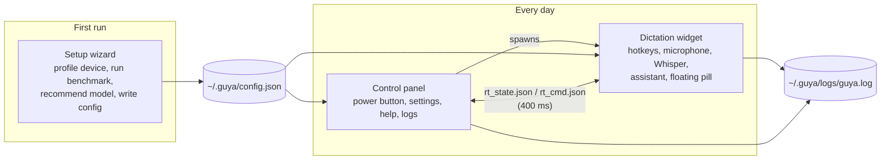
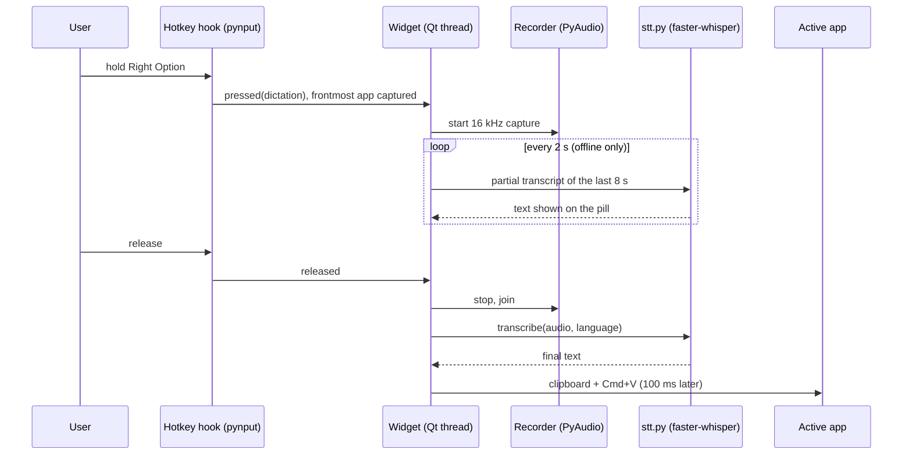
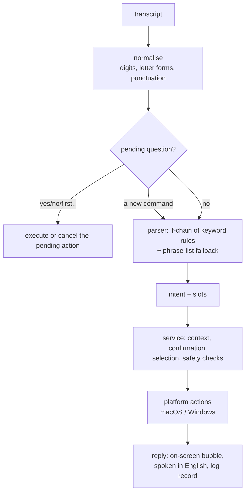

# Guya (گویا): Persian–English voice dictation and a limited desktop assistant for people who find typing hard

**B.Sc. Final-Year Project Report — Computer Engineering**

| | |
|---|---|
| Student | MohammadReza Ganji (220701091) |
| Supervisor | Dr. Hossein Aghababa |
| Institution | University of Tehran, Farabi Campus, Faculty of Engineering |
| Term | Eighth semester, 2026 |
| Code | `git@github.com:faceesmart/guya.git` |

## Abstract

Guya is a desktop application for people who can speak but find sustained typing and repeated mouse and keyboard work difficult. It has two push-to-talk modes on two separate keys: dictation, which types what the user says into whatever application is in front, and a small assistant, which carries out a fixed set of safe desktop actions such as creating, finding, opening and renaming files, opening applications, saving and closing, and simple browser navigation. Both modes work in Persian and English, run entirely on the user's own computer with free software, and cost nothing to use. A setup wizard measures the computer's speed and recommends a speech model that will run at usable speed on that machine, with a free online model as the fallback for weak hardware.

This report describes the design and implementation, and evaluates the system with reproducible measurements: word error rate of six Whisper model tiers on a fixed Persian and English test set, an ablation of Guya's own decoding settings, a held-out test of the command parser, and the assistant's real-use log. The main findings are that Persian needs a model at least the size of `large-v3-turbo` to be usable while English is already good with `small`; that several of the hand-tuned decoding settings inherited from earlier prototypes actually reduced accuracy and were measured, explained and corrected; that the rule-based parser generalises well to unseen phrasings once filler words are handled (68.5% → 99.5% on a held-out set); and that almost all of the latency the user feels is the speech model itself, not the assistant.

چکیده: گویا یک برنامهٔ رومیزی برای افرادی است که می‌توانند صحبت کنند اما تایپ طولانی و کار مکرر با موس و کیبورد برایشان دشوار است. با نگه‌داشتن یک کلید، گفتار به متن تبدیل و در برنامهٔ فعال نوشته می‌شود؛ با کلید دوم، یک دستیار محدود کارهای ساده و امنی مانند ساختن، پیدا کردن، باز کردن و تغییر نام فایل‌ها، باز کردن برنامه‌ها، ذخیره و بستن، و پیمایش ساده در مرورگر را انجام می‌دهد. هر دو حالت به فارسی و انگلیسی و به‌طور کامل روی رایانهٔ کاربر و بدون هزینه اجرا می‌شوند. این گزارش طراحی و پیاده‌سازی سیستم را شرح می‌دهد و آن را با اندازه‌گیری‌های قابل تکرار ارزیابی می‌کند: نرخ خطای واژه برای شش اندازهٔ مدل Whisper روی یک مجموعهٔ آزمون ثابت فارسی و انگلیسی، بررسی تک‌تک تنظیمات رمزگشایی گویا، آزمون تعمیم‌پذیری تحلیل‌گر فرمان‌ها روی جمله‌های دیده‌نشده، و گزارش استفادهٔ واقعی از دستیار.

---

## 1. Introduction

### 1.1 The problem

For someone with a motor impairment, a paragraph of text is not a paragraph of typing; it is several minutes of effort, and often pain. The same is true of the small mechanical tasks around writing: opening the right file, finding it again after closing it, renaming it, moving a web page down. Commercial dictation exists, but it is either tied to a paid cloud service, poor at Persian, or both, and it does not help with the surrounding tasks at all.

The concrete case behind this project is my brother. He speaks clearly, but long typing is hard for him. That fixed the shape of the project from the beginning: it had to run on a normal home computer, it had to work in Persian as well as English, and it could not depend on a subscription.

### 1.2 What Guya does

Guya adds two keys to the computer. Holding the first key (Right Option on macOS) and speaking types the words into the active document when the key is released. Holding the second key (Right Command) and speaking sends the words to a small assistant that understands a fixed list of commands, in Persian or English, and carries them out. The two keys are deliberately separate, so that a dictated sentence such as "open the report" is never mistaken for a command.

The assistant is intentionally small. It does not converse, it does not read web pages, and it cannot delete anything. It can create Word and text files and folders, find files by spoken name (including the way speech recognition tends to mangle filenames, "test six docks" for `test6.docx`), open files, folders and a few applications, rename a file after asking for confirmation, save or close the active window, open a known website, search the web, and scroll or navigate in the browser. When a spoken filename matches several files, it shows up to three choices on screen and accepts a click or a spoken "first", "second", "third".

A setup wizard runs on first launch. It measures how fast the computer runs a small speech model, predicts how the larger models would behave, and recommends one that will keep up with speech on that machine. Weak computers are offered a free online model instead.

### 1.3 Goals and contributions

The project had five stated objectives (from the proposal): reliable Persian and English push-to-talk dictation; a separate bilingual assistant for a limited set of actions; predictable, safe behaviour through rule-based command understanding, confirmation and restricted file access; offline, online and dual recognition modes chosen with the help of device profiling; and an evaluation of accuracy, response time, task success, safety and usability.

What this report adds beyond the running software is evidence. Specifically:

1. A reproducible accuracy and speed measurement of six Whisper model tiers on Persian and English read speech, on consumer hardware, which is the data behind the wizard's model recommendation (Section 6.2).
2. An ablation showing what each of Guya's own decoding settings does to accuracy, which corrected several settings that had been carried over from earlier prototypes on faith (Section 6.3).
3. A held-out test set of 257 natural Persian and English command phrasings and an evaluator for the parser, which turned a 68.5% intent accuracy into 99.5% and fixed eleven of thirteen real misunderstandings found in the usage log (Section 6.5).
4. A structured per-command log record that makes daily use of the assistant an evaluation dataset (Section 6.6).

### 1.4 Scope of this report

The software is a university prototype, not a product. Section 3 states the boundary exactly. Windows support exists in the code but has not been validated on a Windows machine at the time of writing, and the usability study with the target user had not yet been run; both are reported honestly as remaining work in Section 8.

---

## 2. Background

### 2.1 Speech recognition with Whisper

Whisper (Radford et al., 2022) is an encoder–decoder transformer trained on 680,000 hours of multilingual audio. It recognises Persian without any extra training, which is what made this project feasible at all with no budget. It comes in sizes from `tiny` (39 M parameters) to `large-v3` (1.55 B). `large-v3-turbo` keeps the full large encoder but only four decoder layers, which makes it much faster than `large-v3` at similar accuracy.

Guya uses faster-whisper, a re-implementation on the CTranslate2 inference engine. With 8-bit weights it runs even the large models on a laptop CPU at or under real time, which is what makes a fully local Persian system possible. The trade-off is that it is a CPU-bound workload whose speed varies by an order of magnitude between machines and between model sizes (Section 6.4), and on a weaker computer the model Persian needs may simply not keep up; that constraint shapes the whole design (Section 4.5).

### 2.2 Why Persian is harder

Persian is a low-resource language for Whisper compared with English: far less training audio, an Arabic-script writing system with several equivalent letter forms (ي/ی, ك/ک), optional diacritics, and a zero-width non-joiner whose use varies between writers. Colloquial spoken Persian also differs from the formal written form that dominates Whisper's training text: a speaker says «میخوام» and the model writes «می‌خواهم». All of this shows up in the measurements (Section 6.2) as a large gap between Persian and English error rates, and it is why the evaluation reports character error rate alongside word error rate.

### 2.3 Rule-based versus model-based command understanding

A voice assistant needs to turn a transcript into an intent and its arguments. The fashionable way is to hand the text to a large language model. I chose a deterministic parser (keywords, regular expressions and a small phrase list) for three reasons. It is free and works offline. Every decision it makes can be printed and explained, which matters when the action is renaming someone's file. And it cannot be talked into doing something outside its list, which is the whole safety argument of Section 4.6. The cost is coverage: a rule-based parser only understands phrasings someone thought of. Section 6.5 measures that cost and shows it can be made small.

### 2.4 Accessibility considerations

Push-to-talk was chosen over a wake word because it needs no always-on microphone, gives the user explicit control of when the computer listens, and makes the mode (dictation or command) known at the moment of pressing. Feedback is given on the screen and, in English, by voice. Ambiguous results are shown as large clickable choices that can equally be picked by voice. Every destructive-looking action asks first. These are ordinary accessibility principles; the interesting part is where the constraints bit, for example the decision to keep Persian feedback silent rather than read it with an Arabic voice (Section 4.7).

---

## 3. Requirements and scope

### 3.1 Primary user

The primary user can speak clearly enough for speech recognition but has difficulty with long typing and repeated keyboard and mouse operation. A family member may help with installation and first-time setup, so the installer and wizard must be usable by a non-technical helper, and daily use must need nothing beyond two keys.

### 3.2 Included in V1

- Persian and English push-to-talk dictation into the active application.
- A separate assistant key with a fixed bilingual command set: create Word/text files and folders (then ask before opening); open supported applications, files and folders; find files and folders with spoken-filename normalisation; show up to three ambiguous results for click-or-voice selection; remember recent files so "open it again" works; rename with confirmation and without overwriting; save or close the active window; open a known website or a spoken domain over HTTPS; search the web; scroll, go to top or bottom, back and forward in the active browser.
- Offline, online and dual recognition modes, device profiling and a benchmark-based model recommendation.
- An installer, setup wizard, control panel, floating status widget, spoken (English) and on-screen feedback, and a log.
- Filesystem access limited to configured user folders (Desktop, Documents, Downloads by default).
- Automated tests plus a spoken evaluation checklist.

### 3.3 Explicitly excluded

A general conversational assistant; arbitrary shell commands or unrestricted computer control; deleting or overwriting files or bypassing confirmation; reading or understanding arbitrary web pages, clicking results or downloading; application-specific workflows such as Save As; wake-word listening; support for every accent, filename or application; app-store distribution.

### 3.4 Safety rules

These were decided early and are enforced in code rather than by convention (Section 4.6): no delete intent exists; rename asks and never overwrites; create asks before opening; every path is resolved and checked against the allowed roots before use; applications come from an allow-list; websites are HTTPS-only and either a known name or an explicitly spoken domain; browser control is six key codes posted to the browser's own process; Guya's own process can never be the target of a keystroke.

---

## 4. System design

### 4.1 Overview

Guya is three cooperating processes, all Python.



The **wizard** (`guya/wizard.py`) runs once. The **control panel** (`guya/control_panel.py`) is the window the user double-clicks; it starts the **widget** (`guya/widget.py`) as a child process and mirrors its state. The widget is the program that actually listens and acts. Splitting the widget out of the panel has a practical reason: the Whisper model must be loaded before the Qt user-interface library is imported, because CTranslate2's GPU backend can crash if Qt initialises first on Windows, and a child process gives that ordering for free.

The two processes talk through two small JSON files written atomically: the widget writes its state every 400 ms, the panel writes numbered commands (turn on or off, switch language, switch backend). It is not elegant, but it needs no sockets, no permissions and no library.

### 4.2 The dictation path



The microphone is recorded at 16 kHz mono while the key is held. While recording, a background pass re-transcribes the last eight seconds every two seconds and shows the partial text on the pill, so the user sees that they are being heard. On release, the whole recording is transcribed once and the result is pasted into the frontmost application through the clipboard. Pasting was chosen over synthesised keystrokes because one paste is Unicode-safe and instant, while typing Persian character by character through a keyboard simulator was unreliable.

### 4.3 The speech-to-text pipeline (`guya/stt.py`)

The model call is wrapped in a pipeline that was tuned during daily use: the audio's loudness is normalised; voice-activity detection trims silence; a per-language vocabulary prompt biases the decoder toward the user's usual words; a repetition penalty and a no-speech threshold guard against Whisper's habit of hallucinating text in silence; then, for Persian, three post-processing stages unify Arabic letter forms, fix a table of recurring misrecognitions, and turn formal verb forms back into the colloquial forms the user actually said.

Extracting this into its own module was a change made for this report: it lets the evaluation harness run *exactly* the pipeline the widget runs, and switch each setting back to the library default one at a time. Section 6.3 shows why that mattered: some of these "improvements" were making things worse.

### 4.4 The assistant path



The parser (`guya/assistant/parser.py`) is an ordered chain of rules. The order is the semantics: creation is checked before rename because "make a file and name it X" contains "name it"; save and close before browser movement; website before application before file, so "go to youtube" is a website and not a search for a file called youtube. Each rule extracts its arguments with a regular expression written for that command in each language. If no rule fires, the utterance is compared with a list of example phrasings and the closest intent is taken if it is similar enough (ratio ≥ 0.82). Two additions were made for this report, both prompted by measurement: filler words at the edges of an utterance ("let's", "please", "again", «یه کم», «لطفا») are stripped before the strict grammars run, and browser movement has a looser keyword fallback that only fires when nothing in the sentence names a file, folder or application.

The service (`guya/assistant/service.py`) keeps a small context: the current and five most recent files, so "open it again" and "rename it" work, and the pending question, if the assistant has just asked one. A "yes" or "no" answers the question; a fresh command replaces it (the assistant used to insist on an answer first, which made every file creation cost an extra utterance); a question that is not answered within two minutes expires, so a "yes" spoken later can never rename something forgotten.

Spoken filenames need their own normaliser. Whisper hears "test six docks" for `test6.docx` and «گزارش شش ورد» for `گزارش ۶.docx`. The normaliser folds digits and number words, drops leading words like "the" and "my", and rewrites the suffixes speech recognition produces (docs, docks, "doc x") into the extension. Matching is scored, not exact: 1.0 for an exact name, 0.98 for the same stem, 0.86 for a prefix of at least three characters, and so on. A single confident match opens directly; a close race shows the choices. The three-character floor exists because of a real bug: "open the system folder" once opened a folder named `m`.

### 4.5 Device-aware model choice (`guya/benchmark.py`)

Guessing the right model from the machine's specification is unreliable: a 16 GB Mac and a 16 GB GPU-less PC behave very differently. So the wizard measures. It times the `tiny` model on a bundled seven-second speech clip, predicts the real-time factor of each larger model from measured cost ratios, applies a per-language accuracy floor (Persian needs at least `large-v3-turbo`, English is fine with `small`), and recommends the most accurate model predicted to run at or under real time. If none does, it recommends the online model.

Two things about this design were found wrong during the evaluation and fixed. The benchmark used to time the model on synthetic noise; on noise Whisper fails its own quality checks and retries at rising temperatures, so it was measuring decoder retries, not the device, and on the development machine recommended the online model for every language even though the same machine runs `large-v3-turbo` daily. The recommendation rule also had two latency tiers, which made it non-monotonic: a slightly slower machine could be told to run a bigger, slower model. The cost ratios were re-derived from the measurements in Section 6.2.

### 4.6 The safety boundary

The assistant's safety does not rest on the parser being right. Every action passes through `SafeDesktopActions`, which resolves the path (following symlinks) and checks that it lies under one of the allowed roots; a symlink pointing outside a root is therefore invisible. There is no delete action. Rename refuses if the destination exists. Applications are looked up in a fixed table, never launched from a spoken string. Websites go through `safe_website_url`, which accepts only a known name or a domain that the user actually spoke as a domain, and always builds an `https://` URL with no path or query. Browser control is one of six key codes posted to the browser's process id, never to whatever window happens to be in front, and Guya's own process ids are refused as a target. No subprocess is ever started with a shell.

### 4.7 Feedback

English replies are spoken with the system voice and shown on the pill. Persian replies are shown only. macOS ships 184 voices and none for Persian; the only Arabic-script voice reads Persian with an Arabic accent, and after trying it I decided that silence is better than a voice that sounds wrong to every Persian speaker. That is the honest limit of a zero-cost design on this platform. To compensate, every reply longer than the pill can hold, and every question, is shown in a wrapped, right-to-left bubble under the pill, coloured green for success, amber for a question and red for an error, and the pill exposes its text to VoiceOver. Pressing the assistant key while an English reply is being spoken interrupts it and listens.

### 4.8 Configuration, installation and logging

All settings live in `~/.guya/config.json`, merged over defaults so an older file keeps working after an update. On macOS the installer copies the code and its Python environment to `~/.guya/runtime` and generates a `Guya.app` bundle that runs the copy; this was forced by a real failure, recorded in the launcher log, where a Finder-launched app was denied access to a Python environment living on the Desktop. The bundle is the process that asks for microphone and accessibility permission, so the grant belongs to Guya and not to a terminal.

Every process writes to one rotating log. Each assistant command is logged as a single JSON record with the transcript, language, intent, arguments, outcome, target application and the time spent in speech recognition and in acting. Section 6.6 is built entirely from these records.

---

## 5. Implementation

### 5.1 Technology

Python 3.11, PyQt6 for the interfaces, faster-whisper 1.2.1 on CTranslate2 4.8.1 (8-bit weights on CPU), PyAudio for capture, pynput and PyObjC for the macOS hotkey and window layer, and the Windows API through ctypes on Windows. No PyTorch, no paid service. The optional online backend is Groq's free tier of `whisper-large-v3`.

### 5.2 Size and structure

| Module | Lines | Role |
|---|---:|---|
| `guya/widget.py` | ~2,700 | recorder, hotkeys, floating pill, reply bubble, results popup, assistant glue |
| `guya/wizard.py` | ~2,100 | eleven-page bilingual setup wizard |
| `guya/control_panel.py` | ~1,000 | launcher window, settings, help, logs, maintenance |
| `guya/stt.py` | ~500 | the speech-to-text pipeline shared with the evaluation |
| `guya/assistant/parser.py` | ~900 | intents and slots, Persian and English |
| `guya/assistant/service.py` | ~750 | context, confirmation, selection, dispatch |
| `guya/assistant/actions/` | ~1,400 | safe file operations; macOS and Windows adapters |
| `guya/assistant/normalizer.py` | ~280 | text and spoken-filename normalisation |
| `guya/benchmark.py`, `profiler.py` | ~450 | device profile, benchmark, recommendation |
| `eval/` | ~900 | accuracy, ablation, intent and log evaluators |
| `tests/` | 104 tests | parser, normaliser, service, actions, platform, scorer |

The tests need no microphone, no model and no network, and run in a quarter of a second. Several of them assert the *absence* of side effects: that nothing was opened before "yes", that nothing was renamed on "no", that a delete request touched nothing.

### 5.3 Two details worth recording

Creating a `.docx` without a Word library: the file is an OPC zip with three XML parts, written with the standard `zipfile` module; macOS and Word both open it. This kept a dependency out of a project whose whole point is running anywhere for free.

The self-target problem: after the user clicks the pill or a result button, Guya itself is the frontmost application, and the next command would have been sent to Guya. The first version of the log showed this in six of forty-one commands. The widget now remembers the last real target and falls back to it, and the paste routine refuses to paste when Guya is in front, leaving the text on the clipboard with a visible hint.

### 5.4 User interface


---

## 6. Evaluation

Every number in this chapter is produced by a script in `eval/` from data in the repository or downloadable by anyone; `eval/README.md` gives the exact commands. Speech results are corpus-level word error rate (WER) and character error rate (CER); real-time factor (RTF) is transcription time divided by audio length, measured on an otherwise idle Apple M1 Pro (10 cores, 16 GB) with 8-bit weights on the CPU, which is the machine Guya is used on daily.

### 6.1 Data

**Speech.** Google FLEURS is read speech from Wikipedia sentences, recorded by native speakers, with human transcripts, and it is the only Persian speech corpus that can be downloaded without an account, so anyone marking this report can re-run the evaluation. `eval/import_fleurs.py` samples 60 Persian and 60 English clips from the development split, one clip per sentence, with a fixed seed: 14.8 minutes of Persian (1,355 words) and 9.4 minutes of English (1,211 words). Persian sentences are long (median 21 words, 14 seconds), formal, and full of numbers and proper names; this is harder than the short colloquial commands Guya is built for, and the absolute Persian error rates should be read with that in mind. Ten clean English sentences from the macOS speech synthesiser were also kept as a smoke test; they are too easy to rank models and are not used below.

**Commands.** `eval/data/intents.jsonl` holds 257 Persian and English command phrasings written to be natural rather than to match the parser, each labelled with the intended action and arguments. 38 of them coincide with a phrase in the parser's own example lists and are reported separately, so the headline number is on 219 phrasings the parser had never seen.

**Real use.** Every assistant command Guya has handled writes one JSON record to the log. At the time of the audit the log held 41 commands from four sessions of my own use in July and August.

### 6.2 Which model tier does Persian need?

| Model | FA WER | FA CER | EN WER | EN CER | FA RTF | EN RTF |
|---|---:|---:|---:|---:|---:|---:|
| tiny | 92.5% | 37.7% | 13.4% | 6.1% | 0.11 | 0.03 |
| base | 84.1% | 30.8% | 7.8% | 3.7% | 0.07 | 0.05 |
| small | 56.6% | 16.7% | 6.0% | 2.6% | 0.18 | 0.14 |
| medium | 39.6% | 9.8% | 5.0% | 2.2% | 0.42 | 0.36 |
| large-v3-turbo | 28.9% | 6.0% | 4.0% | 1.9% | 0.29 | 0.35 |
| large-v3 | 28.2% | 5.8% | 4.8% | 2.2% | 0.72 | 0.57 |

*Table 1. Stock faster-whisper decoding (beam 5), FLEURS dev, 60 + 60 clips. RTF from a separate pass on an idle machine, 12 + 12 clips.*

Three things follow from Table 1.

English is a solved problem at `small`: 6% WER on read Wikipedia sentences, and the median clip has no errors at all. Persian is not. The three smallest models are unusable for Persian (every second word wrong or worse), `medium` is marginal, and only the two large models bring Persian under 30% WER. The gap between the languages is a factor of seven at the large end and a factor of nine at `small`. This is the measurement behind the wizard's per-language floor: English may run on `small`, Persian must not be offered anything below `large-v3-turbo`. That rule had been a hand-written constant in the code since the first prototype; it is now a measured one.

`large-v3-turbo` is the right default. It matches `large-v3` on Persian (28.9% against 28.2%, a difference of nine words in 1,355), beats it on English, and runs in less than half the time (RTF 0.32 against 0.66). `large-v3` has no place on a CPU.

Persian CER is much lower than Persian WER, 6% against 29% for the shipped model, because a large share of the word errors are spacing conventions rather than misheard words: «می‌کند» written as «می کند», «کنترل کننده‌های» as «کنترل کننده های». The scorer does not fold these, on purpose, since the user has to correct them by hand; but they are a different kind of error from the substitutions in the worst clips (technical vocabulary such as «ردیابی» → «رجابی», numbers, foreign names), and a Persian reader sees the text as mostly right. The per-clip spread is wide: with `large-v3-turbo`, six of the sixty Persian clips are at or under 10% WER and five are at or over 50%, and the median is 24.5%.

### 6.3 Does Guya's own pipeline help or hurt?

The widget does not call the model with stock settings. Over months of use it acquired loudness normalisation, a voice-activity detector tuned for quiet speech, a per-language vocabulary prompt, a repetition penalty of 1.2 against Whisper's habit of looping, a stricter no-speech threshold, and three stages of Persian post-processing. None of these had ever been measured. Extracting the pipeline into `guya/stt.py` made it possible to run the *exact* production code on the test set and then switch each setting back to the library default one at a time.

| `small` | FA WER | FA CER | EN WER | EN CER |
|---|---:|---:|---:|---:|
| stock faster-whisper | 56.6% | 16.7% | 6.0% | 2.6% |
| Guya pipeline, all settings | 63.2% | 21.6% | 15.6% | 11.0% |
| minus the repetition penalty | 57.3% | 17.5% | 6.0% | 2.5% |
| minus voice-activity detection | 62.3% | 21.3% | 12.2% | 7.0% |
| minus the vocabulary prompt | 63.7% | 20.6% | 16.9% | 12.7% |
| minus Persian post-processing | 62.4% | 20.6% | 15.6% | 11.0% |
| minus the stricter no-speech threshold | 62.6% | 20.7% | 15.6% | 11.0% |
| minus loudness normalisation | {{ABL_SMALL_no_rms}} |
| minus conditioning on previous text | {{ABL_SMALL_no_cond}} |

*Table 2. The production pipeline on `small`, and each setting returned to stock in turn.*

The production pipeline made `small` two and a half times worse on English (6.0% → 15.6%) and noticeably worse on Persian, and Table 2 says why: almost all of it is the repetition penalty. Removing only that setting recovers stock accuracy on English exactly and nearly all of the Persian loss. Looking at the worst clips shows the mechanism. The penalty, which multiplies down the score of any token already produced, makes the decoder stop the sentence early rather than repeat a common word such as "the" or "of":

- *ref:* Next, some saddles, particularly English saddles, have safety bars that allow a stirrup leather to fall off the saddle if pulled backwards by a falling rider.
- *with penalty:* Next, some saddles particularly English saddles have safety bars that allow a stirrup leather
- *without:* Next, some saddles, particularly English saddles, have safety bars that allow a stirrup leather to fall off the saddle if pulled backwards by a falling rider.

Voice-activity detection costs a further three to four points of English with `small`, because splitting a sentence into segments loses context at every cut; the prompt, the post-processing and the no-speech threshold are within noise of each other. The Persian post-processing is expected to *add* errors on this test set, since it deliberately rewrites formal verb forms into the colloquial ones a speaker uses («می‌خواهم» → «میخوام») and FLEURS is formal text; the cost is under one point.

| `large-v3-turbo` | FA WER | FA CER | EN WER | EN CER |
|---|---:|---:|---:|---:|
| stock faster-whisper | 28.9% | 6.0% | 4.0% | 1.9% |
| Guya pipeline, all settings | 29.2% | 6.3% | 4.1% | 2.0% |
| minus the repetition penalty | {{ABL_TURBO_no_penalty}} |
| minus voice-activity detection | {{ABL_TURBO_no_vad}} |
| minus the vocabulary prompt | {{ABL_TURBO_no_prompt}} |
| minus Persian post-processing | {{ABL_TURBO_no_postprocess}} |

*Table 3. The same on the shipped model.*

On the shipped model the whole pipeline is within a few words of stock, so the penalty's damage is specific to the smaller model, which is less certain of each token and therefore more easily talked out of continuing. The change made as a result: the repetition penalty is now off (1.0). Protection against Whisper's repetition loops rests on the hallucination filter, which drops a segment dominated by one repeated word, and on not conditioning on previous text for short recordings; both are kept. The other settings stay, because on the shipped model they cost nothing measurable and they exist for situations this test set does not contain (quiet microphones, domain vocabulary, colloquial Persian).

### 6.4 Calibrating the device benchmark

The wizard predicts each model's speed from one measurement of `tiny`. Table 4 gives the measured cost of every model relative to `tiny` on the idle machine; these ratios replaced the guessed table in `benchmark.py`.

| Model | RTF (idle) | ratio to `tiny` | previous guess |
|---|---:|---:|---:|
| tiny | 0.08 | 1.0 | 1.0 |
| base | 0.06 | 0.8 | 2.0 |
| small | 0.16 | 2.1 | 5.2 |
| medium | 0.40 | 5.0 | 14.0 |
| large-v3-turbo | 0.32 | 4.0 | 8.0 |
| large-v3 | 0.66 | 8.4 | 28.0 |

*Table 4. Measured cost ratios. `base` is slightly faster than `tiny` because `tiny` fails Whisper's quality checks more often and retries at higher temperatures.*

The guesses were too pessimistic by a factor of two to three, and the benchmark itself was worse: it timed `tiny` on synthetic noise, on which Whisper fails its compression-ratio check and retries at every temperature, so three runs on the same idle machine gave RTF 0.34, 0.48 and 0.69, and every one of them told this machine, which runs `large-v3-turbo` at 0.32, to use the online model for all three languages. The benchmark now times a bundled seven-second speech clip with temperature fallback off, takes the best of two runs, and gives {{BENCH_IDLE}} on this machine; with the ratios of Table 4 it predicts `large-v3-turbo` at {{BENCH_PRED_TURBO}}, and recommends it, which is correct. The recommendation rule was also changed from two latency tiers, which was non-monotonic (a slightly slower machine could be told to run a bigger model), to a single threshold of 1.0.

### 6.5 Does the command parser generalise?

| Parser | phrasings | intent correct | intent and arguments | English | Persian | browser movement |
|---|---:|---:|---:|---:|---:|---:|
| before this work | 219 | 68.5% | 65.3% | 64.8% | 73.2% | 42.3% |
| after | 219 | 99.5% | 99.5% | 99.2% | 100.0% | 98.6% |

*Table 5. Held-out phrasings, `eval/intent_accuracy.py`. The 38 phrasings that coincide with the parser's own examples score 100% in both versions and are excluded.*

The unit tests had always said the parser was fine, because they tested its example phrases against themselves. The held-out set said otherwise. The single biggest cause was filler words: "let's scroll down", "again, scroll down", «یه کم برو پایین» were all rejected outright, because browser movement was matched with a whole-utterance regular expression. Browser movement scored 42% before, 99% after stripping fillers from the edges of the utterance and adding a keyword fallback that only fires when nothing in the sentence names a file, folder or application. The remaining fixes were individually small and each came from a specific failing row: "new" was a creation verb, so "open the new folder" *created* a folder; "note app" looked like the domain `note.app`; the Persian word «نامه» (letter) contains «نام» (name), so "open the letter" was a rename; a bare "calculator" was nothing; "delete the report" became a file search through fuzzy matching, and is now refused with a sentence saying so. The one remaining miss is "I need a word file named budget please", which has no creation verb and is left as a known limit rather than guessed.

Replaying the 13 real misunderstood transcripts from the usage log through the new parser, 11 now parse to the intended action; the other two are Persian transcripts that were misrecognised beyond repair («برگیار داکات»).

### 6.6 Real use

The 41 logged commands are a small and biased sample: they are my own, mostly in English, and mostly browser commands because that was the feature being tried at the time. They still say two things clearly.

| Outcome (41 commands) | share |
|---|---:|
| action completed | 51% |
| not understood | 27% |
| understood but failed (wrong window in front, nothing found) | 15% |
| assistant asked a question | 5% |
| cancelled | 2% |

Half of the failures were the parser, and Section 6.5 removes almost all of those. The other half were a specific interaction bug: after clicking the pill or a result button, Guya itself was the frontmost application, so the next command was addressed to Guya and refused; six of the 41 commands hit this, and the widget now falls back to the last real target.

Latency is entirely the speech model. Median utterance 1.9 s; median recognition 2,762 ms; median parse-and-act 30 ms; 97% of the time between releasing the key and the reply is Whisper. The in-use real-time factor was 1.44, worse than the 0.32 measured in isolation, because the widget was re-transcribing the whole buffer every two seconds for the live partial text and the final pass had to wait behind it; the partial pass is now bounded to the last eight seconds. A device-aware recommender that recommends a model which then misses real time in use is the most useful negative result the project produced, and it is why the recommendation threshold is 1.0 rather than 2.0.

### 6.7 What was not measured

Nobody but me has used Guya yet. The task list and questionnaire for the session with my brother are in `docs/USER_STUDY.md`, and `eval/record.py` records his voice for the accuracy set, but the session had not happened when this report was written, so there is no usability score and no accuracy figure on the target user's speech. Windows has not been run. The dual (offline English plus online Persian) mode and the online model were not measured, because scoring them means uploading the test audio to a third party.

---

## 7. Discussion

### 7.1 What the numbers say about the design

The central design bet was that a fully local, zero-cost Persian dictation tool is possible on a normal laptop. Table 1 says yes, with a condition: it needs the largest turbo model and a machine that runs it at about a third of real time, and it delivers Persian text that is right in nine characters out of ten and needs spacing corrections. English is far easier and would run on any machine. That asymmetry is the reason the wizard exists at all, and Section 6.4 is the first time it has been driven by measurement instead of assumption.

The second bet was a rule-based assistant. Section 6.5 is the honest picture: written against its own examples it looked perfect; against phrasings someone else would actually say it understood two commands in three; after a day of work driven by a test set, it understands almost all of them, and the safety argument of Section 4.6 still holds because nothing in the parser can produce an action that is not on the list. A language model would have handled the fillers on day one, but it could not have given the same guarantee, and it would not have been free.

### 7.2 Measuring one's own tuning

The most instructive result is Table 2. Every setting in the pipeline had a reason, and each had been added after a real problem in daily use. Together they made the small model markedly worse, and one of them, the repetition penalty, was silently truncating sentences. None of this was visible in use, because the shipped model happens to be robust to it and because a truncated dictation looks like a mumbled ending. It only became visible when the exact production code was run on a fixed test set with each setting switched off in turn. The lesson I take from it is not that the tuning was wrong; it is that tuning without a measurement is guessing, and the harness that makes the measurement cheap is worth more than any single setting.

### 7.3 The Persian voice

Guya speaks its English replies and shows its Persian ones. This is a constraint of the platform, not a choice I like: macOS has no Persian voice, and reading Persian with the one Arabic voice was, to a Persian ear, worse than nothing. The consequence was found during the audit rather than during use: the pill's label holds about thirty characters, so a Persian confirmation question was cut to its first three words, and the user was answering "yes" to a question they could not read. The reply bubble fixes the display; a free offline Persian voice (Piper through sherpa-onnx, tested on this machine at 0.06 RTF) is the natural next step, and a decision for the person who will listen to it.

### 7.4 Limitations and threats to validity

FLEURS is read, formal speech from one microphone setup; Guya's real input is short, colloquial, and from whatever microphone the user has. The absolute error rates in Table 1 are therefore not the error rates a user will see, in either direction: commands are shorter and easier, but home microphones and colloquial Persian are harder. The ranking of models and the size of the language gap are what the table supports.

The held-out intent set was written by me, after reading the parser. I tried to write what people say rather than what the parser accepts, and the 68.5% starting point suggests I did not simply write to the code, but it is not an independent sample of real users' phrasings. The real log is that sample, and it is small.

All timing figures are from one machine. The cost ratios in Table 4 will differ on a Windows laptop without a fast memory system, which is exactly why the wizard measures rather than assumes; but the measurement itself has only been validated on the one machine.

The safety boundary has been tested by unit tests and by reading, not by an adversary. It is a small enough surface that reading is credible, but it is still a claim about a prototype.

---

## 8. Conclusion and future work

Guya set out to give one person a way to write and to do small things on a computer by voice, in Persian and English, for free. The software does that, and this report has replaced most of what was believed about it with what was measured: which model Persian needs, what the machine can run, what the tuning does, what the parser understands, and where the time goes.

Three findings would carry over to anyone building a similar tool. Persian needs the large turbo model and English does not, so a bilingual tool must choose per language. A repetition penalty, the standard remedy for Whisper's loops, truncates sentences on smaller models and should be measured before use. And a rule-based command parser is fine for a fixed command set provided it is tested on phrasings it was not written from, and provided filler words are handled before the grammar runs.

What remains is the part that needs other people: the session with the target user, which will produce the only accuracy number that matters, his own voice, and the usability score; a run on the Windows machine the code was written for but never executed on; and the demonstration. After that, the obvious improvements are a Persian voice, a measured answer to whether the vocabulary prompt helps on colloquial speech (Table 2 only shows it does not hurt on formal speech), and a per-user correction table learned from the user's own corrections instead of a fixed one.

---

## Appendix A. Reproducing the results

```bash
./install.sh && ./venv/bin/python -m unittest discover -s tests -t .      # 104 tests
python eval/import_fleurs.py                                              # data (once)
python eval/accuracy.py --manifest eval/data/fleurs/manifest.jsonl \
    --models tiny,base,small,medium,large-v3-turbo,large-v3 --pipeline raw --out eval/results/fleurs_raw
python eval/accuracy.py --manifest eval/data/fleurs/manifest.jsonl \
    --models small,large-v3-turbo --pipeline guya --out eval/results/fleurs_guya
for a in no_penalty no_vad no_prompt no_postprocess no_speech_thr no_rms no_cond; do
  python eval/accuracy.py --manifest eval/data/fleurs/manifest.jsonl --models small --pipeline guya --ablate $a \
      --out eval/results/ablate_small_$a; done
python eval/intent_accuracy.py --failures
python eval/assistant_report.py --replay
python eval/report_tables.py --write                                      # the tables above
```

## Appendix B. The command set

| Intent | Examples (EN / FA) | Arguments |
|---|---|---|
| create_word_document | Create a Word file named report / یه فایل ورد به اسم گزارش بساز | name |
| create_text_file | Make a text file called notes / یه فایل متنی به اسم یادداشت بساز | name |
| create_folder | Create a folder named photos / یه پوشه به اسم عکس‌ها بساز | name |
| open_app | Open the calculator / ماشین حساب رو باز کن | app (word, text editor, calculator, file manager, browser, chrome, safari, pages) |
| open_file, open_folder | Open test six docs / فایل تست شش ورد رو باز کن; Open it again / دوباره بازش کن | query (optional; "it" uses the remembered file) |
| search | Find my report file / گزارش رو پیدا کن; Where is my budget file / پوشه پروژه کجاست | query |
| rename | Rename it to final report / اسمش رو بذار گزارش نهایی | old_name (optional), new_name; always confirmed |
| save_current, close_current | Save it / ذخیره کن; Close the window / پنجره رو ببند | — |
| open_website | Go to YouTube / برو به سایت یوتیوب; Visit github.com | target (known name or spoken domain) |
| web_search | Search for GitHub on Chrome / تو گوگل دنبال هوا بگرد | query, app |
| browser_navigation | Scroll down, Go to the top, Go back / یه کم برو پایین، برو اول صفحه، برگرد | action (scroll_down, scroll_up, top, bottom, back, forward) |
| sequence | Open Chrome, then search for YouTube / کروم رو باز کن بعد یوتیوب رو جستجو کن | 2–3 steps from open_app, open_website, web_search, save, close |
| confirm, cancel | Yes, sure, go ahead / بله، باشه; No, cancel / نه، لغو کن | — |
| delete_unsupported | Delete the report / فایل گزارش رو پاک کن | refused with an explanation |
| save_as_unsupported | Save this file as report on the Desktop | explained as unsupported |
