# Guya (گویا): Persian–English voice dictation and a limited desktop assistant for people who find typing hard

**B.Sc. Final-Year Project Report — Computer Engineering**

| | |
|---|---|
| Student | MohammadReza Ganji (220701091) |
| Supervisor | Dr. Hossein Aghababa |
| Institution | University of Tehran, Farabi Campus, Faculty of Engineering |
| Term | Eighth semester, 2026 |
| Code | `git@github.com:faceesmart/guya.git` |

## Contents

1. Introduction: problem, motivation, objectives, approach, deliverables, contributions
2. Background and related work: Whisper, faster-whisper, metrics, Persian, VAD, command understanding, accessibility, existing tools, Persian ASR research
3. Requirements analysis: users, use cases, a walkthrough of everyday use, functional, non-functional and safety requirements, constraints, scope
4. System design: architecture, processes, dictation path, speech pipeline, command understanding, model choice, safety model, feedback, platform abstraction, configuration, logging
5. Implementation: technology, code organisation, threads, speech module, filenames, parser, service, actions, widget, wizard, control panel, installer, tests, history, course concepts
6. User guide
7. Evaluation: data, model size, pipeline ablation, benchmark calibration, parser generalisation, real use, review, manual sessions, Windows run and target-user session, objectives
8. Discussion
9. Conclusion and future work
References
Appendix A. Reproducing the results · B. The command set · C. Configuration · D. Evaluation instruments · E. Glossary · F. Program code

**Figures.** 4.1 Layered architecture · 4.2 The three processes · 4.3 Dictation sequence · 4.4 The transcription pipeline · 4.5 The assistant path · 4.6 Pending-question states · 4.7 Pill states and tones · 4.8 The pill on screen · 4.9 The reply bubble · 4.10 The results popup · 5.1 Settings tab · 5.2 Help tab · 5.3 The panel in dual mode · 6.1 Wizard welcome · 6.2 Wizard language choice · 6.3 Control panel

**Tables.** 1.1 Objectives · 1.2 Deliverables · 2.1 Whisper model sizes · 2.2 Existing tools · 3.1 Use cases · 3.2 Functional requirements · 3.3 Non-functional requirements · 3.4 Safety requirements · 4.1 Module responsibilities · 4.2 Response statuses · 4.3 Safety enforcement · 4.4 Pill states · 4.5 Platform interface · 4.6 Log record · 5.1 Dependencies · 5.2 Module sizes · 5.3 Threads and timers · 5.4 Decoding settings · 5.5 Filename match scale · 5.6 Parser rules · 5.7 Benchmark constants · 5.8 Test suite · 5.9 Development timeline · 5.10 Curriculum concepts · 6.1 Spoken commands · 7.1 Accuracy per model · 7.2 Ablation on small · 7.3 Ablation on large-v3-turbo · 7.4 Cost ratios · 7.5 Held-out intent accuracy · 7.6 Usage outcomes · 7.7 Review defects · 7.8 Manual sessions · 7.9 Session outcomes · 7.10 Objectives status · B.1 Command set · C.1 Configuration · E.1 Glossary · F.1 Application files

---

## Abstract

Guya is a desktop application for people who can speak but find sustained typing and repeated mouse and keyboard work difficult. It has two push-to-talk modes on two separate keys: dictation, which types what the user says into whatever application is in front, and a small assistant, which carries out a fixed set of safe desktop actions such as creating, finding, opening and renaming files, opening applications, saving and closing, and simple browser navigation. Both modes work in Persian and English, run, in their default offline mode, entirely on the user's own computer with free software, and cost nothing to use. A setup wizard measures the computer's speed and recommends a speech model that will run at usable speed on that machine, with a free online model as the fallback for weak hardware. The application is installed with one double-click, is 11,905 lines of Python in 24 modules, enforces a safety boundary under which no action can delete or overwrite a file, and is covered by 136 automated tests.

This report describes the requirements, the architecture and the implementation, and evaluates the system with reproducible measurements: word error rate of six Whisper model tiers on a fixed Persian and English test set, an ablation of Guya's own decoding settings, a calibration of the device benchmark, a held-out test of the command parser, and the assistant's real-use log, followed by a session with the target user on a Windows laptop in which all twelve tasks of the study protocol were completed and the System Usability Scale scored 82.5. The main findings are that Persian needs `large-v3-turbo` or larger to fall below 30% word error rate, while English reaches 6% with `small`; that one hand-tuned decoding setting inherited from earlier prototypes, the repetition penalty, was found to cut sentences short and was removed; that the rule-based parser generalises well to unseen phrasings once filler words are handled (69% → 100% on a held-out set); and that the speech model accounts for about 97% of the end-to-end latency of an assistant command, so the assistant's own processing is negligible.

چکیده: گویا یک برنامهٔ رومیزی برای افرادی است که می‌توانند صحبت کنند اما تایپ طولانی و کار مکرر با موس و کیبورد برایشان دشوار است. دو حالت «نگه‌دار و صحبت کن» (push-to-talk) روی دو کلید جداگانه دارد: دیکته، که گفتار کاربر را در هر برنامه‌ای که جلو باشد می‌نویسد، و یک دستیار کوچک که مجموعهٔ ثابتی از کارهای امن رومیزی را انجام می‌دهد: ساختن، پیدا کردن، باز کردن و تغییر نام فایل‌ها، باز کردن برنامه‌ها، ذخیره و بستن پنجره، و پیمایش ساده در مرورگر. هر دو حالت به فارسی و انگلیسی کار می‌کنند، در حالت پیش‌فرض آفلاین به‌طور کامل روی رایانهٔ خود کاربر و با نرم‌افزار آزاد اجرا می‌شوند و هزینه‌ای ندارند. یک ویزارد راه‌اندازی، سرعت رایانه را اندازه می‌گیرد و مدل گفتاری‌ای را پیشنهاد می‌کند که روی همان دستگاه با سرعت قابل استفاده اجرا شود؛ برای دستگاه‌های ضعیف، یک مدل آنلاین رایگان به‌عنوان جایگزین در نظر گرفته شده است. برنامه با یک دوبار کلیک نصب می‌شود، ۱۱٬۹۰۵ خط کد Python در ۲۴ ماژول دارد، مرز ایمنی‌ای را اعمال می‌کند که در آن هیچ عملی نمی‌تواند فایلی را حذف یا بازنویسی کند، و ۱۳۶ آزمون خودکار آن را پوشش می‌دهند. این گزارش نیازمندی‌ها، معماری و پیاده‌سازی سیستم را شرح می‌دهد و آن را با اندازه‌گیری‌های قابل تکرار ارزیابی می‌کند: نرخ خطای واژه (WER) برای شش اندازهٔ مدل Whisper روی یک مجموعهٔ آزمون ثابت فارسی و انگلیسی، یک مطالعهٔ حذفی (ablation) روی تنظیمات رمزگشایی خود گویا، کالیبراسیون بنچمارک دستگاه، یک آزمون تعمیم‌پذیری تحلیل‌گر فرمان‌ها روی جمله‌های دیده‌نشده، و گزارش استفادهٔ واقعی از دستیار، و در پی آن یک جلسه با کاربر هدف روی یک لپ‌تاپ Windows که در آن هر دوازده کار پروتکل مطالعه انجام شد و مقیاس کاربردپذیری سیستم نمرهٔ ۸۲٫۵ گرفت. یافته‌های اصلی از این قرارند: فارسی برای رسیدن به نرخ خطای واژهٔ زیر ۳۰٪ به `large-v3-turbo` یا بزرگ‌تر نیاز دارد، در حالی که انگلیسی با مدل `small` به ۶٪ می‌رسد؛ یک تنظیم دستی که از نمونه‌های اولیه به ارث رسیده بود، یعنی جریمهٔ تکرار، جمله‌ها را کوتاه می‌کرد و حذف شد؛ تحلیل‌گر قاعده‌محور فرمان‌ها، پس از رسیدگی به واژه‌های اضافی گفتار، به جمله‌های دیده‌نشده خوب تعمیم می‌یابد (از ۶۹٪ به ۱۰۰٪ روی مجموعهٔ دیده‌نشده)؛ و مدل گفتار حدود ۹۷٪ تأخیر سرتاسری یک فرمان دستیار را تشکیل می‌دهد، به‌طوری که سهم پردازش خود دستیار ناچیز است.

---
## 1. Introduction

### 1.1 Problem statement

Most writing on a computer is done by typing, and typing is a sustained physical effort. For a person with a motor impairment, one paragraph can take several minutes and can cause pain. The small tasks around writing cost as much again: opening the right document, finding it after it has been closed, renaming it, moving a web page down to read the rest of it. Each of these is a sequence of precise mouse and keyboard operations.

Dictation software has existed for a long time, and operating systems now include voice control. In practice none of it fits a Persian speaker on an ordinary home computer. The built-in dictation of macOS and Windows does not list Persian. The one commercial product that does support Persian, Nevisa, is Windows-only and sold under a paid licence. The cloud services that recognise Persian well send every sentence to a server and need an account, and they do not help with the tasks around the text at all. A survey of these tools is given in Section 2.8.

There was also a technical question at the start of the project. Open speech models such as Whisper recognise Persian, but on a laptop processor the model sizes that recognise Persian accurately run slowly, and the sizes that run quickly are inaccurate. Whether a usable Persian dictation tool could run entirely on a normal computer, at no cost, was not known when the project began. Part of this report answers that question with measurements. The short answer is yes, with one condition: the largest turbo model, quantised to 8 bits, transcribes Persian at under 30% word error and 6% character error at a third of real time on the author's laptop processor, and nothing smaller is good enough (Section 7.2).

### 1.2 Motivation and target user

The project has one concrete user in mind: the author's brother. He speaks clearly, but long typing is difficult for him, and much of his daily computer use is writing in Persian with occasional English. This fixed three constraints before any code was written. The software had to run on the kind of computer a family already owns, with no graphics card and no subscription; it had to work in Persian as well as English; and a family member had to be able to install and set it up for him without technical help.

The user is described more formally in Section 3.1. The important point is that the project was built for a real person, and the design decisions in Chapter 4 were judged against what he would actually do with it. He used the software in an observed session at the end of the term (Section 7.9).

### 1.3 Objectives

The approved proposal (Section 5.14 summarises its history) states five objectives. They are repeated here because the evaluation in Chapter 7 is organised around them.

| ID | Objective |
|---|---|
| O1 | Reliable Persian and English push-to-talk dictation into the active application. |
| O2 | A separate bilingual assistant for a limited set of desktop actions: creating, finding, opening and renaming files and folders, opening applications, saving or closing the active window, and safe web search. |
| O3 | Predictable and safe behaviour through rule-based command understanding, confirmation before renaming, visible choices for ambiguous results, and restricted filesystem access. |
| O4 | Offline, online and dual recognition modes, with device profiling and a measured model recommendation during setup. |
| O5 | Evaluation of recognition accuracy, response time, command-task success, safety and usability with representative users, including the target user. |

*Table 1.1. Project objectives, from the proposal.*

Browser navigation was added to O2 during implementation; the proposal listed only web search.

### 1.4 Approach

Guya is a desktop application written in Python with a PyQt6 interface, split into three processes: a floating widget that listens and types, a control panel for daily settings, and a one-time setup wizard (Section 4.2). Speech recognition is done locally by OpenAI's Whisper model, run through the faster-whisper library on the CTranslate2 inference engine with 8-bit weights, so that even the large model runs on a laptop CPU. The user holds one key to dictate and another key to give a command. Dictated text is pasted into whatever application is in front. Commands go to a small assistant whose understanding is rule-based: a fixed set of intents, each recognised by keywords and regular expressions written for Persian and for English, with a phrase list as a fallback. The assistant carries out actions through a thin platform layer for macOS and Windows, behind a safety boundary that permits no deletion or overwriting and confines every file operation to the user's Desktop, Documents and Downloads folders.

Because the model that Persian requires is computationally expensive, a setup wizard measures the computer's speed on first run and recommends the most accurate model that will keep up with speech on that machine. If nothing does, it offers a free online model instead, and a dual mode keeps both available, so the user can, for example, keep English offline and switch to the online model for Persian with one tap on the pill.

The whole system was built and evaluated on the author's laptop (Apple M1 Pro, 16 GB) between June and September 2026, and it is used daily on that machine.

### 1.5 What was delivered

The project delivered a working, installable application together with the material needed to evaluate and reproduce it. Table 1.2 lists the deliverables. Sizes are from the repository at the time of writing.

| Deliverable | Content | Size |
|---|---|---|
| Application | dictation widget, assistant, setup wizard, control panel, platform adapters for macOS and Windows | 24 Python modules, 11,905 lines |
| Installers and launchers | one-double-click installers for macOS and Windows, a generated `Guya.app` bundle, an uninstaller inside the control panel | 6 scripts |
| Evaluation harness | speech accuracy and speed scorer, FLEURS importer, ablation switches, held-out intent evaluator, usage-log analyser, table generator, a recorder for the target user's voice and a synthetic-speech sample maker | 8 modules, 1,240 lines |
| Test suite | unit and regression tests that run without a microphone, model or network | 136 tests, 10 files, 1,598 lines |
| Data and results | 120-clip bilingual speech test set (manifest), 267 command phrasings, all result files | 60 result files |
| Documentation | user guide (Chapter 6), demonstration script, user-study protocol, spoken evaluation checklist, this report in English and Persian | |

*Table 1.2. Deliverables.*

The repository holds 56 commits between 5 June and 14 September 2026, with the assistant added in August and the evaluation data and results in September (Section 5.14 gives the history).

### 1.6 Contributions

Beyond the software, the project produced measurements that were not previously available, all reproducible from the repository (Appendix A):

1. A measurement of six Whisper model sizes on Persian and English read speech on consumer hardware, giving accuracy and speed for each. This is the data behind the wizard's recommendation and the per-language model floor (Section 7.2).
2. An ablation of Guya's own decoding settings, one setting at a time. It showed that one setting inherited from early prototypes, the repetition penalty, was cutting sentences short, and it was removed (Section 7.3).
3. A calibration of the device benchmark against measured cost ratios, replacing estimates that were wrong by a factor of two to three (Section 7.4).
4. A held-out test set of 267 natural Persian and English command phrasings and an evaluator for the parser. Intent accuracy on the 221 unseen phrasings went from 69.2% to 100% after the parser was changed to handle filler words and keyword navigation (Section 7.5).
5. A structured log record for every assistant command, which turns daily use into an evaluation dataset (Section 7.6).

The software itself contains several pieces that had to be built rather than assembled, and a referee may want to look at them directly: a bilingual, filler-tolerant rule-based parser for 19 intents that reaches 100% on unseen phrasings without any trained model (Section 5.6); a spoken-filename resolver that turns "test six docks" or «آزمون شیش دکس» into `test6.docx` with a scored match scale and a rule for when to ask instead of guess (Section 5.5); a device benchmark whose model table is measured rather than estimated (Section 5.10); a safety boundary of 513 lines that a reviewer can read in full (Section 4.7); non-modal confirmation questions that expire after two minutes so a late "yes" cannot rename the wrong file (Section 4.5); a `.docx` writer built on the standard library alone, so creating a Word file needs no extra dependency (Section 5.8); and a three-process design whose processes talk through atomically replaced JSON files, with no sockets or permissions (Section 4.2).

### 1.7 Structure of the report

Chapter 2 gives the background on speech recognition with Whisper, on Persian as a low-resource language, on command understanding, and on the existing tools. Chapter 3 states the requirements and the scope. Chapter 4 describes the architecture and the design decisions. Chapter 5 describes the implementation module by module, the testing strategy and the development history. Chapter 6 is the user guide. Chapter 7 presents the evaluation. Chapter 8 discusses the results and their limits, and Chapter 9 concludes with future work. The appendices give the reproduction commands, the command set, the configuration keys, the evaluation instruments and a glossary.

---
## 2. Background and related work

### 2.1 Automatic speech recognition and Whisper

Automatic speech recognition (ASR) turns an audio signal into text. Until a few years ago a competitive recogniser was assembled from separate acoustic, pronunciation and language models, each trained on data prepared for that language. Persian systems of that kind exist (Section 2.8), but building one is a multi-year effort for a company. What made a student project feasible was the arrival of large end-to-end models trained on many languages at once.

Whisper (Radford et al., 2023) [1] is such a model. It is an encoder–decoder Transformer trained by OpenAI on 680,000 hours of audio collected from the web, paired with the transcripts that accompanied it. The audio is cut into 30-second windows, converted to a log-mel spectrogram, and passed through the encoder; the decoder then generates text tokens one at a time, conditioned on the encoder output and on the tokens already produced. Special tokens at the start of the decoder sequence tell the model which language to expect and whether to transcribe or translate. The same weights therefore handle Persian and English, and a language token is all that switches between them. That is the property that made this project possible at zero cost: no Persian-specific training was needed to get a usable Persian recogniser.

Whisper is released in several sizes, listed in Table 2.1. The `large-v3-turbo` variant keeps the full encoder of `large-v3` but reduces the decoder from 32 layers to 4, which makes it several times faster with only a small loss of accuracy [1]. Chapter 7 measures how much of that claim holds for Persian on a laptop.

| Model | Parameters | Download size (float16, MB) | Notes |
|---|---:|---:|---|
| tiny | 39 M | 75 | used by the wizard as a speed probe |
| base | 74 M | 145 | |
| small | 244 M | 484 | the English floor in Guya |
| medium | 769 M | 1,530 | |
| large-v3-turbo | 809 M | 1,620 | the Persian floor and the default |
| large-v3 | 1,550 M | 3,090 | |

*Table 2.1. Whisper model sizes. Parameter counts from the model card [1]; download sizes are the float16 CTranslate2 conversions the wizard fetches; the weights are quantised to 8-bit when the model is loaded.*

The decoding settings affect the output as much as the choice of model does. Whisper's decoder is run with beam search (Guya uses a beam of 5) and has a set of built-in quality checks: if the generated text compresses too well (a sign of repetition) or its average log-probability is too low, the library retries the window at a higher sampling temperature. Guya keeps the checks but switches the retry off in the single-language modes and allows a short temperature ladder only in dual mode (Section 5.4). It also estimates a "no speech" probability for each window, which is used to drop segments that are probably silence. These checks exist because of two well-known Whisper failure modes that Guya also has to handle: hallucinated text on silence or noise, typically sentences such as "thanks for watching" that were common in the training subtitles, and repetition loops where the decoder emits the same phrase again and again. Section 5.4 describes the filters Guya applies, and Section 7.3 measures what each of them costs.

### 2.2 faster-whisper and CTranslate2

Running the original PyTorch implementation of Whisper on a CPU is slow. Guya uses faster-whisper [2], a re-implementation of the inference on CTranslate2 [3], an engine written in C++ for Transformer models. CTranslate2 quantises the weights to 8-bit integers on the CPU, which cuts memory by about four times and speeds up the matrix operations, at a cost in accuracy that is generally reported as small; every measurement in this project was made in int8 and the difference was not measured here. The library also bundles the Silero voice activity detector (Section 2.5) and exposes all of Whisper's decoding options as keyword arguments. faster-whisper 1.2.1 and CTranslate2 4.8.1 were used throughout the project.

With 8-bit weights, `large-v3-turbo` transcribes at about a third of real time (RTF 0.29 for Persian, 0.35 for English) on the development machine (Section 7.2), which is what makes a fully local Persian system practical. The same measurement shows that the speed varies by an order of magnitude across model sizes and, on other machines, will vary again. That variation is why Guya measures the machine rather than assuming a fixed model (Section 4.6).

The alternative to local inference, for a machine that cannot run the Persian model at usable speed, is a hosted Whisper. Guya's online mode sends the recording as a 16-bit WAV to Groq's transcription endpoint [18], which runs `whisper-large-v3`, the same model family as the offline path, on a free tier that needs only an account and an API key. The price is privacy: in that mode the audio leaves the machine, and the wizard says so on the page where the mode is chosen. Dual mode splits the difference, one language offline and the other online, so a weak machine can keep English local with `small` and send only Persian out. The online and dual modes were not scored in Chapter 7, because scoring them means uploading the test audio to a third party (Section 7.9).

### 2.3 Measuring a recogniser

Three metrics are used throughout this report.

The **word error rate** (WER) of a transcript against a reference is the minimum number of word substitutions, deletions and insertions needed to turn one into the other, divided by the number of words in the reference:

WER = (S + D + I) / N

The **character error rate** (CER) is the same quantity computed over characters, with spaces removed. It is reported next to WER for Persian because a large share of Persian word errors are spacing differences that a reader barely notices (Section 7.2); CER shows what proportion of the characters were recognised correctly.

The **real-time factor** (RTF) is the time spent transcribing divided by the duration of the audio. An RTF of 0.5 means ten seconds of speech take five seconds to transcribe. Below 1.0 the recogniser keeps up with speech.

All error rates in this report are corpus-level: the edit counts of all clips are summed before dividing, so long clips weigh more than short ones. Both reference and hypothesis go through the same normalisation before scoring (lower case, punctuation removed, digits and spelled-out numbers unified, Arabic letter forms folded into Persian ones, diacritics and the zero-width non-joiner removed). The scorer is in `eval/wer.py` and has its own tests, because every number in Chapter 7 depends on it.

Two further measures are used for the assistant. **Intent accuracy** is the share of test phrasings for which the parser returns the intended intent; the stricter **intent-and-arguments accuracy** also requires the named arguments (the new filename, the site, the scroll direction, the steps of a sequence) to match after normalisation. Both are computed by `eval/intent_accuracy.py` on held-out phrasings only: rows that coincide with the parser's own example phrases are marked and excluded, so the parser is never scored on sentences it was written from. For real use, every command the assistant handles is logged as one JSON record with its outcome (completed, not understood, understood but failed, asked a question, cancelled) and two timings, the recognition time and the parse-and-act time; `eval/assistant_report.py` turns those records into the outcome shares and the latency split of Section 7.6.

### 2.4 Why Persian is harder

Persian is a low-resource language for Whisper. The training data is dominated by English, and Persian is one of the languages with a small share of it. The writing system adds difficulties of its own. Persian uses the Arabic script with several letters that have two Unicode forms (ي and ی, ك and ک), so the same word can be written two ways. Short vowels are usually not written. Compound words and verb prefixes are joined with a zero-width non-joiner (ZWNJ) that many writers replace with a space or omit («می‌کند», «می کند», «میکند»), and Whisper's output is inconsistent about it. Finally, the spoken language differs from the written one: a speaker says «میخوام» and the model, whose training transcripts are mostly in the written register, outputs «می‌خواهم». Guya maps the most common of these formal forms back to the spoken ones (Section 5.4), and the evaluation reports CER next to WER so that spacing variation does not hide the real picture.

### 2.5 Voice activity detection

A voice activity detector (VAD) labels each short frame of audio as speech or not. Whisper transcribes fixed 30-second windows and tends to hallucinate on silence, so removing silent stretches before decoding reduces both wasted computation and invented text. faster-whisper includes the Silero VAD [6], a small recurrent network shipped as an ONNX file, and trims the audio according to a handful of parameters, four of which Guya sets:: the speech probability threshold, the minimum silence that ends a speech region, the minimum length of a speech region, and the padding kept around each region. Guya lowers the threshold and shortens the silence gap relative to the library defaults, because the target user speaks quietly and pauses within sentences; the exact values and their measured effect are in Sections 5.4 and 7.3.

### 2.6 Command understanding: rules or a language model

A voice assistant must map a transcript to an intent and its arguments, for example "rename it to final report" to *rename* with the new name *final report*. The common way to do this today is to send the text to a large language model. Guya uses a deterministic parser instead: keyword sets, regular expressions written for each command in each language, and a list of example phrases used as a fallback. Three reasons led to this choice.

First, cost and locality. A language model API is paid or rate-limited and needs a connection; a local language model would compete with Whisper for the same CPU. The middle option, a small classifier trained on labelled commands, was ruled out by data: no corpus of Persian desktop commands exists, and the 267 phrasings the project eventually collected (Section 7.5) were written to test the parser, not to train one, and are too few for either. Where the rules do not fire, Guya falls back to approximate string matching: the normalised sentence is compared with every example phrase by difflib's similarity ratio and takes the closest intent only above 0.82, with looser thresholds for a one-word answer to a pending question (0.75) and for choice words such as "second" (0.5), because a misheard «بله» must still count as yes while a misheard command must not become an action.

Second, explainability. Every decision of a rule-based parser can be printed and traced to a line of code. This matters when the action is renaming a user's file.

Third, safety. The parser can only produce intents from a fixed list, and the action layer only implements those intents. There is no path from spoken text to an arbitrary action, and no prompt injection to defend against. Section 4.7 builds the safety argument on this.

The cost of the choice is coverage: a rule-based parser understands only the phrasings anticipated when the rules were written. Section 7.5 measures this cost on phrasings the parser had never seen and shows how it was reduced.

### 2.7 Accessibility considerations

Several design choices follow from the intended user rather than from the technology. Push-to-talk was chosen over a wake word: it needs no always-on microphone, it gives the user explicit control over when the computer listens, and the key pressed says which mode is meant. Feedback is always visible on screen, and in English it is also spoken. Speech output uses the operating system's own synthesiser (`say` on macOS, the PowerShell speech engine on Windows) rather than a bundled voice, which keeps the install small; but macOS ships no Persian voice at all and its one Arabic voice reads Persian badly, so Persian replies are shown in a reply bubble instead of spoken (Sections 4.9 and 8.3). A free offline Persian voice, Piper's `fa_IR-amir-medium` through sherpa-onnx [17], was tested at a real-time factor of 0.06 and is left as future work (Section 9.2). The floating status widget pairs every colour with a text label, so colour is never the only carrier of state (WCAG 2.2 success criterion 1.4.1, Use of Color), and its clickable targets exceed the 24 × 24 pixel minimum of criterion 2.5.8, Target Size: the pill is 42 pixels high, the reply bubble at least 48, and the Yes/No buttons are at least 96 pixels wide and taller than 24 (14-pixel text with 8 pixels of padding above and below) [9]. Ambiguous results are shown as large buttons that can also be chosen by voice. Renaming, the one action that alters an existing file, asks first; creating never overwrites an existing name, and saving only triggers the application's own Save. These are standard accessibility principles. Where the platform constrained them, for example in the decision to show Persian feedback as text rather than read it with an Arabic voice, Section 4.9 explains the compromise.

### 2.8 Existing tools

None of the mainstream dictation and voice-control products covers the case this project is built for: a Persian speaker on an ordinary computer with no budget. Table 2.2 summarises the state in September 2026, taken from the vendors' own documentation [10–15].

| Tool | Persian dictation | Voice commands for the desktop | Runs offline | Cost | Platform |
|---|---|---|---|---|---|
| Apple Dictation / Voice Control | no (Persian is not in the dictation language list; Voice Control supports English, Spanish, French, German, Chinese, Japanese) | yes, English and a few others | partly | free | macOS, iOS |
| Windows Voice Access / voice typing | no (15 variants of English, Spanish, German, French, Chinese, Japanese, Italian) | yes | yes | free | Windows 11 |
| Nuance Dragon Professional v16 | no (eight languages, none Persian) | yes | yes | about US $700 | Windows only; the Mac version was discontinued |
| Google Docs voice typing | yes (Farsi is listed) | inside Google Docs only | no, the browser's cloud service | free | any browser |
| Talon Voice | no (the main model is English only) | yes, very deep, aimed at programmers with RSI | yes | free tier, paid beta | macOS, Windows, Linux |
| Nevisa (Asr Gooyesh Pardaz) | yes, Persian since 2003, medical and legal editions | a separate product, Kara | yes | commercial licence | Windows |
| **Guya** | **yes, Persian and English** | **yes, a fixed safe set, bilingual** | **yes** | **free** | **macOS and Windows** |

*Table 2.2. Existing tools against the project's requirements.*

Two of these, Nevisa and Talon, are the closest comparisons and are discussed below.

Nevisa is the established Persian dictation product. It was built by an Iranian company over two decades on a classical recogniser tuned for Persian, and it exists because the international vendors never covered the language. It is commercial, Windows-only, and its command product is separate. Guya does not compete with it. Guya does not compete with it. It shows what an open multilingual model such as Whisper makes possible: a free tool that one student can build and a family can install, with dictation and commands in one program.

Talon is the closest comparison on the accessibility side. It is designed for people who cannot use their hands at all, it is precise, and it has a large community of command grammars. It is also English-only and a power-user tool with a learning curve. Guya's user is meant to learn two keys and the short list of sentences in Table 6.1.

Since Whisper's release a number of open-source desktop front-ends have appeared that hold a key, record, and paste Whisper's output into the active window. They give Persian dictation for free on any platform, and Guya's dictation mode is, in that respect, one more of them. What none of them provides is what the rest of this report is about: a Persian and English command mode behind a safety boundary, Persian post-processing for colloquial speech, a setup that measures the machine and chooses a model the computer can actually run, and an installer a family member can use.

Guya therefore covers a combination that none of these tools offers: Persian and English dictation together with a small set of safe desktop commands, running locally and free of charge on an ordinary laptop.

### 2.9 Research on Persian speech recognition

Persian was, for a long time, a language with little public speech data. Two developments changed that: public read-speech corpora that include Persian, Mozilla Common Voice (Ardila et al., 2020) [5] and FLEURS (Conneau et al., 2022) [4], and Whisper (Radford et al., 2023) [1], which was trained on web audio in 97 languages and recognises Persian without any Persian-specific work. The `large-v3` release added one million hours of weakly labelled and four million hours of pseudo-labelled audio, and OpenAI reports 10 to 20% fewer errors than `large-v2` on Common Voice 15 and FLEURS for the languages it handles well.

Two facts from this work shaped the project's expectations. First, Whisper's Persian error rate is several times its English error rate at every model size; Section 7.2 measures this on the project's own test set. Second, fine-tuning Whisper on Persian data reduces the error substantially: a `large-v3` fine-tuned on Common Voice Persian reports about 13% WER on FLEURS [7], less than half the error of the stock model measured here. Fine-tuning needs a GPU and time that this project did not have; it is the most promising item of future work (Section 9.2).

### 2.10 What Guya takes from this

From the products: the two-key design (Talon and Dragon both separate dictation from commands), confirmation before destructive actions (Voice Control confirms), and the observation that no free desktop tool offers Persian dictation. From the research: Whisper through faster-whisper as the recogniser, the expectation that Persian needs the largest practical model, FLEURS as the test set so that the numbers can be reproduced and compared with published work, and fine-tuning as future work.

---
## 3. Requirements analysis

### 3.1 Stakeholders and primary user

Three roles are involved. The **primary user** can speak clearly enough for speech recognition but finds sustained typing and repeated mouse and keyboard operation difficult. He writes mostly in Persian, sometimes in English, in a word processor and in the browser. He is not a technical user and should not have to read a manual. A **helper**, a family member, installs the software and runs the first-time setup; the installer and wizard must be usable by a non-technical person. The **developer** (the author) needs to diagnose problems from a log after the fact, because he is not present when they occur.

The user's computer is an ordinary laptop or desktop without a discrete graphics card, running macOS or Windows. The internet connection may be slow or absent, and no paid service can be assumed.

### 3.2 Use cases

Table 3.1 lists the use cases the system supports. Each corresponds to an item of the proposal's scope (`docs/PROPOSAL.md`, Section 5). UC-1 to UC-7 and UC-9 are exercised by the demonstration script (`docs/DEMO.md`) and the user-study task list (`docs/USER_STUDY.md`); UC-8 is covered by the wizard's benchmark tests and UC-10 by the log analysis of Section 7.6.

| ID | Use case | Actor | Main flow | Result |
|---|---|---|---|---|
| UC-1 | Dictate text | user | places the cursor in any application, holds the dictation key, speaks a sentence, releases | the sentence appears at the cursor in the language the badge shows |
| UC-2 | Create a document | user | holds the assistant key, says "create a Word file named report" | the file is created in Documents; Guya asks whether to open it; a spoken or clicked yes opens it |
| UC-3 | Find and open a file | user | says "open test six docs" or «فایل گزارش رو پیدا کن» | a unique match opens; several close matches are shown as up to three buttons to click or name |
| UC-4 | Rename a file safely | user | says "rename it to final report" | Guya shows the old and new names and asks; only "yes" renames; an existing name is never overwritten |
| UC-5 | Control the active window | user | says "save it", "close it" | the keystroke is sent to the application the command was spoken to |
| UC-6 | Use the browser | user | says "go to YouTube", "scroll down", "go back", "search for the weather on Chrome" | the browser navigates; searches open in the browser in front or the one named |
| UC-7 | Switch language | user | clicks the badge or says "switch to Persian" / «برو انگلیسی» | recognition language changes for both modes |
| UC-8 | First-time setup | helper | double-clicks the installer, picks Easy setup, answers the language question and clicks Install | the model is downloaded, a launcher is created, Guya starts |
| UC-9 | Everyday start and stop | user or helper | double-clicks Guya, later closes it from the control panel | the widget appears on screen; all processes end together |
| UC-10 | Diagnose a problem | developer | opens the log from the control panel | every command is one structured record with what was heard and what happened |
| UC-11 | Give two steps at once | user | says "open Chrome and search for the weather" or «کروم رو باز کن بعد یوتیوب رو جستجو کن» | both steps run in order and the search uses the browser the first step opened; if any step is outside the allowed set, nothing runs |

*Table 3.1. Use cases.*

### 3.3 A walkthrough of everyday use

This section presents the use cases of Table 3.1 as a single day of use, in the order they would occur. The scenario describes the primary user's expected use after the helper has installed Guya; every on-screen message quoted below is reproduced verbatim from the software.

**Morning.** He double-clicks Guya. The control panel opens, its power button turns teal, the status line reads "Guya is on", and a small grey circle appears at the top centre of the screen. He does not touch the panel again; it can be minimised. He opens Word, places the cursor, holds the Right Option key and starts a Persian sentence. The circle expands into a pill, turns red, and shows "● Dictation listening…" followed by the first words as they are recognised. When he releases the key the pill turns blue ("Processing…"), then green ("✓ Done"), and the sentence appears at the cursor, with the spacing around Persian punctuation corrected and the colloquial verb forms he actually used (Section 5.4). He continues sentence by sentence. No audio or text has been sent off the computer; the model runs on the laptop itself.

**An English email.** He needs to reply in English. He holds the assistant key and says "switch to English"; the reply "Switched to English." appears on the pill and is spoken aloud, and the badge changes from FA to EN. He dictates the reply the same way, then says «برو فارسی» to switch back. Persian replies are not spoken, so this one is only shown, on the pill; longer Persian replies and every question are repeated in the bubble beneath it. When a Persian sentence carries English words, a product name or a term from work, he sets the badge to DUAL instead: the model then decides the language of each segment and the English word comes out in Latin letters. It is a little slower than a fixed language, so he keeps FA for plain Persian.

**A new document.** He holds the Right Command key and says «یه فایل ورد به اسم گزارش هفتگی بساز». The pill turns amber and the bubble shows «گزارش هفتگی.docx ساخته شد. الان بازش کنم؟ بگویید بله یا نه.» with two buttons, بله and نه. He says «بله» (or clicks) and the document opens in Word. Had he said nothing, the question would have expired after two minutes and the file would have stayed closed.

**Finding a file from last week.** Later he says «فایل گزارش رو باز کن». There are two close matches and no exact one, «گزارش هفتگی.docx» in Documents and «گزارش ماهانه.docx» on the Desktop, so the pill asks and a popup lists them, each as two lines, the numbered file name over its folder, with the hint «روی گزینه بزنید یا بگویید اول، دوم، سوم یا لغو». He says «دومی»; the monthly report opens. He decides the name is wrong and says «اسمش رو بذار گزارش قدیمی». The bubble asks «نام گزارش ماهانه.docx به گزارش قدیمی تغییر کند؟ بگویید بله یا نه.» Only after his «بله» is the file renamed, keeping its extension («نام به گزارش قدیمی.docx تغییر کرد.»), and if a file of that name had existed the assistant would have refused.

**The browser.** He clicks inside Chrome and says "go to YouTube". The page opens in the current tab. He says "let's scroll down a bit", then "go back". Each command is answered on the pill ("Scrolled down.", "Went back one page."). If he had said "scroll down" while Word was in front, the reply would have been "Focus a supported browser, then try the command again."

**When something goes wrong.** He clicks the pill by mistake and then dictates a sentence: the pill shows "Copied! Press ⌘V to paste", because Guya itself is now the application in front and the text has been left on the clipboard. He pastes it. Another time the pill says "Too short — hold the key while you speak", because he released the key before the first word. If he asks for something outside the command set, for example "delete the old report", the bubble explains that Guya never deletes or removes files.

**Evening.** He closes Word and the browser as usual, then clicks the power button on the panel or closes the panel window. The pill disappears with it; no process is left holding the microphone.

### 3.4 Functional requirements

Table 3.2 lists the functional requirements of version 1. The last column names where each is verified: an automated test file, an evaluation section, the manual test sessions of Section 7.8, or the author's daily use (Section 7.6); FR-20 and FR-21 were checked by hand only.

| ID | Requirement | Verified by |
|---|---|---|
| FR-1 | Push-to-talk dictation in Persian and English, with the recording bounded by the key press and release. | daily use since June; Sections 7.2 and 7.3 (accuracy of the shipped pipeline on 60 + 60 clips); Section 7.6 (latency in use) |
| FR-2 | While the key is held, the words recognised so far are shown on the status widget. | daily use |
| FR-3 | On release, the full recording is transcribed once and the text is pasted into the application in front; if pasting is impossible the text stays on the clipboard and the widget says so. | daily use; Sections 5.9 and 7.6 (the self-target failure that produced the clipboard notice) |
| FR-4 | A second key, distinct from the dictation key, starts a command; a dictated sentence can never be executed as a command. | `test_platform_macos.py` (hotkey identity); mode routing: daily use |
| FR-5 | Create a Word document, a text file or a folder from a spoken name, then ask whether to open it. | `test_assistant_service.py` |
| FR-6 | Open an application from a fixed list (word processor, text editor, calculator, file manager, browsers). | `test_assistant_parser.py` |
| FR-7 | Find and open files and folders by spoken name, including spoken numbers and spoken extensions ("test six docs"). | `test_assistant_normalizer.py`, `test_assistant_actions.py` |
| FR-8 | When several files match, show at most three choices that can be clicked or chosen by voice ("first", «دوم»). | `test_assistant_service.py` |
| FR-9 | Remember recently used files so that "open it again" and "rename it" work without a name. | `test_assistant_service.py` |
| FR-10 | Rename a file or folder only after confirmation and never over an existing name. | `test_assistant_actions.py`, `test_review_regressions.py` |
| FR-11 | Save or close the window the command was spoken to. | `test_assistant_actions.py` |
| FR-12 | Open a website by a known name or a spoken domain, always over HTTPS. | `test_assistant_actions.py` |
| FR-13 | Search the web in the browser in front or in a named browser. | `test_assistant_parser_robustness.py`, `test_review_regressions.py` |
| FR-14 | Scroll, go to top or bottom, go back and forward in the browser in front. | `test_assistant_service.py`, Section 7.5 |
| FR-15 | Carry out two or three commands spoken in one sentence ("open Chrome, then search for YouTube"). | `test_assistant_parser.py`, `test_assistant_service_pending.py` |
| FR-16 | Switch the recognition language by voice or by clicking the badge, between Persian, English and bilingual (the DUAL badge). In the bilingual setting the model decides the language of each segment, so a Persian sentence with an English product name or technical term in it is transcribed as it was spoken; it is a little slower than a fixed language. | `test_review_regressions.py`; Section 5.4 |
| FR-17 | Answer a pending question by voice or by clicking a button; a question left unanswered expires. Pressing either key while an English reply is being spoken stops the voice, so the user never waits for Guya to finish talking. | `test_assistant_service_pending.py`; manual |
| FR-18 | Refuse deletion and Save As with an explanation. | `test_assistant_service_pending.py`, `test_assistant_service.py` |
| FR-19 | A setup wizard measures the computer, recommends a model, downloads it and creates a launcher. | `test_benchmark.py`; Section 7.4 |
| FR-20 | Offline, online and dual recognition modes, switchable from the control panel. Offline runs a downloaded model on the machine; online sends each recording to a free hosted Whisper; dual keeps both ready so that one language can run offline and the other online, with the backend switched on the pill. This dual *mode* is distinct from the DUAL *badge* of FR-16, which is a language setting. | manual; Section 5.4 |
| FR-21 | A control panel turns Guya on and off, changes settings, shows the log, and can update, re-run setup or uninstall. | manual: items UI-01 to UI-07 of the evaluation workbook `docs/Guya_V1_Test_and_Evaluation.docx` (start-up, permissions, both keys, language switch, log view) |
| FR-22 | Every process writes to one log, and every assistant command produces one structured record. | Section 7.6 |
| FR-23 | Dictated Persian text is normalised before it is pasted: Arabic letter forms are mapped to their Persian equivalents, spacing around Persian punctuation is fixed, a table of known misrecognitions is corrected whole-word, and the colloquial verb forms the speaker used are kept rather than the formal forms the model prefers. A recording whose output is only a repeated word or a known hallucination phrase is discarded instead of pasted. | Section 7.3 (`eval/accuracy.py --ablate no_postprocess`) |

*Table 3.2. Functional requirements.*

The requirements follow from the objectives of Table 1.1: FR-1 to FR-3 and FR-16 realise O1; FR-5 to FR-15 realise O2; FR-4, FR-8, FR-10, FR-17 and FR-18, together with the safety requirements of Section 3.6, realise O3; FR-19 to FR-21 realise O4; and FR-22, with the evaluation harness of Chapter 7, realises O5.

### 3.5 Non-functional requirements

Table 3.3 lists the non-functional requirements and, for each, how the delivered system meets it.

| ID | Requirement | How it is met |
|---|---|---|
| NFR-1 | Zero cost: only free software and services. | faster-whisper, PyQt6 and Python; the optional online model uses Groq's free tier. |
| NFR-2 | Local operation: after the one-time model download, dictation and commands work with no internet connection. | offline mode; no telemetry; while Guya is running the only network call is the optional online transcription. The other three, the model download, the wizard's key test and the panel's Update button, are each started by the user and none carries speech. |
| NFR-3 | Responsiveness: the recommended model must transcribe faster than real time on the user's machine, and the assistant's own work must be negligible next to recognition. | the wizard measures the machine and applies a real-time factor threshold of 1.0 (Section 4.6); on the development machine the shipped model runs at 0.32 of real time (Table 7.1), and in use a command's parse and action take a median of 30 ms against 2,762 ms of recognition (Section 7.6). |
| NFR-4 | Installability by a non-technical helper. | one-double-click installers, a wizard in Persian or English with an easy mode. |
| NFR-5 | Bilingual interface and replies. | every reply exists in Persian and English; the wizard is translated, and the control panel's help tab is bilingual (its controls are in English). |
| NFR-6 | Feedback is never colour alone and never invisible: every state has a text label, every question is shown in full, and English replies are also spoken. | pill labels, reply bubble, spoken English; every label change is mirrored into the pill's accessible description and every button carries an accessible name, so a screen reader can read the state (Section 4.8). |
| NFR-7 | Privacy: audio never leaves the machine unless the user chose the online mode explicitly, and nothing about the user is collected. | the wizard states this on the mode page; the configuration file holding a key is owner-readable only; audio is never written to disk, and the log keeps only the first 80 characters of each dictated sentence and each command, under the user's home folder, capped at 2 MiB times five files, so a log sent with a bug report is short and can be read before sending. |
| NFR-8 | Diagnosability: a problem reported after the fact can be understood from the log alone. | one rotating log, structured command records (Section 4.11). |
| NFR-9 | Testability: the logic can be tested without a microphone, a model or a network. | the parser, service and action layers are separated from the UI; 136 tests run in a quarter of a second. |
| NFR-10 | Portability: the same code base runs on macOS and Windows. | platform adapters for hotkeys, window targeting, keystrokes and speech (`actions/macos.py`, `actions/windows.py`, `platform_macos.py`); the Windows adapter is unit-tested with the operating system mocked and was run on the family's Windows laptop at the end of the term (Section 7.9). |
| NFR-11 | Resource footprint: the offline model must fit an ordinary laptop's disk and memory, and the wizard must never offer a model the machine cannot hold. | the recommended model takes 1.6 GB on disk (medium 1.5 GB, small 0.5 GB); the wizard withholds `large-v3-turbo` below 8 GB of memory (except on Apple silicon) and `medium` below 6 GB, and offers the online model when nothing offline qualifies (Section 4.6). |
| NFR-12 | Reproducibility: every number reported about the system can be regenerated from the repository by a third party. | the evaluation harness in `eval/` with the FLEURS importer, the ablation switches and the held-out intent set; `report_tables.py` re-scores every stored hypothesis on each run so the tables and the raw files cannot disagree (Appendix A). |
| NFR-13 | Robustness: a double launch must not open the microphone twice, and closing the panel must never leave a process holding the hotkeys or the microphone. | one lock file per process (stale after ten seconds); the widget checks its parent process id on every tick and exits when the panel is gone; a microphone failure is reported on the pill instead of being mistaken for a short recording (Sections 4.2 and 7.8). |

*Table 3.3. Non-functional requirements.*

### 3.6 Safety requirements

The safety requirements were set in the proposal, before implementation began, and each is enforced by a check in the code; Section 4.7 names where each is implemented. They exist because the input is unreliable in a specific way: the recogniser mishears short Persian words (Section 7.8 records «بله» heard as «بیلی» and «اول» as «عوال»), and a rule-based parser can match the wrong intent. Every requirement below therefore holds in the action layer regardless of what the parser produced, so the worst outcome of a misrecognition is a refused or reversible action, never a lost file.

| ID | Requirement |
|---|---|
| SR-1 | No delete action exists. A spoken request to delete is refused with an explanation. |
| SR-2 | Nothing is ever overwritten: creating a file with an existing name fails, and renaming onto an existing name fails. |
| SR-3 | The assistant touches only paths inside the configured folders (Desktop, Documents, Downloads by default); every path is resolved, symbolic links included, before the check. |
| SR-4 | Applications are launched only from a fixed table, never from a spoken string. |
| SR-5 | Websites are opened only as an HTTPS host, either a known name or a domain the user spoke as a domain; no path, query, port or script. |
| SR-6 | Keystrokes are addressed to the process the command was spoken to (on Windows, to the captured window after it has been brought to the front and verified), and never to Guya's own process. |
| SR-7 | The assistant starts no subprocess through a shell, and spoken text is never part of a command line. The one place a shell is used is the launcher generator at install time, which signs and registers the bundle at a path it wrote itself; nothing the user said reaches it. |
| SR-8 | Renaming, and opening a file that was just created, happen only after the user confirms. |
| SR-9 | A pending question expires after two minutes, so a late "yes" cannot act on something forgotten. |
| SR-10 | A multi-step command is validated as a whole before its first step runs, and may only open applications or websites, search, save or close. |

*Table 3.4. Safety requirements.*

### 3.7 Constraints

The project was carried out by one student in one term, alongside other courses, with no budget. Development and all measurements were done on one machine, an Apple M1 Pro laptop with 16 GB of memory and no CUDA GPU. The target Windows machine belongs to the user's family and became available only at the end of the term (Section 7.9). macOS ships no Persian system voice, which constrains how Persian replies are delivered (Sections 4.9 and 8.3). Two further constraints come from macOS itself. A program that listens for global hotkeys and posts keystrokes needs the Accessibility permission, and one that records needs the Microphone permission; both have to be granted by the helper on first run, and the permission belongs to whichever process asked for it, which is why the launcher is a signed application bundle rather than a terminal script (Section 4.10) and why the control panel shows a banner with a button to the right pane of System Settings when either permission is missing (Section 5.11). And a locally built application is not from an identified developer, so the bundle is signed ad hoc to pass Gatekeeper without an Apple developer account.

### 3.8 Out of scope

Most of the following were excluded from version 1 in the proposal (docs/PROPOSAL.md, Section 5); Save As and the other application-specific workflows were excluded during implementation. All remain excluded: a general conversational assistant; arbitrary shell commands or unrestricted control of the computer; deleting or overwriting files or bypassing confirmation; reading or understanding arbitrary web pages, clicking results, or downloading; application-specific workflows such as Save As in every editor; wake-word listening; guaranteed recognition of every accent and filename, and control of every application; and app-store distribution. The exclusions were chosen so that the safety argument of Section 4.7 stays short enough to be checked in full.

---
## 4. System design

### 4.1 Architecture overview

Guya is organised in six layers, shown in Figure 4.1. The proposal described five layers (interaction, speech recognition, command understanding, safety and action, accessible control). Building the system reshaped them: the wizard and control panel joined the interaction layer, the operating-system glue became a platform layer of its own, and a sixth, infrastructure, grew out of the installation and diagnosis problems met during the term. Every layer is a Python package or module inside `guya/`, and the dependencies point downward only: the interaction layer knows about the speech and command layers, the command layer knows about the action layer, and nothing below knows about the user interface. This is what allows the command and action layers to be tested without a screen, a microphone or a model (Section 5.13).

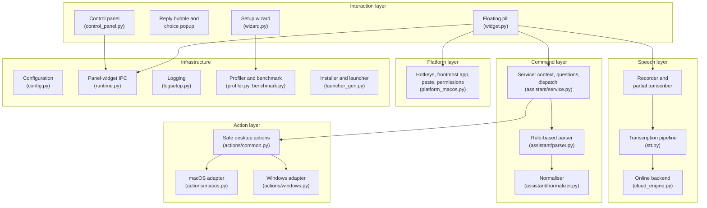

*Figure 4.1. Layered architecture. Arrows show the direction of calls.*

Table 4.1 gives each module's responsibility in one line. Sizes are discussed in Section 5.2.

| Module | Responsibility |
|---|---|
| `widget.py` | the pill process: hotkeys, recording, live and final transcription, pasting, assistant glue, bubble and popup, state publication |
| `stt.py` | the transcription pipeline shared by the widget and the evaluation harness |
| `cloud_engine.py` | the optional online transcription through Groq |
| `assistant/normalizer.py` | Unicode and spoken-number normalisation; spoken filename normalisation; filename match scoring |
| `assistant/parser.py` | transcript to intent and slots, Persian and English |
| `assistant/service.py` | context memory, pending questions, sequence validation, dispatch to actions, bilingual replies |
| `assistant/context.py`, `models.py` | the data classes: parsed command, response, action outcome, context |
| `assistant/actions/common.py` | the safety boundary and filesystem actions; abstract platform operations |
| `assistant/actions/macos.py`, `windows.py` | the platform adapters: open, keystrokes, browser, speech |
| `platform_macos.py` | hotkey listener, frontmost application, paste, Accessibility permission |
| `wizard.py`, `profiler.py`, `benchmark.py` | first-run setup, device profile, measured model recommendation |
| `control_panel.py` | the everyday window: power, live controls, settings, help, logs, maintenance |
| `config.py`, `runtime.py`, `logsetup.py`, `launcher_gen.py`, `__main__.py` | configuration, IPC files, logging, launcher generation, entry point |

*Table 4.1. Module responsibilities.*

### 4.2 Process model

At run time Guya is three cooperating processes, all Python (Figure 4.2). The **wizard** runs once, on first launch or on request; it spawns two short-lived children of its own, the benchmark (`python -m guya.benchmark`, so that the probe model is timed in a process that has never imported Qt) and the model download (so that a stalled download can be paused, resumed or cancelled without freezing the wizard). The **control panel** is the window the user double-clicks; it starts the **widget** as a child process and mirrors its state. The widget is the program that listens and acts.

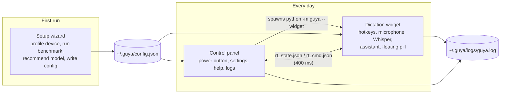

*Figure 4.2. The three processes and the files they share.*

The panel and the widget were separated for two reasons. The first is import order. The Whisper model must be loaded before the Qt library is imported, because on Windows the CUDA backend of CTranslate2 crashes if Qt has initialised its OpenGL libraries first. A child process that loads the model and only then imports Qt guarantees that ordering without any further coordination, and the entry point relaunches itself after the first-run wizard for the same reason. The second is robustness. If the widget process exits, the panel's 400 ms tick sees the child-process state change and shows the power button as off; the user restarts with one click instead of losing the window.

The two processes talk through two small JSON files written atomically (a temporary file renamed over the target). The widget publishes its state every 400 ms: process id, timestamp, enabled flag, assistant flag and key, backend, language (and the locked offline language in dual mode), hybrid flag, microphone status, current state, and whether the Accessibility permission is granted. The panel polls at the same interval, treats a state older than two seconds as stale, and sends commands (turn on or off, switch language, switch backend, enable the assistant) with a monotonically increasing sequence number so that a command is never applied twice. File-based polling was chosen over sockets because it requires no network permission and no additional library, and either process can restart without the other noticing more than a stale state.

The process model is protected against orphans, double launches and lost diagnostics as follows. The widget compares its parent process id with the one recorded at start-up on every tick and exits if the panel has gone, so a closed panel never leaves an orphan holding the hotkeys and the microphone. The widget and the panel each take a lock file (`widget.lock`, `control-panel.lock`, stale after ten seconds) so that a double launch cannot start two widgets that would both open the microphone and both fail. Finally, all three processes write to the same log (Section 4.11).

### 4.3 The dictation path

Figure 4.3 shows what happens between the key press and the pasted text.

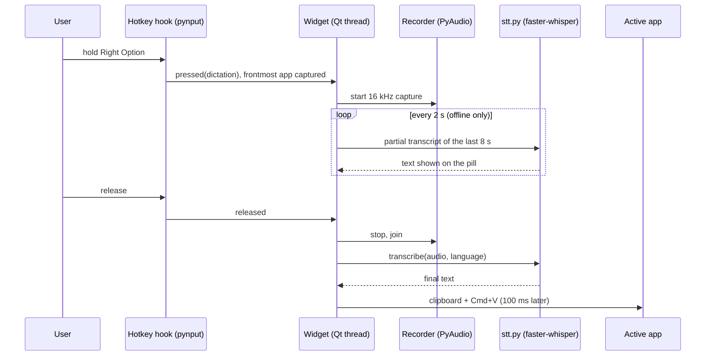

*Figure 4.3. Dictation from key press to pasted text.*

The hotkey listener runs in its own thread and records which application is in front at the moment of the press, before any window of Guya can take focus. Its callbacks do nothing but emit a Qt signal, so every state change happens on the interface thread; the recorder, the partial transcriber, the final transcription and the assistant command each run on their own thread and report back through signals (Table 5.3). Three guards keep the two keys from interfering: the listener remembers which key is held and ignores key-repeat events and the other key while one is down; a release is honoured only for the mode that is recording, so pressing the second key during a recording neither starts a second one nor ends the first; and no recording can start while a transcription or a command is still being processed. At most one recording and one model call therefore exist at any time. Audio is captured from the microphone at 16 kHz mono while the key is held. The keys are modifiers (Right Option for dictation, Right Command for the assistant) because a modifier pressed alone types nothing: no key has to be swallowed system-wide, no stray character reaches the document, and the listener runs without suppressing any event. Holding rather than toggling means the recording is bounded by the user's own hand, so the microphone is never left open by mistake (Section 2.7); Right Control is still accepted for the assistant so that a full-size keyboard from the first prototype keeps working. While recording with the offline backend, a background pass re-transcribes the last eight seconds every two seconds and shows the partial text on the pill, so the user can see that they are being heard; the text is display-only and is never merged into the result. With the online backend no partial text is shown. On release, the whole recording is transcribed once and the result is pasted into the frontmost application through the clipboard.

Pasting was chosen over synthesised keystrokes for two reasons. A single paste transfers the whole Unicode string in one operation, whereas typing Persian character by character through a keyboard simulator was unreliable in the early prototypes. And the paste goes to whatever is frontmost at that moment: the widget never takes focus, so the user's text field is still in front. There is a second reason, recorded in the code: the first version re-activated the application captured at key press, and on macOS the frontmost application read on the listener thread was sometimes stale, returning the application that had launched Guya, so the text went to the wrong window (commit 599bf81, June 2026). Reading the frontmost application again on the interface thread at paste time fixed it; the captured identifier is still used, but only to address the assistant's keystrokes (Section 4.9), where the self-target fallback of Section 5.9 covers the stale case. The one case where this fails is when the user has just clicked on Guya itself; the paste is then refused, the text stays on the clipboard, and the pill says so (Section 5.9).

### 4.4 The speech pipeline

The model call is wrapped in a pipeline, shown in Figure 4.4, that was tuned during daily use and then measured (Section 7.3). Each stage, its parameters and the reason for them are described in Section 5.4.

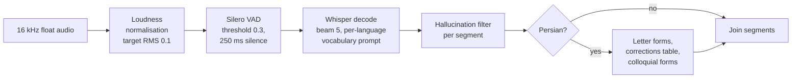

*Figure 4.4. The transcription pipeline in `stt.py`.*

The pipeline has one entry point, `transcribe_audio`, with a `mode` argument that selects the vocabulary prompt: the dictation prompt lists the user's usual words, the assistant prompt lists the command vocabulary, and the answer prompt, used only while a question is pending, lists nothing but the possible answers. The assistant prompt was added after the first manual test session, when short Persian answers such as «بله» and «بازش کن» were heard as unrelated words; the answer prompt followed the third session, when «اول» was heard as «عوال» (Section 7.8). The function also takes an `overrides` dictionary that the evaluation harness uses to switch each setting back to the library default one at a time. The pipeline was extracted into its own module for this report so that the evaluation harness executes exactly the code the widget runs; the ablation in Section 7.3 depends on this.

The pipeline also has an online branch, and the way it is used is the third recognition mode of objective O4. In **dual mode** the widget loads the offline model and holds the online one as well, and the pill carries an OFFLINE/ONLINE switch that the control panel mirrors. The reason is the per-language floor of Section 7.2: a machine that cannot run `large-v3-turbo` at real time can still run `small` for English offline, and only Persian has to go online. Two rules follow. While the offline backend is selected the badge is locked to the language it was set up for, because that is the only language the small offline model is good enough for; switching to online unlocks the badge and, when the offline language is English, defaults it to Persian. And no partial transcription runs on the online backend: one request per release instead of one every two seconds keeps the free tier's rate limit out of the way and avoids uploading audio for text that is only displayed. The online path (`cloud_engine.py`) sends the recording as a 16-bit WAV in one multipart request to Groq's `whisper-large-v3` endpoint with a 30-second timeout, applies the same hallucination filter and Persian post-processing as the offline path so that the two produce comparable text, and maps a lost connection, a timeout, a bad key and a rate limit to four short messages on the pill. The wizard's mode page says in plain words that in this mode the audio leaves the computer (NFR-7).

### 4.5 Command understanding

Figure 4.5 shows the path of a spoken command.

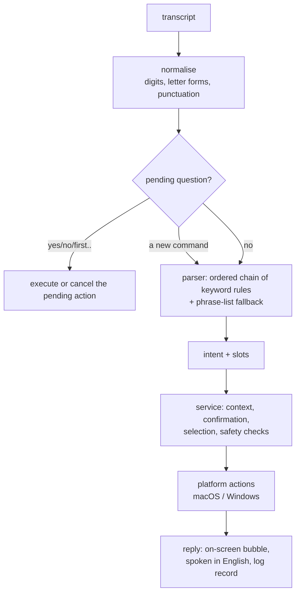

*Figure 4.5. The assistant path.*

**The parser** The parser is an ordered chain of rules in which the first rule that matches wins, so the order of the rules determines the result. Deletion is checked first so that it can be refused before any other rule sees the sentence. Creation is checked before rename, because "make a file and name it X" contains "name it". Save and close come before browser movement. Website comes before application, and application before file, so that "go to youtube" is a website and "open Word" opens the application rather than searching for a file named "word". Each rule extracts its arguments with regular expressions written for that command in each language. If no rule fires, the utterance is compared with the example phrases of its language (67 in each of the two phrase files, the yes/no and cancel entries excluded) and the closest intent is taken if the similarity ratio is at least 0.82. The rules are described one by one in Section 5.6.

Two additions were made for this report, both driven by the held-out evaluation. Filler words at the edges of an utterance ("let's", "please", "again", «یه کم», «لطفاً») are stripped before the strict grammars run. And browser movement has a looser keyword fallback that requires a movement word and a direction word and refuses to fire when the sentence names a file, folder, application, window or tab. The reason for the second rule's strictness is recorded in Section 7.5: its first version scrolled the page on "shut down the computer".

**The service** keeps a small context: the current path, the five most recent paths, and at most one pending question. The recent paths are what let "open it again" and "rename it" work without a name. A pending question is one of three kinds: a confirmation (rename, or "open it now?" after a file was created), a request for a missing name, or a choice among up to three search results. Figure 4.6 shows how the service moves between these states.

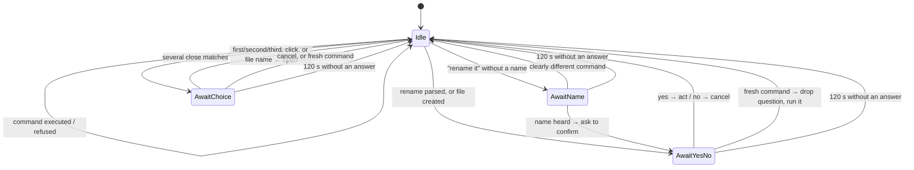

*Figure 4.6. Pending-question states of the assistant service.*

The following behaviour of the state machine is intentional. A "yes" or "no" answers the question, and a fresh command replaces it: the assistant used to insist on an answer first, which made every file creation cost an extra utterance, and the log showed the user simply moving on to the next command. A question that is not answered within two minutes expires, so a "yes" spoken later can never rename something the user has forgotten. And answers to a question are interpreted in the language of the question, so "yes" spoken in English to a Persian question gets a Persian reply.

**Sequences** are the one place where a single utterance produces more than one action, and they were designed conservatively. The parser splits an utterance only on explicit connectors ("then", "and then", «بعد», «سپس», and a bare "and" or «و» only when a verb such as save, close or search follows), into at most three parts, and each part must parse on its own or the whole utterance is treated as one command. The service then validates every step against an allow-list of five intents (open an application, open a website, web search, save, close) before running the first one, so a refused third step can never leave the first two already done; the list contains nothing that creates, renames or asks a question, which is why a sequence never has to carry a pending state. Steps run in order and stop at the first failure, and the reply says how many completed. One inheritance rule was added after the third manual session: a search step directly after "open Chrome" becomes a web search in Chrome, because "open Chrome and search for the weather" had opened Safari.

Every response from the service carries one of six statuses (Table 4.2). The widget uses the status to choose the tone of the pill and whether to show buttons.

The contract between the layers is four small data classes in `assistant/models.py`, and nothing else crosses a layer boundary. The parser returns a `ParsedCommand` (intent, language, slots, the original text, and for a sequence the list of steps, each itself a `ParsedCommand`). An action returns an `ActionOutcome` (success flag, the message in English and in Persian, and the path acted on), so the action layer never decides the reply language. A search yields `SearchMatch` records (path, score, exact flag) that the service ranks. And the service returns an `AssistantResponse` (status, the message in the chosen language, the command, the path, the language, and the options offered), which is the only object the widget ever sees.

| Status | Meaning | Widget behaviour |
|---|---|---|
| `success` | the action was carried out | green pill, reply shown for 3 s |
| `error` | not understood, refused, or failed | red pill, reply shown for 6 s |
| `needs_confirmation` | a yes/no question is pending | amber pill, bubble with Yes/No buttons |
| `needs_selection` | up to three matches are pending | amber pill, popup with clickable choices |
| `needs_input` | a name is missing | amber pill, bubble with the question |
| `cancelled` | the user said no or cancel | amber pill, reply shown for 6 s |

*Table 4.2. Response statuses.*

**Spoken filenames** need their own normaliser. Whisper hears "test six docks" for `test6.docx` and «گزارش شش ورد» for `گزارش ۶.docx`. The normaliser folds digits and number words, drops leading words such as "the" and "my", and rewrites the suffixes speech recognition produces (docs, docks, "doc x", «دکس», «ورد») into the extension. Matching is scored rather than exact, with a fixed scale (Section 5.5). A single match above the confidence threshold is opened directly; when several candidates score closely, the choices are shown. The rule that a partial match needs at least three characters exists because of a real bug: "open the system folder" once opened a folder named `m`.

### 4.6 Device-aware model choice

Guessing the right model from the machine's specification is unreliable: a 16 GB Mac and a 16 GB PC without a graphics card behave very differently. The wizard therefore measures the machine instead of inferring its speed from the specification. The algorithm is:

```
rtf_base   = time to transcribe the bundled 7 s clip with `tiny` / clip length
             (one warm-up pass, then the best of two timed passes, temperature fallback off)
for each model m:
    predicted_rtf[m] = rtf_base × RELATIVE_COST[m]
candidates = offline models the profiler allows for this RAM,
             with accuracy rank ≥ FLOOR[language]
choose the most accurate candidate with predicted_rtf ≤ 1.0
if none: recommend the online model
```

`RELATIVE_COST` is the measured real-time factor of each model on the reference machine divided by the reference probe value 0.040 (Table 7.4). The per-language floor encodes the accuracy measurement of Section 7.2: English is acceptable from `small` upward, Persian and dual need at least `large-v3-turbo`. The threshold of 1.0 means the recommended model keeps up with speech; the wizard also shows the predicted time for ten seconds of speech on each model card, so a user who prefers accuracy over speed can choose a slower one knowingly.

The profiler's part is the gating before the benchmark: the large tier is offered from 8 GB of memory or on Apple silicon, `medium` from 6 GB and `small` always, and a machine with a CUDA device of at least 4 GB is offered full `large-v3` on the GPU in 16-bit precision instead of `large-v3-turbo` on the CPU. The cost ratios were measured on one CPU; the assumption that they hold on another CPU, and on a GPU where the probe and the large model may scale differently, is untested (Section 8.4), which is one more reason the cards show the predicted times instead of hiding them.

The evaluation exposed two defects in the earlier benchmark design, both since fixed. The benchmark used to time the model on synthetic noise; on noise Whisper fails its own quality checks and retries at rising temperatures, so it was measuring decoder retries rather than the device, and on the development machine it recommended the online model for every language even though the same machine runs `large-v3-turbo` in daily use. The recommendation rule also had two latency tiers, which made it non-monotonic: a slightly slower machine could be told to run a bigger, slower model. The second is pinned by tests (`tests/test_benchmark.py`: the reference machine reproduces the measured table and a slower machine never gets a bigger model); the first changed what the benchmark times and is checked by the measurement of Section 7.4, not by a unit test.

### 4.7 The safety model

The assistant's safety does not rest on the parser being right. Table 4.3 maps each safety requirement of Section 3.6 to the mechanism that enforces it and the module that implements it.

| Requirement | Mechanism | Where |
|---|---|---|
| SR-1 no delete | no delete method exists in the action layer; the parser recognises delete words only to refuse them, before any other rule | `parser.py`, `actions/common.py` |
| SR-2 no overwrite | `exists()` is checked before create and before rename; a text file is created with `exist_ok=False` | `actions/common.py` |
| SR-3 allowed roots | every path is `resolve()`d (symbolic links followed) and must be relative to one of the roots; search does not descend into symbolic links, hidden folders, application bundles or a fixed list of tool folders, and stops at depth 6 | `actions/common.py` |
| SR-4 app allow-list | applications are looked up in a table of eight names with fixed executables; the spoken string is never launched | `actions/macos.py`, `actions/windows.py` |
| SR-5 HTTPS host only | `safe_website_url` accepts a known name or a domain with a valid label structure and a top-level domain from a list, and returns `https://host` with nothing after it | `actions/common.py` |
| SR-6 addressed keystrokes | macOS posts key events with `CGEventPostToPid` to the process captured at key press; Windows refocuses the captured window and verifies it before sending; Guya's own bundle ids are refused as targets | `actions/macos.py`, `actions/windows.py` |
| SR-7 no shell | every `subprocess` call is a fixed argument list (`open -a`, `say`, a fixed PowerShell script); no shell is ever invoked and no spoken word is interpolated into a shell string: spoken text reaches another process only as one element of an argument vector (`say`), on stdin (PowerShell), or URL-encoded | both adapters |
| SR-8 confirmation | rename and "open it now?" set a pending confirmation; the action runs only from the confirmation path | `service.py` |
| SR-9 expiry | `PENDING_TIMEOUT_SEC = 120`; an expired question is cleared before any answer is interpreted | `context.py`, `service.py` |
| SR-10 sequences | every step is checked against an allow-list of five intents before the first step runs | `service.py` |

*Table 4.3. Safety requirements and their enforcement.*

The boundary is small enough to be read in full: `actions/common.py` is 513 lines.

One mechanism belongs with SR-2 and SR-3 although it is not a requirement of its own: every spoken name passes through `_safe_name` before it touches the filesystem. Path separators, the characters Windows forbids in names and control characters are removed, leading and trailing dots are stripped, a name that is empty or reduces to `.` or `..` is refused, and the result is cut to 180 characters; so a name that arrives with a slash cannot leave the folder, and the assistant never creates a hidden file. The same function guards rename, and a new name spoken without an extension inherits the old one, so a spoken rename cannot silently turn a `.docx` into a file no application opens. Several unit tests assert the absence of side effects, for example that nothing was opened before "yes", that nothing was renamed after "no", and that a delete request touched nothing (Section 5.13).

### 4.8 Feedback and interaction

The floating pill is the primary on-screen feedback element and the only part of Guya that is visible during use. It has five states (loading, idle, listening, processing, done) and the done state carries one of three tones: ok, warn or error. Figure 4.7 shows the transitions; Table 4.4 gives the colours and labels.

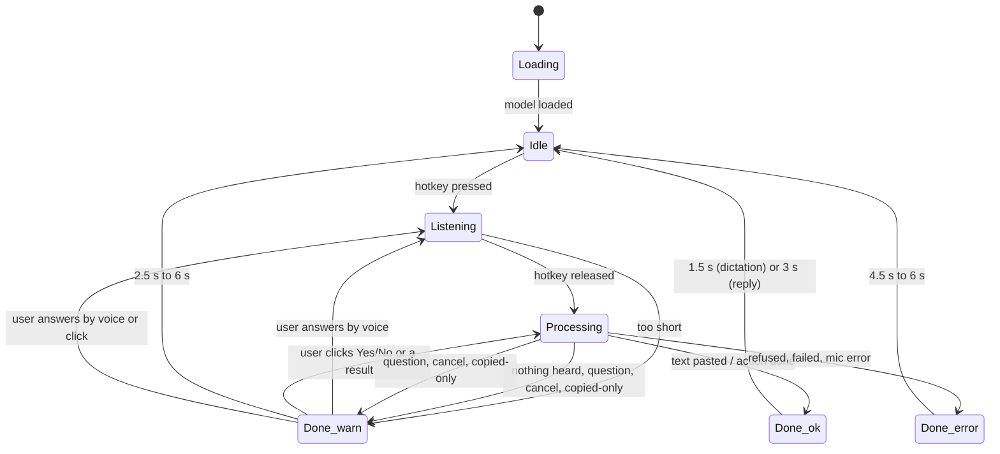

*Figure 4.7. Pill states and tones.*

| State / tone | Dot colour | Label | Meaning |
|---|---|---|---|
| loading | amber | "Loading…" | model is being loaded |
| idle | grey | "⌥ Dictate · ⌘ Assist" | ready; the badge shows the language |
| listening | red, pulsing | "● Dictation listening…" / "● Assistant listening…" then the partial text | key held |
| processing | blue, breathing | "Processing…" / "Understanding command…" | transcribing or acting |
| done, ok | green | "✓ Done" or the reply | success |
| done, warn | amber | the question or notice | a question is pending, or a notice |
| done, error | red | the error | refused or failed |

*Table 4.4. Pill states, tones and labels.*


*Figure 4.8. The pill on screen: listening on the assistant key (red, pulsing dot), and idle in dual mode with the OFFLINE and ONLINE backend badges; the language badge shows EN.*

Every state pairs its colour with a text label, and every label change is mirrored into the pill's accessible description so that a screen reader can read it. While idle the pill is collapsed to a 40-pixel circle at the top centre of the screen and it expands only while listening, processing or showing a reply, so that it takes almost nothing from the document and draws the eye only when something is happening; it stays on top of every window, never takes keyboard focus, and can be dragged aside if it covers something. A single reusable idle timer returns the pill to idle after a delay that depends on what was shown: 1.5 s for a plain "Done", 2.5 s for a notice, 4.5 s for an error notice on the dictation path, 3 s for a successful assistant reply and 6 s for any other assistant reply (question, refusal, error or cancellation). The timer is re-armed on every change, because an earlier design with one fire-and-forget timer per reply let an old timer wipe a new reply early.

The pill's label holds about thirty characters and cannot wrap. Any reply longer than 28 characters, and any reply that is not a plain success, is therefore repeated in full in a **reply bubble** under the pill: a 420-pixel wrapped panel that follows the text direction (right-to-left for Persian), coloured by tone, with Yes and No buttons when a confirmation is pending. The buttons emit the literal words "yes" and "no" into the same path a spoken answer takes, so a click and a voice answer are handled by one piece of code. Search results that need a choice appear in a similar popup with up to three buttons and a Cancel. Neither window ever takes keyboard focus, so the user's document keeps it.

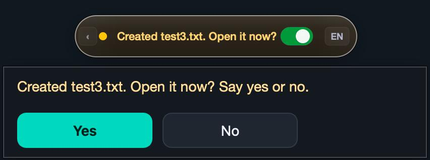

*Figure 4.9. The reply bubble after a file was created: the amber pill carries the short form of the question and the bubble repeats it in full with the Yes and No buttons.*

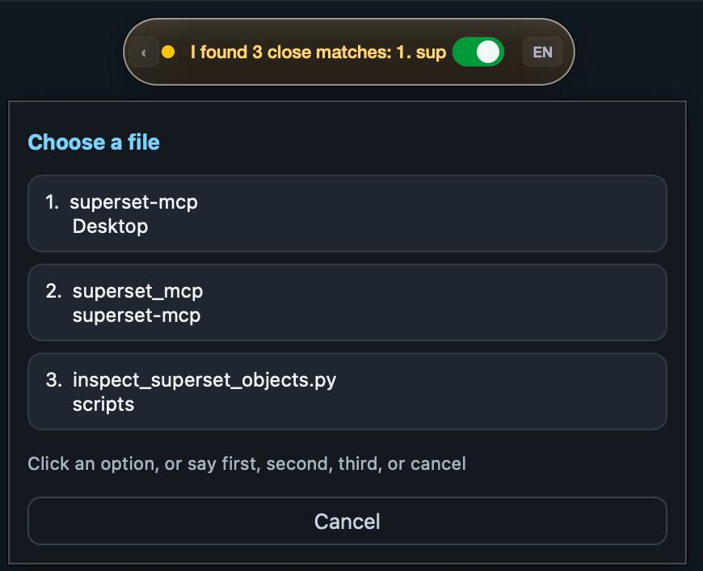

*Figure 4.10. The results popup for a spoken name with three close matches; each option shows the file name over its folder, and the pill shows the beginning of the spoken reply.*

English replies are also spoken with the system voice. Persian replies are shown only. macOS ships 184 voices and none for Persian; the only Arabic-script voice reads Persian with an Arabic accent, and after a trial, the decision was to show Persian replies silently rather than have them read with an Arabic accent. Because Persian replies cannot be spoken, the on-screen text has to carry them in full. The audit found that a Persian confirmation question had been truncated to its first three words on the pill, so the user was confirming a question that was not readable; the reply bubble was added in response., and the user was answering "yes" to a question they could not read. Pressing either hotkey while an English reply is being spoken interrupts it; the dictation key does so because Guya's own voice was once recorded as part of a dictation.

### 4.9 Platform abstraction

Everything that touches the operating system goes through two adapters with the same interface (Table 4.5). The service and the parser never call an operating-system API themselves; every such call sits behind the adapter interface, which is why the tests can substitute a fake adapter and run without a screen (Section 5.13).

| Operation | macOS | Windows |
|---|---|---|
| detect the hotkeys | pynput listener over a system event tap; Right Option and Right Command (Right Control is also accepted for the assistant) matched by key and by hardware code | low-level keyboard hook (`WH_KEYBOARD_LL`) in a thread; G and F8 by default, configurable |
| capture the target | frontmost application's bundle identifier, read on the hook thread at key press | foreground window handle, plus the focused text control |
| paste dictated text | clipboard, then Cmd+V to whatever is frontmost; refused if that is Guya | clipboard, refocus the captured window, Ctrl+V |
| open a file or folder | `open <path>` | `os.startfile` |
| open an application | `open -a <name>` from a table of candidates | `os.startfile(<exe>)` from a table |
| save, close | Cmd+S / Cmd+W posted to the captured process id; close tries the window's Accessibility close button first | Ctrl+S / Ctrl+W after refocusing and verifying the captured window |
| browser navigation | Page Up/Down, Cmd+Up/Down, Cmd+[ and Cmd+] posted to the browser's process; refused unless the captured app is one of eight known browsers | Page Up/Down, Home/End, Browser Back/Forward keys to a Chrome- or Firefox-class window |
| open a URL | into the current tab of the captured browser (Cmd+L, paste, Return, clipboard restored) or `open -a <browser> <url>` | same, with Ctrl+L |
| speak a reply | `say` for English; nothing for Persian | PowerShell speech synthesiser, first `fa-*` voice if installed; text passed on stdin as UTF-8 |
| permissions | Accessibility prompt through `AXIsProcessTrustedWithOptions`; microphone prompt by opening the stream once | administrator check for the keyboard hook |

*Table 4.5. The platform interface and its two implementations.*

The Windows adapter was written against the API documentation, and the one test that exercises it runs with the operating system calls patched out. It was first executed on a Windows machine at the end of the term, where it behaved as the macOS adapter does (Section 7.9).

### 4.10 Configuration, installation and runtime layout

All settings live in one JSON file, `~/.guya/config.json`, with 26 settings and a version stamp (Appendix C). On every load the file is merged over the built-in defaults, so an older file keeps working after an update and simply gains any new keys. The file is written with owner-only permissions because it may hold the online API key.

Everything Guya writes at run time lives under `~/.guya`:

```
~/.guya/
├── config.json          settings (chmod 600)
├── logs/guya.log        one rotating log for all processes (2 MiB × 5)
├── logs/launcher.log    stdout and stderr of the process tree started from Guya.app
├── runtime/guya/        a copy of the package (macOS)
├── runtime/venv/        a copy of the Python environment (macOS)
├── runtime/origin       path of the checkout, for Update and Uninstall
├── rt_state.json        widget → panel, every 400 ms
├── rt_cmd.json          panel → widget, numbered commands
├── widget.lock          single-instance locks
└── control-panel.lock
```

Models are not under `~/.guya`; they live in the Hugging Face cache (`~/.cache/huggingface/hub`), a location that both the wizard and the uninstaller reference.

The copy of the package and environment under `runtime/` is the result of a failure recorded in the launcher log. An application launched from the Finder is denied access to a Python environment that lives on the Desktop or in Documents, because those folders are protected by macOS privacy controls; a Terminal launch hides the problem because Terminal already has permission. The installer therefore copies the code to `~/.guya/runtime` and generates a `Guya.app` bundle that runs the copy. The bundle is a four-line shell stub with an `Info.plist` that names Guya as the process asking for the microphone and for the Desktop, Documents and Downloads folders, and it is signed ad hoc so that Gatekeeper accepts it without an Apple developer account. Because the bundle, not a terminal, is the process that asks for Accessibility, the permission belongs to Guya. The panel's Update button pulls the repository, reinstalls the requirements and regenerates the bundle, which re-copies the package; Uninstall removes the settings, logs, models, runtime copy and launchers, and keeps the project folder.

### 4.11 Logging and diagnosability

Problems are reported after the fact, without the developer present, so the log must contain enough on its own to reconstruct what happened. Every process writes to one rotating file, and every record carries the date and the process id, so a session can be reconstructed afterwards. The widget logs the mode, the captured target, the audio length and the transcription time of every recording, and the first 80 characters of the final text, which is what makes an "it typed the wrong thing" report diagnosable; the partial text is logged only at debug level. The log never leaves the machine: it is a local file, rotation keeps at most six files of 2 MiB, and Uninstall removes it. And every assistant command produces one JSON record (Table 4.6), which is what Section 7.6 and the usage-log analyser are built from. Because the record keeps the transcript, the log doubles as a regression set: `eval/assistant_report.py --replay` re-parses every transcript that failed with the parser as it is now, so a parser change can be checked against every real failure ever logged without recording anything again. Each file search adds a second record with the query, its canonical form, the number of names inspected, the time taken and the top five candidates with their scores (Section 5.8), which is what turns "it opened the wrong file" into a reproducible report. The control panel shows the last 400 lines of the log in a dialog that refreshes every 1.5 seconds and preserves the reader's scroll position; losing that position on refresh was one of the reported bugs.

| Field | Content |
|---|---|
| `transcript` | what was heard |
| `stt_language` | the badge language at the time |
| `response_language` | the language of the reply |
| `intent`, `slots`, `steps` | what the parser produced |
| `status`, `message` | the service's response |
| `path`, `options` | the file acted on, or the choices offered |
| `target_app` | the application the command was addressed to |
| `audio_seconds`, `transcription_ms`, `command_ms` | the latency split |

*Table 4.6. The per-command log record.*

---
## 5. Implementation

### 5.1 Technology stack

Table 5.1 lists every runtime dependency with the version used and what it is for. PyTorch is not needed, no paid service is involved, and no code written for the project is compiled; the only native code is inside the listed wheels. Python 3.10 to 3.12 is required because PyQt6 6.11 had no wheels for Python 3.13 or later when the project was built; the development environment runs 3.11.15.

PyQt6 was chosen because the pill needs frameless, always-on-top windows that never take keyboard focus (`WindowDoesNotAcceptFocus`, `WA_ShowWithoutActivating`), custom painting for the animated capsule, signals that deliver a worker thread's result on the interface thread, accessible names and descriptions that VoiceOver reads, and right-to-left text with style sheets for the Persian bubble; all of these are in Qt, and PyQt6 is free under the GPL.

| Component | Version | Used for |
|---|---|---|
| Python | 3.11 | everything |
| faster-whisper | 1.2.1 | offline speech recognition; pulls CTranslate2 4.8.1, the tokenizer, ONNX Runtime for the VAD, and the Hugging Face hub client for downloads |
| CTranslate2 | 4.8.1 | the inference engine; 8-bit weights on the CPU |
| PyQt6 | 6.11.0 | every window, plus `QProcess`, `QThread`, `QTimer` and `QLockFile` |
| PyAudio (PortAudio) | 0.2.14 | microphone capture |
| NumPy | 2.4.6 | audio buffers |
| pyperclip | 1.11.0 | clipboard for pasting |
| psutil | 7.2.2 | device profile (cores, memory) |
| httpx | 0.28.1 | the optional online transcription request |
| pynput (macOS) | 1.8.2 | global hotkey listener; Cmd+V synthesis |
| PyObjC: Cocoa, ApplicationServices, Quartz (macOS) | 12.2.1 | frontmost application, Accessibility permission, window close button, addressed key events |
| Groq API (optional) | `whisper-large-v3` | online transcription on the free tier |

*Table 5.1. Runtime dependencies.*

### 5.2 Code organisation and size

The repository is laid out as follows.

```
guya/                         the application package (24 modules, 11,905 lines)
  widget.py                   pill process
  stt.py                      transcription pipeline
  wizard.py  profiler.py  benchmark.py
  control_panel.py  runtime.py  config.py  logsetup.py  launcher_gen.py
  platform_macos.py  cloud_engine.py  __main__.py
  assistant/                  parser.py  service.py  normalizer.py  context.py  models.py
    commands_en.json  commands_fa.json      phrase packs (93 + 100 examples)
    actions/                  common.py  macos.py  windows.py
  assets/                     bench_speech.wav (7 s probe clip), Vazirmatn fonts
eval/                         evaluation harness (8 modules, 1,240 lines)
tests/                        136 tests (10 files, 1,598 lines)
docs/                         this report, user guide material, user-study protocol, demo script, and `tools/build_report_html.py`, the renderer of this report
tools/                        record_sample.py, the microphone probe used to validate the online path before M4
install.sh  install.bat  "Install Guya.command"  "Install Guya.bat"  run.sh  run.bat
```

Table 5.2 gives the size of each module. The whole project is 14,920 lines of Python in 45 modules: the application package, the evaluation harness, the tests, the report renderer under `docs/tools/` and a small recording script under `tools/`. The two largest modules are the two user interfaces; the parser, service and actions, where correctness matters most, are about 3,300 lines and hold most of the 136 tests; the normaliser, the benchmark, the WER evaluator and the macOS hotkey layer have test files of their own (Table 5.8).

| Module | Lines | Role |
|---|---:|---|
| `widget.py` | 2,808 | recorder, hotkeys, floating pill, reply bubble, results popup, assistant glue |
| `wizard.py` | 2,121 | eleven-page bilingual setup wizard |
| `assistant/parser.py` | 1,121 | intents and slots, Persian and English |
| `control_panel.py` | 1,017 | launcher window, settings, help, logs, maintenance |
| `assistant/service.py` | 798 | context, confirmation, selection, dispatch |
| `stt.py` | 574 | the speech-to-text pipeline shared with the evaluation |
| `assistant/actions/macos.py` | 547 | macOS adapter |
| `assistant/actions/common.py` | 513 | the safety boundary and filesystem actions |
| `platform_macos.py` | 427 | hotkeys, frontmost application, paste, permissions |
| `assistant/actions/windows.py` | 315 | Windows adapter |
| `assistant/normalizer.py` | 287 | text and spoken-filename normalisation |
| `benchmark.py`, `profiler.py` | 498 | device profile, benchmark, recommendation |
| `launcher_gen.py`, `config.py`, `cloud_engine.py` | 498 | launcher generation, configuration, online backend |
| `__main__.py`, `runtime.py`, `logsetup.py`, `context.py`, `models.py`, `__init__` files | 381 | entry point, IPC, logging, data classes |
| `eval/` | 1,240 | accuracy, ablation, intent and log evaluators, table generator |
| `tests/` | 1,598 | 136 tests |

*Table 5.2. Module sizes.*

### 5.3 Start-up sequence and threads

The widget's `main()` runs a fixed sequence: enable the fault handler, which prints a native stack trace if CTranslate2 or PortAudio crash the process where no Python traceback would appear, and route unhandled exceptions on every thread to the log through `sys.excepthook` and `threading.excepthook`; check the Accessibility permission and open the microphone once so that macOS asks for both permissions; load the Whisper model (or construct the online model object; in dual mode both, so that the pill's backend switch needs no restart); only then import the Qt library, because CTranslate2's CUDA backend crashes if Qt's OpenGL context has been initialised first; take the single-instance lock; build the window; set the widget process's macOS activation policy to *accessory*, so that the pill shows without a Dock icon or menu bar (the Dock icon the user sees belongs to the panel process started by `Guya.app`, Section 5.12); and show the pill collapsed at the top centre of the screen.

Model loading chooses the device and precision at run time. On macOS there is no GPU backend for faster-whisper, so the model runs on the CPU with 8-bit weights and all cores. On Windows the code probes `nvcuda.dll` through `ctypes`; if a CUDA device is found the model runs there in 16-bit floating point, and if initialisation fails it falls back to the CPU, where the retry loads `medium` with 8-bit weights rather than the configured size; the Windows run of Section 7.9 did not exercise this fallback. If the model files are not in the cache, they are downloaded in a subprocess with a ten-minute timeout. The cache check is a directory glob for a `model.bin` under `models--*--faster-whisper-<size>` in the Hugging Face cache, done without importing the hub client, because the subprocess that imports the download machinery was measured at about 87 seconds and that cost was being paid on every start even when the model was already present.

At run time the widget has five threads and four timers (Table 5.3). The hotkey hook, the recorder and the partial transcriber are plain Python threads; the final transcription and assistant commands run in Qt threads so that their results arrive on the interface thread as signals. No blocking call runs on the interface thread, so the pill keeps animating while the model works. The recorder appends each chunk to a list under a lock, and the partial transcriber's snapshot copies only the trailing eight seconds, so a partial pass costs the same however long the key is held; before that cap the pass re-decoded the whole buffer and the final pass queued behind it, which is what produced the real-time factor of 1.44 in use (Section 7.6). On release the partial thread is told to stop but not joined, so a pass already inside the model finishes in the background while the final pass starts; the cap also bounds that overlap to one eight-second decode.

| Thread or timer | What it does | Interval |
|---|---|---|
| hotkey hook thread | pynput listener (macOS) or low-level keyboard hook (Windows); captures the frontmost application at key press | event-driven |
| recording thread | reads 1,024-sample chunks (64 ms) from PortAudio into a buffer | while the key is held |
| partial transcriber thread | transcribes the last 8 s of the buffer and shows it on the pill; offline dictation only, because a request to the online service every two seconds would spend the free tier's rate limit on text that is only displayed | every 2.0 s |
| transcription `QThread` | the final pass over the whole recording | once per release |
| assistant `QThread` | `service.handle(text)` | once per command |
| animation timer | the pill's width, glow and dot animation | 33 ms (30 fps) |
| runtime timer | publishes state to the panel, applies its commands, checks the parent process | 400 ms |
| idle timer | returns the pill to idle after a reply or notice | 1.5 to 6 s, single-shot |
| paste delay | between "Done" and the paste keystroke | 100 ms |

*Table 5.3. Threads and timers of the widget.*

### 5.4 The speech-to-text module

`stt.py` is 574 lines; its entry point is `transcribe_audio`, and the widget also imports `CloudModel` and `is_hallucination` from it. Its stages run in the order shown in Figure 4.4; Table 5.4 lists the decoding settings against the library defaults.

**Loudness normalisation.** The float audio is scaled so that its root-mean-square level becomes 0.1, with the gain capped at 30 and the result clipped to ±1. Silence (RMS below 10⁻⁶) is left untouched. The target user speaks quietly into a built-in laptop microphone; without this stage the VAD dropped the ends of sentences.

**Voice activity detection.** faster-whisper's Silero VAD is enabled with a speech threshold of 0.3 instead of 0.5, a minimum silence of 250 ms instead of 2,000 ms, 500 ms of padding around each speech region, and a minimum speech region of 80 ms. The lower threshold keeps quiet speech from being classified as silence, the 500 ms padding preserves word edges at each cut, and the 250 ms minimum silence lets the VAD cut at natural pauses rather than only at long gaps; Section 7.3 shows that these cuts cost accuracy on the small model but not on the shipped one.

**Language and prompt.** For Persian and English the language token is fixed and the sampling temperature is 0 with no fallback. A fixed temperature means one beam-search pass per segment; the library's default ladder re-decodes a segment at up to six rising temperatures whenever the compression-ratio or log-probability check fails, and each retry is another full pass, so the ladder makes the latency unpredictable for little gain on ordinary speech. It is the same retry behaviour that made the benchmark measure decoder retries instead of the device (Section 4.6). In dual mode the language is left to the model, per-segment detection is enabled, and a short temperature ladder (0, 0.2, 0.4, 0.6) is allowed, because mixed-language audio fails the quality checks more often. Each language has a vocabulary prompt: a comma-separated list of words the user says often (colloquial cue words such as «خب», «میخوام», «چجوری», technical terms, brand names, «فایل», «پوشه», «گزارش»). The prompt is a list rather than sentences because Whisper tends to copy a prompt written as a sentence into the output as if it had been spoken. faster-whisper keeps only the last 223 prompt tokens, and an earlier 298-token Persian prompt was silently losing its first 75 tokens, which were the colloquial cue words it existed for; the current one measures 214 tokens with the model's tokenizer and the code comment says so, so that nobody adds words without re-measuring.

**Decoding.** Decoding uses beam search with 5 beams, `best_of` 5, a no-speech threshold of 0.5 instead of 0.6, and no repetition penalty. The penalty was 1.2 from the first prototype until September 2026, as the standard remedy for Whisper's repetition loops; the ablation of Section 7.3 showed that it made the decoder end sentences early and cost the small model 9.6 points of English WER, so it was removed. Loop protection now rests on the hallucination filter and on the rule that recordings shorter than five seconds are decoded without conditioning on previous text. With the penalty removed, the pipeline as shipped measures 27.1% Persian and 3.9% English WER on the FLEURS clips against 28.9% and 4.0% for stock decoding of the same model (Table 7.3): the settings that remain are a small net gain on the shipped model, not merely harmless.

| Setting | Guya | faster-whisper default |
|---|---|---|
| beam size / best of | 5 / 5 | 5 / 5 |
| temperature | 0 (fa, en); 0, 0.2, 0.4, 0.6 (dual) | 0 to 1.0 in six steps |
| VAD filter | on | off |
| VAD threshold / min silence / padding / min speech | 0.3 / 250 ms / 500 ms / 80 ms | 0.5 / 2,000 ms / 400 ms / 0 |
| no-speech threshold | 0.5 | 0.6 |
| repetition penalty | 1.0 (was 1.2 until September 2026) | 1.0 |
| condition on previous text | off for recordings under 5 s | on |
| initial prompt | per-language vocabulary list (fa 214 tokens, en 64, dual 97) | none |
| compression ratio / log-probability thresholds | 2.4 / −1.0 (default) | 2.4 / −1.0 |

*Table 5.4. Decoding settings.*

**Hallucination filter.** Each segment of the output is dropped if it is shorter than two characters, consists only of punctuation, is a single repeated character, or has five or more words of which one makes up more than 60% (the rule requires at least five words so that a word doubled for emphasis, as in «خیلی خیلی خوب», is not dropped). A segment that matches one of sixteen phrases Whisper produces on silence («ساب اسکرایب», "thanks for watching", «زیرنویس توسط», "www.") is also dropped, but only when the segment is at most one word longer than the phrase; an earlier version that also removed single words such as «ترجمه» deleted real sentences.

**Persian post-processing.** Three stages run on Persian text (and, in dual mode, on every segment that contains Persian script). First, six Arabic letter forms are mapped to their Persian equivalents, diacritics are removed, and the spacing around Persian punctuation is fixed without touching times and version numbers («ساعت 10:30»). Second, a table of 64 corrections is applied with whole-word matching, longest key first. The entries were collected during daily use and fall into four groups: names and places the user says («جاباما»), similar-sounding letter confusions (ب/پ, د/ت, ز/ذ), words the model splits or merges («پارامت های» → «پارامترهای», «محمد رضا» → «محمدرضا»), and technical and brand terms («اپ دیت» → «آپدیت», «واتس اپ» → «واتساپ»). Whole-word matching is essential: an earlier substring version turned «مدیریت» into «مدیرت». Third, 43 regular-expression rules turn the formal written forms Whisper prefers, mostly verbs but also pronouns and adverbs, back into the colloquial forms the speaker used: «می‌خواهم» → «میخوام», «می‌دانم» → «میدونم», «می‌توانم» → «میتونم», «اصلاً» → «اصن», «آنها» → «اونا», «چگونه» → «چجوری». English text is not post-processed. All three Persian stages are lookup tables and regular expressions inside `stt.py` with no Persian NLP library behind them: hazm, the usual choice, was used in an early prototype and removed because its dependencies conflicted with the CUDA build of the inference stack, and the three stages cover what daily use actually needed.

**Modes and overrides.** The `mode` argument selects the prompt: `dictation` (default), `assistant` (the command vocabulary: yes, no, cancel, the ordinals, open, close, save, find, create, file, folder, rename, scroll, the word website, the two browsers, the calculator, the language names, and a few words from the test scripts such as report and test), or `answer` (only the words that can answer a question: «اول، دوم، سوم، یک، دو، سه، لغو، بله، نه»). The widget passes `assistant` for command recordings and `answer` when a question or a result list is pending. The dual-mode command prompt could not simply join the Persian and English lists: together they measure 247 tokens, so the first Persian items, which are exactly the answer words yes, no, cancel and the ordinals, fell outside the 223-token window and were silently dropped; the shorter union used now measures 194 tokens, and the code records the figure for the same reason as the dictation prompt. The `overrides` dictionary is merged over the decoding arguments and exists only for the evaluation harness; the widget never passes it. Two flags of the same kind, `postprocess=False` and `rms=False`, switch off the two stages that are not decoding arguments; they produce the 'minus Persian post-processing' and 'minus loudness normalisation' rows of Table 7.2.

**Online backend.** When the model object is the online one, the same function sends the audio as a 16-bit WAV to Groq's transcription endpoint (`whisper-large-v3`, 30-second timeout, the language field set for Persian or English and omitted for dual), and applies the same hallucination filter and post-processing to the result. Connection, timeout, authentication and rate-limit errors are mapped to short messages for the pill. No prompt or VAD settings are sent; loudness normalisation is applied before the audio is encoded, and because the endpoint returns no segments the hallucination filter runs once over the whole text. Groq was chosen because its free tier serves `whisper-large-v3`, the same model family as the offline path, so Persian quality online is at least that of the shipped model; the request shape was checked by hand against the live endpoint before the module was written.

### 5.5 Spoken filenames

Filenames reach the assistant spelled the way the recogniser heard them: "test six docks", «آزمون شیش دکس», "report doc x". `normalize_spoken_filename` turns them into a form that can be compared with real names, in five steps: character normalisation (lower case, digits, Arabic letter forms, diacritics, punctuation and separators to spaces); spoken numbers from 0 to 99 in both languages, including colloquial Persian forms («یه», «شیش», «پونزده»); removal of leading words such as "the", "my", «فایل», «پوشه»; rewriting of the trailing type words ("word file", «سند ورد») and the spoken extensions ("docs", "docks", "doc x", «دکس», «ورد» → `docx`; "text", «تکست» → `txt`); `filename_keys` then splits the result into a stem and a recognised extension.

`filename_match_score` then compares a spoken query with a candidate name and returns a score on a fixed scale (Table 5.5). The similarity ratio is difflib's `SequenceMatcher` (the Ratcliff–Obershelp measure: twice the number of matching characters over the combined length), computed on the two stems with every separator removed, so that "final report" and `final_report` compare as the same string and the score depends only on the letters heard. The scale was tuned by hand against recogniser errors collected during daily use, and the search keeps candidates scoring at least 0.58, shows at most three, and opens without asking only when the best is clearly ahead (a single match at 0.90 or above, or a best score of at least 0.86 with a margin of 0.12 over the runner-up, or an exact match with no near-exact rival).

| Case | Score |
|---|---:|
| full name identical | 1.00 (exact) |
| stem identical, one or both without an extension | 0.98 (exact) |
| stem identical, different extension | 0.90 |
| otherwise, similarity ratio of the stems | ratio × 0.76 |
| the shorter stem (≥ 3 characters) is a prefix of the other | at least 0.86 |
| the shorter stem (≥ 3 characters) is contained in the other | at least 0.82 |
| share of the query's words present in the name | at least share × 0.80 |
| extension equal / different | +0.04 / −0.08 |
| cap for any non-exact match | 0.97 |

*Table 5.5. Filename match scale.*

### 5.6 The command parser

`parse(text)` first detects the language (any Persian character makes the utterance Persian), normalises the text, and checks whether the whole utterance, before or after filler stripping, is one of the confirmation or cancellation phrases (14 and 12 in English, 17 and 16 in Persian). Then it looks for a sequence: the text is split only on explicit connectors ("then", "and then", «بعد», «سپس», and a bare "and" or «و» only when followed by a verb such as save, close, search, go or visit), each part is parsed on its own; more than three parts is rejected as unknown, and if every part is understood the result is a sequence, otherwise the whole utterance is parsed as one command. A search step directly after "open Chrome" becomes a web search in Chrome, and a website or search step inherits the browser that the previous step opened; this rule came from the third manual test session (Section 7.8), where "open Chrome and search for the weather" opened Safari.

Filler stripping removes, from the edges of the utterance only, any of 30 English and 24 Persian words and phrases ("please", "just", "let's", "can you", "a bit", «لطفاً», «یه کم», «دوباره», «میشه», «بی زحمت»), longest first and repeatedly. The restriction to the edges is deliberate: a filler word inside a name («گزارش دوباره») is part of the name.

The single-command parser is a chain of eighteen rules tried in order (Table 5.6). Every rule returns the same data structure, a `ParsedCommand` with five fields: `intent`, `language`, `slots` (a dictionary such as `{"old_name": ..., "new_name": ...}`), `original_text`, and, for a sequence, `steps`, a list of `ParsedCommand`s. The service reads nothing else, which is why the parser can be evaluated on text alone (Section 7.5). Apart from the whole-utterance alias test of rule 2 and the two fallbacks at the end, each rule is a whole-word keyword test followed by slot extraction with a regular expression for each language.

| # | Rule | Fires on | Guard |
|---|---|---|---|
| 1 | delete refused | any of 9 delete words, unless another verb comes first | "open the trash folder" and "rename it to remove" stay ordinary commands |
| 2 | bare application name | the whole utterance is one of 32 application aliases | |
| 3 | language switch | at most six words matching a switch frame ("switch to Persian", «برو انگلیسی», "dual") | a bare language name alone is not a switch, so "english" while dictating a name does nothing |
| 4–7 | create Word document, folder, text file, plain file | a create verb (8 in the two languages), or in English "new" at the start of the utterance or "need", "want", "give me", "get me" followed by "a", "an", "another" or "new" ("I need a word file"), plus a type word | "new" and "build" are not create verbs, so "open the new folder" and "open the build folder" stay open requests; in English an utterance that starts with "new" or says "I need a", "I want a" or "give me a" also counts as a creation request; creation is checked before rename because "make a file and name it X" contains "name it" |
| 8 | rename | 18 rename verbs or the frames "change … name", «اسمش رو بذار», «اسم جدیدش بشه» | «اسم» and «نام» must be whole words, so «نامه» (a letter) is never a rename; the contraction «اسمشو» is |
| 9 | save / save as | 7 save verbs; "save … as" or a folder name means Save As, which is refused with an explanation | |
| 10 | close | 7 close verbs | |
| 11 | browser navigation | 20 English and 21 Persian strict patterns, then the keyword fallback | the fallback needs a movement word and a direction, at most seven tokens, and no word that names a file, folder, application, window, tab or the computer |
| 12 | open website | "go to", "visit", «برو به سایت» with a known site name (56 spellings) or a spoken domain | a domain counts only if the raw transcript contains the dot or the word "dot"/«دات»/«نقطه»; otherwise "open note app" would be a website |
| 13 | open application | an open verb and an application alias | "open the word file report" is a file, "open word file" is Word |
| 14 | find and open | "find X and open it", «X رو پیدا کن و بازش کن» | |
| 15 | web search / file search | 16 search verbs; a web search if the sentence names the web, Google or a browser, with five Persian patterns that place the query before or after the verb («توی گوگل سرچ کن X», «X رو گوگل کن») | |
| 16 | open file or folder | an open verb; "open it", «بازش کن» give no name and use the remembered path | |
| 17 | phrase-list fallback | the closest of the 67 example phrases of the utterance's language (the confirmation and cancellation phrases are excluded) at similarity ≥ 0.82, then the slot extractor of that intent | a website from this path may omit the dot ("visit github com") |
| 18 | unknown | | |

*Table 5.6. Parser rules in order.*

Three helper functions serve the service while a question is pending. `leading_answer` accepts "yes" or "no" followed by more words ("no, don't rename it", «نه اسمش رو عوض نکن»), trying the cancel phrases first. `fuzzy_answer` accepts a single misheard word as an answer when its similarity ratio to a yes or no word is at least 0.75, because Whisper has written «بیلی» for «بله». `fuzzy_selection_index` does the same for "first", "second", "third" at 0.5 with a margin of 0.1 over the runner-up, because it wrote «عوال» and «آبال» for «اول». All three are consulted only while a question is pending, so a misheard word cannot start an action on its own. The whole chain is cheap: eighteen keyword tests and, on the fallback path, 67 `SequenceMatcher` comparisons, about one to two milliseconds per utterance, and in use the median parse-and-act time was 30 ms against 2,762 ms of recognition (Section 7.6). The explainability argued for in Section 2.6 therefore costs nothing the user can notice.

### 5.7 The assistant service

`handle(text)` runs the flow of Figure 4.6. It first clears a pending question that is older than 120 seconds. If a result list is pending, the utterance is tried as a selection: an index word, a fuzzy index, or the name of one of the options (scored with the filename scale, accepted at 0.86 with a 0.12 margin); a click on the results popup selects directly, and an utterance that parses as another command with its own arguments drops the list, but an open or search command does not, because "open the report" while a list of reports is showing is more likely a choice by name than a new request, so its name is scored against the options first. If a confirmation is pending, `leading_answer` and `fuzzy_answer` decide; a confirmation runs the stored action, a cancellation reports what was left unchanged ("Okay. report.docx was created and left closed."), and a fresh command from a list of sixteen intents replaces the question; the one exception is a bare "rename it" without a name while a rename is already pending, which restates the question and is answered with the yes/no prompt again. If a name is pending, the utterance is taken as the name after eight English and twelve Persian prefixes ("the new name should be", «اسمش رو بذار») are removed, unless it parses as another command with its own arguments, or as save, close or delete. Otherwise the utterance is parsed and dispatched.

Two answers are refused as names: a confirmation word ("yes", «بله»), because it answers a question that was not asked and must never become a filename, and an empty remainder, which asks again. In the selection path the chosen file is checked to still exist before it is opened, and an index word spoken after the list has expired is answered with "That list has expired. Please search again." rather than silence.

`_dispatch` is a chain of intent checks with one branch per intent. Creation calls the action and then asks whether to open the result. Opening with a name checks the remembered paths first and then searches. Search never opens anything; it remembers the best match and says how to open it. A sequence is validated in full before its first step: every step must be one of open application, open website, web search, save or close, and a sequence with any other step is refused as a whole. At run time the steps execute in order and stop at the first failure; the reply then says how many steps completed and repeats the failing step's message ("Stopped after 1 step(s). ..."), and a successful sequence reports the count with the message of every step, so the user always knows how far a three-step command got. Rename finds the target (a spoken old name, or the remembered path), asks for the new name if it was not given, and then asks for confirmation with both names shown. Delete and Save As are answered with a fixed explanation.

Every message exists as an English and a Persian string written side by side in the code, and the service picks one by the language of the utterance, or, for an answer, by the language of the question. There are about forty such pairs in the service, and every `ActionOutcome` returned by the action layer carries `message_en` and `message_fa` as well, so no path can produce a reply in only one language; for the Persian user, whose replies are never spoken (Section 4.8), the bubble text is the whole of the feedback. Ranking of search results adds a small recency bonus to paths in the five-entry recent list (0.03 for the most recent path, 0.005 less for each older entry), so that "open the report" prefers the report opened a minute ago over an older one with the same name.

### 5.8 Desktop actions and platform adapters

`SafeDesktopActions` implements the filesystem actions once for both platforms. Its allowed roots default to Desktop, Documents and Downloads and are resolved at construction; the default directory for new files is Documents. Every path that reaches an action is resolved again and must be relative to one of the roots; a symbolic link pointing outside resolves outside and is rejected, and a link loop, which raises an exception on resolution, is treated as disallowed.

**Search** walks the roots with `os.walk` without following links, skipping hidden folders, application bundles and nine tool folders (`node_modules`, `venv`, `__pycache__`, `Library` and so on), to a depth of six and at most 20,000 candidates per root. Folder names that also occur in ordinary user projects, such as `build`, `out` or `dist`, are not skipped: an earlier list that skipped them hid the user's own folders. A skipped folder is still offered as a candidate; only its contents are not searched. Every name is scored with the filename scale, candidates below 0.58 are dropped, and the top twenty are ranked by score, exactness, name length and path. Queries that are too generic ("the file", «چیز») or shorter than two characters (unless they are a digit) are rejected before the walk. Each search writes one diagnostic record to the log with the query, the number of names inspected, the time taken and the top five candidates.

**Create** sanitises the spoken name (invalid characters removed, length capped at 180), appends `.docx` or `.txt` when missing, refuses an existing name, and writes the file. A Word document is produced without any Word library: it is an Office Open XML package, a zip with three parts (`[Content_Types].xml`, `_rels/.rels`, `word/document.xml` containing one empty paragraph), written with the standard `zipfile` module. Word, Pages and LibreOffice open it. This avoids a dependency on a Word library such as python-docx.

**Rename** keeps the old extension when the new name has none, refuses an existing destination, and calls `Path.rename`. The confirmation step is handled by the service (Section 5.7) before the action is called.

**Websites** go through `safe_website_url`: a known name is looked up in a table of 19 spellings for 7 sites; anything else must be at least two labels of letters, digits and hyphens with a top-level domain from a list of 14, with each label at most 63 characters and the host at most 253, and becomes `https://host`. Paths, queries, ports and schemes are not accepted.

**The macOS adapter** opens files with `open` and applications with `open -a` from a table (word → Microsoft Word, Pages, LibreOffice in that order; browser → Safari, Google Chrome; eight entries in all). Keystrokes are Quartz keyboard events posted with `CGEventPostToPid` to the process id resolved from the bundle identifier captured at key press; the docstring records why a global keyboard controller was rejected: a global event can be delivered back to Guya if macOS changes focus at the wrong moment, and a process-addressed event cannot. Close first asks the Accessibility API for the focused window's close button and presses it, falling back to Cmd+W. Browser navigation is refused unless the captured application is one of eight known browsers; when it is, the adapter posts Page Up, Page Down, Cmd+Up, Cmd+Down, Cmd+[ or Cmd+] to it. A URL is opened in the current tab when the captured browser matches the requested one: the clipboard is saved, the URL copied, Cmd+L, Cmd+V and Return posted with short pauses, and the clipboard restored; otherwise the URL is handed to `open -a` with the requested or captured browser. English replies are spoken with `say`; Persian replies are not spoken, because macOS has no Persian voice (Section 4.8).

**The Windows adapter** uses the standard library `ctypes` bindings of `user32` rather than pywin32 (plus `pyperclip` for the clipboard): `os.startfile` for files and applications, a low-level keyboard event after refocusing the captured window and verifying that the refocus worked, Home, End, Page Up, Page Down and the browser back and forward keys for navigation, and the current-tab navigation with Ctrl+L. Speech uses the .NET speech synthesiser through PowerShell, choosing the first installed Persian voice if there is one; the text is written to the process's standard input as UTF-8 rather than placed on the command line, because PowerShell's `-Command` treats everything after the script as more script, so text passed as an argument would be empty and nothing would be spoken. This adapter has one unit test, which patches out the operating system calls; it was run on the family's Windows laptop at the end of the term (Section 7.9).

### 5.9 The widget

The pill is a frameless, always-on-top window that never accepts focus, drawn entirely with `QPainter`: a 40-pixel circle when collapsed and a capsule of 280 by 42 pixels when expanded (360 pixels wide in dual mode), placed 18 pixels from the top of the screen and draggable. On macOS the usual `Tool` window type is deliberately not used, because a tool window there is a panel that hides whenever the application is not active, which would hide the status indicator whenever another application is active. The expanded pill holds a status dot, the label, an on/off toggle, the language badge and a collapse chevron; the collapsed circle shows the dot and the badge. The width animates towards its target at 30 frames per second, and the listening state pulses its dot and glow.

The label is drawn without wrapping, which is what makes the reply bubble necessary (Section 4.8). The badge cycles Persian, English and dual on click; in dual mode it is locked to the configured offline language while the offline backend is active and cycles only when the online backend is selected. A right-click menu offers the same language switch and Quit.

The bubble and the results popup are separate non-activating windows styled with Qt style sheets: a dark panel with a one-pixel border and the teal accent of the wizard; the bubble uses 14-pixel text and answer buttons at least 96 pixels wide, the popup 12-pixel option buttons that span its width. Both are positioned under the pill, clamped to the screen edges, and move above it when there is no room below. A click on Yes, No, an option or Cancel first interrupts any speech and then feeds the corresponding word into the assistant exactly as if it had been spoken.

Every path that previously failed silently shows a notice through one function: "Too short — hold the key while you speak" (and likewise "Microphone error — check that only one Guya is running", "Nothing heard — please try again") when the recording is under 0.4 s; "Microphone error, check that only one Guya is running" when PortAudio could not open the device, which is the common symptom of a second running copy, a revoked permission or a device lost after sleep; "Nothing heard, please try again" on an empty transcript; "Copied! Press ⌘V to paste" when the paste was refused. The microphone and assistant error notices stay for 4.5 seconds and the warnings for 2.5, because the first version overwrote them on the next line and they were never seen.

The widget also handles the self-target problem. After the user clicks the pill or a result button, Guya itself is the frontmost application, so the next command would be addressed to Guya and refused; in six of the first 41 logged commands the captured target was Guya's own process, so any keystroke or window action in them would have gone nowhere. The widget now remembers the last real target and falls back to it when the captured target is Guya. The paste routine still checks the frontmost application at paste time and leaves the text on the clipboard if it is Guya.

Every label change is mirrored into the pill's accessible description, and the bubble, its buttons and each result option have accessible names, so VoiceOver can read them; for Persian users, whose replies are not spoken, the on-screen text of the label and the bubble is the only feedback channel.

### 5.10 Wizard, profiler and benchmark

The wizard is a `QStackedWidget` of eleven pages with a seven-step strip, translated into Persian and English with 170 strings each and mirrored right-to-left for Persian. It offers an easy path and an advanced path. In both, the language page comes first; then a loading page runs the device profile (processor, memory, GPU) and the benchmark as a subprocess with a 75-second safety timeout. The easy path then shows a single summary page with a "Change" button next to each choice; the advanced path walks through the device page (with editable specifications), the mode page (offline, online, dual, each with its advantages and drawbacks and a one-line statement of where the audio is sent), the setup page (model cards or the online-key panel with a Test button that sends one second of noise to the API), the key page, and a review page. Finishing writes the configuration, creates the launcher, and, if the chosen model is not in the cache, shows a download page that polls the cache folder's size every half second against the known model size, with pause, resume and retry.

The profiler decides from the installed memory which tiers a machine may run (the large tier from 8 GB, or on any Apple silicon machine; medium from 6 GB; small always) and always lists the online model as an option. The benchmark runs as `python -m guya.benchmark` so that no Qt is loaded, times the `tiny` model on the bundled seven-second speech clip with temperature fallback off, takes the best of two runs after a warm-up, and prints the probe real-time factor (`rtf_base` in Section 4.6). The recommendation then follows the algorithm of Section 4.6 with the constants of Table 5.7.

| Constant | Value |
|---|---|
| probe model, clip | `tiny`, 7.0 s of English speech |
| reference probe RTF | 0.040 (three idle runs: 0.0398, 0.040, 0.040) |
| relative cost tiny / base / small / medium / large-v3-turbo / large-v3 | 2.0 / 1.5 / 5.5 / 10.0 / 8.25 / 16.5 |
| threshold | predicted RTF ≤ 1.0 |
| floor: English / Persian / dual | small / large-v3-turbo / large-v3-turbo |
| latency shown on cards | predicted RTF × 10 s |

*Table 5.7. Benchmark constants.*

### 5.11 Control panel

The control panel is the window used day to day, 540 by 780 pixels, with a circular power button, a status line with the uptime, a permission banner that appears when the widget reports a missing Accessibility or Microphone permission (with a button that opens the right pane of System Settings), and three tabs. The Controls tab reflects the widget's current state: it shows the widget's state as reported every 400 ms and offers on/off switches for Guya and the assistant, the backend switch in dual mode, and the language, each sending a numbered command to the widget. The Settings tab shows the mode, the model, whether an online key is set and the two hotkeys, each with a Change button opening a modal; a change saves the configuration and restarts the widget. The Help tab is a bilingual card with the two keys, the common commands, the browser commands, choices and confirmations, and the safety limits. A maintenance row offers four actions. Re-run Setup runs the wizard as a subprocess while the panel hides. Update runs `git pull` and `pip install` in a console dialog and then regenerates the launcher so that the runtime copy is refreshed. Open Logs shows the last 400 lines of the log, refreshed every 1.5 seconds without disturbing the scroll position. Uninstall asks for confirmation and then removes the settings, logs, downloaded models, runtime copy and launchers, keeping the project folder.

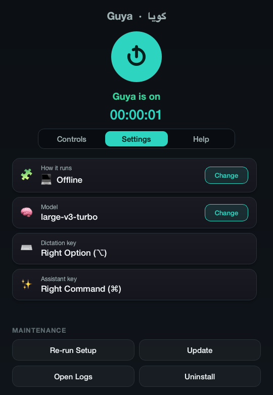

*Figure 5.1. The Settings tab: mode, model, online key and the two hotkeys, each with a Change button.*

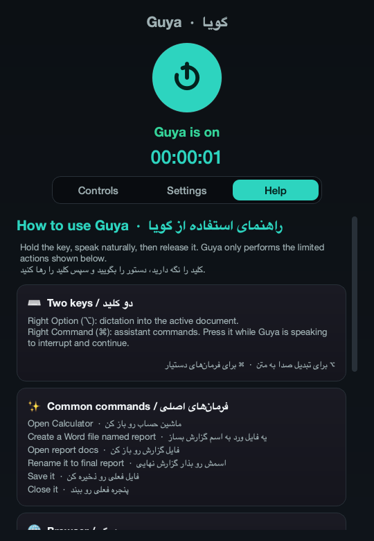

*Figure 5.2. The bilingual Help tab.*

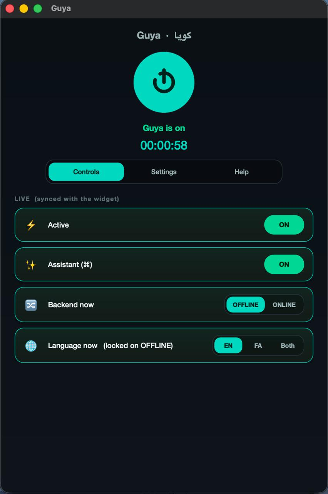

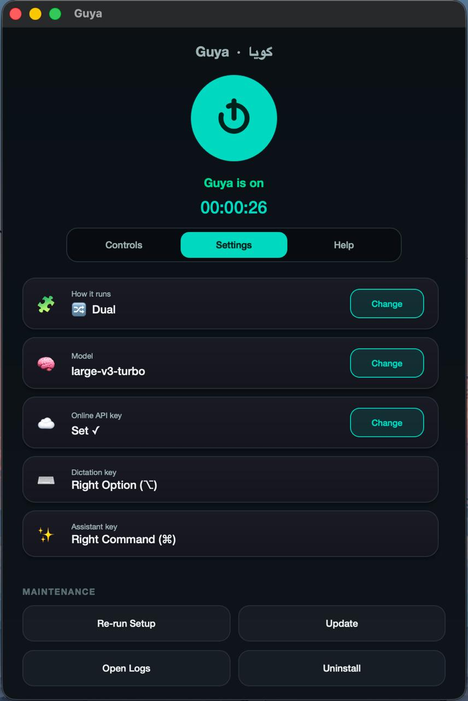

*Figure 5.3. The control panel in dual mode: the Controls tab with the live backend switch and the language locked while OFFLINE, and the Settings tab with the mode, model, online key and the two hotkeys.*

### 5.12 Installer, launcher and logging

`Install Guya.command` is the macOS installer. It looks for Python 3.10 to 3.12; if none is found, it installs Python 3.11 with Homebrew when Homebrew is present, and otherwise opens a short setup page and the python.org download. It installs PortAudio through Homebrew, creates the virtual environment under `~/.guya/runtime/venv`, installs the requirements, creates `Guya.app` through `launcher_gen`, and opens it. `install.sh` does the same without the interactive prompts and explanations, for use from a terminal, and `run.sh` starts Guya from whichever environment exists. `Install Guya.bat` mirrors the flow on Windows with `py` launcher detection, `winget` installation of Python if needed, and a retry of PyAudio through `pipwin`; it was used for the Windows run of Section 7.9 and needed no manual step.

`launcher_gen.create_launcher()` copies the package to `~/.guya/runtime/guya` (ignoring caches), records the checkout path in `runtime/origin`, copies the environment if the runtime has none, and writes the bundle: a four-line shell stub that changes into the runtime directory and runs `python -m guya` with its output appended to `launcher.log`, and an `Info.plist` with the bundle identifier `com.guya.app`, the microphone and folder usage descriptions, and no `LSUIElement`, so that the application keeps a normal Dock icon and the user can see it is running. The bundle is signed ad hoc and registered with Launch Services. On Windows the launcher is a `Start Guya.vbs` that starts `pythonw.exe` without a console.

Logging is set up once per process by `logsetup.setup_logging()`: one rotating file, 2 MiB with five backups, the format `time [level] pid=N message`, the noisy HTTP and hub loggers raised to warning level. This module was added in September because until then only the widget configured logging and every line from the panel and the wizard was lost.

### 5.13 Testing strategy

The tests are organised by layer and run with the standard `unittest` runner in about a quarter of a second, with no microphone, model, network or display:

```
$ python -m unittest discover -s tests -t .
Ran 136 tests in 0.227s
OK
```

Table 5.8 lists the files. Three kinds of test carry most of the safety requirements. **Fakes at the platform boundary**: the service tests run against a `FakeDesktopActions` that records what would have been opened or spoken, so a test can assert both that a file was created on disk (in a temporary directory) and that nothing was opened before "yes". **Absence assertions**: several tests assert that no side effect happened, which is where the safety requirements are pinned; for example that an unrecognised command runs no action, that a delete request changes nothing, and that a sequence with a disallowed step runs none of its steps. **Regression tests from real failures**: every parser, service and search defect found by the September code review and by the three manual test sessions became a test that reproduces the original phrasing, so that "open word file", «اسمشو بذار گزارش نهایی» and "shut down the computer" continue to be handled as intended: an open, a rename to «گزارش نهایی» and a refusal.

| File | Tests | What it pins |
|---|---:|---|
| `test_assistant_parser.py` | 15 | word variants, bilingual names, rename forms, selection words, sequences, and that every phrase-pack example maps to its own intent |
| `test_assistant_parser_robustness.py` | 19 | filler words, "new", spoken domains, Persian rename false positives, delete refusal, web search forms |
| `test_review_regressions.py` | 26 | every regression found by the review and the manual test sessions |
| `test_assistant_normalizer.py` | 5 | number and extension homophones, compound numbers, one-character candidates |
| `test_assistant_service.py` | 23 | confirmation, selection, context, sequences ordered and limited, several assert that no action happened |
| `test_assistant_service_pending.py` | 8 | non-modal questions, expiry, refusals |
| `test_assistant_actions.py` | 18 | the filesystem boundary, no-overwrite rename, DOCX generation, addressed keystrokes with the OS mocked, no Arabic voice for Persian |
| `test_platform_macos.py` | 3 | hotkey recognition (run on macOS only) |
| `test_benchmark.py` | 6 | calibration on the reference machine, per-language floor, monotonic recommendation |
| `test_eval_wer.py` | 13 | the scorer behind every accuracy number |

*Table 5.8. The test suite.*

The evaluation scripts double as tests of a different kind: the held-out intent evaluator runs in under a second and could be run in continuous integration, and `report_tables.py` re-scores every stored hypothesis with the current scorer each time it runs, so the tables in Chapter 7 and the raw result files cannot disagree.

### 5.14 Development history

The project was developed between June and September 2026 in four phases: the dictation widget and wizard (June), the assistant (July to August), the evaluation sprint (5 September) and the manual test sessions and report (9 to 13 September); Table 5.9 gives the milestones. The repository has 56 commits at the time of writing; most of the work was done in long sessions and committed when a milestone was reached.

| Period | Milestone | Commits |
|---|---|---|
| 5–6 June | M1 dictation widget with configuration; M2 setup wizard and device profile; M3 benchmark-based recommendation; M4 online fallback through Groq; dual mode with a backend switch on the widget; first fix of the paste target (stale frontmost application) | 17 |
| 20 June | project proposal in English and Persian; one-double-click installers for both platforms; easy and advanced wizard paths; Calm Teal theme and Vazirmatn fonts; `Guya.app` bundle; control panel with live two-way sync, tabs and logs; accuracy harness (WER, CER, RTF) | 17 |
| July | proposal approved; the assistant designed and written without intermediate commits (parser, service, actions for both platforms, phrase packs, first five test files, scope document, spoken evaluation checklist) | |
| 17 August | assistant version 1 committed: 31 files, 5,708 lines | 1 |
| 5 September | evaluation sprint: FLEURS test set, scorer rewrite, `stt.py` extraction, held-out intent set and evaluator, usage-log analyser; visible errors, reply bubble, safer targets, calibrated benchmark; filler-tolerant parser and non-modal questions; report chapters; systematic review of the day's changes; the defects it found were fixed, and the parser, service and search ones pinned by 13 regression tests; repetition penalty removed; final tables | 9 |
| 9–11 September | microphone error notice, orphan exit, single instance; three manual test sessions and their fixes (command-vocabulary prompt, Yes/No buttons, language switch by voice, Persian web search, colloquial numbers, browser inheritance, misheard choice words) | 5 |
| 13 September | report in the B.Sc. layout, HTML renderer, Persian report; rewrite as a full engineering report with requirements, architecture and implementation chapters, in both languages | 6 |
| 14 September | line-by-line review of both reports against the code and the result files; corrections and technical additions | 1 |

*Table 5.9. Development timeline.*

Three of the iterations led to changes in the design. The first was the discovery, in July, that a Finder-launched application could not read a virtual environment on the Desktop, which turned the June bundle into the runtime copy plus bundle of Section 4.10. The second was the first usage log, 41 of the author's own commands recorded before the September changes, which showed that not every failure was misrecognition: in six of 41 commands the captured target was Guya's own window rather than the user's application, and the author, the only user in that log, moved on from unanswered questions instead of answering them. That led to the non-modal question design of Section 4.5 and the target fallback of Section 5.9. The third was the September evaluation, which tested several assumptions by measurement and reversed two of them: the repetition penalty raised the error rate, and the benchmark, run on synthetic noise, was timing decoder retries rather than the device. The measurements behind both reversals are in Chapter 7.

The proposal itself changed once. The first draft, written in June 2026 and kept in `docs/archive/`, described a dictation-only project with a four-week timeline. The proposal approved in July 2026 (`docs/PROPOSAL.md`) added the assistant and the five objectives of Table 1.1, and listed as excluded everything in Section 3.8. Its expected outputs were a runnable application with installers for macOS and Windows, both modes on separate keys, the wizard, control panel, widget, spoken feedback, help and logs, automated tests, structured user-evaluation results, documented limitations, this report, and a repeatable demonstration.

### 5.15 Course concepts applied

Guya is an application project, and most of its components apply material from the computer engineering curriculum. Table 5.10 lists the concepts used, with the section where each appears, so that the connection between the coursework and the code is explicit.

| Course area | Concept | Where it is used in Guya |
|---|---|---|
| Operating systems | processes and child processes; inter-process communication; threads and a lock-protected buffer; lock files for mutual exclusion; the platform permission model | the panel–widget split and its file-based IPC with sequence numbers (4.2); the recorder thread and the Qt worker threads (5.3); `widget.lock` and `control-panel.lock`; the macOS privacy controls that forced the runtime copy (4.10) |
| Computer architecture and performance | CPU-bound inference; 8-bit quantisation; using all cores; measuring with warm-up and best-of-n; real-time factor as a throughput measure | CTranslate2 int8 on the CPU (2.2); the benchmark's warm-up pass and best of two runs (5.10); the cost-ratio calibration (7.4) |
| Algorithms and data structures | edit distance by dynamic programming; sequence similarity; ranking with tie-breaks; bounded tree traversal | WER and CER (2.3, `eval/wer.py`); the filename match scale and the fuzzy fallbacks built on `SequenceMatcher` (5.5, 5.6); result ranking with a recency bonus (5.7); the depth- and count-bounded search walk (5.8) |
| Formal languages and automata | regular expressions as a grammar; tokenisation and normalisation; an ordered rule chain as a priority grammar; finite state machines | the parser's 18 rules and their slot extractors (5.6); the normaliser (5.5); the pending-question and pill state machines (4.5, 4.8) |
| Artificial intelligence and machine learning | encoder–decoder transformers; language and task tokens; beam search and temperature sampling; prompts as prior context; a small neural voice activity detector; evaluation with a held-out set, ablation and corpus-level metrics | Whisper through faster-whisper (2.1); the decoding settings (5.4); the Silero VAD (2.5); the whole of chapter 7 |
| Signal processing | sampling at 16 kHz, 16-bit mono PCM; RMS level and gain with clipping; the log-mel spectrogram front end | audio capture (5.3); loudness normalisation (5.4); Whisper's input (2.1) |
| Software engineering | requirements with identifiers and traceability; layered architecture with one-way dependencies; fakes at the boundary and absence assertions; regression tests from real failures; configuration merging; logging designed for diagnosis; version control history | chapter 3; 4.1; 5.13; 4.10; 4.11; 5.14 |
| Programming languages and systems programming | foreign-function calls into the Win32 API through `ctypes`; the Objective-C bridge for macOS APIs; writing a file format from its specification with the standard library | the Windows adapter (5.8); PyObjC and Quartz key events (5.8); the three-part DOCX package (5.8) |
| Computer networks | HTTP multipart upload; timeouts and error classes; API keys and their protection | the online backend (5.4); the owner-only configuration file (4.10) |
| Human–computer interaction | push-to-talk against wake words; feedback states that pair colour with text; target size; non-modal questions; the System Usability Scale | 2.7; 4.8; 4.5; Appendix D |
| Security | allow-lists over free text; path containment with symbolic-link resolution; no shell execution from spoken text; least privilege | the safety model (4.7) |

*Table 5.10. Concepts from the curriculum and where they are applied.*

Two of these had a larger effect on the project than the table shows. The evaluation methodology of Chapter 7 (a fixed held-out set, one variable changed at a time, corpus-level metrics with the same normalisation on both sides) was the part of the coursework that changed the project most, for the two reversals described at the end of Section 5.14. The operating-systems material mattered more than expected in a desktop application: the two hardest bugs of the term, the orphaned widget that kept the microphone open and the Finder-launched application that could not read its own virtual environment, were both process-model and permission problems.

---
## 6. User guide

This chapter is written for the person who will use Guya, or the family member who installs it for them. It repeats nothing from the design chapters and can be read on its own.

### 6.1 Installing

Download or clone the project folder, then double-click the installer: `Install Guya.command` on macOS (the first time, right-click it and choose Open, because it is not from the App Store), or `Install Guya.bat` on Windows. The installer finds Python, or helps you install it, prepares everything, and opens the setup wizard. On macOS the first run asks for two permissions, Microphone and Accessibility; both are needed, the first to hear you and the second to press keys on your behalf. Nothing is sent anywhere: the speech model is downloaded once (about 1.5 GB for the recommended model) and after that Guya works without internet.

### 6.2 First run: the setup wizard

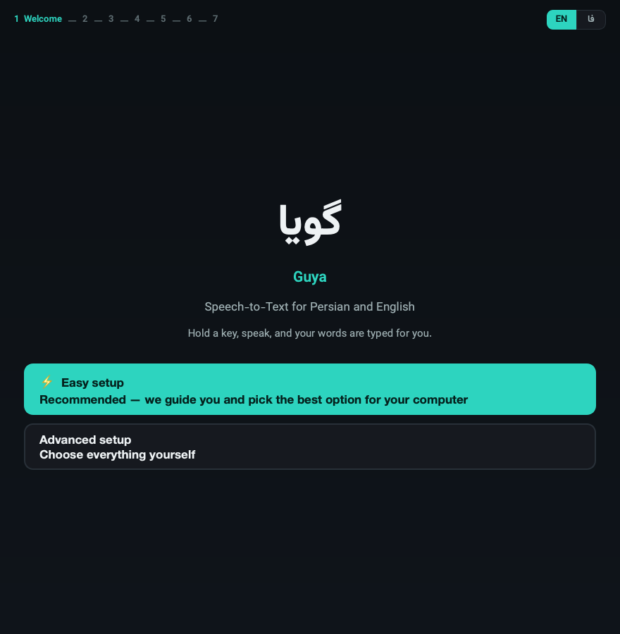

*Figure 6.1. Wizard welcome.*

The wizard asks three things. The first is which languages you speak (Persian, English, or both); this decides which speech models are acceptable. Then it measures your computer for a few seconds and recommends how to run: offline with a model that keeps up with your voice, online through a free service if the computer is too slow for the model Persian needs, or both. Then it shows what it chose and a button to install. Easy mode does all of this on one page with a Change button next to each choice; Advanced mode walks through the same choices one page at a time.

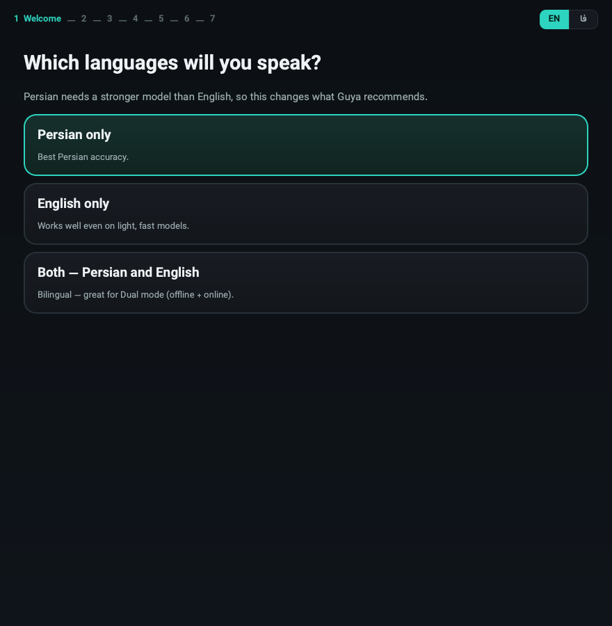

*Figure 6.2. Wizard language choice.*

At the end the wizard creates a `Guya` launcher (Guya.app on macOS, Start Guya on Windows). From then on, that launcher is the only thing you need to open.

### 6.3 Daily use

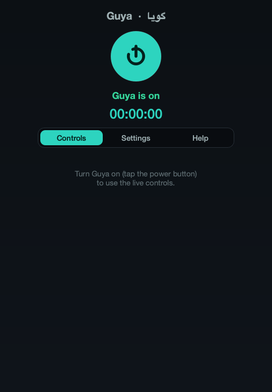

*Figure 6.3. Control panel.*

Double-click Guya. The control panel opens and turns Guya on; a small round pill appears at the top of the screen. The pill shows Guya's state: grey when idle, solid red while listening, blue while thinking, green when done, amber when it has a question, and a red tint when something failed. The two-letter badge on it (FA, EN or DUAL) is the language it is listening for; click it to change, or say a language command (Section 6.7).

You can close the control panel window only by turning Guya off; while Guya is on, keep the panel open or minimised.

### 6.4 Dictation

Hold **Right Option (⌥)** on macOS, or **G** on Windows, speak, and release. While you speak, the pill shows the words it has heard so far; when you release, the whole sentence is written into whatever program is in front, wherever the cursor is. Speak naturally in whole sentences; the model is better on a full sentence than on single words. If the text does not appear, it is on the clipboard: press ⌘V (Ctrl+V on Windows). This happens when Guya's own window is in front, and the pill says so.

### 6.5 Commands

Hold **Right Command (⌘)** on macOS, or **F8** on Windows, say one command, release. Guya answers on the pill and, if the answer is long or a question, in a bubble under it. English answers are also spoken; Persian answers are only shown, because macOS has no Persian voice.

| You want to | Say (English) | بگویید (فارسی) |
|---|---|---|
| create a Word file | Create a Word file named report | یه فایل ورد به اسم گزارش بساز |
| create a text file or folder | Make a text file called notes · Create a folder named photos | یه فایل متنی به اسم یادداشت بساز · یه پوشه به اسم عکس‌ها بساز |
| open a program | Open the calculator · Open Chrome | ماشین حساب رو باز کن · کروم رو باز کن |
| find a file or folder | Find my report file · Where is the photos folder | فایل گزارش رو پیدا کن · پوشه عکس‌ها کجاست |
| open a file by name | Open test six docs | فایل تست شش ورد رو باز کن |
| open the last thing again | Open it again | دوباره بازش کن |
| rename (Guya asks first) | Rename it to final report | اسمش رو بذار گزارش نهایی |
| save or close the current window | Save it · Close it | ذخیره کن · پنجره رو ببند |
| open a website | Go to YouTube · Visit github.com | برو به سایت یوتیوب |
| search the web | Search for the weather on Chrome | توی گوگل سرچ کن هوای تهران |
| two steps at once | Open Chrome, then search for YouTube | کروم رو باز کن بعد یوتیوب رو جستجو کن |
| move in the browser | Scroll down · Go back · Go to the top | یه کم برو پایین · برگرد · برو اول صفحه |
| change the language | Switch to Persian · Switch to dual | برو انگلیسی · دو زبانه |

*Table 6.1. Quick reference of spoken commands.*

Filler words are fine ("let's scroll down a bit", «لطفاً یه کم برو پایین»). Numbers in names may be spoken («تست شش», "test six") and the file's real extension does not need to be said correctly; "docs" and «دکس» both mean `.docx`.

### 6.6 Questions and choices

After creating something, Guya asks whether to open it. Answer by voice (yes / no, بله / نه) or click the Yes / No buttons in the bubble. Before renaming, it asks the same way and shows the exact new name; nothing is renamed until you say yes. If a name matches several files, up to three choices appear on screen: click one, or say first / second / third (اول / دوم / سوم), or cancel (لغو). You can also just give a different command; the question goes away. A question that is not answered within two minutes expires by itself.

### 6.7 Languages and modes

The badge decides which language Guya listens for. FA and EN fix the language and are the most accurate; DUAL lets the model detect the language sentence by sentence and is a little slower. To switch by voice, say the command in the language currently set: *switch to Persian* while on EN, «برو انگلیسی» while on FA, and *dual* or «دو زبانه» for both. The control panel's Settings tab changes the model and the running mode (offline, online, both); those changes restart Guya.

### 6.8 What Guya will not do

It only looks inside Desktop, Documents and Downloads. It does not delete or overwrite files, run commands, click inside web pages, download anything, or automate Save As. If you ask for one of those it says so. Browser commands only work when the browser is the program in front.

### 6.9 If something goes wrong

- *"Too short"*: hold the key while you speak, release after the last word.
- *"Nothing heard"*: the microphone heard silence; check the input device in System Settings.
- *"Microphone error"*: usually a second copy of Guya is running; quit both and start once. It also happens after sleep on some Macs; restarting Guya fixes it.
- *"Focus a supported browser"*: click inside the browser page first.
- *A command is misunderstood*: the pill shows the words Guya heard. Say the sentence again in one breath; short single words are the hardest for the model.
- *Everything else*: the control panel's Open Logs button shows `~/.guya/logs/guya.log`; every command is one line there with what was heard and what happened. Sending that file with a bug report is the fastest way to get it fixed.

### 6.10 Removing Guya

The Uninstall button in Settings removes the settings, the logs, the downloaded models and the launcher, and leaves the project folder. Re-run Setup starts the wizard again without removing anything.

---
## 7. Evaluation

Every number in this chapter was produced by a script in `eval/` from data that is either in the repository or downloadable by anyone; Appendix A gives the exact commands, and `report_tables.py` regenerates every table from the stored per-clip results with the current scorer, so the tables and the raw files cannot drift apart. Speech results are corpus-level word error rate (WER) and character error rate (CER); the real-time factor (RTF) is transcription time divided by audio length. All timing was done on an otherwise idle Apple M1 Pro (10 cores, 16 GB) with 8-bit weights on the CPU, which is the machine Guya is used on every day.

### 7.1 Data and method

**Speech.** Google FLEURS [4] is read speech of Wikipedia sentences recorded by native speakers, with human transcripts; it was chosen because it is the only Persian speech corpus the author found that can be downloaded without an account, so anyone assessing this report can rerun the evaluation. `eval/import_fleurs.py` samples 60 Persian and 60 English clips from the development split with a fixed seed (7), one clip per sentence so that no sentence is counted twice: 14.8 minutes of Persian (1,355 words after normalisation) and 9.4 minutes of English (1,211 words). The Persian sentences are long (median 23 words, 14.7 s), formal, and full of numbers and proper names; this is harder than the short colloquial commands Guya is built for, and the absolute Persian error rates should be read with that in mind. Ten clean English sentences from the macOS speech synthesiser were also kept as a smoke test of the pipeline; they are too easy to rank models and are not used below.

**Commands.** `eval/data/intents.jsonl` holds 267 Persian and English command phrasings (139 English, 128 Persian), written to be natural rather than to match the parser, each labelled with the intended intent and arguments. The last ten are taken verbatim from the manual test sessions of Section 7.8. The evaluator computes which rows coincide with one of the parser's own example phrases (46, after the yes/no vocabulary was widened) and reports them separately, so the headline number is on the 221 phrasings the parser had never seen (120 English, 101 Persian).

**Real use.** Every assistant command Guya processes writes one JSON record to the log (Table 4.6). At the time of the audit the log held 41 commands from four sessions of the author's own use in July and August; that snapshot is analysed in Section 7.6. At the time of writing the log holds 165 records; only the audited snapshot is analysed here.

**Machine and settings.** All speech measurements use faster-whisper 1.2.1 with int8 weights on the CPU. "Stock" means the library defaults with a beam of 5; "Guya pipeline" means the exact code of `stt.py` as the widget runs it.

### 7.2 Which model size does Persian need?

| Model | FA WER | FA CER | EN WER | EN CER | FA RTF | EN RTF |
|---|---:|---:|---:|---:|---:|---:|
| tiny | 92.5% | 37.7% | 13.4% | 6.1% | 0.11 | 0.03 |
| base | 84.1% | 30.8% | 7.8% | 3.7% | 0.07 | 0.05 |
| small | 56.6% | 16.7% | 6.0% | 2.6% | 0.18 | 0.14 |
| medium | 39.6% | 9.8% | 5.0% | 2.2% | 0.42 | 0.36 |
| large-v3-turbo | 28.9% | 6.0% | 4.0% | 1.9% | 0.29 | 0.35 |
| large-v3 | 28.2% | 5.8% | 4.8% | 2.2% | 0.72 | 0.57 |

*Table 7.1. Stock faster-whisper decoding (beam 5), FLEURS dev, 60 + 60 clips. RTF from a separate pass on the idle machine over 12 + 12 clips.*

Three results follow from Table 7.1.

**The two languages need different model sizes.** English at `small` is already a solved problem for this purpose: 6% WER on read Wikipedia sentences, and 32 of the 60 clips are transcribed with no error at all. Persian needs a much larger model. The three smaller models are unusable for Persian (more than one word in two wrong), `medium` is marginal, and only the two large models bring Persian under 30% WER. Persian WER is about seven times the English figure at the large end and nine times at `small`. This is the measurement behind the per-language accuracy floor in the wizard: English may run on `small`, but Persian must not be offered anything below `large-v3-turbo`. That rule was a constant in the code from the first prototype; it is now a measured rule with a test.

**`large-v3-turbo` is the right default.** It matches `large-v3` on Persian (28.9% against 28.2%, a difference of nine words in 1,355), beats it on English, and runs in less than half the time (RTF 0.32 against 0.66, Table 7.4). There is no reason to ship `large-v3` on a CPU.

**Persian CER is much lower than Persian WER**, 6% against 29% for the shipped model, because a large share of the word errors are spacing conventions rather than misheard words: «می‌کند» written as «می کند», «کنترل کننده‌های» written as «کنترل کننده های». The scorer deliberately does not unify these, because the user has to correct them by hand; but they are a different kind of error from the substitutions in the worst clips (technical vocabulary such as «ردیابی» heard as «رجابی», numbers, foreign names), and a Persian reader sees the text as mostly right. The spread across clips is wide. With `large-v3-turbo`, the median Persian clip has 25.7% WER; six of the sixty clips are at or under 10%, one is perfect, five are at or over 50%, and the worst is 71%. English is tighter: 40 of the 60 clips are perfect and 52 are at or under 10%.

### 7.3 Does Guya's own pipeline help or hurt?

The widget does not call the model with stock settings. Over months of use it had accumulated loudness normalisation, a VAD tuned for quiet speech, a vocabulary prompt per language, a repetition penalty of 1.2 against Whisper's habit of looping, a stricter no-speech threshold, and three Persian post-processing stages (Section 5.4). None of these had ever been measured. Extracting the pipeline into `stt.py` made it possible to run exactly the production code over the test set and then switch each setting back to the library default one at a time.

| `small` | FA WER | FA CER | EN WER | EN CER |
|---|---:|---:|---:|---:|
| stock faster-whisper | 56.6% | 16.7% | 6.0% | 2.6% |
| Guya pipeline, all settings | 63.2% | 21.6% | 15.6% | 11.0% |
| minus the repetition penalty | 57.3% | 17.5% | 6.0% | 2.5% |
| minus the VAD | 62.3% | 21.3% | 12.2% | 7.0% |
| minus the vocabulary prompt | 63.7% | 20.6% | 16.9% | 12.7% |
| minus Persian post-processing | 62.4% | 20.6% | 15.6% | 11.0% |
| minus the stricter no-speech threshold | 62.6% | 20.7% | 15.6% | 11.0% |
| minus loudness normalisation | 64.3% | 22.1% | 16.4% | 12.2% |
| minus the no-conditioning rule for short clips | 62.6% | 20.7% | 15.6% | 11.0% |

*Table 7.2. The production pipeline on `small`, and each setting switched back to stock in turn.*

The production pipeline made `small` two and a half times worse on English (6.0% to 15.6%) and 6.6 points worse on Persian (56.6% to 63.2%), and Table 7.2 says why: almost all of the loss is the repetition penalty. Removing that one setting restores stock accuracy on English exactly and recovers nearly all of the Persian loss. The worst clips show the mechanism. The penalty, which lowers the score of every token already generated, pushes the decoder to end the sentence early rather than repeat a common word such as "the" or "of":

- *reference:* Next, some saddles, particularly English saddles, have safety bars that allow a stirrup leather to fall off the saddle if pulled backwards by a falling rider.
- *with the penalty:* Next, some saddles particularly English saddles have safety bars that allow a stirrup leather
- *without it:* Next, some saddles, particularly English saddles, have safety bars that allow a stirrup leather to fall off the saddle if pulled backwards by a falling rider.

The VAD costs another three to four points of English on `small`, because splitting a sentence into segments loses context at every cut; removing the prompt, the post-processing or the no-speech threshold changes the result by at most 1.3 points, which is within noise on 60 clips. Persian post-processing is expected to add errors on this set, because it deliberately rewrites formal verb forms into the colloquial forms a speaker uses («می‌خواهم» to «میخوام») and FLEURS is formal text; the cost is under one point.

| `large-v3-turbo` | FA WER | FA CER | EN WER | EN CER |
|---|---:|---:|---:|---:|
| stock faster-whisper | 28.9% | 6.0% | 4.0% | 1.9% |
| Guya pipeline, all settings | 29.2% | 6.3% | 4.1% | 2.0% |
| minus the repetition penalty | 27.1% | 6.6% | 3.9% | 1.8% |
| minus the VAD | 29.7% | 7.2% | 4.4% | 2.0% |
| minus the vocabulary prompt | 29.7% | 6.8% | 4.0% | 1.9% |
| minus Persian post-processing | 28.3% | 6.4% | 4.1% | 2.0% |

*Table 7.3. The same on the shipped model.*

On the shipped model the whole pipeline is within a few words of stock, so the damage from the penalty is specific to the smaller model, which is less certain about each token and gives up sooner. Even on the shipped model, though, the row without the penalty is the best in the table (27.1% Persian, 3.9% English), better than stock decoding. As a result, the repetition penalty is now off (1.0). Protection against Whisper's repetition loops falls to the hallucination filter, which drops a segment dominated by one repeated word, and to the rule that short recordings are decoded without conditioning on previous text; both are kept. The other settings stay, because they cost nothing measurable on the shipped model and exist for situations this test set does not contain (weak microphones, specialised vocabulary, colloquial Persian).

### 7.4 Calibrating the device benchmark

The wizard predicts each model's speed from one measurement of `tiny`. Table 7.4 gives the measured cost of every model relative to `tiny` on the idle machine; these ratios replaced the estimated table in `benchmark.py`.

| Model | RTF (idle) | ratio to `tiny` | previous estimate |
|---|---:|---:|---:|
| tiny | 0.08 | 1.0 | 1.0 |
| base | 0.06 | 0.8 | 2.0 |
| small | 0.16 | 2.1 | 5.2 |
| medium | 0.40 | 5.0 | 14.0 |
| large-v3-turbo | 0.32 | 4.0 | 8.0 |
| large-v3 | 0.66 | 8.4 | 28.0 |

*Table 7.4. Measured cost ratios. `base` is slightly faster than `tiny` because `tiny` fails Whisper's quality checks more often and retries at higher temperatures. The wizard's table now holds these measured values (Guya's own pipeline for `small` and `large-v3-turbo`, stock decoding for the rest) divided by the reference probe measurement of 0.040, so a machine whose probe comes out twice the reference is predicted to run every model twice as slowly.*

The estimates were pessimistic by a factor of two to three, and the probe behind them was less reliable still: it timed `tiny` on synthetic noise, on which Whisper fails its own compression-ratio check and retries at every temperature. Three runs on the same idle machine gave RTF 0.34, 0.48 and 0.69, and all three told this machine, which runs `large-v3-turbo` at 0.32, to use the online model for every language. The benchmark now times a bundled seven-second speech clip with temperature fallback off, takes the best of two runs, and gives 0.040 on this machine (three runs: 0.0398, 0.040, 0.040); with the ratios of Table 7.4 it predicts `large-v3-turbo` at 0.33 and recommends it, which matches the measured 0.32. The recommendation rule also changed from two latency tiers, which were non-monotonic (a slightly slower machine could be told to run a bigger model), to a single threshold of 1.0.

### 7.5 Does the command parser generalise?

| Parser | phrasings | intent correct | intent and arguments | English | Persian | browser navigation |
|---|---:|---:|---:|---:|---:|---:|
| before this work | 221 | 69.2% | 66.1% | 65.8% | 73.3% | 42.3% |
| after | 221 | 100.0% | 100.0% | 100.0% | 100.0% | 100.0% |

*Table 7.5. Unseen phrasings, `eval/intent_accuracy.py`. The 46 phrasings that coincide with the parser's own examples are excluded from both rows.*

The unit tests had always said the parser was fine, because they tested its example phrases against themselves. The unseen set said otherwise. Of the 75 failures before the change, 46 were browser navigation: "let's scroll down", "again, scroll down", «یه کم برو پایین» all failed outright, because navigation was matched with a regular expression over the whole sentence. The rest were spread over search (5), web search (5), open file (3), rename (3), open website (3) and a few others. Browser navigation went from 42% to 100% after filler words were stripped from the edges of the sentence and a keyword fallback was added. That fallback needed a second round of its own: its first version fired on any short sentence with a direction word, so "shut down the computer" scrolled the page and "back up my thesis" went back a page; it now requires a movement word as well as a direction and refuses anything that names a file, folder, application, window or tab. The remaining fixes were individually small and each came from one failing row: "new" was a create verb, so "open the new folder" *created* a folder; "note app" looked like the domain `note.app`; the word «نامه» contains «نام», so «سند پایان نامه رو باز کن» was a rename; «ماشین حساب» on its own was nothing; "delete the report" fuzzy-matched to a file search, and now is refused with a sentence that says so.

A perfect score on a set written by the parser's author shows that the parser covers the phrasings one person could think of; it says little about the phrasings nobody thought of. The real-use log is the check on that (Section 7.6), and the code review of Section 7.7 found five further regressions that this set had not caught.

When the 13 misunderstood transcripts from the usage log are re-run through the new parser, 9 of them parse to the intended action. Of the other four, two are Persian transcripts that are misheard beyond repair («برگیار داکات»), and two are "Let's cool down", which is what Whisper made of "let's scroll down": the parser is deliberately not so lenient as to scroll on "cool down", because the same leniency is what made "shut down the computer" scroll.

### 7.6 Real use

The 41 logged commands are a small and biased sample: the author's own commands, almost all in English (39 of 41), and mostly browser commands because that feature was being tested at the time. They still say two things clearly.

| Outcome (41 commands) | Share |
|---|---:|
| action completed | 51% |
| not understood | 27% |
| understood but failed (wrong window in front, nothing found) | 15% |
| the assistant asked a question | 5% |
| cancelled | 2% |

*Table 7.6. Outcomes in the usage log.*

Most of the failures (the 27% not understood, eleven commands) were the parser's, and Section 7.5 removes almost all of them. The rest were one specific interaction bug: after a click on the pill or a result button, Guya itself was the frontmost application, so the next command was addressed to Guya and refused; six of the 41 commands hit this, and the widget now falls back to the last real target.

Latency is almost entirely the speech model. The median utterance was 1.9 s; median recognition 2,762 ms; median parse and act 30 ms; 97% of the time between key release and reply is Whisper. The real-time factor in use was 1.44, worse than the 0.32 measured in isolation, because the widget was re-transcribing the whole buffer every two seconds for the partial text and the final pass had to wait behind it; the partial pass is now limited to the last eight seconds. That the recommender could suggest a model which then fell behind real time in use is the reason the recommendation threshold is now 1.0 rather than 2.0.

### 7.7 Review of the September changes

The parser and widget changes of 5 September were reviewed line by line the same day, with every suspected defect reproduced before it was counted. The review found defects in six groups; Table 7.7 lists them by kind.

| Group | Examples |
|---|---|
| rule precedence | "open word file" opened the last remembered folder instead of Word; "Okay, new folder" was not a creation |
| whole-word guards | the guard that stopped «نامه» from being a rename also stopped the spoken contraction «اسمشو» |
| navigation fallback firing too widely | "shut down the computer", "back up my thesis", "look up the weather" scrolled or went back |
| search pruning | a list meant to hide `node_modules` also hid any folder the user had named `build` or `out` |
| evaluation harness | the ablation switch for one setting flipped it the wrong way; eight rows of the held-out set coincided with the parser's own example phrases without being flagged |
| pending questions | a fresh command while a name was awaited was taken as the name; extra words after a spoken "no" («نه اسمش رو عوض نکن») were not recognised as a refusal |

*Table 7.7. Defects confirmed by the review, by group.*

Every one of them was reproduced and fixed before the numbers above were regenerated; the parser, service and search defects were pinned by 13 regression tests in `tests/test_review_regressions.py`, and the widget, panel and evaluation-script defects were checked by re-running the affected measurement. The held-out set had been written by the same person who wrote the parser, so it shared his blind spots; the review did not, and that is the main argument for keeping both kinds of check.

### 7.8 Manual test sessions

After the evaluation sprint, manual testing was done on the development machine: a first run on 9 September and three task sessions on 11 September, each with a short list of spoken tasks in both languages. Each session produced observations that became code changes the same day (Table 7.8). The sessions are the reason for several details of Chapter 5 that would otherwise look arbitrary.

| Session | Observation | Cause found in the log | Change |
|---|---|---|---|
| 9 Sept | nothing happened on the hotkey; the pill said "I did not understand" | two widget processes were running (one left over from a screenshot script); both had opened the microphone and PortAudio failed for both with error −9986 | single-instance lock; widget exits when the panel dies; a "Microphone error" notice instead of "too short" |
| 1 | «بازش کن» after a file was created did nothing; «بله» was refused | Whisper transcribed the two-word command as «بازشگو» and the answer as «بیلی»; the dictation vocabulary prompt does not help on short commands | a command-vocabulary prompt for assistant recordings and an answer-only prompt while a question is pending; fuzzy acceptance of one-word answers at similarity 0.75; Yes/No buttons in the bubble |
| 1 | the user asked to switch languages by voice | (feature request) | `set_language` intent in both languages; the reply is given in the new language |
| 2 | Persian web search worked worse than English | Persian puts the query after the verb («توی گوگل سرچ کن مدل مو») and the grammar expected it before; «سرچ» was heard as «سیرچ» and «سیچ» | five verb-first Persian search patterns; the misheard forms added to the search verbs; «X رو گوگل کن» |
| 2 | «آزمون شیش» did not find `آزمون شیش.docx` and «ورد پنج» found nothing | the colloquial numbers were not in the spoken-number table; a query consisting of one digit was rejected as too short | colloquial Persian numbers added; single-digit queries allowed |
| 3 | "open Chrome and search for the weather" searched in Safari | the second step of the sequence carried no browser | a search step inherits the browser opened by the previous step |
| 3 | «اول» did not choose the first result; «یک» did | Whisper wrote «عوال» and «آبال» | fuzzy choice words at similarity 0.5 with a 0.1 margin, used only while a list is pending |

*Table 7.8. Manual test sessions and the changes they produced.*

Each change is pinned by a test, and the ten phrasings from these sessions were added to the held-out set. The sessions show one pattern: the recogniser coped with long speech, and most failures were on short Persian words at the edges of the interaction (answers and choice words), where the fix was to tell the recogniser what to expect at those moments.

### 7.9 The Windows run and the session with the target user

**Windows.** At the end of the term the family's Windows laptop became available: an ASUS ROG G513RM with a Ryzen 7 6800H processor, 16 GB of memory and an RTX 3060 graphics card. The one-double-click installer and the wizard ran without help, the wizard recommended the same model as on the Mac, `large-v3-turbo`, and dictation and the assistant behaved as described for macOS in the chapters above. No accuracy or timing measurements were taken on that machine; the run confirms that the adapter of Section 5.8, which until then had only been unit-tested with the operating system mocked, works on the platform it was written for.

**The target user.** The author's brother, the person the project was built for, then went through the twelve-task protocol of Appendix D on that laptop in September 2026, with the author observing and recording the outcome of each task by hand. Table 7.9 gives the outcomes; the raw answers are in `eval/results/user_study/session-2026-09.json`.

| Task | Outcome |
|---|---|
| 1–6: dictate a given sentence, dictate freely, type the sentence for comparison, create «تمرین», leave it closed, find «نامه» and choose the older one | done |
| 7: rename it to «نامه اول» and confirm | done in two steps; he found the confirmation exchange a little complicated |
| 8–9: open and close the calculator | done |
| 10: in Chrome, go to YouTube, scroll down, go back | done after one command was repeated once |
| 11–12: open the «عکس» folder with the mouse, then by voice | done |

*Table 7.9. Task outcomes in the session with the target user.*

All twelve tasks were completed without help; two needed a second attempt. Times were not recorded, and the ten sentences of `eval/record.py` were not recorded, so there is still no accuracy figure on his voice.

His answers to the ten System Usability Scale statements were 4, 1, 5, 2, 4, 1, 4, 1, 3, 2, which score 82.5 out of 100; 68 is the average for software in general [8]. His answers to the three open questions, in his own words (spelling normalised):

- *What helped most:* «اینکه خیلی سریع‌تر می‌تونم متن‌های یک‌مقدار بلندی که دارم رو بنویسم و کارهام سریع‌تر جلو می‌ره، و استفاده ازش هم آسون بود و بدون کمک به بقیه می‌تونستم متن‌هام رو بنویسم، و اینکه توی هر برنامه‌ای هم کار می‌کرد خیلی خوب بود. اگر لازم نبود خودم روی جایی که می‌خوام متن بنویسم کلیک نکنم و خودش می‌فهمید بهتر هم می‌شد.» (That I can write my longer texts much faster and my work moves faster; that it was easy to use and I could write my texts without help from anyone; and that it worked in every application. It would be even better if I did not have to click where I want to write and it understood that on its own.)
- *What was most annoying:* «اینکه توی ساخت فایل و کارهایی که دستیار برام می‌کرد وقتی اشتباه داشتم به فارسی برام نمی‌خوند که مشکل چیه و متنی که نوشته بود هم زود می‌رفت و برای منی که نمی‌تونم خیلی سریع بخونم سخت بود ببینم مشکل چیه، و توی دیکته هم بعضی موارد وقتی خیلی صحبت می‌کردم طول می‌کشید تا تایپ کنه برام و توی حالت آفلاین به لپ‌تاپ فشار می‌اومد یکم.» (When I made a mistake in creating a file or in the things the assistant did for me, it did not read out in Persian what the problem was, and the text it showed went away quickly; for me, who cannot read very fast, it was hard to see what the problem was. In dictation, when I spoke for a long time it sometimes took a while to type it, and in offline mode the laptop was under some load.)
- *One thing to change:* «دوست داشتم بتونم ازش روی گوشی هم استفاده کنم.» (I would have liked to use it on my phone too.)

Three of his points map directly onto items of Section 9.2: a Persian voice for the assistant's replies, a longer or adjustable display time for replies, and lower latency and load on long offline dictations. The wish not to have to click into the text field is discussed there as well.

**What was not measured.** This was one session with one user, observed by the author; it shows that he could complete the tasks and how he rated the system, not how accurate the recogniser is on his voice. The dual mode (offline English plus online Persian) and the online model were not measured, because scoring them means uploading the test audio to a third party.

### 7.10 Summary against the objectives

| Objective | Status | Evidence |
|---|---|---|
| O1 Persian and English dictation | met on macOS and Windows | Table 7.1; daily use since June; Section 7.9 |
| O2 bilingual assistant with the listed actions | met | Appendix B; Tables 7.5 and 7.8 |
| O3 predictable, safe behaviour | met | Table 4.3; absence tests in Section 5.13 |
| O4 offline, online and dual modes with a measured recommendation | met; online and dual modes unmeasured | Section 7.4 |
| O5 evaluation of accuracy, response time, task success, safety and usability | accuracy, response time and safety measured; task success and usability measured in one session with the target user (twelve of twelve tasks, SUS 82.5) | Sections 7.2 to 7.9 |

*Table 7.10. Objectives and their status.*

---
## 8. Discussion

### 8.1 What the measurements say about the design

The central design bet was that a fully local, zero-cost Persian dictation tool is possible on a normal laptop. Table 7.1 supports this, with one condition. It needs the large turbo model and a machine that runs it at about a third of real time, and it delivers Persian text with a character error rate of about 6% that still needs spacing corrections. English is far easier and would run on any machine. That asymmetry is the reason the wizard exists, and Section 7.4 is the first time its recommendation has been calibrated against measured results rather than estimated.

The second bet was a rule-based assistant. Section 7.5 gives the full picture. Tested against its own example phrasings, it scored 100%. Against phrasings written to resemble what other people would say, it understood 69.2% of commands. After a day of work driven by a held-out test set, it understands almost all of them, and the safety argument of Section 4.7 still holds, because nothing in the parser can produce an action that is not on the list. A language model would have coped with the filler words without this work, but it could not guarantee that only the listed actions are reachable, and it would not run locally at no cost.

The third bet, that the tool could be installed and used by a family without help, has one data point: the installer and the wizard ran on the family's Windows laptop without help, and the target user completed all twelve tasks of the protocol and rated the system 82.5 on the usability scale (Section 7.9). The installer, the wizard and the launcher each exist because of a specific failure met during the term (a Finder-launched application denied access to its own Python environment, a benchmark that told a fast machine to go online, a Persian question cut to three words), and that each failure is now covered by code and, where possible, by a test.

### 8.2 The effect of tuning without measurement

The most instructive result of the project is Table 7.2. Every setting in the speech pipeline had a reason, and each had been added after a real problem in daily use. Together they made the small model markedly worse, and one of them, the repetition penalty, was silently truncating sentences. None of this was visible in use, because the shipped model happens to be insensitive to it and because a truncated dictation looks like a mumbled ending. It only became visible when the exact production code was run on a fixed test set with each setting switched off in turn. The settings were not wrong in intent. But none of their effects had been measured, and the ablation harness that makes such a measurement cheap has proved more valuable than any single setting.

The same applies to the parser work. After the changes had reached 100% on the held-out set, the review of Section 7.7 found further defects in the same day's work, including phrasings that had worked before the changes and no longer did. Every one of them was reproduced and pinned by a test before the numbers were regenerated. The held-out set and the review found different things, which is the reason both are kept.

### 8.3 The Persian voice

Guya speaks its English replies and shows its Persian ones. This is a constraint of the platform rather than a design choice: macOS has no Persian voice, and Persian read by the single Arabic voice is not intelligible to a Persian speaker. The problem this caused was found during the audit rather than in daily use. The pill's label holds about thirty characters, so a Persian confirmation question was cut to its first three words, and the user was answering "yes" to a question they could not read. The reply bubble fixes the display. A free offline Persian voice (Piper's `fa_IR-amir-medium` model through sherpa-onnx [17], tested on this machine at 0.06 RTF) is the obvious next step; whether its quality is acceptable is for the target user to judge.

### 8.4 Limitations and threats to validity

FLEURS is read, formal speech from one microphone setup; Guya's real input is short, colloquial, and from whatever microphone the user has. The absolute error rates in Table 7.1 are therefore not the error rates a user will see, in either direction: commands are shorter and easier, but home microphones and colloquial Persian are harder. What the table supports is the ranking of the models and the size of the gap between the languages.

The held-out intent set was written by the author, after reading the parser. It was written to contain what people say rather than what the parser accepts, and the 69.2% starting point suggests it was not simply written to the code. It is still not an independent sample of real users' phrasings. The real-use log is that sample, and it is small and mostly English.

All timing figures are from one machine. The cost ratios in Table 7.4 will differ on a Windows laptop with slower memory; this is why the wizard measures the machine instead of assuming its class, but the measurement itself has been validated only on this one machine.

The safety boundary has been checked by unit tests and by code review, not by a deliberate attempt to break it. The surface is small enough for review to be meaningful, but the guarantee has not been tested adversarially.

Finally, the session with the target user was one session with one person, observed by the author, with outcomes recorded by hand and no timings or recordings; it shows that he could do the tasks and how he rated the system, not how accurate the recogniser is on his voice. The Windows run confirmed that the adapter works and measured nothing else.

---

## 9. Conclusion and future work

### 9.1 Conclusion

Guya set out to give a person with a physical disability, for whom typing at length is difficult, a way to write and to carry out everyday file, application and browser tasks by voice, in Persian and English, without any paid service. The software does this on macOS and Windows: it installs with one double-click, is configured by a wizard that benchmarks the machine, has been in the author's daily use throughout the term, and was used by the person it was built for, who completed every task of the study protocol and rated it 82.5 on the System Usability Scale. It is 11,905 lines of Python in 24 modules, with a safety boundary that cannot delete or overwrite anything, 136 automated tests, and an evaluation harness that reproduces every number in this report.

The evaluation replaced several assumptions about the system with measurements: which model Persian needs (`large-v3-turbo`, at 28.9% WER and 6.0% CER on read speech, against 4.0% WER for English), what the machine can run (the benchmark now calibrated within a few percent on the reference machine), what the tuning does (one setting was hurting and was removed), what the parser understands (100% of 221 unseen phrasings, from 69.2%), and where the time goes (97% in the speech model).

Three findings would carry over to anyone building a similar tool. Persian needs the large turbo model and English does not, so a bilingual tool must choose per language. A repetition penalty, the standard remedy for Whisper's loops, truncates sentences on smaller models and should be measured before it is used. A rule-based command parser is adequate for a fixed command set, provided it is tested on phrasings it was not written from and filler words are removed before the grammar runs. Together, the working tool, the two test sets and the harness give later work, including the fine-tuned Persian model of Section 9.2, something to be measured against.

### 9.2 Future work

The items below are ordered by their expected effect on the user.

1. **A longer study with recordings.** The session of Section 7.9 was one afternoon with one user, with outcomes recorded by hand. The next one should record his ten sentences with `eval/record.py`, which gives the accuracy figure that matters most, measured on his own speech, and time the tasks against typing.
2. **Replies that stay on screen longer.** His main complaint was that a Persian reply disappeared before he could read it. The display times are constants (Section 4.8); making them a setting, and keeping a refusal or an error on screen until the next key press, is a small change.
3. **A Persian voice.** His other complaint was that an error was not read out to him in Persian. Piper through sherpa-onnx runs at 0.06 RTF on this machine; wiring it into the `speak` method of the macOS adapter is a small change, and the user should judge whether the voice quality is acceptable.
4. **Fine-tuning on Persian.** A `large-v3` fine-tuned on Common Voice Persian reports about 13% WER on FLEURS [7], less than half the stock model's error. Fine-tuning needs a GPU for a few hours; a fine-tuned model converted to CTranslate2 would drop into Guya without any other change, and the harness of Chapter 7 would measure the gain.
5. **A per-user correction table.** The 64 corrections of Section 5.4 were collected by hand. Guya could learn them from the user's own edits: when a dictated word is replaced within a few seconds, the pair is a candidate correction.
6. **The vocabulary prompt on colloquial speech.** Table 7.2 shows only that the prompt does not hurt on formal speech; whether it helps on the user's own colloquial Persian needs the recorded set of item 1.
7. **More commands, within the same safety model.** Save As already has a refusal message because it came up in use; a Save As that names the folder, and moving a file with confirmation, are the natural next commands, and each fits the confirmation pattern of Section 4.5.
8. **Finding the text field automatically.** He also asked not to have to click where the text should go. Guya pastes at the cursor of the frontmost application and deliberately never chooses a window itself (SR-6). The safe version of this wish is to remember the last text field the user typed in and return focus to it when the paste target turns out to be Guya's own window, which the widget already does for commands (Section 5.9).
9. **A faster backend on Apple silicon and lower load on the CPU.** faster-whisper has no Metal backend; whisper.cpp does. On the development machine, this could bring `large-v3-turbo` well under 0.2 RTF and make the partial transcription smoother; his second complaint, the wait on long dictations and the load on the laptop in offline mode, is this item. A version for the phone, his last wish, is outside this project's scope: the hotkeys, the pasting and the window targeting are desktop mechanisms, although the parser and the service are plain Python and would carry over.

---
## References

1. A. Radford, J. W. Kim, T. Xu, G. Brockman, C. McLeavey and I. Sutskever, "Robust Speech Recognition via Large-Scale Weak Supervision," *Proceedings of the 40th International Conference on Machine Learning (ICML)*, 2023. Model card and `large-v3` release notes: https://github.com/openai/whisper and https://github.com/openai/whisper/discussions/1762; `large-v3-turbo` release notes: https://github.com/openai/whisper/discussions/2363.
2. SYSTRAN, *faster-whisper: Whisper transcription with CTranslate2*, https://github.com/SYSTRAN/faster-whisper (version 1.2.1 used).
3. OpenNMT, *CTranslate2: fast inference engine for Transformer models*, https://github.com/OpenNMT/CTranslate2 (version 4.8.1 used).
4. A. Conneau, M. Ma, S. Khanuja, Y. Zhang, V. Axelrod, S. Dalmia, J. Riesa, C. Rivera and A. Bapna, "FLEURS: Few-shot Learning Evaluation of Universal Representations of Speech," *IEEE Spoken Language Technology Workshop (SLT)*, 2022. Data: https://huggingface.co/datasets/google/fleurs (CC-BY-4.0).
5. R. Ardila, M. Branson, K. Davis, M. Henretty, M. Kohler, J. Meyer, R. Morais, L. Saunders, F. M. Tyers and G. Weber, "Common Voice: A Massively-Multilingual Speech Corpus," *Proceedings of LREC*, 2020.
6. Silero Team, *Silero VAD: pre-trained enterprise-grade voice activity detector*, https://github.com/snakers4/silero-vad (used through faster-whisper).
7. M. Gholizadeh, *whisper-large-v3-persian-common-voice-17*, Hugging Face model card, 2024, https://huggingface.co/MohammadGholizadeh/whisper-large-v3-persian-common-voice-17 (a Persian fine-tune reporting about 13% WER on FLEURS).
8. J. Brooke, "SUS: a 'quick and dirty' usability scale," in *Usability Evaluation in Industry*, Taylor & Francis, 1996.
9. W3C, *Web Content Accessibility Guidelines (WCAG) 2.2*, W3C Recommendation, October 2023, https://www.w3.org/TR/WCAG22/.
10. Apple, "Use Voice Control on your Mac," Apple Support, and "Dictation in Farsi/Persian," Apple Community discussion 253735978, accessed September 2026.
11. Microsoft, "Voice access frequently asked questions," Microsoft Support, accessed September 2026, https://support.microsoft.com/en-US/accessibility/windows/voice-access/voice-access-frequently-asked-questions-faqs.
12. Nuance, *Dragon Professional v16 data sheet*, 2023, https://dragon.nuance.com/shared/data-sheets/ds-dragon-professional-v16-en-us.pdf.
13. Google, "Type & edit with your voice," Google Docs Editors Help, accessed September 2026, https://support.google.com/docs/answer/4492226.
14. Talon Community, "Speech engines," Talon Community Wiki, accessed September 2026, https://talon.wiki/Resource%20Hub/Speech%20Recognition/speech%20engines/.
15. Asr Gooyesh Pardaz, *Nevisa: Persian speech to text*, https://asr-gooyesh.com/en/, accessed September 2026.
16. Riverbank Computing, *PyQt6*, https://www.riverbankcomputing.com/software/pyqt/ (version 6.11 used); PortAudio and PyAudio for capture; pynput and PyObjC for the macOS hotkey and window layer.
17. M. Hansen, *Piper: a fast, local neural text-to-speech system*, https://github.com/rhasspy/piper, and k2-fsa, *sherpa-onnx*, https://github.com/k2-fsa/sherpa-onnx, accessed August 2026 (the Persian voice `fa_IR-amir-medium`).
18. Groq, *Speech to text API reference*, https://console.groq.com/docs/speech-to-text, accessed September 2026 (the optional online model, `whisper-large-v3`).
19. Ecma International, *ECMA-376: Office Open XML File Formats*, Part 1, 2006 and later editions (the package structure used to write `.docx` files).
20. V. I. Levenshtein, "Binary codes capable of correcting deletions, insertions, and reversals," *Soviet Physics Doklady*, vol. 10, no. 8, pp. 707–710, 1966 (the edit distance behind WER and CER).

---

## Appendix A. Reproducing the results

All commands are run from the repository root. The FLEURS audio (about 430 MB) is downloaded once by the importer and is not committed; the manifests and every result file are.

```bash
./install.sh && ./venv/bin/python -m unittest discover -s tests -t .      # 136 tests, about 0.25 s
python eval/import_fleurs.py                                              # 60 + 60 clips, seed 7 (once)
python eval/accuracy.py --manifest eval/data/fleurs/manifest.jsonl \
    --models tiny,base,small,medium,large-v3-turbo,large-v3 --pipeline raw --out eval/results/fleurs_raw
python eval/accuracy.py --manifest eval/data/fleurs/manifest.jsonl \
    --models small,large-v3-turbo --pipeline guya --out eval/results/fleurs_guya
# Tables 7.2 and 7.3 were measured while production still had repetition_penalty=1.2;
# with the current code, "all settings" is `--ablate penalty_1_2` and "minus the
# penalty" is the plain `--pipeline guya` row.
for a in penalty_1_2 no_vad no_prompt no_postprocess no_speech_thr no_rms no_cond; do
  python eval/accuracy.py --manifest eval/data/fleurs/manifest.jsonl --models small --pipeline guya --ablate $a \
      --out eval/results/ablate_small_$a; done
python eval/intent_accuracy.py --failures                                 # Table 7.5
python eval/assistant_report.py --replay                                  # Table 7.6
python eval/report_tables.py --write                                      # regenerates every table
```

The full accuracy run over six models takes about two hours on the reference machine. The real-time factors of Tables 7.1 and 7.4 come from a separate run over 12 + 12 clips on the idle machine, because timing is disturbed by anything else running.

## Appendix B. The command set

| Intent | Examples (EN / FA) | Arguments |
|---|---|---|
| create_word_document | Create a Word file named report / یه فایل ورد به اسم گزارش بساز | name |
| create_text_file | Make a text file called notes / یه فایل متنی به اسم یادداشت بساز | name |
| create_folder | Create a folder named photos / یه پوشه به اسم عکس‌ها بساز | name |
| open_app | Open the calculator / ماشین حساب رو باز کن | app (word, text editor, calculator, file manager, browser, chrome, safari, pages) |
| open_file, open_folder | Open test six docs / فایل تست شش ورد رو باز کن; Open it again / دوباره بازش کن | query (optional; "it" uses the remembered path) |
| search | Find my report file / گزارش رو پیدا کن; Where is my budget file / پوشه پروژه کجاست | query |
| rename | Rename it to final report / اسمش رو بذار گزارش نهایی | old_name (optional), new_name; always confirmed |
| save_current, close_current | Save it / ذخیره کن; Close the window / پنجره رو ببند | — |
| open_website | Go to YouTube / برو به سایت یوتیوب; Visit github.com | target (known name or spoken domain) |
| web_search | Search for GitHub on Chrome / تو گوگل دنبال هوا بگرد | query, app |
| browser_navigation | Scroll down, Go to the top, Go back / یه کم برو پایین، برو اول صفحه، برگرد | action (scroll_down, scroll_up, top, bottom, back, forward) |
| sequence | Open Chrome, then search for YouTube / کروم رو باز کن بعد یوتیوب رو جستجو کن | 2–3 steps from open_app, open_website, web_search, save, close |
| set_language | Switch to Persian / برو انگلیسی; dual / دو زبانه | language (fa, en, dual) |
| confirm, cancel | Yes, sure, go ahead / بله، باشه; No, cancel / نه، لغو کن | — |
| delete_unsupported | Delete the report / فایل گزارش رو پاک کن | refused with an explanation |
| save_as_unsupported | Save this file as report on the Desktop | explained as unsupported |

*Table B.1. Intents, examples and arguments.*

The parser also recognises 32 application aliases, 56 website names, 16 search verbs, 18 rename verbs and 54 selection phrases; the full lists are in `guya/assistant/parser.py`, and the example phrases used by the fallback are in `guya/assistant/commands_en.json` and `commands_fa.json`.

## Appendix C. Configuration

Settings are read from `~/.guya/config.json`, which is merged over the defaults on every load so that an old file keeps working.

| Key | Default | Meaning |
|---|---|---|
| `model.backend` | `faster-whisper` | `faster-whisper` (offline) or `cloud` |
| `model.size` | `large-v3-turbo` | tiny, base, small, medium, large-v3-turbo, large-v3 |
| `model.device`, `model.compute_type` | `auto`, `auto` | CPU int8 or CUDA float16, chosen at start |
| `language` | `fa` | `fa`, `en` or `dual`; the badge's starting value |
| `cloud.provider`, `cloud.api_key`, `cloud.enabled` | groq, empty, false | the optional online model; `enabled` means dual mode |
| `hotkey.vk`, `hotkey.name`, `hotkey.label` | 71, G, G | the Windows dictation key; macOS uses Right Option regardless |
| `assistant.enabled` | true | whether the assistant key is active |
| `assistant.hotkey.*` | 119, F8, F8 | the Windows assistant key; macOS uses Right Command |
| `assistant.allowed_roots` | Desktop, Documents, Downloads | the only folders the assistant may touch |
| `assistant.default_directory` | Documents | where new files are created |
| `assistant.speak_feedback` | true | speak English replies |
| `ui.style` | `pill` | the widget style (a second style is reserved) |
| `audio.sample_rate`, `audio.chunk_size`, `audio.realtime_chunk_sec` | 16000, 1024, 2.0 | capture and partial-transcription settings |
| `behavior.min_recording_duration` | 0.4 s | shorter recordings are ignored |
| `behavior.done_state_duration_ms` | 1500 | how long "Done" stays on the pill |
| `behavior.type_delay_ms` | 100 | delay before the paste keystroke |
| `behavior.animation_fps` | 30 | pill animation rate |

*Table C.1. Configuration keys.*

## Appendix D. Evaluation instruments

**Spoken evaluation checklist.** `docs/ASSISTANT_EVALUATION.md` is the checklist used for the spoken tests of version 1. Each item is graded on four aspects (recognition, intent, action and feedback), each as pass, partial or fail. It has 75 items in six groups: 15 English commands, 13 Persian commands, 8 phrasing variations, 7 safety checks (delete, overwrite, outside folders, unsupported actions), 23 save, close and browser checks, and 9 spoken-filename checks. The result summary at its end records the totals, the median response time, the best and worst commands per language, and any crash.

**User-study protocol.** `docs/USER_STUDY.md` is the protocol for the session with the target user (and, if possible, two or three other people); one session takes about forty minutes. It measures task success (done, done with help, not done), time on task, recognition quality (the tester writes what Guya heard), a typing comparison (two tasks are also done by typing, timed), usability with the ten-item System Usability Scale [8] in Persian, and three open questions. The twelve tasks are:

1. Dictate «امروز هوا خوب است و من می‌خواهم بیرون بروم.»
2. Dictate two sentences of the participant's own choice.
3. Type the sentence of task 1 by hand, for comparison.
4. Create a Word file called «تمرین».
5. Answer "no" when Guya asks whether to open it.
6. Find the file «نامه» and choose the older of the two.
7. Rename it to «نامه اول» and confirm.
8. Open the calculator.
9. Close it.
10. In Chrome: go to YouTube, scroll down, go back.
11. Open the «عکس» folder by typing the path or clicking, for comparison.
12. Open the «عکس» folder by voice.

The SUS items, in Persian, are (1 = کاملاً مخالفم … 5 = کاملاً موافقم):

1. فکر می‌کنم دوست دارم از گویا مرتب استفاده کنم.
2. گویا را بی‌جهت پیچیده یافتم.
3. استفاده از گویا آسان بود.
4. فکر می‌کنم برای استفاده از گویا به کمک یک فرد فنی نیاز دارم.
5. بخش‌های مختلف گویا به‌خوبی با هم هماهنگ بودند.
6. در گویا ناسازگاری‌های زیادی دیدم.
7. فکر می‌کنم بیشتر افراد خیلی سریع یاد می‌گیرند از گویا استفاده کنند.
8. استفاده از گویا دست‌وپاگیر بود.
9. هنگام استفاده از گویا احساس اطمینان داشتم.
10. قبل از اینکه بتوانم از گویا استفاده کنم باید چیزهای زیادی یاد می‌گرفتم.

Scoring follows Brooke: for odd items use (answer − 1), for even items (5 − answer); the sum is multiplied by 2.5. A score around 68 is average for software in general. After the session the log is copied to `eval/results/user_study/`, `eval/assistant_report.py` is run on it, and the participant's ten recorded sentences are scored with `eval/accuracy.py`.

## Appendix E. Glossary

| Term | Persian | Meaning in this report |
|---|---|---|
| ASR, automatic speech recognition | تشخیص خودکار گفتار | turning audio into text |
| push-to-talk | نگه‌دار و صحبت کن | recording only while a key is held |
| dictation mode | حالت دیکته | speech typed into the active application |
| assistant mode, command mode | حالت دستیار، حالت فرمان | speech interpreted as a command |
| intent | قصد | the action a command asks for |
| slot, argument | آرگومان | a value inside a command, such as a file name |
| phrase pack | بستهٔ عبارت‌ها | the list of example phrasings per intent |
| held-out set | مجموعهٔ دیده‌نشده | test phrasings the parser was not written from |
| WER, word error rate | نرخ خطای واژه | edits per reference word |
| CER, character error rate | نرخ خطای نویسه | edits per reference character |
| RTF, real-time factor | ضریب زمان واقعی | transcription time divided by audio length |
| VAD, voice activity detection | تشخیص فعالیت صوتی | labelling frames as speech or silence |
| beam search | جستجوی پرتویی | decoding that keeps several candidate sequences |
| temperature fallback | بازگشت دمایی | retrying a window with more randomness |
| repetition penalty | جریمهٔ تکرار | lowering the score of tokens already produced |
| hallucination | توهم | text the model produces without matching audio |
| vocabulary prompt | prompt واژگانی | words given to the decoder as prior context |
| ablation | مطالعهٔ حذفی | switching settings off one at a time to measure each |
| quantisation, int8 | کوانتیزاسیون، ۸ بیتی | storing weights as 8-bit integers |
| ZWNJ, zero-width non-joiner | نیم‌فاصله | the invisible character written inside Persian compounds in place of a space, keeping the letters from joining |
| pill | پیل | the floating status widget |
| reply bubble | حباب پاسخ | the wrapped panel under the pill |
| badge | نشان | the FA / EN / DUAL label on the pill |
| pending question | پرسش در انتظار | a confirmation, name or choice the assistant is waiting for |
| allowed roots | پوشه‌های مجاز | the folders the assistant may touch |
| barge-in | قطع گفتار | interrupting a spoken reply by pressing a key |
| wizard | ویزارد | the first-run setup program |
| control panel | پنل کنترل | the everyday window with the power button |
| launcher | اجراکننده | `Guya.app` or `Start Guya` |
| runtime copy | نسخهٔ اجرایی | the copy of the code under `~/.guya/runtime` |
| SUS, System Usability Scale | مقیاس کاربردپذیری سیستم | the ten-item usability questionnaire |

*Table E.1. Terms used in the report and their Persian equivalents.*

## Appendix F. Program code

The complete program is public at https://github.com/faceesmart/guya, and the version this report describes carries the tag `v1.0`. This appendix lists every file of the application package, so that a reader can find the code behind each chapter, and then shows the one routine on which the safety requirements of Chapter 3 rest. The evaluation harness (`eval/`, eight modules) and the tests (`tests/`, ten files) are described in Table 5.2, Table 5.8 and Appendix A.

| File | Lines | What it holds |
|---|---:|---|
| `guya/__main__.py` | 87 | entry point: runs the wizard when there is no configuration, otherwise the widget |
| `guya/widget.py` | 2,808 | the pill process: recorder, hotkeys, floating pill, reply bubble, results popup, assistant glue |
| `guya/stt.py` | 574 | the speech-to-text pipeline: model loading, silence trimming, decoding, post-processing; shared with the evaluation |
| `guya/wizard.py` | 2,121 | the eleven-page bilingual setup wizard |
| `guya/profiler.py` | 233 | the device profile (CPU, memory, GPU) and the specification-based recommendation |
| `guya/benchmark.py` | 265 | the on-device speech benchmark and the recommendation made from it |
| `guya/control_panel.py` | 1,017 | the everyday window: power button, settings, help, logs, maintenance |
| `guya/config.py` | 178 | the configuration file and its defaults |
| `guya/runtime.py` | 66 | file-based state exchange between the panel and the widget |
| `guya/logsetup.py` | 66 | one logging setup for the three processes |
| `guya/launcher_gen.py` | 184 | generates `Guya.app` and `Start Guya` |
| `guya/platform_macos.py` | 427 | macOS adapter: hotkeys, frontmost application, paste, permissions |
| `guya/cloud_engine.py` | 136 | the online speech backend |
| `guya/__init__.py` | 4 | package name and version |
| `guya/assistant/__init__.py` | 9 | package note |
| `guya/assistant/parser.py` | 1,121 | intents and slots, Persian and English |
| `guya/assistant/service.py` | 798 | intent routing, context, confirmation, dispatch |
| `guya/assistant/normalizer.py` | 287 | text and spoken-filename normalisation |
| `guya/assistant/context.py` | 87 | the short-lived context behind "rename it" |
| `guya/assistant/models.py` | 46 | the data classes shared by parser, service and actions |
| `guya/assistant/actions/__init__.py` | 16 | picks the adapter for the running platform |
| `guya/assistant/actions/common.py` | 513 | the safety boundary and the filesystem actions |
| `guya/assistant/actions/macos.py` | 547 | macOS: applications, browser, spoken feedback |
| `guya/assistant/actions/windows.py` | 315 | Windows: applications, browser, spoken feedback |
| `guya/assistant/commands_en.json`, `commands_fa.json` | – | the phrase packs, 93 English and 100 Persian examples |
| `guya/assets/bench_speech.wav` | – | the seven-second benchmark clip |
| `guya/assets/fonts/` | – | Vazirmatn, four weights |
| `install.sh`, `install.bat`, `Install Guya.command`, `Install Guya.bat`, `run.sh`, `run.bat` | – | installers and launchers for macOS and Windows |

*Table F.1. The files of the application package; the Python files add up to the 11,905 lines of Table 5.2.*

Every file action passes through one check before it touches the disk: the path is resolved, so that `..` and symbolic links cannot point outside, and it must lie under one of the allowed roots; anything that cannot be resolved counts as outside. The rename action shows the pattern that all the actions follow: the check runs on the source and on the destination, an existing destination is never overwritten, and every refusal returns a bilingual message instead of raising an exception. The tests in `tests/test_assistant_actions.py` exercise each of these refusals.

```python
def _is_allowed(self, path: Path) -> bool:
    try:
        candidate = Path(path).expanduser().resolve()
    except (OSError, RuntimeError):
        # A symlink loop raises RuntimeError on Python 3.11; anything that
        # cannot be resolved is treated as outside the boundary.
        return False
    for root in self.roots:
        try:
            candidate.relative_to(root)
            return True
        except ValueError:
            continue
    return False
```

```python
# from rename(), after the source has passed the same check
    destination = path.with_name(safe_name)
    if not self._is_allowed(destination):
        return self._failure(
            "That new name is not allowed.",
            "این نام جدید مجاز نیست.",
        )
    if destination.exists():
        return self._failure(
            f"{destination.name} already exists. Nothing was changed.",
            f"{destination.name} از قبل وجود دارد و تغییری انجام نشد.",
        )
    try:
        renamed = path.rename(destination)
```
