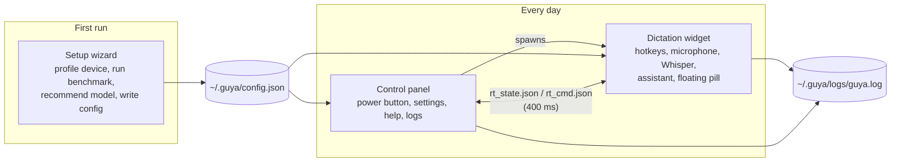
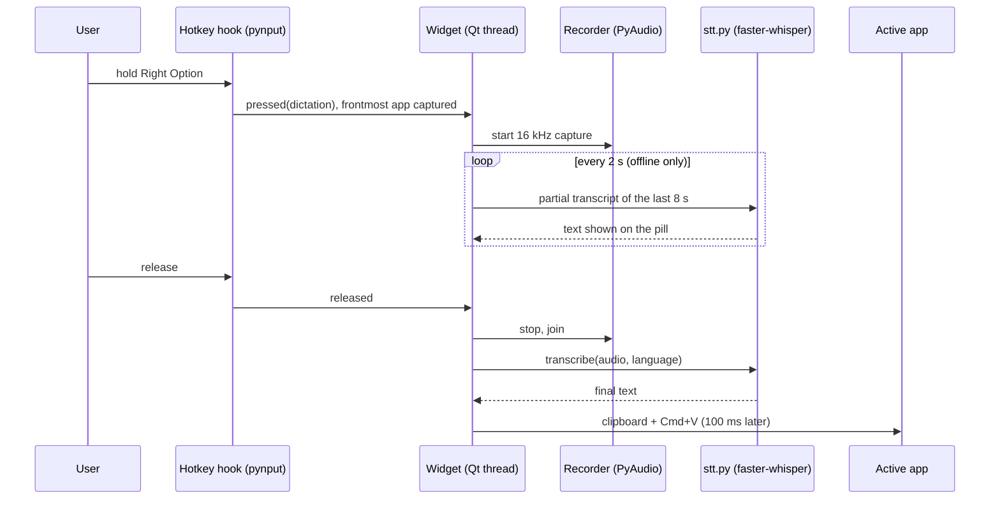
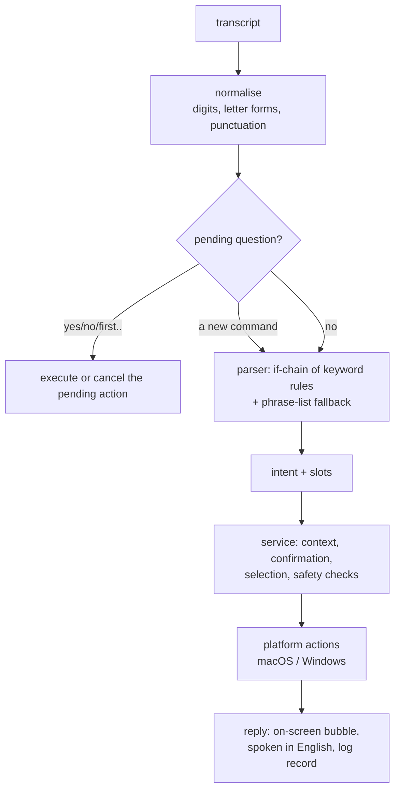

# Guya (گویا): Persian–English voice dictation and a limited desktop assistant for people who find typing hard

**B.Sc. Final-Year Project Report — Computer Engineering**

| | |
|---|---|
| Student | MohammadReza Ganji (220701091) |
| Supervisor | Dr. Hossein Aghababa |
| Institution | University of Tehran, Farabi Campus, Faculty of Engineering |
| Term | Eighth semester, 2026 |
| Code | `git@github.com:faceesmart/guya.git` |

## Abstract

Guya is a desktop application for people who can speak but find sustained typing and repeated mouse and keyboard work difficult. It has two push-to-talk modes on two separate keys: dictation, which types what the user says into whatever application is in front, and a small assistant, which carries out a fixed set of safe desktop actions such as creating, finding, opening and renaming files, opening applications, saving and closing, and simple browser navigation. Both modes work in Persian and English, run entirely on the user's own computer with free software, and cost nothing to use. A setup wizard measures the computer's speed and recommends a speech model that will run at usable speed on that machine, with a free online model as the fallback for weak hardware.

This report describes the design and implementation, and evaluates the system with reproducible measurements: word error rate of six Whisper model tiers on a fixed Persian and English test set, an ablation of Guya's own decoding settings, a held-out test of the command parser, and the assistant's real-use log. The main findings are that Persian needs a model at least the size of `large-v3-turbo` to be usable while English is already good with `small`; that several of the hand-tuned decoding settings inherited from earlier prototypes actually reduced accuracy and were measured, explained and corrected; that the rule-based parser generalises well to unseen phrasings once filler words are handled (68.5% → 99.5% on a held-out set); and that almost all of the latency the user feels is the speech model itself, not the assistant.

چکیده: گویا یک برنامهٔ رومیزی برای افرادی است که می‌توانند صحبت کنند اما تایپ طولانی و کار مکرر با موس و کیبورد برایشان دشوار است. با نگه‌داشتن یک کلید، گفتار به متن تبدیل و در برنامهٔ فعال نوشته می‌شود؛ با کلید دوم، یک دستیار محدود کارهای ساده و امنی مانند ساختن، پیدا کردن، باز کردن و تغییر نام فایل‌ها، باز کردن برنامه‌ها، ذخیره و بستن، و پیمایش ساده در مرورگر را انجام می‌دهد. هر دو حالت به فارسی و انگلیسی و به‌طور کامل روی رایانهٔ کاربر و بدون هزینه اجرا می‌شوند. این گزارش طراحی و پیاده‌سازی سیستم را شرح می‌دهد و آن را با اندازه‌گیری‌های قابل تکرار ارزیابی می‌کند: نرخ خطای واژه برای شش اندازهٔ مدل Whisper روی یک مجموعهٔ آزمون ثابت فارسی و انگلیسی، بررسی تک‌تک تنظیمات رمزگشایی گویا، آزمون تعمیم‌پذیری تحلیل‌گر فرمان‌ها روی جمله‌های دیده‌نشده، و گزارش استفادهٔ واقعی از دستیار.

---

## 1. Introduction

### 1.1 The problem

For someone with a motor impairment, a paragraph of text is not a paragraph of typing; it is several minutes of effort, and often pain. The same is true of the small mechanical tasks around writing: opening the right file, finding it again after closing it, renaming it, moving a web page down. Commercial dictation exists, but it is either tied to a paid cloud service, poor at Persian, or both, and it does not help with the surrounding tasks at all.

The concrete case behind this project is my brother. He speaks clearly, but long typing is hard for him. That fixed the shape of the project from the beginning: it had to run on a normal home computer, it had to work in Persian as well as English, and it could not depend on a subscription.

### 1.2 What Guya does

Guya adds two keys to the computer. Holding the first key (Right Option on macOS) and speaking types the words into the active document when the key is released. Holding the second key (Right Command) and speaking sends the words to a small assistant that understands a fixed list of commands, in Persian or English, and carries them out. The two keys are deliberately separate, so that a dictated sentence such as "open the report" is never mistaken for a command.

The assistant is intentionally small. It does not converse, it does not read web pages, and it cannot delete anything. It can create Word and text files and folders, find files by spoken name (including the way speech recognition tends to mangle filenames, "test six docks" for `test6.docx`), open files, folders and a few applications, rename a file after asking for confirmation, save or close the active window, open a known website, search the web, and scroll or navigate in the browser. When a spoken filename matches several files, it shows up to three choices on screen and accepts a click or a spoken "first", "second", "third".

A setup wizard runs on first launch. It measures how fast the computer runs a small speech model, predicts how the larger models would behave, and recommends one that will keep up with speech on that machine. Weak computers are offered a free online model instead.

### 1.3 Goals and contributions

The project had five stated objectives (from the proposal): reliable Persian and English push-to-talk dictation; a separate bilingual assistant for a limited set of actions; predictable, safe behaviour through rule-based command understanding, confirmation and restricted file access; offline, online and dual recognition modes chosen with the help of device profiling; and an evaluation of accuracy, response time, task success, safety and usability.

What this report adds beyond the running software is evidence. Specifically:

1. A reproducible accuracy and speed measurement of six Whisper model tiers on Persian and English read speech, on consumer hardware, which is the data behind the wizard's model recommendation (Section 6.2).
2. An ablation showing what each of Guya's own decoding settings does to accuracy, which corrected several settings that had been carried over from earlier prototypes on faith (Section 6.3).
3. A held-out test set of 257 natural Persian and English command phrasings and an evaluator for the parser, which turned a 68.5% intent accuracy into 99.5% and fixed eleven of thirteen real misunderstandings found in the usage log (Section 6.5).
4. A structured per-command log record that makes daily use of the assistant an evaluation dataset (Section 6.6).

### 1.4 Scope of this report

The software is a university prototype, not a product. Section 3 states the boundary exactly. Windows support exists in the code but has not been validated on a Windows machine at the time of writing, and the usability study with the target user had not yet been run; both are reported honestly as remaining work in Section 8.

---

## 2. Background

### 2.1 Speech recognition with Whisper

Whisper (Radford et al., 2022) is an encoder–decoder transformer trained on 680,000 hours of multilingual audio. It recognises Persian without any extra training, which is what made this project feasible at all with no budget. It comes in sizes from `tiny` (39 M parameters) to `large-v3` (1.55 B). `large-v3-turbo` keeps the full large encoder but only four decoder layers, which makes it much faster than `large-v3` at similar accuracy.

Guya uses faster-whisper, a re-implementation on the CTranslate2 inference engine. With 8-bit weights it runs the large models on a laptop CPU at a few times real time, which is what makes a fully local Persian system possible. The trade-off is that it is a CPU-bound workload: on the development machine (Apple M1 Pro, 16 GB) the biggest model is slower than real time, and this constraint shapes the whole design (Section 4.5).

### 2.2 Why Persian is harder

Persian is a low-resource language for Whisper compared with English: far less training audio, an Arabic-script writing system with several equivalent letter forms (ي/ی, ك/ک), optional diacritics, and a zero-width non-joiner whose use varies between writers. Colloquial spoken Persian also differs from the formal written form that dominates Whisper's training text: a speaker says «میخوام» and the model writes «می‌خواهم». All of this shows up in the measurements (Section 6.2) as a large gap between Persian and English error rates, and it is why the evaluation reports character error rate alongside word error rate.

### 2.3 Rule-based versus model-based command understanding

A voice assistant needs to turn a transcript into an intent and its arguments. The fashionable way is to hand the text to a large language model. I chose a deterministic parser (keywords, regular expressions and a small phrase list) for three reasons. It is free and works offline. Every decision it makes can be printed and explained, which matters when the action is renaming someone's file. And it cannot be talked into doing something outside its list, which is the whole safety argument of Section 4.6. The cost is coverage: a rule-based parser only understands phrasings someone thought of. Section 6.5 measures that cost and shows it can be made small.

### 2.4 Accessibility considerations

Push-to-talk was chosen over a wake word because it needs no always-on microphone, gives the user explicit control of when the computer listens, and makes the mode (dictation or command) known at the moment of pressing. Feedback is given on the screen and, in English, by voice. Ambiguous results are shown as large clickable choices that can equally be picked by voice. Every destructive-looking action asks first. These are ordinary accessibility principles; the interesting part is where the constraints bit, for example the decision to keep Persian feedback silent rather than read it with an Arabic voice (Section 4.7).

---

## 3. Requirements and scope

### 3.1 Primary user

The primary user can speak clearly enough for speech recognition but has difficulty with long typing and repeated keyboard and mouse operation. A family member may help with installation and first-time setup, so the installer and wizard must be usable by a non-technical helper, and daily use must need nothing beyond two keys.

### 3.2 Included in V1

- Persian and English push-to-talk dictation into the active application.
- A separate assistant key with a fixed bilingual command set: create Word/text files and folders (then ask before opening); open supported applications, files and folders; find files and folders with spoken-filename normalisation; show up to three ambiguous results for click-or-voice selection; remember recent files so "open it again" works; rename with confirmation and without overwriting; save or close the active window; open a known website or a spoken domain over HTTPS; search the web; scroll, go to top or bottom, back and forward in the active browser.
- Offline, online and dual recognition modes, device profiling and a benchmark-based model recommendation.
- An installer, setup wizard, control panel, floating status widget, spoken (English) and on-screen feedback, and a log.
- Filesystem access limited to configured user folders (Desktop, Documents, Downloads by default).
- Automated tests plus a spoken evaluation checklist.

### 3.3 Explicitly excluded

A general conversational assistant; arbitrary shell commands or unrestricted computer control; deleting or overwriting files or bypassing confirmation; reading or understanding arbitrary web pages, clicking results or downloading; application-specific workflows such as Save As; wake-word listening; support for every accent, filename or application; app-store distribution.

### 3.4 Safety rules

These were decided early and are enforced in code rather than by convention (Section 4.6): no delete intent exists; rename asks and never overwrites; create asks before opening; every path is resolved and checked against the allowed roots before use; applications come from an allow-list; websites are HTTPS-only and either a known name or an explicitly spoken domain; browser control is six key codes posted to the browser's own process; Guya's own process can never be the target of a keystroke.

---

## 4. System design

### 4.1 Overview

Guya is three cooperating processes, all Python.

The **wizard** (`guya/wizard.py`) runs once. The **control panel** (`guya/control_panel.py`) is the window the user double-clicks; it starts the **widget** (`guya/widget.py`) as a child process and mirrors its state. The widget is the program that actually listens and acts. Splitting the widget out of the panel has a practical reason: the Whisper model must be loaded before the Qt user-interface library is imported, because CTranslate2's GPU backend can crash if Qt initialises first on Windows, and a child process gives that ordering for free.

The two processes talk through two small JSON files written atomically: the widget writes its state every 400 ms, the panel writes numbered commands (turn on or off, switch language, switch backend). It is not elegant, but it needs no sockets, no permissions and no library.

### 4.2 The dictation path

The microphone is recorded at 16 kHz mono while the key is held. While recording, a background pass re-transcribes the last eight seconds every two seconds and shows the partial text on the pill, so the user sees that they are being heard. On release, the whole recording is transcribed once and the result is pasted into the frontmost application through the clipboard. Pasting was chosen over synthesised keystrokes because one paste is Unicode-safe and instant, while typing Persian character by character through a keyboard simulator was unreliable.

### 4.3 The speech-to-text pipeline (`guya/stt.py`)

The model call is wrapped in a pipeline that was tuned during daily use: the audio's loudness is normalised; voice-activity detection trims silence; a per-language vocabulary prompt biases the decoder toward the user's usual words; a repetition penalty and a no-speech threshold guard against Whisper's habit of hallucinating text in silence; then, for Persian, three post-processing stages unify Arabic letter forms, fix a table of recurring misrecognitions, and turn formal verb forms back into the colloquial forms the user actually said.

Extracting this into its own module was a change made for this report: it lets the evaluation harness run *exactly* the pipeline the widget runs, and switch each setting back to the library default one at a time. Section 6.3 shows why that mattered: some of these "improvements" were making things worse.

### 4.4 The assistant path

The parser (`guya/assistant/parser.py`) is an ordered chain of rules. The order is the semantics: creation is checked before rename because "make a file and name it X" contains "name it"; save and close before browser movement; website before application before file, so "go to youtube" is a website and not a search for a file called youtube. Each rule extracts its arguments with a regular expression written for that command in each language. If no rule fires, the utterance is compared with a list of example phrasings and the closest intent is taken if it is similar enough (ratio ≥ 0.82). Two additions were made for this report, both prompted by measurement: filler words at the edges of an utterance ("let's", "please", "again", «یه کم», «لطفا») are stripped before the strict grammars run, and browser movement has a looser keyword fallback that only fires when nothing in the sentence names a file, folder or application.

The service (`guya/assistant/service.py`) keeps a small context: the current and five most recent files, so "open it again" and "rename it" work, and the pending question, if the assistant has just asked one. A "yes" or "no" answers the question; a fresh command replaces it (the assistant used to insist on an answer first, which made every file creation cost an extra utterance); a question that is not answered within two minutes expires, so a "yes" spoken later can never rename something forgotten.

Spoken filenames need their own normaliser. Whisper hears "test six docks" for `test6.docx` and «گزارش شش ورد» for `گزارش ۶.docx`. The normaliser folds digits and number words, drops leading words like "the" and "my", and rewrites the suffixes speech recognition produces (docs, docks, "doc x") into the extension. Matching is scored, not exact: 1.0 for an exact name, 0.98 for the same stem, 0.86 for a prefix of at least three characters, and so on. A single confident match opens directly; a close race shows the choices. The three-character floor exists because of a real bug: "open the system folder" once opened a folder named `m`.

### 4.5 Device-aware model choice (`guya/benchmark.py`)

Guessing the right model from the machine's specification is unreliable: a 16 GB Mac and a 16 GB GPU-less PC behave very differently. So the wizard measures. It times the `tiny` model on a bundled seven-second speech clip, predicts the real-time factor of each larger model from measured cost ratios, applies a per-language accuracy floor (Persian needs at least `large-v3-turbo`, English is fine with `small`), and recommends the most accurate model predicted to run at or under real time. If none does, it recommends the online model.

Two things about this design were found wrong during the evaluation and fixed. The benchmark used to time the model on synthetic noise; on noise Whisper fails its own quality checks and retries at rising temperatures, so it was measuring decoder retries, not the device, and on the development machine recommended the online model for every language even though the same machine runs `large-v3-turbo` daily. The recommendation rule also had two latency tiers, which made it non-monotonic: a slightly slower machine could be told to run a bigger, slower model. The cost ratios were re-derived from the measurements in Section 6.2.

### 4.6 The safety boundary

The assistant's safety does not rest on the parser being right. Every action passes through `SafeDesktopActions`, which resolves the path (following symlinks) and checks that it lies under one of the allowed roots; a symlink pointing outside a root is therefore invisible. There is no delete action. Rename refuses if the destination exists. Applications are looked up in a fixed table, never launched from a spoken string. Websites go through `safe_website_url`, which accepts only a known name or a domain that the user actually spoke as a domain, and always builds an `https://` URL with no path or query. Browser control is one of six key codes posted to the browser's process id, never to whatever window happens to be in front, and Guya's own process ids are refused as a target. No subprocess is ever started with a shell.

### 4.7 Feedback

English replies are spoken with the system voice and shown on the pill. Persian replies are shown only. macOS ships 184 voices and none for Persian; the only Arabic-script voice reads Persian with an Arabic accent, and after trying it I decided that silence is better than a voice that sounds wrong to every Persian speaker. That is the honest limit of a zero-cost design on this platform. To compensate, every reply longer than the pill can hold, and every question, is shown in a wrapped, right-to-left bubble under the pill, coloured green for success, amber for a question and red for an error, and the pill exposes its text to VoiceOver. Pressing the assistant key while an English reply is being spoken interrupts it and listens.

### 4.8 Configuration, installation and logging

All settings live in `~/.guya/config.json`, merged over defaults so an older file keeps working after an update. On macOS the installer copies the code and its Python environment to `~/.guya/runtime` and generates a `Guya.app` bundle that runs the copy; this was forced by a real failure, recorded in the launcher log, where a Finder-launched app was denied access to a Python environment living on the Desktop. The bundle is the process that asks for microphone and accessibility permission, so the grant belongs to Guya and not to a terminal.

Every process writes to one rotating log. Each assistant command is logged as a single JSON record with the transcript, language, intent, arguments, outcome, target application and the time spent in speech recognition and in acting. Section 6.6 is built entirely from these records.

---

## 5. Implementation

### 5.1 Technology

Python 3.11, PyQt6 for the interfaces, faster-whisper 1.2.1 on CTranslate2 4.8.1 (8-bit weights on CPU), PyAudio for capture, pynput and PyObjC for the macOS hotkey and window layer, and the Windows API through ctypes on Windows. No PyTorch, no paid service. The optional online backend is Groq's free tier of `whisper-large-v3`.

### 5.2 Size and structure

| Module | Lines | Role |
|---|---:|---|
| `guya/widget.py` | ~2,700 | recorder, hotkeys, floating pill, reply bubble, results popup, assistant glue |
| `guya/wizard.py` | ~2,100 | eleven-page bilingual setup wizard |
| `guya/control_panel.py` | ~1,000 | launcher window, settings, help, logs, maintenance |
| `guya/stt.py` | ~500 | the speech-to-text pipeline shared with the evaluation |
| `guya/assistant/parser.py` | ~900 | intents and slots, Persian and English |
| `guya/assistant/service.py` | ~750 | context, confirmation, selection, dispatch |
| `guya/assistant/actions/` | ~1,400 | safe file operations; macOS and Windows adapters |
| `guya/assistant/normalizer.py` | ~280 | text and spoken-filename normalisation |
| `guya/benchmark.py`, `profiler.py` | ~450 | device profile, benchmark, recommendation |
| `eval/` | ~900 | accuracy, ablation, intent and log evaluators |
| `tests/` | 104 tests | parser, normaliser, service, actions, platform, scorer |

The tests need no microphone, no model and no network, and run in a quarter of a second. Several of them assert the *absence* of side effects: that nothing was opened before "yes", that nothing was renamed on "no", that a delete request touched nothing.

### 5.3 Two details worth recording

Creating a `.docx` without a Word library: the file is an OPC zip with three XML parts, written with the standard `zipfile` module; macOS and Word both open it. This kept a dependency out of a project whose whole point is running anywhere for free.

The self-target problem: after the user clicks the pill or a result button, Guya itself is the frontmost application, and the next command would have been sent to Guya. The first version of the log showed this in six of forty-one commands. The widget now remembers the last real target and falls back to it, and the paste routine refuses to paste when Guya is in front, leaving the text on the clipboard with a visible hint.

### 5.4 User interface

---

## 6. Evaluation

_(filled in Section 6 of this document from `eval/results/`; see below)_

---

## 7. Discussion

_(see below)_

---

## 8. Conclusion and future work

_(see below)_
